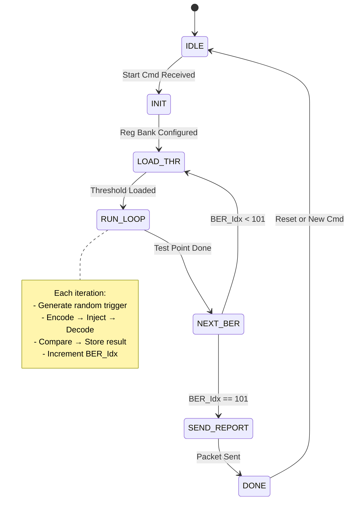

# 项目需求
本项目是对一篇论文所提出的2个创新算法2NRM-RRNS, 3NRM-RRNS算法与传统的RRNS算法，以及RS算法进行对比，目的是证实：这两个创新性算法是否具有可实施性，从存储效率、冗余纠错能力、计算复杂度及计算资源消耗维度对四种算法进行对比，希望得出的结论是两种创新算法2NRM-RRNS,3NRM-RRNS算法是可行的，从存储效率、冗余纠错能力、算法复杂度、计算资源消耗等各个方面综合考虑，2NRM-RRNS算法是属于最佳的。
进行对比的配置为如下
- 要保存的数据为16bits（0~65535）（此处数据为需要保存的原始数据，payload)
- 各个算法使用的模式如下表格
- ![[Pasted image 20260304095414.png|490]]
- 各个算法生成的codword长度见如下表格（体现了存储效率）![[Pasted image 20260304095516.png]]
- 各个算法在上述模式配置情况下的纠错能力对比见如下表格![[Pasted image 20260304095719.png]]

# 项目第一阶段（MATLAB仿真阶段）综述

在项目的第一阶段采用了MATLAB对各个算法进行了仿真对比，主要的结论见如下：

- 不同误码率的情况下解码成功率对比见如下图
![[Pasted image 20260304095904.png]]
从这个图中可以看到，从有误码的情况下解码成功情况看，RS算法与3NRM-RRNS相当（3NRM-RRNS）稍微优于RS算法；C-RRNS排在中间；而2NRM-RRNS的误码情况下解码恢复能力在四种算法里面最低

- 不同解码算法的解码资源消耗（从解码时间来对比）见下图
![[Pasted image 20260304100318.png]]
从解码资源消耗维度来看，2NRM-RRNS算法最优，其次为3NR-RRNS算法，而RS算法以及传统的C-RRNS算法明显比较高。

# 第二阶段（FPGA实现）计划要实现的目标

在第一阶段是在PC平台上使用MATLAB进行仿真对比，在第二阶段打算在FPGA平台上（目前选择的是ARTY A7-100T)对四种算法进行算法实现，然后对一定样本数据，利用四种编码算法进行编码，然后在不同误码率（从1%误码到10%误码），以及不同误码模式（均匀的random bit反转误码，以及连续的cluster误码）进行解码，对照四种算法的解码成功率，解码速率，并对比四种编解码的资源效率（对比资源消耗，可以支持的最高时钟频率）


---

# FPGA 多算法容错性能对比测试系统 - 顶层架构与模块规格说明书 

**版本**: v1.1 (Closed-Loop Architecture)  
**目标平台**: Xilinx Artix-7 (Arty A7-100T)  
**核心目标**: 对比 C-RRNS, RS, 3NRM-RRNS, 2NRM-RRNS 四种算法的**误码容忍度 **(BER vs Success Rate) 与 **执行效率 **(Latency/Throughput)。


## 1. 系统层次结构图 (System Hierarchy Diagram)

系统分为 **PC 端 (Python)** 和 **FPGA 端 (Verilog)** 两大部分，通过 **UART 串口** 进行全双工通信。

### **1.1  系统整体架构拓扑图 (System Architecture Topology ）**


![[system_architecture.drawio 6.png]]

本设计在最终验证与论文撰写阶段采用 Single-Algorithm-Build 模式，即每次综合仅包含一个译码算法实例，以确保时序、资源、Fmax 数据的准确性和可比性。

---

### **1.2 采用树状结构描述：**

```
System Architecture (V1.0 - Auto-Scan & LUT Based)
│
├── [PC Side] (Python Environment)
│   ├── 1. py_controller_main.py (主控逻辑)
│   │   ├── [Pre-Process] ROM 生成器 (gen_rom.py) 
│   │   │   └── 离线计算 101点×4算法×15突发长度 的阈值表 -> threshold_table.coe
│   │   │
│   │   ├── [Execution] 测试执行引擎
│   │   │   ├── 命令包构建器 (极简指令: Algo/Mode/Burst/SampleCount)
│   │   │   └── 大数据包解析器 (解析响应帧)
│   │   │
│   │   └── [Visualization] 绘图与分析（单独的一个python程序处理）
│   │       ├── FER/BER 曲线绘制 (Log Scale)
│   │       └── 吞吐量/延迟分析
│   │
│   └── 2. py_uart_driver.py (通信驱动)
│       ├── Serial Port 管理 (波特率优先以921600)
│       ├── 同步阻塞发送 (Send Command)
│       └── 固定长度阻塞接收 (Read 2231 Bytes ) 
│           └── 移除轮询监听，改为一次性大包接收
│
FPGA SIDE
 │
 ├── UART Communication (sub_uart_comm)
 │     └── ctrl_reg_bank → 输出稳定参数给 Main Scan FSM
 │── [NEW] Seed Lock Unit  
  |
 ├── Main Scan FSM 
 │     └── 监听 cmd_start 脉冲 -> 捕获 free_run_counter -> 输出 fixed_seed
 │     ├── 状态机：IDLE → INIT → LOAD_THR → RUN_LOOP → NEXT_BER → SEND_REPORT
 │     ├── 调用 rom_threshold_ctrl 获取当前点阈值
 │     └── 调用 Auto_Scan_Engine 执行单点测试 (传入 fixed_seed)
 │
 ├── Auto_Scan_Engine 
 │     ├── LFSR (接收来自 FSM 的 fixed_seed 作为初始值)
 │     ├── Encoder
 │     ├── Error Injector
 │     ├── Decoder
 │     └── Result Comparator → 输出 Pass/Fail + Latency
 │
 ├── rom_threshold_ctrl
 │     └── 实例化 threshold_rom (.coe 初始化)
 │
 └── Result Buffer & Reporter
       ├── mem_stats_array  ← 由 Main Scan FSM 写入
       └── tx_packet_assembler →  UART 帧
```

---


### **1.3 系统整体工作流程说明 (System Workflow Overview)**

本系统采用 **“PC 集中控制 + FPGA 全自动执行”** 的主从架构。PC 端负责高层策略制定与数据可视化，FPGA 端负责微秒级的高速误码注入、解码验证及统计上报。整体交互流程分为 **配置下发**、**自动扫描执行**、**结果回传** 三个阶段，具体逻辑如下：

#### **1. 配置下发阶段 (Configuration Phase)**
*   **触发源**：PC 端应用层 (`py_controller_main.py`)。
*   **动作**：用户设定算法类型 (`Algo_ID`)、突发长度 (`Burst_Len`)、误码模式 (`Error_Mode`) 及单点采样数 (`Sample_Count`)。
*   **协议封装**：驱动层 (`py_uart_driver.py`) 将上述 4 个参数封装为 **7 字节 Payload** 的二进制帧（含帧头、校验和），通过 USB-TTL 物理链路发送至 FPGA。
*   **关键特性**：**无独立启停命令**。PC 发送配置帧的行为本身即隐含“开始测试”指令。

#### **2. 自动扫描执行阶段 (Auto-Scan Execution Phase)**
此阶段完全由 FPGA 内部逻辑闭环完成，无需 PC 干预，确保测试时序的确定性。
*   **解析与锁存 (`uart_comm`)**：
    *   `protocol_parser` 校验帧完整性后，产生 `cfg_update_pulse` 脉冲。
    *   `ctrl_register_bank` 捕获该脉冲，原子性锁存 4 个配置参数，并**自动置位** `test_active` 启动测试引擎。
*   **101 点循环扫描 (`Main SCAN FSM`)**：
    *   FSM 初始化 BER 索引 (`ber_idx = 0`)。
    *   **动态阈值查找**：根据当前 `ber_idx` 和配置的 `Burst_Len`，实时查询 `rom_threshold_lut` 获取对应的 LFSR 注入阈值，**无需 PC 参与计算**。
    *   **子测试循环**：在单个 BER 点上，`Auto Scan Engine` 重复执行 $N$ 次（$N=$ `Sample_Count`）：
        1.  **种子捕获**：`Seed Lock Unit` 锁定随机种子。
        2.  **编码与注入**：`Data Gen` 生成数据 -> `Encoder` 编码 -> `Error Injector` 根据阈值动态翻转比特。
        3.  **解码与比对**：`Decoder` 纠错 -> `Result Comparator` 比对原始数据与解码数据，统计 Pass/Fail 及耗时。
    *   **索引递增**：当单点采样数达到 $N$ 时，FSM 自动保存该点统计结果，`ber_idx++`，切换至下一个 BER 阈值，直至完成全部 **101 个测试点**。
*   **测试终止**：101 个点全部完成后，FSM 自动拉低 `test_active` 停止测试，并触发上报信号。

#### **3. 结果回传阶段 (Reporting Phase)**
*   **数据组装 (`tx_packet_assembler`)**：
    *   FSM 控制读取片上 RAM (`mem_stats_array`) 中缓存的 101 组统计数据（包含成功/失败次数、时钟计数、实际翻转数等）。
    *   添加全局信息头（算法 ID、总点数等）及帧尾校验和，组装成约 **2.2KB** 的完整响应帧。
*   **上行传输**：通过 `uart_tx_module` 将二进制流发回 PC。
*   **解析与可视化**：
    *   PC 端驱动接收并校验数据帧。
    *   应用层解析二进制数据，计算各点 BER，绘制 **BER 性能曲线图**，并支持导出 CSV 报告。
    * 对于各个算法之间的汇总对比，需要由单独的python程序读取CSV进行输出（因为每次与FPGA单板通讯测试只能测试一种算法的数据）

---

### **💡 设计亮点总结 (Design Highlights)**
1.  **极简协议**：下行仅需 7 字节有效载荷，去除了复杂的阈值计算与启停握手，降低通信开销。
2.  **全自动化**：FPGA 内部集成 ROM 查表与状态机调度，单次命令即可完成全谱系（101 点）扫描，极大缩短测试周期。
3.  **高可靠性**：配置参数的原子性锁存机制，杜绝了参数更新过程中的竞争冒险；完整的校验和机制保障了上下行数据的准确性。

---

#### **📊 对应图中模块映射**
*   **PC Side**：对应流程中的 **阶段 1 (配置)** 和 **阶段 3 (解析/绘图)**。
*   **UART Comm**：对应流程中的 **数据收发与解析锁存**。
*   **Main SCAN FSM**：对应流程中的 **阶段 2 (核心调度)**，负责 101 点循环与阈值切换。
*   **Auto Scan Engine**：对应流程中的 **单次测试执行** (编码/注入/解码/比对)。
*   **buffer & Reporter**：对应流程中的 **结果缓存与组包上报**。

---

#### **1.4 主状态机图**



**`IDLE` → `INIT`**：检测到 `Start_Cmd`，**拉高 `lock_seed`**，加载初始配置。
**`INIT` → `LOAD_THR`**：保持 `lock_seed` 高电平。
**`RUN_LOOP` / `NEXT_BER`**：循环过程中，**保持 `lock_seed` 高电平**（严禁在此阶段翻转或重锁）。
**`SEND_REPORT` → `DONE`**：数据包发送完成后，**拉低 `lock_seed`**，释放随机数生成器，等待下一次命令。

### **1.5 时钟域**


系统采用单时钟域 (Single Clock Domain) 设计，消除跨时钟域 (CDC) 复杂度，确保数据通路零延迟握手。
**主时钟** (clk_sys): 100 MHz (源自 Arty A7-100T 板载晶振)。
用途：驱动所有业务逻辑，包括 LFSR 随机数生成、ROM 查表、编解码器流水线、统计计数器及 UART 波特率发生器。
**UART 时钟**: 不独立生成，直接使用 clk_sys 通过分频使能信号 (clk_en_16x) 驱动 UART 收发状态机。
优势: 无需异步 FIFO，所有模块间信号可直接连接，最大化时序收敛余量。

### **1.6 通信模式与策略 (Communication Mode & Strategy)**

| 方向           | 模式     | 频率             | 数据内容                                                              | 设计目的                                      |
| :----------- | :----- | :------------- | :---------------------------------------------------------------- | :---------------------------------------- |
| 下行 (PC→FPGA) | 单次配置命令 | 极低频 (每次测试 1 帧) | 仅包含 `Algo`, `Mode`, `Burst_Len`, `Sample_Count`。不再下发 BER 阈值。      | 极简指令。FPGA 收到后自动锁存种子，并内部启动 101 点 BER 全自动扫描。 |
| 上行 (FPGA→PC) | 终结大包回复 | 低频 (每次测试 1 帧)  | 包含 101 个 BER 点 的完整统计数据 (`Success/Fail Count`) 及 `Total_Clk_Count`。 | 避免中间过程频繁上报占用带宽。利用 FPGA 高速计算能力，一次性回传所有结果。  |
| 中间过程         | 静默运行   | 无通信            | 无 UART 交互。LED 指示运行状态。                                             | 释放 UART 带宽，让 FPGA 全速跑满 100MHz，不受串口发送阻塞影响。 |

#### **1.6.1 串口参数**：

2. **波特率**：**921600**。
	
- **硬件接口**：FPGA UART 模块参数化 `BAUD_RATE`，默认设为 **921600** 。
- **软件策略**：Python 脚本增加“自动波特率探测”或配置文件选项。
  - 默认配置：`BAUD = 921600` (传输耗时约 8ms)，**如果调试过程中无法实现再切换为115200，这个是调试的策略，非自动配置，不需要动态切换。**
- **超时公式更新**：为降低复杂度，采取一定的冗余设置一个固定值。


 **⚙️ 波特率生成与误差分析 (Baud Rate Generation & Error Analysis)**
 为确保与 PC 端 (921,600 bps) 的稳定通信，UART 模块采用整数分频策略。
 *   **系统时钟**: $F_{clk} = 100 \text{ MHz}$。
 *   **目标波特率**: $B_{target} = 921,600 \text{ bps}$。
 *   **分频系数计算**:
     $$ N = \frac{F_{clk}}{B_{target}} = \frac{100,000,000}{921,600} \approx 108.5069 $$
 *   **最终选型**: **$N = 109$** (向下取整会导致正误差，向上取整导致负误差，工程惯例优先选择负误差以避免建立时间违例风险)。
 *   **实际波特率**: $B_{act} = \frac{100,000,000}{109} \approx 917,431 \text{ bps}$。
 *   **相对误差**:
     $$ \text{Error} = \frac{917,431 - 921,600}{921,600} \times 100\% \approx \mathbf{-0.45\%} $$
 *   **可靠性验证**:
     *   标准 UART 接收机通常容忍 **±2.5%** 的时钟偏差（基于 16x 过采样，采样点位于比特中心）。
     *   本设计的 **-0.45%** 误差远小于容限，**不会**导致长帧（1936 字节）末尾的比特移位或帧错误。误差是固定的相位偏移，不会随比特数累积。
 *   **Verilog 实现**:
     ```verilog
     localparam BAUD_CNT_MAX = 109 - 1; // Count 0 to 108
     reg [$clog2(BAUD_CNT_MAX):0] baud_cnt;
     // ... logic toggles tx/rx enable when baud_cnt == BAUD_CNT_MAX
     ```


 *   **约束文件 (.xdc)**：需对 UART TX/RX 引脚添加 `IOSTANDARD = LVCMOS33` 及 `SLEW = FAST` 约束，以保证信号完整性。

*   **PC 端驱动**：
    > Python 脚本在每次实验开始前，必须执行 `serial.reset_input_buffer()` 和 `serial.reset_output_buffer()`，清除上一次实验残留的高速数据，防止“粘包”导致首帧解析失败。


#### **1.6.2  协议帧结构概览 (Protocol Frame Overview)**

- **下行命令帧 (Command Frame)**: 固定 **12 Bytes**。
  - 结构: `Header(2)` + `CmdID(1)` + `Len(1)` + `Payload(7)` + `Checksum(1)`。
  - 特点: 紧凑、二进制、含校验。
  - 具体见2.1.3.1章节
- **上行响应帧 (Response Frame)**: 固定 **3039 Bytes**。
  - 结构: `Header(2)` + `CmdID(1)` + `Len(2)` + `GlobalInfo(3)` + `PerPointData(101×30)` + `Checksum(1)` 。
  - 帧长计算: `2+1+2+3+(101×30)+1 = 3039 Bytes`（每点 **30 Bytes**，含 1B Reserved）。
  - 特点: 大数据量、包含 101 个点详情（含编码器/解码器周期数）、含头尾标识。
  - 具体见2.1.3.2章节

#### 1.6.3 异常处理与超时保护 (Exception Handling & Timeout)

鉴于上行帧长度为 **2231 Bytes**，经测算：
 - 在 **115,200 bps** 下，纯传输耗时约 **0.14 秒**。
 - 在 **921,600 bps** 下，纯传输耗时约 **0.02 秒**。

 因此，通信传输时间在总耗时中占比极小。PC 端超时阈值 ($T_{out}$) 主要取决于样本量 (`Sample_Count`)。为简化实现，采用以下**固定分级策略**：
 1.  **常规模式** (`Sample_Count` ≤ $10^6$):
     - **固定超时值**: **10 秒**
     - *适用*: 99% 的日常功能验证与 BER 统计。

建议 Sample_Count 设置在$10^4$ ~ $10^5$  之间，以保证单次测试在 1~10 秒内完成，避免 UART 超时。

 2.  **压力模式** (`Sample_Count` > $10^6$):
     - **固定超时值**: **120 秒** (或根据样本量线性外推，每增加 $10^6$ 样本增加 7 秒)
     - *适用*: 极低误码率 ($<10^{-12}$) 的长时间累积测试。

 *注：上述数值已包含 1.5 倍计算余量及 0.4 秒的最坏情况通信/系统延迟余量。*

---
## 2. 详细流程说明


---


### 2.1 PC 端控制软件架构规格说明

软件采用 **分层架构设计**，分为两层：
1.  **应用层 (`Controller`)**: 负责业务逻辑、参数计算、用户交互、数据可视化。
2.  **驱动层 (`UART Driver`)**: 负责底层比特流传输、帧解析、多线程监听。

#### 2.1.1 应用层：主控逻辑 (`Controller`)
**职责**: 实现“所想即所得”的实验配置，屏蔽底层硬件细节。
##### 核心功能点：
1.  **用户交互接口**:
    - 提供 CLI 命令行提示，提示信息需要告知如下参数配置和对应的值。
    - **输入参数**:
        - `Algo_Type`: 算法选择 (0: 2NRM-RRNS, 1: 3NRM-RRNS, 2: C-RRNS-MLD, 3: C-RRNS-MRC, 4: C-RRNS-CRT, 5: RS)。
        -  `Error_Mode`: 错误模式 (0 随机单比特/1 cluster模式)。
        - `Burst_Len`: 突发错误长度 $L$ (1~15.不支持0，对于单比特模式L为1，其他值为cluster模式)。
        - `Sample_Count`:每个BER配置下执行测试的次数
2.  **实验流程自动化**:
    - 配置下发以后FPGA程序遍历一系列 BER 值 (BER从 $10^{-2}$ 到 $10^{-1}$，步长为$10^{-3}$)，等待 FPGA 测试完成，收集数据，绘制曲线。
3.  **数据后处理**:
    - 解析 FPGA 回传的 数据。
    - 计算实际成功率、平均延迟。
    - - 自动保存结果至 CSV 文件。
    - 实时绘制本次测试 **BER vs Success Rate** 曲线。

**对各种算法的结果进行汇总对比，另外设计python脚本进行汇总和汇总曲线**
##### 关键函数接口：
```python
def calculate_threshold(target_ber: float, burst_len: int, algo_id: int) -> int:
    """
    根据目标 BER 和算法参数，反推 FPGA 所需的 LFSR 阈值整数。
    返回: uint32 threshold
    """
    pass

def build_config_frame(algo_id, threshold, burst_len, error_mode) -> bytes:
    """
    封装二进制配置帧。
    格式: [0xAA, 0x55] [CMD_ID] [Len] [Payload...] [Checksum]
    """
    pass

def process_stats_data(stats_dict: dict) -> dict:
    """
    将原始计数值转换为有意义的指标 (成功率，吞吐量等)。
    """
    pass
```

---

#### **2.1.2 驱动层：UART 通信引擎 (`UART Driver`)**
**职责**: 提供可靠的**同步请求 - 响应 (Request-Response)** 通信机制，确保指令下发后能准确接收 FPGA 的处理结果，并在超时或错误时及时报错。

##### **核心功能点：**

1.  **串口生命周期管理**:
    - 自动扫描并连接可用端口 (`比如COM3`, `/dev/ttyUSB0`)。
    - 配置波特率 (推荐高速率 **921600**或**115200**，以缩短 2231 Bytes 大数据帧的传输时间)。
    - **配置读取超时 (Read Timeout)**: 设置为动态计算值或固定大值 (**≤10^6,配置为**10s，大于10^6,配置为 120s**，程序根据测试次数自动设置 ), 作为“看门狗”防止死锁。

2.  **TX 发送逻辑 (同步触发)**:
    - 接收应用层的二进制测试命令帧。
    - **清空接收缓冲区** (防止读到旧的残留数据)。
    - 写入串口发送命令。
    - **立即进入等待接收状态** (不返回，直到收到数据或超时)。

3.  **RX 接收逻辑 (同步阻塞等待)**:
    - **不再使用独立后台线程**，改为**主线程同步读取**。
    - **原子化接收流程**:
        1. 调用串口读取函数 (如 `serial.read(size)` 或 `read_until`)，阻塞等待数据。
        2. **帧头同步**: 读取到的数据若不以帧头 (`0xBB 0x66`) 开头，则丢弃字节继续寻找，直到找到合法帧头。
        3. **长度解析**: 读取帧头后的长度字段 (Offset 3)，确定剩余 Payload 长度 (例如 1914 Bytes)。
        4. **完整读取**: 继续读取剩余字节，直到凑满整帧 (处理**断包**情况)。
        5. **校验检查**: 计算 `Checksum`，若失败则抛出“校验错误”异常，并可选尝试重新读取下一帧。
    - **超时处理**: 若在设定的 `Timeout` 时间内未收到完整帧，串口库自动抛出 `TimeoutException`，驱动层捕获后向上层报告 **“FPGA 测试超时”**。

4.  **异常处理与恢复**:
    - **超时错误**: 直接终止当前测试任务，提示用户检查样本量或重启 FPGA。
    - **校验错误**: 记录日志，可选择丢弃该帧并提示错误信息告知用 (通常测试命令只期望一帧回复，校验错即视为本次测试失败)。
    - **连接丢失**: 捕获串口断开异常，提示用户检查硬件连接。


```python
def run_ber_test(sample_count):
    # 1. 准备命令
    cmd_frame = build_command_frame(sample_count)
    
    # 2. 清空旧数据 (关键！防止读到上一次测试的残留)
    uart.flushInput() 
    
    # 3. 发送命令
    uart.write(cmd_frame)
    
    # 4. 同步等待接收 (核心变化)
    try:
        # 设置动态超时，例如 10 秒 (小样本) 或 120 秒 (大样本)
        uart.timeout = calculate_timeout(sample_count) 
        
        # 读取帧头 (假设 2 字节)
        header = uart.read(2)
        if header != b'\xBB\x66':
            raise Exception("帧头错误，可能数据不同步")
        
        # 读取长度 (1 字节) -> 假设长度字段表示 Payload 长度
        length_byte = uart.read(1)
        payload_len = int.from_bytes(length_byte, 'big')
        
        # 读取剩余 Payload (处理断包：read 会自动阻塞直到读满或超时)
        # 总长度 = 长度字段本身(1) + GlobalInfo(4) + PerPointData(1547) + Checksum(1) ? 
        # 需根据您的协议精确计算剩余字节数
        remaining_bytes = payload_len + 1 # 举例：如果 length 不包含自身但包含 checksum
        
        data_payload = uart.read(remaining_bytes)
        
        if len(data_payload) < remaining_bytes:
            raise Exception("读取超时：FPGA 未在规定时间内返回完整数据")
            
        # 5. 校验
        full_frame = header + length_byte + data_payload
        if not verify_checksum(full_frame):
            raise Exception("校验失败：数据传输错误")
            
        # 6. 解析并返回结果
        return parse_result(full_frame)

    except serial.SerialTimeoutException:
        print("错误：FPGA 测试超时 (可能死锁或样本量过大)")
        return None
    except Exception as e:
        print(f"通信错误：{e}")
        return None
```


---

#### **2.1.3  数据流与协议定义 (Data Flow & Protocol)**

##### **2.1.3.1 下行链路 (PC -> FPGA): 二进制配置帧**
用于下发精确控制指令，追求高效。

**命令功能**：配置误码注入参数并启动测试。FPGA 收到此帧后，立即锁存内部随机种子并开始运行。
**帧总长度**：12 Bytes

| 偏移 (Offset) | 字段 (Field)         | 长度 (Len) | 类型     | 描述 (Description)                                                 |
| :---------- | :----------------- | :------- | :----- | :--------------------------------------------------------------- |
| **0**       | Header             | 2 Bytes  | Fixed  | `0xAA 0x55`                                                      |
| **2**       | CmdID              | 1 Byte   | Hex    | `0x01`                                                           |
| **3**       | Length             | 1 Byte   | Uint8  | Payload 长度 (固定为 7)                                               |
| **4**       | `cfg_burst_len`    | 1 Byte   | Uint8  | 突发长度 $L$ (1~15)。单比特模式下可填 1。严格禁止输入0，需要在PC侧做合法性检查。                 |
| **5**       | `cfg_algo_ID`      | 1 Byte   | Uint8  | 算法 ID (0:2NRM, 1:3NRM, 2:C-RRNS-MLD, 3:C-RRNS-MRC, 4:C-RRNS-CRT, 5:RS) |
| **6**       | `cfg_error_mode`   | 1 Byte   | Uint8  | 模式 ID (0:Single, 1:Burst, 2:Fixed)                               |
| **7**       | `cfg_sample_count` | 4 Bytes  | Uint32 | **每个 BER 点**的测试样本数 (Big-Endian)。总测试次数 = `cfg_sample_count` × 101。 |
| **11**      | Checksum           | 1 Byte   | Uint8  | 全帧异或校验                                                           |


**设计备注**：
1.  **Threshold 移除**：Threshold 不再由 PC 计算传输，FPGA 根据 `Algo`, `Burst` 内部查 ROM 表获得。
2.  **随机种子**：FPGA 的测试模块在接收到UART传输数据帧的瞬间，自动截取内部自由计数器值作为 LFSR 种子，无需 PC 干预。
3.  **Burst length**：4-bit 存储，值 `1~15` 映射为长度 `1~15`。
4. **length**：固定为7bytes，不包括Header,CmdID,Length以及最后的Checksum。


> **🔢 校验和算法定义 (Checksum Algorithm Definition):**
> 为确保 PC 端与 FPGA 端校验逻辑严格一致，本协议采用 **逐字节异或累加 (Byte-wise XOR Reduction)** 算法。**本项目所有的check sum都采用该方案。**
> *   **计算公式**: `Checksum = Byte[0] ^ Byte[1] ^ ... ^ Byte[N-1]`
>     *   范围：从帧头 `0xAA` 开始，直到有效数据最后一个字节。
>     *   结果长度：1 Byte。
> *   **示例**: 若帧内容为 `[0xAA, 0x01, 0x02]`，则 Checksum = `0xAA ^ 0x01 ^ 0x02 = 0xA9`。
> *   **优势**: 硬件实现极简（单周期流水线），能有效检测单比特及奇数位翻转错误。

**工作流程说明**：
*   **步骤 1**: PC 下发配置帧 (含 `Sample_Count`=N)。
*   **步骤 2**: FPGA 锁存参数，`test_active` 置 1，`ber_index` 清零。
*   **步骤 3**: **Main Scan FSM 进入循环**:
    *   查表获取当前 `ber_index` 对应的阈值。
    *   运行 N 次测试 (内部子计数器计满 N)。
    *   **关键点**: 子计数器满时，**不停止** `test_active`，而是 `ber_index++`，清零子计数器，保存当前点统计结果。
    *   重复直到 `ber_index` == 101。
*   **步骤 4**: 101 点全部完成后，FSM 拉低 `test_active`，触发 `test_done_flag`，打包上报。


##### **2.1.3.2 上行链路 (FPGA -> PC): 二进制配置**

**命令功能**：测试完成后，上报统计结果及**每个BER配置的处理总耗时（含编码器和解码器分项周期数）**。
**帧总长度**：**3039 Bytes** (当测试 101 个 BER 点时：Total Frame Length = Header(2) + CmdID(1) + Length(2) + GlobalInfo(3) + 101×30 + Checksum(1) = 3039 Bytes)


| 偏移 (Offset) | 字段 (Field)                         | 长度 (Len)    | 类型         | 描述 (Description)                                              |
| :---------- | :--------------------------------- | :---------- | :--------- | :------------------------------------------------------------ |
| **0**       | Header                             | 2 Bytes     | Fixed      | `0xBB 0x66`                                                   |
| **2**       | CmdID                              | 1 Byte      | Hex        | `0x81`                                                        |
| **3**       | Length                             | 2 Bytes     | Uint16     | Payload 长度 (**3033** = GlobalInfo(3) + 101×30，不含Checksum)，Big-Endian。`0x0BD9` |
| **5**       | **Global Info**                    |             |            |                                                               |
| 5           | `Total_Points`                     | 1 Byte      | Uint8      | 测试的 BER 点数 ( 101，从0%~10%，步长为0.1%（含BER=0基线点）)                              |
| 6           | `Algo_Used`                        | 1 Byte      | Uint8      | 算法 ID (0~5)                                                   |
| 7           | `Mode_Used`                        | 1 Byte      | Uint8      | 模式 ID (0/1)                                                   |
| **8**       | **Per-Point Data** (Loop 101 times) |             |            | 每个 BER 点占 **30 Bytes**                                        |
| +0          | `BER_Index`                        | 1 Byte      | Uint8      | 当前点索引 (0~100)                                                  |
| +1          | `Success_Count`                    | 4 Bytes     | Uint32     | 成功解码数                                                         |
| +5          | `Fail_Count`                       | 4 Bytes     | Uint32     | 失败解码数                                                         |
| +9          | `Actual_Flip_Count`                | 4 Bytes     | Uint32     | 实际翻转了多少个比特                                                    |
| +13         | `Clk_Count_EachBER`                | **8 Bytes** | **Uint64** | 每个BER点总系统时钟周期数 (Big-Endian)                                   |
| +21         | `Enc_Clk_Count`                    | **4 Bytes** | **Uint32** | **新增** 每个BER点编码器累计时钟周期数 (Big-Endian)                          |
| +25         | `Dec_Clk_Count`                    | **4 Bytes** | **Uint32** | **新增** 每个BER点解码器累计时钟周期数 (Big-Endian)                          |
| +29         | `Reserved`                         | 1 Byte      | Uint8      | 固定为 `0x00`，用于 BRAM 对齐                                         |
| **+30**     | *(Next Point Starts)*              |             |            |                                                               |
| **End**     | Checksum                           | 1 Byte      | Uint8      | 全帧异或校验                                                        |

**PC 端计算说明：**
- `Avg_Enc_Clk_Per_Trial = Enc_Clk_Count / (Success_Count + Fail_Count)`
- `Avg_Dec_Clk_Per_Trial = Dec_Clk_Count / (Success_Count + Fail_Count)`
- `Avg_Total_Clk_Per_Trial = Clk_Count_EachBER / (Success_Count + Fail_Count)`
*   **字节序定义 (Endianness)**：
     为确保 FPGA 与 PC 端数据解析一致，本协议规定：**所有多字节字段（如 32-bit 计数器、64-bit 时间戳）均采用大端模式 (Big-Endian, MSB First) 传输。**
     *   **FPGA 侧**：组包模块 (`tx_packet_assembler`) 需先将高位字节放入 FIFO。
    *   **PC 侧**：Python 解析时需使用 `struct.unpack('>I', data)` (注意 `>` 符号)。
     *   **示例**：若 `Success_Count` 为 `0x00000001`，UART 发送顺序应为 `00` -> `00` -> `00` -> `01`。

#### 2.1.4 异常处理

PC 端异常处理见1.4.3章节

---

### **2.2. FPGA 端：UART 通信与配置层 (`uart_comm`)**
这是 FPGA 与 PC 交互的唯一窗口，负责解析下行命令并将配置参数安全地传递给核心测试引擎。本设计采用**“配置即启动”**模式，无需独立的启停控制命令。

#### **核心子模块概览**
- **`uart_rx_module`**: 标准 UART 接收器，将串行比特流转换为并行数据。
- **`uart_tx_module`**: 标准 UART 发送器，将统计结果回传 PC。
- **`protocol_parser`**: 协议解析状态机，负责帧同步、校验及参数提取。
- **`ctrl_register_bank`**: 配置寄存器组，负责参数的原子性锁存与测试自动触发。

---

#### **子模块 2.2.1: `uart_rx_module` (接收器)**
- **输入**: `uart_rx_pin`, `clk`, `rst_n`, `clk_en_16x` (16 倍采样使能)。
- **输出**: `rx_byte` [7:0], `rx_valid` (单周期脉冲)。
- **功能**:
    - 检测起始位，以 16 倍时钟采样数据位。
    - 组装 8-bit 并行数据，检测停止位。
    - 当一字节接收完成且无误时，拉高 `rx_valid` 一个周期。

#### **子模块 2.2.2: `uart_tx_module` (发送器)**
- **输入**: `tx_byte` [7:0], `tx_en`, `clk`, `rst_n`, `clk_en_16x`.
- **输出**: `uart_tx_pin`, `tx_busy`.
- **功能**:
    - 接收内部并行数据，添加起始位、停止位。
    - 串行发送数据，`tx_busy` 高电平时表示发送忙，不可写入新数据。

---

#### **子模块 2.2.3: `protocol_parser` (协议解析状态机) **
- **输入**: `rx_byte`, `rx_valid`, `clk`, `rst_n`.
- **输出**:
    - `cfg_update_pulse`: **配置更新 & 启动脉冲** (校验成功后拉高 1 周期)。
    - `cfg_algo_id` [7:0]: 解析出的算法 ID，低有效位对齐，高位补零。
    - `cfg_burst_len` [7:0]: 解析出的突发长度，低有效位对齐，高位补零。
    - `cfg_error_mode` [7:0]: 解析出的误码注入模式，低有效位对齐，高位补零”。
    - `cfg_sample_count` [31:0]: 解析出的单点采样总数。
    - `tx_data_fifo_in` [7:0]: 待发送的结果数据字节。
    - `tx_req`: 请求发送数据 (当测试完成需上报时拉高)。


- **状态机流程**:
    1.  `IDLE`: 等待帧头 Byte1 (`0xAA`)。
    2.  `WAIT_HEADER_2`: 等待帧头 Byte2 (`0x55`)。
    3.  `READ_CMD`: 读取命令字 (目前仅支持配置命令 `0x01`)。
    4.  `READ_LEN`: 读取长度字 (确认为 Payload 长度 `0x07`)。
    5.  `READ_PAYLOAD`: 依次读取 7 字节 Payload，并实时拼装：
        - Byte 0 → `cfg_burst_len`
        - Byte 1 → `cfg_algo_id`
        - Byte 2 → `cfg_error_mode`
        - Byte 3~6 → `cfg_sample_count` (Big-Endian)
    6.  `CHECK_SUM`: 读取校验和并验证。
        - **成功**: 拉高 `cfg_update_pulse` (同时触发寄存器锁存与测试启动)，若需回复则准备数据。
        - **失败**: 丢弃该帧，复位状态机至 `IDLE`。


---

#### **2.2.4 子模块: `ctrl_register_bank` (配置寄存器组) **

本模块是 PC 配置与 FPGA 业务逻辑之间的**隔离墙**与**快照机**。它负责在接收到有效配置帧的瞬间，原子性地锁存所有参数并**自动启动**测试流程。

**1. 模块定位**
- **配置锁存与自动触发器**：不包含 RAM/ROM，不计算阈值。
- **核心行为**：
    1.  **监听** `cfg_update_pulse`（来自协议解析器）。
    2.  **锁存**：在该脉冲上升沿，同步捕获 PC 下发的 4 个参数 (`cfg_algo_id`, `cfg_burst_len`, `cfg_error_mode`, `cfg_sample_count`)。
    3.  **启动**：在该脉冲上升沿，**自动将运行标志 `test_active` 置为 1**，触发下游 FSM 开始工作。
    4.  **保持**：在测试过程中保持参数稳定，直到下一帧有效配置到来或测试自然结束。
- **单点切换**: 当内部子计数器达到 reg_sample_count 时，不改变 test_active 状态，而是向 FSM 发送 point_done 信号，触发 BER 索引递增。
- **全局停止**: 仅当接收到 FSM 发出的 test_done_flag (表示 101 个点全部完成) 时，才将 test_active 清零，结束测试。

**2. 接口定义 (Interface)**

| 方向         | 信号名                | 位宽     | 描述              | 来源/去向                          |
| :--------- | :----------------- | :----- | :-------------- | :----------------------------- |
| **Input**  | `clk`              | 1      | 系统时钟            | 100 MHz                        |
| **Input**  | `rst_n`            | 1      | 异步复位            | 低电平有效                          |
| **Input**  | `cfg_update_pulse` | 1      | **配置更新 & 启动脉冲** | 来自 `protocol_parser` (校验通过后产生) |
| **Input**  | `cfg_algo_id`      | [7:0]  | 算法类型 ID         | 来自 `protocol_parser`           |
| **Input**  | `cfg_burst_len`    | [7:0]  | 突发长度 L          | 来自 `protocol_parser`           |
| **Input**  | `cfg_error_mode`   | [7:0]  | 误码注入模式          | 来自 `protocol_parser`           |
| **Input**  | `cfg_sample_count` | [31:0] | 单点采样总数          | 来自 `protocol_parser`           |
| **Input**  | `test_done_flag`   | 1      | 测试完成标志          | 来自下游 `Main Scan FSM` (计数满时拉高)  |
| **Output** | `reg_algo_id`      | [7:0]  | **稳定**的算法 ID    | 供 Test FSM 查表使用                |
| **Output** | `reg_burst_len`    | [7:0]  | **稳定**的突发长度     | 供 Error Injector 使用            |
| **Output** | `reg_error_mode`   | [7:0]  | **稳定**的误码模式     | 供 Error Injector 使用            |
| **Output** | `reg_sample_count` | [31:0] | **稳定**的采样数      | 供 Counter 使用                   |
| **Output** | `test_active`      | 1      | **稳定**的运行使能     | 全局测试开关 (高=运行，低=空闲)             |

> **注意**：输入端口中**已移除** `cmd_start` 和 `cmd_stop`。启动由 `cfg_update_pulse` 隐式触发，停止由 `test_done_flag` 隐式触发。

**3. 内部逻辑行为 (Verilog 伪代码)**

```verilog
always @(posedge clk or negedge rst_n) begin
    if (!rst_n) begin
        test_active       <= 1'b0;
        reg_algo_id      <= 2'b00;
        reg_burst_len    <= 4'd0;
        reg_error_mode   <= 2'b00;
        reg_sample_count <= 32'd0;
    end else begin
        // 核心逻辑：配置更新脉冲 = 锁存参数 + 启动测试
        if (cfg_update_pulse) begin
            reg_algo_id      <= cfg_algo_id;
            reg_burst_len    <= cfg_burst_len;
            reg_error_mode   <= cfg_error_mode;
            reg_sample_count <= cfg_sample_count;
            test_active       <= 1'b1; // 【关键修改】收到新配置自动启动
        end
        
        // 自动停止逻辑：当内部 FSM 报告测试完成时，关闭使能
        // 这样可以防止 FSM 重复运行，直到 PC 发送下一帧配置
        if (test_done_flag) begin
            test_active <= 1'b0;
        end
    end
end
```

**4. 交互时序图解**

```text
PC 端动作:  [ 发送配置帧 (含 4 个参数) ] ----------------------> [ 等待结果 ]
                     |
FPGA Parser:   [ 解析中... ] -> [ 校验通过 ] -> 产生 cfg_update_pulse (1 周期)
                     |                |
FPGA RegBank:  [ 保持旧值 ] -> [ 锁存新参数 ] + [ test_active = 1 ] (启动!)
                     |
FPGA FSM:      [ 空闲 ] ---------> [ 开始测试 (计数...) ] -> [ 计数满 ] -> 产生 test_done_flag
                     |                                         |
FPGA RegBank:  [ 保持运行 ] -----------------------------------> [ test_active = 0 ] (停止)
                     |
FPGA TX:       [ 打包结果 ] ------------------------------------> [ 发送回 PC ]
```

**5. 设计优势**
- **协议极简**：PC 端只需发送“配置帧”，无需额外发送“开始命令”。发配置即意味着“用新配置跑一次”。
- **状态机安全**：利用 `test_done_flag` 自动清零 `test_activetest_active`，确保每次测试只运行一轮，避免死循环，除非 PC 主动下发新配置。
- **原子性保证**：参数锁存与启动信号在同一时钟沿发生，杜绝了“参数未对齐就启动”的风险。


> **🛡️ 配置原子性保护机制 (Configuration Atomicity Protection):**
> 为防止在长帧报告发送过程中（约 20ms）接收新的配置命令导致数据流断裂或状态机错乱，引入 **TX_BUSY 锁**。
> *   **逻辑规则**: 当 `tx_packet_assembler` 输出 `busy == 1` 时，`ctrl_register_bank` **强制忽略** 所有来自 UART RX 的寄存器写操作 (`cfg_update_pulse` 被屏蔽)。
> *   **行为**: 新命令将被丢弃（或由 PC 端重发机制保证送达），确保当前 1936 字节报告帧的完整性和校验通过。
> *   **状态机约束**: 仅在 FSM 回到 `IDLE` 或 `WAIT_CONFIG` 状态时，才重新使能配置寄存器更新。

---


### **2.3. 核心测试闭环 (Main_Scan_FSM`)**

#### **2.3.1 FPGA 顶层模块接口定义 (Top-Level Interface)**

| 信号名                  | 方向     | 位宽     | 类型    | 描述                                                                       |
| :------------------- | :----- | :----- | :---- | :----------------------------------------------------------------------- |
| **clk_100m**         | Input  | 1      | Clock | 系统主时钟 (100 MHz)。⚠️ *注：UART 波特率发生器需支持小数分频以适配 921600 bps。*                 |
| **rst_n**            | Input  | 1      | Reset | 全局复位，**低电平有效**。                                                          |
| **uart_rx**          | Input  | 1      | Wire  | UART 物理接收线 (TTL 电平)。                                                     |
| **uart_tx**          | Output | 1      | Wire  | UART 物理发送线 (TTL 电平)。                                                     |
| **cfg_valid**        | Input  | 1      | Wire  | 配置更新脉冲 (来自 UART 解析模块)。                                                   |
| **cfg_algo_id**      | Input  | 8      | Reg   | 锁存后的算法 ID，来自于ctrl_register_bank。                                         |
| **cfg_burst_len**    | Input  | 8      | Reg   | 锁存后的突发长度，来自于ctrl_register_bank。                                          |
| **cfg_error_mode**   | Input  | 8      | Reg   | 锁存后的误码模式，来自于ctrl_register_bank。                                          |
| **cfg_sample_count** | Input  | **32** | Reg   | **锁存后的单BER点采样数 (修正为 32-bit)**。范围：1 ~ 4,294,967,295。来自于ctrl_register_bank |
| **test_active**      | Output | 1      | Reg   | 测试运行使能标志 (内部 FSM 状态)。可外接 LED 指示“测试中”。                                    |
| **sys_test_done**    | Output | 1      | Wire  | 测试完成脉冲。当 101 个点全部扫描结束时拉高 1 个时钟周期。                                         |
| **uart_tx_data**     | Output | 8      | Reg   | 待发送数据字节 (上行链路)。                                                          |
| **uart_tx_valid**    | Output | 1      | Reg   | 数据有效标志 (高电平表示 `uart_tx_data` 有效)。                                        |
| **uart_tx_ready**    | Input  | 1      | Wire  | **新增**：发送就绪握手信号。由 UART 底层模块驱动，高电平时允许发送新字节。                               |

> **💡 设计备注**：
> 1. **内存实现**：统计结果缓存 (`mem_stats_array`) 实例化为 FPGA 内部 **Block RAM (BRAM)**，容量 2KB，无外部接口。
> 2. **时钟精度**：100MHz 时钟下 921600 波特率的理论误差为 0.46%，在 UART 通信容错范围 (±2%) 内，可稳定通信。


#### **2.3.2 LFSR 随机故障注入逻辑 (LFSR-based Error Injection)**

本设计采用 **32 位 Galois 型 LFSR** 作为伪随机序列生成器，用于决定**是否在当前时钟周期触发错误注入**，以及**错误的位置和模式**。


##### **2.3.2.1 种子初始化机制 (Seed Initialization)**

为了实现“一键启动”且保证每次测试的随机性不同，种子不由 PC 下发，而是由 FPGA 内部自动捕获：
1.  **自由计数器**：系统内部维护一个 32-bit 自由运行计数器 `free_run_cnt`，在每个系统时钟上升沿自增。
2.  **触发时刻**：当 UART 接收模块解析完配置帧并校验通过（产生 `cfg_valid_pulse` 信号）的瞬间。
3.  **锁存逻辑**：
    $$ \text{LFSR\_Seed} = \begin{cases} \text{free\_run\_cnt}, & \text{if } \text{free\_run\_cnt} \neq 0 \\ 1, & \text{if } \text{free\_run\_cnt} = 0 \end{cases} $$
    *注：强制非零是为了防止 LFSR 进入全 0 死锁状态。*

 **任务级锁存机制**：`lock_seed` 信号仅在 `Main Scan FSM` 进入 **`INIT`** 状态时拉高，并在整个 101 个 BER 测试点扫描完成、FSM 进入 **`DONE`** 状态前保持有效。
**目的**：确保 101 个不同误码率测试点的数据均源自同一随机序列片段，消除因种子重置导致的统计偏差，保证跨测试点数据的一致性。

**seed_lock_unit(种子锁定单元)接口定义**

虽然逻辑简单，但明确接口可防止复位时序问题。
```verilog
module seed_lock_unit (
    input  wire        clk,
    input  wire        rst_n,
    
    // Control
    input  wire        lock_en,       // High during entire 101-point scan (From FSM INIT state)
    input  wire        capture_pulse, // Single pulse when Config Received (Start of task)
    
    // Free Running Counter Input
    input  wire [31:0] free_cnt_val,
    
    // Output
    output reg  [31:0] locked_seed,   // Stable seed for LFSR
    output reg         seed_valid     // Indicates seed is latched and non-zero
);
// Logic: On capture_pulse & lock_en -> latch free_cnt_val. Handle zero-seed fix.
endmodule
```


##### **2.3.2.2 错误注入触发机制 (Trigger Mechanism)**

**BER 定义**：
本系统定义的 BER (Bit Error Rate) 为 **注入的错误比特总数** 与 **编码后有效信息比特总数** 之比。该定义反映了编码数据流在传输或存储过程中的真实误码水平。

$$ BER_{target} = \frac{\text{Total Flipped Bits}}{\text{Total Valid Codeword Bits}} = \frac{N_{samples} \times P_{trigger} \times L}{N_{samples} \times W_{valid}} $$

其中：
*   $W_{valid}$：当前 ECC 算法编码后的有效位宽（见下表），**不包含填充位 (Padding)**。
*   $L$：突发错误长度 (Burst_Len)。
*   $P_{trigger}$：每个样本触发注入的概率。

| ECC Type | $W_{valid}$ (bits) | 说明 |
| :--- | :--- | :--- |
| RS | 48 | 4+4+4+4 + 4×8 = 48 |
| C-RRNS-MLD | 61 | 6+6+7+7+7+7+7+7+7 = 61（MLD解码，842周期）|
| C-RRNS-MRC | 61 | 同上（MRC解码，~10周期）|
| C-RRNS-CRT | 61 | 同上（CRT解码，~5周期）|
| 3NRM-RRNS | 48 | 6+6+7 + 5+5+5+5+4 = 48 |
| 2NRM-RRNS | 41 | 9+8 + 6+6+6+6 = 41 |

**触发概率计算公式**：
$$ P_{trigger} = \frac{BER_{target} \times W_{valid}}{L} $$

**阈值整数计算**：
$$ Threshold\_Int = \text{round}\left( \frac{BER_{target} \times W_{valid}}{L} \times (2^{32}-1) \right) $$

 **💡 设计备注**：
 *   虽然 FPGA 内部采用 64-bit 并行总线处理，但 BER 统计仅针对 $W_{valid}$ 部分。填充位 (Padding) 可能被翻转，但不计入 BER 分母，也不影响解码器对有效数据的恢复能力评估。
 *   此定义确保了不同编码方案（如 RS vs C-RRNS）在相同 BER 设置下，其有效信息位遭受的攻击强度是公平的、可比的。


##### **2.3.2.3 FPGA 实现：32-bit 阈值比较**

由于 FPGA 无法直接处理浮点概率，我们将 $P_{trigger}$ 映射为一个 32-bit 整数阈值：

$$
\boxed{Threshold\_Int = \left( \frac{BER_{target} \times W_{valid}}{L} \right) \times (2^{32} - 1)}
$$

**工作原理**：
- 每个时钟周期，LFSR 输出一个 32-bit 随机数 $R$。
- 若 $R < Threshold\_Int$ → 触发注入。
- 否则 → 不注入。

 💡 举例：若 $BER_{target}=10^{-6}, W_{valid}=48, L=1$，则  
 $P_{trigger} = 48 \times 10^{-6} = 0.000048$  
 $Threshold\_Int = 0.000048 \times (2^{32}-1) \approx 206,158$


##### **2.3.2.4 预存储表 (ROM) 制作流程**

由于 $Threshold\_Int$ 依赖于 $BER_{target}$、$W_{valid}$ 和 $L$，而这些参数在测试前已知，我们采用**查表法**避免实时浮点运算。

**索引映射关系**

阈值表是一个三维映射，由以下三个参数唯一确定：
1.  **算法类型 (Algo)**: 0~3 → 决定 $W_{valid}$
2.  **目标 BER 索引 (BER_Index)**: 0~90 → 对应 $$ BER_{target} = index \times 0.001 $$**突发长度 (Burst_Len)**: 1~15

**查找公式**：
$$ \text{Addr} = (\text{Algo} \times 101 \times 15) + (\text{BER\_Index} \times 15) + (\text{Burst\_Len} - 1) $$

*   **表深度 (Depth)**: $6 \times 101 \times 15 = 9090$ 个条目（6种算法：2NRM/3NRM/C-RRNS-MLD/C-RRNS-MRC/C-RRNS-CRT/RS）。
*   **数据位宽**: 32 bits (精确匹配 $Threshold\_Int$)。

---

#####  **2.3.2.5 错误位置生成与边界安全策略**

 **设计决策**：
 为确保突发错误 (Burst Error) 完整落在 64-bit 数据窗口内且不发生截断或回绕，本设计 **摒弃传统的动态移位器方案**，采用 **ROM 预计算错误图样 (Look-Up Table)** 策略。

 **工作原理**：
 1.  **地址生成**：ROM 地址由 `Random_Offset` (6-bit) 和 `Burst_Len` (4-bit) 组合而成。
 2.  **预计算约束 (PC 端)**：在 `gen_rom.py` 脚本生成 `.coe` 文件时，对每个突发长度 $L$，严格限制随机偏移 $Start$ 的生成范围(**对于L严格限制1~15，不允许为0**）：
    $$ Start \in [0, 64 - L] $$
     脚本通过取模运算实现：$Start = \text{LFSR\_Raw} \pmod{64 - L + 1}$。
     *例如：当 $L=10$ 时，$Start$ 仅在 $0 \sim 54$ 之间生成，确保 $Start + 10 \le 64$。*
 3.  **硬件实现 (FPGA 端)**：
    *   FPGA 内部实例化一个分布式 RAM (Distributed RAM)，深度为 $1024$ (64 种偏移 $\times$ 16 种长度)，宽度为 64-bit。
     *   每个时钟周期，根据当前的 $L$ 和随机生成的合法 $Start$，直接查表输出 64-bit `error_pattern`。
     *   **优势**：
         *   **零边界判断逻辑**：无需比较器或取模电路，所有合法性检查在 PC 端预计算阶段完成。
         *   **单周期延迟**：消除 Barrel Shifter 的长组合逻辑路径，确保 100MHz 时序收敛。
         *   **注入精确**：保证每次触发都精确翻转 $L$ 个比特，BER 统计分母准确无误。


**必须限制错误注入的范围仅在 $W_{valid}$ 有效位内**
要求 ROM 生成的错误图样 **仅在低 $W_{valid}$ 位内有效(此处设定encoder高位进行0填充）**。
 **修正后的注入策略**：
 1.  **有效注入窗口**：错误注入的起始位置 $P_{start}$ 和突发范围必须完全落在当前算法的 $W_{valid}$ 范围内。
     *   对于 RS ($W_{valid}=48$)：$P_{start} \in [0, 48-L]$。
     *   对于 C-RRNS ($W_{valid}=61$)：$P_{start} \in [0, 61-L]$。

**2. ROM 地址映射逻辑**
	由于突发长度 $L$ 被严格限制在 $1 \sim 15$，且寄存器值与长度值一一对应，地址生成逻辑可简化为**纯线性拼接**，无需任何条件译码：
	$$ \text{ROM\_Addr} = \{ \text{algo\_id},\ (\text{burst\_len} - 1),\ \text{random\_offset} \} $$
	*   **高位 [11:10]**：`algo_id[1:0]` (2-bit 用于 error_lut ROM 地址)，区分 4 种基础算法。注意：algo_id 实际为 3-bit（支持 6 种算法），threshold_table 使用完整 algo_id（深度 9090=6×101×15）。
	*   **中位 [9:6]**：`burst_len - 1` (4-bit)。
	    *   输入 `0001` ($L=1$) $\rightarrow$ 索引 `0000`。
	    *   输入 `1111` ($L=15$) $\rightarrow$ 索引 `1110`。
	    *   **优势**：由于输入范围固定为 $1 \sim 15$，减法运算**永不发生下溢或越界**，硬件实现仅需一个简单的常数偏移，无需比较器。
	*   **低位 [5:0]**：`random_offset` (6-bit)，直接来自 LFSR 输出。
	*   **ROM 规格**：深度 $2^{12} = 4096$ (实际有效使用 $4 \times 15 \times 64 = 3840$ 项)，宽度 64-bit。

---


**PC 侧预计算脚本 (`gen_rom.py`) 逻辑**

Python 脚本负责根据上述公式计算所有组合下的 $Threshold\_Int$。

**核心逻辑变更点：**
1.  **引入 $W_{valid}$ 约束**：不同算法的有效位宽不同（RS=48, C-RRNS=61 等），随机起始位置 $P_{start}$ 的上限必须是 $W_{valid} - L$。
2.  **统一 ROM 地址映射**：采用 `Addr = (Algo_ID << 10) | ((Len-1) << 6) | Offset` 的线性映射，方便 FPGA 译码。
3.  **填充非法地址**：对于超出边界的地址（如 $L=10$ 但 $Offset=60$），填入 `0` 或重复最后一个合法值，防止随机数撞到非法地址时注入错误图样。
```python
import math

# ================= 配置参数 =================
ALGORITHMS = {
    '2NRM':        {'w_valid': 41, 'id': 0},
    '3NRM':        {'w_valid': 48, 'id': 1},
    'C-RRNS-MLD':  {'w_valid': 61, 'id': 2},  # C-RRNS with MLD decoding
    'C-RRNS-MRC':  {'w_valid': 61, 'id': 3},  # C-RRNS with MRC decoding
    'C-RRNS-CRT':  {'w_valid': 61, 'id': 4},  # C-RRNS with CRT decoding
    'RS':          {'w_valid': 48, 'id': 5},
}

# 【关键修改】突发长度范围严格限制为 1 ~ 15
BURST_LENGTHS = range(1, 15)  # 生成 1, 2, ..., 15

ROM_DEPTH = 4096
ROM_WIDTH = 64
rom_data = [0] * ROM_DEPTH

def generate_error_pattern(length, start_pos, w_valid):
    """生成连续 length 位的错误掩码"""
    mask = 0
    for i in range(length):
        pos = start_pos + i
        if pos < w_valid:
            mask |= (1 << pos)
        else:
            # 理论上不应进入此分支，因为调用前已做边界检查
            return 0 
    return mask

print(f"开始生成 ROM 数据 (L={min(BURST_LENGTHS)}~{max(BURST_LENGTHS)})...")

current_addr = 0

for algo_name, params in ALGORITHMS.items():
    algo_id = params['id']
    w_valid = params['w_valid']
    
    for length in BURST_LENGTHS:
        # 计算当前长度下的最大合法起始位置
        # 公式: Max_Offset = W_valid - Length
        # 如果 Offset > Max_Offset，则视为非法，填入 0
        max_offset = w_valid - length
        
        # LFSR 提供的 offset 范围是 0 ~ 63 (6-bit)
        for offset in range(64):
            # 【关键逻辑】边界安全检查
            if offset <= max_offset:
                pattern = generate_error_pattern(length, offset, w_valid)
            else:
                # 超出有效数据范围，强制填 0 (Fail-Safe)
                pattern = 0
            
            # 计算 ROM 地址
            # 对应 Verilog: addr = {algo_id, length-1, offset}
            len_idx = length - 1  # 0 ~ 14
            addr = (algo_id << 10) | (len_idx << 6) | offset
            
            rom_data[addr] = pattern
            current_addr += 1

# 填充剩余未使用的地址 (例如 L=15 时，len_idx=14，而 4-bit 能表示到 15，即 L=16 的位置)
# 虽然我们的循环只到 15，但为了保险，可以将剩余地址填 0
# 实际上上面的循环已经覆盖了所有合法组合，剩余的 addr (如 len_idx=15) 默认为初始化的 0

# 生成 .coe 文件
with open("error_lut.coe", "w") as f:
    f.write("memory_initialization_radix=16;\n")
    f.write("memory_initialization_vector=\n")
    for i, val in enumerate(rom_data):
        hex_val = f"{val:016X}" # 64-bit 转为 16 位十六进制
        if i == len(rom_data) - 1:
            f.write(f"{hex_val};\n")
        else:
            f.write(f"{hex_val},\n")

print(f"ROM 数据生成完毕，文件已保存为 error_lut.coe")
print(f"有效数据项: {len(ALGORITHMS) * len(BURST_LENGTHS) * 64}")
print(f"总深度: {ROM_DEPTH}")
```

#### 💡 脚本关键点解析：
*   **动态 `max_start`**：这是最关键的修改。对于 RS 算法 ($W=48$)，当 $L=10$ 时，`max_start` 自动变为 38。任何 $Offset > 38$ 的地址都会生成 `0`。这确保了错误永远不会落在填充位（48-63）上。
*   **地址映射**：循环顺序是 `Algo -> Len -> Offset`，这与下面 FPGA 的地址拼接逻辑 `{algo_id, len-1, offset}` 完美对应。

---

**FPGA 侧 ROM 实例化**

**核心逻辑变更点：**
1.  **地址拼接**：使用 12-bit 地址 (`4-bit Algo` + `4-bit Len` + `6-bit Offset`)。
2.  **零开销查表**：直接使用 `rom[addr]` 输出 `error_pattern`，无需任何移位器或比较器。
3.  **注入执行**：将 `data_in ^ error_pattern` 即可。

```verilog
module error_injector (
    input wire clk,
    input wire rst_n,
    
    // 控制信号
    input wire inject_en,          // 注入使能 (由 BER 概率模块触发)
    input wire [2:0] algo_id,      // 算法选择: 0=2NRM, 1=3NRM, 2=C-RRNS-MLD, 3=C-RRNS-MRC, 4=C-RRNS-CRT, 5=RS
    input wire [3:0] burst_len,    // 突发长度 L (1~15)
    input wire [5:0] random_offset,// 来自 LFSR 的随机偏移 (0~63)
    
    // 数据通路
    input wire [63:0] data_in,     // 原始编码数据
    output reg [63:0] data_out     // 注入错误后的数据
);

    // ================= ROM 定义 =================
    // 深度：4 (Algo) * 16 (Len) * 64 (Offset) = 4096
    // 宽度：64 bit
    localparam ROM_DEPTH = 4096;
    localparam ROM_ADDR_WIDTH = 12; // 2^12 = 4096
    
    reg [63:0] rom_mem [0:ROM_DEPTH-1];
    
    // ================= 地址生成逻辑 =================
    // 地址映射公式: Addr = (algo_id << 10) | ((burst_len - 1) << 6) | random_offset
    // 解释:
    // bit [11:10]: algo_id (2 bits, 支持 4 种算法) -> 实际上我们用了 4 种，预留 2 位够吗？
    // 等等，上面 Python 脚本是按顺序生成的，如果是 4 种算法，需要 2 bits (0~3)。
    // 但是为了对齐 16*64=1024 的块大小，我们需要确认地址计算。
    // 修正：Python 中是 4 种算法，每种 1024 个条目。
    // Addr = algo_id * 1024 + (burst_len - 1) * 64 + random_offset
    // 等价于: {algo_id, burst_len-1, random_offset} (2 + 4 + 6 = 12 bits)
    
    wire [1:0] algo_idx = algo_id; // 确保是 2-bit
    wire [3:0] len_idx = burst_len - 1'b1; // 0~15
    wire [11:0] rom_addr = {algo_idx, len_idx, random_offset};
    
    // ================= ROM 读取 (单周期) =================
    wire [63:0] error_pattern;
    
    // 初始化 ROM (在 FPGA 综合时会自动从 .coe 文件加载)
    initial begin
        $readmemh("error_lut.coe", rom_mem);
    end
    
    assign error_pattern = rom_mem[rom_addr];
    
    // ================= 错误注入执行 =================
    always @(posedge clk or negedge rst_n) begin
        if (!rst_n) begin
            data_out <= 64'b0;
        end else begin
            if (inject_en) begin
                // 异或操作：如果 pattern 某位为 1，则翻转 data_in 对应位
                data_out <= data_in ^ error_pattern;
            end else begin
                data_out <= data_in;
            end
        end
    end

endmodule
```

#### 💡 代码关键点解析：
*   **地址拼接 `{algo_idx, len_idx, random_offset}`**：
    *   `algo_idx` (2-bit): 选择 4 种算法之一。
    *   `len_idx` (4-bit): 选择 1~15 的长度。
    *   `random_offset` (6-bit): 直接来自 LFSR 的低 6 位。
    *   **总地址宽度**：$2+4+6=12$ bit，对应 $2^{12}=4096$ 深度，与 Python 脚本完全一致。
*   **安全性**：由于 Python 脚本已经把非法地址（如 $Offset > W_{valid}-L$）的内容填成了 `0`，所以即使 LFSR 生成了很大的随机数，查表出来的 `error_pattern` 也是 0，**不会发生错误注入**。这完美解决了边界溢出问题，且无需 FPGA 内部做任何比较判断。

LFSR 输出分配策略：
采用单路 32-bit LFSR，每个时钟周期更新一次。其输出直接拆分复用：
rnd[31:0]：用于 BER 阈值比较 (if (rnd < threshold)).
rnd[5:0]：直接作为 random_offset 输入给 ROM 查表模块。
理由：LFSR 的每一位都具有伪随机性，高低位之间相关性极低，足以满足 BER 测试的统计独立性要求。此方案无需额外 LFSR 实例，也无需多周期等待，实现单周期注入决策。


   **资源消耗估算**：
     *   **ROM 规格**：深度 4096 (12-bit 地址)，宽度 64-bit。
     *   **总容量**：$4096 \times 64 = 262,144$ bits $\approx 256$ Kb。
     *   **FPGA 实现**：在 Xilinx Artix-7 架构中，这将自动推断为 **Distributed RAM (LUTRAM)** 或 **Block RAM (BRAM)**。
         *   若使用 LUTRAM (每个 SLICE 可存 64-bit)：约占用 **64 个 SLICE** (仅占 Arty A7-100T 总资源的 < 0.5%)。
         *   若综合工具优化为 BRAM：占用 **1 个 BRAM18K** (实际上 256Kb 需要 2 个 BRAM18K 或 1 个 BRAM36K，仍极小)。
     *   **结论**：该查找表策略对系统资源影响微乎其微，完全可接受。


 **设计权衡说明 (Design Trade-off)**：
本设计将突发长度 $L$ 的上限设定为 **15** (而非理论最大值 16)。
*   **理由**：4-bit 控制字若需表示 $1 \sim 16$，则必须引入“0 映射为 16”的非线性译码逻辑，增加硬件复杂度和验证风险。
 *   **影响**：限制 $L \le 15$ 对 BER 测试的统计特性影响微乎其微。在典型的信道模型（如 Gilbert-Elliott 模型）中，长度超过 15 的突发错误概率极低 ($< 10^{-6}$)。此简化显著提升了控制逻辑的鲁棒性，是性价比极高的工程折中。

###### **1. `rom_threshold_ctrl` (BER 阈值查找控制器)接口定义**

该模块实例化 ROM 并输出阈值，是 FSM 的核心输入。
```verilog
module rom_threshold_ctrl (
    input  wire        clk,           // 100MHz System Clock
    input  wire        rst_n,         // Async Reset
    
    // Address Inputs (From Main_Scan_FSM)
    input  wire [2:0]  i_algo_id,     // 0~5: 2NRM, 3NRM, C-RRNS-MLD, C-RRNS-MRC, C-RRNS-CRT, RS
    input  wire [6:0]  i_ber_idx,     // 0~90: BER Point Index
    input  wire [3:0]  i_burst_len,   // 1~15: Burst Length (Input directly, internal -1 handled here or in FSM)
    
    // Data Output
    output reg  [31:0] o_thresh_int,  // 32-bit Threshold for LFSR comparison
    output wire        o_valid       // Single cycle pulse when data is ready (Optional, usually combinatorial)
);
// Internal: Instantiate threshold_rom.coe
// Logic: addr = {i_algo_id, i_burst_len-1, i_ber_idx} -> o_thresh_int = rom[addr]
endmodule
```
*注意：需确认地址拼接顺序与 Python 脚本 `gen_rom.py` 完全一致。*


---

##### **2.3.2.6 LFSR逻辑交互时序图 (简述)**

1.  **配置阶段**：PC 发送 `Algo`, `BER_Index`, `Burst_Len` → FPGA 锁存。
2.  **地址生成**：FPGA 组合上述参数生成 `rom_addr`。
3.  **查表**：下一个时钟周期，`threshold_int` 从 ROM 输出。
4.  **循环测试**：
    - LFSR 生成 32-bit 随机数 $R$。
    - 比较器：`if (R < threshold_int) → trigger_inject = 1`
    - 若触发：
        - 再次运行 LFSR 或用高位生成 $P_{start}$
        - 根据 `Burst_Len` 生成 Error_Mask
        - 注入错误到数据流
    - 计数器：`clk_counter++`
5.  **结束**：达到样本数上限 → 切换下一个 BER 点 或 发送结果。

---

#####  **2.3.2.7 总结**

本方案通过严格的数学推导，将抽象的 BER 目标转化为可硬件实现的 32-bit 整数阈值，并通过预存储 ROM 实现高效查表。整个流程闭环：

- **输入**：PC 设定 BER 索引、算法、突发长度。
- **转换**：Python 预计算 → 生成 `.coe` → FPGA 固化为 ROM。
- **执行**：FPGA 实时比较 LFSR 输出与阈值 → 控制注入频率。
- **验证**：最终统计实际 FER 与理论 BER 的一致性。

此设计既保证了精度，又兼顾了资源效率和实时性，是工业级误码注入测试的理想架构。

---

#### **2.3.3 核心工作流程 (测试整体流程)**

为了实现“成功率”和“效率”的对比，数据流必须遵循以下严格时序：

1.  **生成**  (Generate):  `data_gen` 产生一个原始数据块 $D_{orig}$。
2.  **编码** (Encode):  根据配置的 `Algo_ID`，调用对应的 Encoder，输出码字 $C_{coded}$ 和 `valid_mask`。
    *   *记录时间戳 $T_{start}$*。
3.  **注入**(Inject): `error_injector` 根据设定的 BER 阈值和突发长度，在 $C_{coded}$ 上引入错误，生成 $C_{corrupted}$。
4.  **解码**(Decode): 调用对应的 Decoder 处理 $C_{corrupted}$，输出恢复数据 $D_{recov}$ 和 `decode_status` (成功/失败)。
    *   *记录时间戳 $T_{end}$*。
5.  **比对**(Compare): `result_comparator` 比较 $D_{orig}$ 和 $D_{recov}$。
    *   若 $D_{orig} == D_{recov}$ 且 `decode_status` 为成功 -> **Success**。
    *   否则 -> **Failure**。
6.  **统计**(Statistics):
    *   累加 `cnt_total_tests`。
    *   累加 `cnt_success` 或 `cnt_failure`。
    *   累加耗时 ($T_{end} - T_{start}$) 到 `cnt_total_cycles`。

---

##### **2.3.3.1 子模块: `encoder_wrapper`**

- **输入**: `data_in` [K-1:0] (原始信息位), `load_en`, `reg_algo_id`.
- **输出**: `codeword_out` [63:0], `cw_valid`, `valid_mask` [63:0].
- **功能**:
    - 根据 `reg_algo_id` 实例化对应的编码器 (RS/RRNS 等)。
    - **对齐逻辑**: 将变长的 Codeword 右对齐到 64-bit 总线(本测试低位为有效位，高位进行填充）。
    - **Mask 生成**: 输出对应的 `valid_mask` (有效位为 1，填充位为 0)。
        - _例_: RS(64bit) -> Mask = `0x0000_FFFF_FFFF_FFFF` (假设低 48 位有效)。

**valid_mask 没有失效**，但作用发生了转移：
*   **在注入阶段 (Injector)**：由于 ROM 已经保证了注入位置合法，`valid_mask` **不再需要** 参与注入时的按位与操作 (`&`)。注入是绝对安全的。
*   **在解码阶段 (Decoder)**：`valid_mask` **依然至关重要**。
    *   某些算法（如 RS 或特定的 RRNS 实现）的解码器 IP 核可能需要知道哪些位是有效数据，哪些是填充位（Padding），以便正确处理擦除（Erasure）或忽略高位垃圾数据。
    *   在统计阶段：如果需要计算精确的 BER（分母），需要使用 `valid_mask` 来统计总的有效比特数，而不是固定的 64 位。

---

##### **2.3.3.2 子模块 : `error_injector_unit` (误码注入单元) ⭐核心⭐**

**⚠️ 架构一致性说明 (Architecture Consistency Note)**
本模块 (`error_injector_unit`) 的实现**完全依赖**于 **2.3.2.5 节** 定义的 **ROM 预计算查找表策略**。
*   **已移除逻辑**：移除了所有动态边界检查 (`Max_Offset` 计算)、实时取模 (`Modulo`) 和动态移位器逻辑。
*   **安全保证**：边界安全性由 PC 端 `gen_rom.py` 脚本保障。ROM 中所有超出 $W_{valid}$ 范围的地址均预填充为 `0`。
*   **工作流程**：FPGA 仅执行简单的地址拼接 (`{Algo, Len-1, Offset}`) 和查表异或操作。任何随机的 `Offset` 输入都是安全的，非法输入将自动导致“无错误注入”，无需硬件干预。
*   **优势**：此设计确保了单周期延迟 (<5ns)，消除了长组合逻辑路径，保证 100MHz 时序收敛。

 *   **架构一致性声明**：本模块**严格遵循 2.3.2.5 定义的 ROM 查表策略**。**摒弃**了传统的动态移位器（Barrel Shifter）和实时取模（Modulo）逻辑，以确保 100MHz 下的时序收敛。
 *   **输入信号简化**：
   *   `random_offset` [5:0]：直接来自 LFSR 的低 6 位，**无需**在 FPGA 内部进行任何范围检查或取模运算。
   *   `burst_len` [3:0]：直接作为 ROM 地址的一部分（需 `-1` 偏移），**无需**动态计算 `Max_Offset`。
 *   **边界安全机制 (Fail-Safe)**：
   *   所有关于“错误不超出有效位 $W_{valid}$”的边界约束，已在 PC 端 `gen_rom.py` 脚本中完成。
   *   对于任何非法的地址组合（例如：RS算法中 $L=10$ 但 $Offset=50$），ROM 中预存的内容为 `64'h0000_0000_0000_0000`。
   *   **FPGA 行为**：无论 LFSR 生成什么随机数，查表输出的 `error_pattern` 天然保证合法。若随机数指向非法区域，结果为“无错误注入”，从而在硬件层面完美解决边界溢出问题，**零额外逻辑开销**。
 *   **数据通路**：
   1.  **地址拼接**：`rom_addr = {algo_id, burst_len - 1, random_offset}`。
   2.  **查表**：`error_pattern = rom_mem[rom_addr]` (单周期)。
   3.  **注入**：`data_out = data_in ^ error_pattern`。
 *   **统计信号**：
  *   `flip_vector`：直接等于 `error_pattern`（因为ROM已保证只在有效位翻转）。
  *   `inject_pulse`：当 `error_pattern != 0` 时拉高，用于统计实际翻转次数。

---

##### **2.3.3.3 编码器/解码器及接口标准化 (Interface Standardization)**

为了支持四种算法的动态切换，所有 Encoder/Decoder 必须遵循统一接口：

以下是基于 **AXI-Lite 风格** 优化后的接口定义。

1. **Encoder 接口 (标准化版)**

**主要变化**：
*   `start_pulse` → `start` (电平)
*   新增 `busy` (电平)
*   `done_pulse` → `done` (脉冲，指示结束)
*   **移除** `latency_cycles` (改由外部 Testbench 统计)

```verilog
module encoder_xx (
    input  wire        clk,           // 系统时钟
    input  wire        rst_n,         // 异步复位，低有效
    
    // --- 控制接口 (AXI-Lite Style) ---
    input  wire        start,         // [新] 启动请求 (高电平有效，需保持直到 busy 拉高)
    output reg         busy,          // [新] 忙状态 (高电平表示正在编码，禁止输入新数据)
    output reg         done,          // 完成脉冲 (高电平持续一个周期，表示编码结束)
    
    // --- 数据接口 ---
    input  wire [63:0] data_in,       // 原始数据 (高位有效)
    output reg  [63:0] codeword_out,  // 编码后数据 (64-bit 定长)
    output reg  [63:0] valid_mask     // 有效位掩码 (指示哪些位是真实码字)
);
    // 内部实现逻辑...
endmodule
```

2. **Decoder 接口 (标准化版)**

**主要变化**：同上，移除内部延迟统计，增加 `busy` 流控。

```verilog
module decoder_xx (
    input  wire        clk,           // 系统时钟
    input  wire        rst_n,         // 异步复位，低有效
    
    // --- 控制接口 (AXI-Lite Style) ---
    input  wire        start,         // [新] 启动请求
    output reg         busy,          // [新] 忙状态 (高电平表示正在解码)
    output reg         done,          // 完成脉冲 (高电平持续一个周期)
    
    // --- 数据接口 ---
    input  wire [63:0] codeword_in,   // 含噪码字
    input  wire [63:0] valid_mask,    // 有效位掩码 (辅助解码，如 RS 需要知道擦除位置)
    
    output reg  [63:0] data_out,      // 恢复数据
    output reg         success_flag   // 纠错结果 (1: 成功/无错，0: 失败)
    
    // [移除] latency_cycles: 改由 Testbench 统一统计
);
    // 内部实现逻辑...
endmodule
```

3. **decoder_wrapper** (解码器统一适配层)接口定义

由于 RS IP 核和手写 RRNS 接口不同，此 Wrapper 是解耦的关键。
```verilog
module decoder_wrapper (
    input  wire        clk,
    input  wire        rst_n,
    
    // Unified Control Interface (AXI-Lite Style)
    input  wire        start,         // From Test Engine
    output reg         busy,          // To Test Engine
    output reg         done,          // Pulse to Test Engine
    
    // Algorithm Selection
    input  wire [2:0]  algo_sel,      // 0:2NRM, 1:3NRM, 2:C-RRNS-MLD, 3:C-RRNS-MRC, 4:C-RRNS-CRT, 5:RS
    
    // Data Interface
    input  wire [63:0] codeword_in,   // Noisy Data
    input  wire [63:0] valid_mask,    // Valid Bits Mask
    output reg  [63:0] data_out,      // Recovered Data
    output reg         success_flag   // 1: Success, 0: Fail
    
    // Optional: Debug outputs for specific IP cores if needed
);
// Internal: Case statement on algo_sel to instantiate specific decoder IP/Core
// Handles AXI-Stream handshake for RS IP internally
endmodule
```


- **风险**：Xilinx RS IP 通常是流式接口，而 RRNS 可能是组合逻辑或不同握手。
- **修正**：设计一个统一的 **`Decoder_Wrapper`** 适配层。
  - 输入：统一的 `start`, `data_in`, `valid`。
  - 输出：统一的 `done`, `result`, `error_flag`。
  - 内部：针对不同算法实例化不同的 IP 或模块，并在 Wrapper 内处理时序差异（如插入 FIFO 缓冲或状态等待）。

   *   **好处**：`test_bench_core` 的状态机无需关心具体算法耗时，只需检测 `done` 信号即可，极大简化控制逻辑。

为兼容 AXI Stream 协议并避免握手冲突，本设计采用专用 Wrapper 层进行协议转换

```
[User Logic] --start--> [Wrapper] --ip_start--> [RS IP Core]
                            |                     |
                            v                     v
                        [AXI Stream] <------- [ip_data/ip_valid/ip_last]
                            |
                            v
                        [done] <-- [Wrapper generates after TLAST ack]

```

**关键机制：**

- TVALID 由 Wrapper 根据 ip_valid 和下游 TREADY 动态生成，支持背压。
- TLAST 仅在 IP 输出最后一个字节且 TREADY1 时拉高。
- done 信号在 TLAST 被确认后产生，保证事务完整性。

**优势：**
- IP 核保持简洁，仅依赖 start/done。
- 完全符合 AXI Stream 规范，无死锁风险。
- 易于复用和验证。

> **🎯 `valid_mask` 信号适用性说明 (Applicability of `valid_mask`):**
> 鉴于不同纠错算法对有效位掩码的需求不同，`decoder_wrapper` 对该信号的处理策略如下：
> *   **RS / C-RRNS 算法**: 核心 IP 核通常基于固定符号长度解码，**忽略** `valid_mask` 输入信号（内部悬空或接 0）。该信号仅用于后处理阶段的统计过滤（如计算 BER 时分母统计）。
> *   **自定义 NRM 算法**: 若算法逻辑依赖动态有效位，Wrapper 将把 `valid_mask` 透传至内部模块。
> *   **编码指南**: 开发者需根据具体实例化的算法 IP，在 Wrapper 内部进行条件连接，**严禁**强行将 `valid_mask` 连接到不支持该输入的 IP 端口，以免综合报错。

---

##### **2.3.3.4 结果比对器 (`result_comparator`)**
- **功能**:
  - 接收原始数据 $D_{orig}$ (需缓存等待解码完成) 和解码数据 $D_{recov}$。
  - 执行逐位比对。
  - **关键逻辑**: 即使 Decoder 报告 `success_flag=1`，如果 $D_{orig} \neq D_{recov}$，也强制判定为 **Failure** (防止 Decoder 误报)。
- **输出**: `test_result` (1: Pass, 0: Fail), `current_latency`。

描述示例：“`result_comparator` 包含一个深度可配置的 FIFO，用于缓存 $D_{orig}$ 及其对应的 `valid_mask`，等待解码器发出 `done_pulse` 后，再弹出数据进行比对。”


---

##### **2.3.3.5 结果上报与 UART 通信子系统 (Result Buffer & Reporter)**

**设计目标**：
本模块负责在 FPGA 完成 **全量程 BER 扫描（101 个点）** 后，将存储在片上 RAM 中的统计数据打包成 **单帧大数据包**，并通过 UART 接口一次性发送给 PC 端。**所有 BER 计算、曲线绘制及性能分析均在 PC 端 Python 脚本中完成**，FPGA 仅作为高精度数据采集器。

**1. 工作流程 (基于命令触发)**

1.  **空闲态**：FPGA 等待 PC 下发 配置（采用下发配置即启动的模式）。
2.  **扫描态**：收到命令后，Main SCAN FSM 控制 Auto Scan Engine 依次遍历 101 个 BER 点 ($0 \sim 10^{-1}$, step $10^{-3}$)。
    *   每个点的测试结果 (`Success`, `Fail`, `Flip_Count`, `Clk_Count`) 实时写入 **`mem_stats_array`**。
3.  **完成态**：101 个点全部测试完毕后，FSM 拉高 `scan_done` 信号。
4.  **上报态**：`tx_packet_assembler` 被激活，从 `mem_stats_array` 读取全部 101 个点的数据，按照 **Table 2-X (FPGA->PC Protocol)** 组装成大帧，通过 UART 发送。
5.  **返回空闲**：发送完成后，等待下一条命令。

**2. 硬件架构与存储规划**

##### **A. mem_stats_array (大容量统计缓存 BRAM)**
由于需要缓存 101 个点的完整数据，且每个点包含 64-bit 时钟计数，存储需求较大。
*   **单点数据结构 (21 Bytes)**：
    *   `BER_Index` (1 Byte): 0~90
    *   `Success_Count` (4 Bytes): UInt32
    *   `Fail_Count` (4 Bytes): UInt32
    *   `Actual_Flip_Count` (4 Bytes): UInt32 (注入的错误比特总数)
    *   `Clk_Count` (8 Bytes): UInt64 (该点消耗的总时钟周期数)
*   **总存储需求**：$101 \times 22 \text{ Bytes} = 2222 \text{ Bytes}$。
*   **实现方案**：
    *   使用 Xilinx **Block RAM (BRAM)** 配置为 **True Dual Port**。
    *   **端口 A (写)**：由 Main FSM 控制，在测试过程中逐个写入每个点的结果。
    *   **端口 B (读)**：由 `tx_packet_assembler` 控制，在测试结束后顺序读出用于组包。
    *   **地址映射**：`Addr = BER_Index` (0~90)，直接寻址，无需复杂译码。

######  `mem_stats_array` (统计结果 BRAM 缓存)接口定义

这是 101 点数据的存储核心，必须明确双端口（Dual Port）行为。

> **⚠️ v1.8 接口更新说明**：数据宽度已从 168-bit (21 Bytes) 更新为 **176-bit (22 Bytes)**，Port B 改为**同步读**（无 `re_b` 信号），`dout_b` 每个时钟周期自动输出 `addr_b` 指向的数据。

**176-bit 数据打包格式 (Data Packing Format)**：

| 位域 (Bit Range) | 字段 (Field) | 宽度 | 描述 |
| :--- | :--- | :--- | :--- |
| `[175:168]` | `BER_Index` | 8-bit | 当前 BER 点索引 (0~100) |
| `[167:136]` | `Success_Count` | 32-bit | 成功解码次数 |
| `[135:104]` | `Fail_Count` | 32-bit | 失败解码次数 |
| `[103:72]` | `Actual_Flip_Count` | 32-bit | 实际翻转比特总数 |
| `[71:8]` | `Clk_Count` | 64-bit | 该 BER 点消耗的总时钟周期数 |
| `[7:0]` | `Reserved` | 8-bit | 固定为 `0x00`，用于 BRAM 对齐 |

```verilog
module mem_stats_array (
    input  wire        clk,
    
    // Port A: Write Port (Controlled by Main_Scan_FSM during test)
    input  wire        we_a,          // Write Enable
    input  wire [6:0]  addr_a,        // Address: 0~90 (BER Index)
    input  wire [175:0] din_a,        // Data Input: 22 Bytes * 8 = 176 bits
                                      // [175:168]=BER_Idx, [167:136]=Success, [135:104]=Fail,
                                      // [103:72]=Flip, [71:8]=Clk, [7:0]=Reserved(0x00)
    
    // Port B: Read Port (Controlled by TX_Packet_Assembler during report)
    // NOTE: Synchronous read - no re_b signal needed.
    // dout_b is automatically updated every clock cycle based on addr_b.
    input  wire [6:0]  addr_b,        // Address: 0~90 (Sequential scan for reporting)
    output reg  [175:0] dout_b        // Data Output to Packet Assembler (registered, 1-cycle latency)
);
// Implementation: Xilinx inferred Dual-Port RAM -> maps to RAMB18E1
// Constraint: Must be mapped to Block RAM (size = 101 * 22 = 2222 Bytes)
endmodule
```
*关键点：数据宽度为 176-bit (22 字节)，Port B 同步读，读取结果在下一个时钟周期有效。`tx_packet_assembler` 需在地址发出后等待 1 个时钟周期再采样数据。*


##### **B. tx_packet_assembler (大帧组包器)**
按照2.1.3.2规定的协议表进行组包。

*   **帧结构总览**：
    *   **Header**: 2 Bytes (`0xBB 0x66`)
    *   **CmdID**: 1 Byte (`0x81`)
    *   **Length**: 2 Bytes (**2225** = `0x08B1`，即 Payload 长度 = GlobalInfo(3) + PerPointData(101×22=2222) = 2225 Bytes，**不含** Checksum)
    *   **Global Info**: 3 Bytes (Total_Points, Algo_ID, Mode_ID)
    *   **Per-Point Data**: $101 \times 22 = 2222$ Bytes (每点 **22 Bytes**，含 1B Reserved)
    *   **Checksum**: 1 Byte
    *   **Total Frame Size**: $2(\text{Header}) + 1(\text{CmdID}) + 2(\text{Length}) + 3(\text{GlobalInfo}) + 101 \times 22(\text{PerPoint}) + 1(\text{Checksum}) = \mathbf{2231}$ Bytes
    
**tx_packet_assembler (发送包组包器)接口定义**

负责将 BRAM 数据转为 UART 字节流。
```verilog
module tx_packet_assembler (
    input  wire        clk,
    input  wire        rst_n,
    
    // Control
    input  wire        start_load,    // Pulse from FSM to start reading BRAM
    output reg         busy,          // High while assembling/sending
    output reg         done,          // Pulse when 2231 bytes sent
    
    // BRAM Interface (Port B)
    output reg         re_b,          // Read Enable to mem_stats_array
    output reg  [6:0]  addr_b,        // Current Address (0~90)
    input  wire [167:0] din_b,        // Data from BRAM
    
    // UART TX Interface
    output reg  [7:0]  tx_byte,       // Byte to send
    output reg         tx_valid,      // Pulse when byte is valid
    input  wire        tx_ready       // Backpressure from UART TX module
);
// Logic: State machine to generate Header -> Global Info -> Loop 101 times (Break 176-bit to 22 bytes) -> Checksum
endmodule
```

**⚠️ 数据结构优化说明 (Data Structure Optimization):**
 为了适配 Xilinx Artix-7 Block RAM (`RAMB18E1`) 的最佳映射效率，避免非标准位宽导致的资源碎片化或推断失败，单点统计数据结构由 **21 Bytes** 调整为 **22 Bytes**。
 *   **原定义**: 21 Bytes (168 bits) = Success(4) + Fail(4) + Flip(4) + Clk(8) + Idx(1)。
 *   **新定义**: **22 Bytes (176 bits)** = [原 21 Bytes] + **1 Byte Reserved (0x00)**。
 *   **影响**: 总报告帧长由 2011 Bytes 更新至 **2231 Bytes** (101 points × 22 Bytes + Header/Checksum)。传输耗时增加 < 0.2ms，可忽略不计。
 *   **Verilog 实现**: `input wire [175:0] din_a;` (Width aligned to 16-byte boundary for efficient BRAM packing). 

---

##### **📄 2.3.3.6 auto_scan_engine**

#### **2.3.3.6 auto_scan_engine (自动扫描测试引擎)**

**功能描述**：
`auto_scan_engine` 是单次 BER 测试点的执行核心。它接收来自 FSM 的启动信号和配置参数（阈值、算法ID、突发长度），自动完成以下全流程：
1.  **数据生成**：产生伪随机测试码流。
2.  **错误注入**：根据 `threshold_val` 和 `burst_len`，在码流中精确注入指定数量的比特翻转错误。
3.  **容错处理**：调用编译时选定的 Encoder/Decoder 模块进行编码、传输模拟和解码。
4.  **结果校验**：对比原始数据与解码数据，统计误码数 (`flip_count`)，判断测试是否通过 (`pass/fail`)，并记录处理耗时 (`latency`)。
5.  **状态上报**：测试完成后向 FSM 返回详细的结果统计。

**接口定义表**：

| 信号方向 | 信号名称 | 位宽 | 类型 | 描述 |
| :--- | :--- | :--- | :--- | :--- |
| **全局控制** | | | | |
| `input` | `clk` | 1 | Clock | 系统时钟 (e.g., 100MHz) |
| `input` | `rst_n` | 1 | Reset | 异步复位，低电平有效 |
| **启动与配置** | | | | |
| `input` | `start` | 1 | Pulse | **启动脉冲**。高电平持续一个周期触发单次测试流程。 |
| `input` | `algo_id` | 3 | Constant | **算法选择ID（3-bit）**。由顶层固定传入 (`CURRENT_ALGO_ID`)。`0`: 2NRM, `1`: 3NRM, `2`: C-RRNS-MLD, `3`: C-RRNS-MRC, `4`: C-RRNS-CRT, `5`: RS |
| `input` | `threshold_val` | 32 | Data | **注入阈值**。决定本次测试中需要注入的错误数量或概率基准。由 `rom_threshold_ctrl` 提供。 |
| `input` | `burst_len` | 4 | Data | **突发错误长度**。定义连续错误注入的最大长度 (1~15)。 |
| `input` | `seed_in` | 32 | Data | **PRBS 种子**。用于初始化伪随机序列发生器，确保测试可复现。 |
| `input` | `load_seed` | 1 | Pulse | **加载种子脉冲**。配合 `seed_in` 使用，通常在测试开始前由 FSM 控制加载一次。 |
| **状态反馈** | | | | |
| `output` | `busy` | 1 | Status | **忙标志**。`start` 脉冲后拉高，表示引擎正在运行；测试完成或出错时拉低。FSM 需等待此信号变低或等待 `done` 脉冲。 |
| `output` | `done` | 1 | Pulse | **完成脉冲**。测试流程完全结束时拉高一个周期。FSM 在此时刻锁存结果数据。 |
| **测试结果** | | | | |
| `output` | `result_pass` | 1 | Flag | **通过标志**。`1`: 解码后数据与原始数据完全一致 (或误码在容错范围内)。`0`: 测试失败 (不可纠正错误)。 |
| `output` | `latency_cycles` | 8 | Count | **耗时统计**。记录从开始注入到完成解码所消耗的时钟周期数。用于性能分析。 |
| `output` | `was_injected` | 1 | Flag | **注入确认标志**。`1`: 确认本次测试成功注入了错误 (用于验证注入逻辑是否生效)。`0`: 未注入错误 (可能因阈值过低或随机性导致)。 |
| `output` | `flip_count_a` | 6 | Count | **A路误码统计**。记录通道 A (或第一组冗余路径) 检测到的翻转比特数。 |
| `output` | `flip_count_b` | 6 | Count | **B路误码统计**。记录通道 B (或第二组冗余路径) 检测到的翻转比特数。 |

**时序行为说明**：

1.  **空闲态 (Idle)**:
    *   `busy` = 0, `done` = 0。
    *   等待 `start` 脉冲。
    *   若 `load_seed` 有效，内部 PRBS 发生器更新种子。

2.  **运行态 (Running)**:
    *   收到 `start` 后，`busy` 立即拉高。
    *   内部状态机依次执行：`GEN_DATA` -> `INJECT_ERROR` (依据 `threshold_val`, `burst_len`) -> `ENCODE` -> `DECODE` -> `VERIFY`。
    *   在此期间，输出结果信号 (`result_pass`, `flip_count` 等) 保持上一轮测试的值或不定态，直到测试结束。

3.  **完成态 (Completion)**:
    *   当所有子步骤完成后，`done` 拉高一个时钟周期。
    *   同时，所有结果信号 (`result_pass`, `latency_cycles`, `flip_count_a/b`, `was_injected`) 更新为本次测试的有效值，并保持稳定直到下一次 `start`。
    *   `busy` 拉低，回归空闲态。

**内部模块依赖 (编译时配置)**：
*   该模块内部实例化了具体的 `encoder_top` 和 `decoder_top`。
*   具体实例化的模块类型由顶层宏定义 `` `ifdef `` 控制 (例如 `` `ifdef ALGO_2NRM `` 则实例化 2NRM 编解码器)。
*   `algo_id` 输入主要用于内部日志记录或在多算法混合编译模式下的路由选择（在当前单算法策略下作为元数据透传）。

**数据位宽设计理由**：
*   `flip_count` (6-bit): 支持最大 63 个误码统计。对于短帧测试或特定 BER 点 (0.01~0.1)，63 个误码通常足以覆盖统计需求；若测试帧长极长，可扩展至 8-bit。
*   `latency_cycles` (8-bit): 支持最大 255 个时钟周期的耗时记录。若容错算法极其复杂耗时超过 255 周期，需扩展位宽或改为饱和计数。当前设计假设流水线优化良好，延迟在百周期以内。

##### **📄 顶层模块接口定义 (Top-Level Interface Specification)**

**模块名称**: `top_fault_tolerance_test`
**功能描述**: 故障容错测试系统的顶层封装，集成 UART 通信、种子锁定、自适应扫描引擎及结果上报逻辑。

#### 1. 端口列表 (Port List)

| 端口名称 | 方向 | 位宽 | 默认电平 | 描述 | 对应架构图位置 |
| :--- | :---: | :---: | :---: | :--- | :--- |
| **系统控制** | | | | | |
| `clk_sys` | input | 1 | - | 系统主时钟 (建议 50MHz/100MHz) | 左侧输入 |
| `rst_n` | input | 1 | 0 | 异步复位，低电平有效 | 左侧输入 |
| **UART 接口** | | | | | |
| `uart_rx` | input | 1 | 1 | UART 接收端 (连接 PC TX) | 顶部输入 |
| `uart_tx` | output | 1 | 1 | UART 发送端 (连接 PC RX) | 顶部输出 |
| **状态指示 (LED)** | | | | | |
| `led_cfg_ok` | output | 1 | 0 | **配置就绪**: FSM 处于 IDLE 状态，等待开始命令 | 右侧输出 |
| `led_running` | output | 1 | 0 | **测试进行中**: Auto Scan Engine 正在执行扫描 | 右侧输出 |
| `led_sending` | output | 1 | 0 | **数据上报中**: 正在通过 UART 发送统计结果 | 右侧输出 |
| `led_error` | output | 1 | 0 | **异常状态**: 看门狗超时、FIFO 溢出或严重错误 | 右侧输出 |
| **预留/调试** | | | | | |
| `gpio_exp` | output | 4 | 0 | 预留 GPIO (可用于扩展或内部信号抓取) | 可选 |


---


### **2.4 FPGA端异常处理**

FPGA 端：如果解码器死锁（busy 信号一直为高），设置看门狗定时器强制复位该模块

当看门狗触发复位解码器时，需同时向 `Main Scan FSM` 发送一个 `decoder_reset_flag` 信号。FSM 收到该信号后，应立即终止当前测试点，记录一次‘Hardware Error’，并强制跳转到 `NEXT_BER` 状态，避免系统死锁。

---

### **2.5  LED 调试接口映射**

 **💡 LED 状态指示映射表 (LED Status Mapping)**
 为便于板级调试与故障定位，顶层模块预留 4 位 LED 输出 (`led[3:0]`)，定义如下状态映射。该信号由主状态机 (`Main_Scan_FSM`) 直接驱动，无需额外逻辑。


| LED Index | 信号名           | 含义描述 (Meaning) | 点亮条件 (Active High)                  | 故障诊断指引                                                 |
| :-------- | :------------ | :------------- | :---------------------------------- | :----------------------------------------------------- |
| LED[0]    | `led_cfg_ok`  | 配置就绪           | FSM 进入 `WAIT_START` 状态              | 常亮表示 UART 配置接收校验成功，等待开始命令。若不亮，检查 UART 接收或 Checksum。    |
| LED[1]    | `led_running` | 测试进行中          | FSM 处于 `RUN_TEST` 状态 (0~90 点扫描)     | 闪烁或常亮表示正在注入误码并解码。若卡在常亮不结束，可能是 Decoder 死锁或 BRAM 写超时。    |
| LED[2]    | `led_sending` | 数据上报中          | FSM 处于 `SEND_REPORT` 状态             | 常亮表示正在通过 UART 发送 1936 字节数据。若此时熄灭但 PC 未收完，说明 UART 发送中断。 |
| LED[3]    | `led_error`   | 系统异常           | 检测到致命错误 (如 BRAM 地址越界、解码超时 watchdog) | 正常情况应熄灭。若点亮，表示内部看门狗触发或 FSM 进入 `ERROR_STATE`。           |
|           |               |                |                                     |                                                        |
|           |               |                |                                     |                                                        |

 *   **端口定义补充**:
     ```verilog
     output wire [3:0] led_status, // Mapped to onboard LEDs
     // Internal assignment:
     assign led_status[0] = (fsm_state == WAIT_START);
     assign led_status[1] = (fsm_state == RUN_TEST);
     assign led_status[2] = (fsm_state == SEND_REPORT);
     assign led_status[3] = (fsm_state == ERROR_STATE);
     ```
 *   **扩展性**: 预留 `led[7:4]` 供未来 ILA 触发或更详细的子状态调试使用，当前接地。


### **2.6 资源预估表**


 **📊 资源占用预估表 (Resource Utilization Estimation)**
 基于 **Xilinx Artix-7 XC7A100T** 器件规格，针对本设计 (Single-Algorithm-Build 模式，含最复杂的 RS 解码器配置) 进行初步综合预估。

| 资源类型 (Resource) | Artix-7 100T 总量 (Total) | 本设计预估用量 (Estimated) | 占用率 (Utilization) | 备注 (Notes) |
| :--- | :---: | :---: | :---: | :--- |
| LUTs (Logic) | 63,400 | ~3,500 | < 6% | 主要消耗于 RS 解码器 GF 运算及 FSM 控制逻辑。 |
| Flip-Flops (FFs) | 126,800 | ~4,200 | < 4% | 用于数据流水线和状态寄存器。 |
| BRAM_18K | 260 (130 x 36K) | ~4 | < 2% | 1 个用于 Statistics Array (2KB), 1 个用于 ROM 查表，2 个预留 FIFO。 |
| DSP Slices | 74 | ~2 | < 3% | 仅当 RS IP 核配置为高速模式时使用，否则为 0。 |
| IO Ports | 200+ | ~15 | < 10% | UART(2), LEDs(4), JTAG(4), 预留调试口。 |

✅ 可行性结论:
资源充裕: 即使在最坏情况下（实例化高性能 RS IP），资源占用率也远低于 10%，Artix-7 100T 完全能够容纳，且留有充足余量用于未来功能扩展或时序约束优化。
时序收敛: 低资源占用率意味着布线拥塞度（Congestion）极低，配合 100MHz 时钟约束，时序收敛 (Timing Closure) 风险极低。
单算法构建优势: 通过 Single-Algorithm-Build 宏定义，每次综合仅包含当前需要的解码器逻辑，进一步确保了资源的最小化。

---

## 3. 核心策略

### **3.1 跨时钟域 (CDC) 策略**

Arty A7 通常由一个晶振通过 PLL 分出所有时钟。“系统采用单一 100MHz 时钟源，UART 波特率生成使用该时钟的分频使能信号 (clk_en_16x)，因此无需异步 FIFO，所有信号可直接跨模块连接。”


### 3.2 **⚡ 全局复位策略：异步复位、同步释放 (Async Reset, Sync Release)**
 为确保系统在 100MHz 主频下的时序收敛及上电可靠性，全系统采用标准的**“异步复位、同步释放”**机制。
 *   **输入信号**: `rst_n_i` (外部按键或 JTAG 复位，低电平有效，异步)。
 *   **内部信号**: `sys_rst_n` (经过同步器处理后的全局复位，低电平有效)。
*   **实现逻辑**:
     1.  外部 `rst_n_i` 直接连接到所有寄存器的异步复位端 (`RST` pin)，确保上电瞬间立即清零。
     2.  使用**两级打拍同步器**将 `rst_n_i` 同步到 `clk_100m` 域，生成 `sys_rst_n`。
    3.  所有业务逻辑模块（FSM、计数器、BRAM 控制）仅使用 `sys_rst_n` 作为复位源。
 *   **Verilog 模板**:
 * 
     ```verilog
     // Reset Synchronizer (Top Level)
     reg rst_sync1, rst_sync2;
     always @(posedge clk_100m or negedge rst_n_i) begin
         if (!rst_n_i) begin
             rst_sync1 <= 1'b0;
             rst_sync2 <= 1'b0;
         end else begin
             rst_sync1 <= 1'b1;
             rst_sync2 <= rst_sync1;
         end
     end
     wire sys_rst_n = rst_sync2; // Active Low, Sync Released

     // Usage in Sub-modules
     always @(posedge clk_100m or negedge sys_rst_n) begin
         if (!sys_rst_n) begin
             // Async reset logic (immediate clear)
             state <= IDLE;
             cnt <= 0;
         end else begin
             // Normal logic
             ...
         end
     end
     ```
 *   **约束要求**: 在 `.xdc` 文件中对 `rst_n_i` 添加 `set_false_path` 或专门的复位时序例外约束，避免工具对异步路径报违例。

### 3.2 **编译时配置 (Compile-Time Configuration)**:

- 引入 Verilog  define  宏定义。
- 模式 A (Debug/Single): 仅实例化当前选中的 1 种算法编解码器。优势：时序最优，资源占用最小，便于单独调试复杂算法（如 RS）。
- 模式 B (Full-Compare): 实例化全部 4 种算法，通过 Mux 切换。优势：无需重新综合即可切换算法进行快速对比。
- 决策: 默认开发阶段使用 模式 A。对于模式B,当优先完成数据采集和论文写作的前提下，如果时间充裕，并且ARTY A7-100资源可以支持，则尝试利用模式B进行探索，优先级低。

本设计采用 Single-Algorithm-Build 策略，通过顶层宏定义切换算法，以确保资源统计独立性和时序最优。消除多模块资源竞争干扰，获取各算法独立的 Fmax (最大工作频率) 和精确的资源占用报告。

### 3.3. **IP 核复用策略 (IP Reuse)**:
    
- RS 编解码: 优先尝试调用 Xilinx Vivado 自带的 Reed-Solomon Encoder/Decoder IP (若 License 允许) 或成熟的开源 AXI-Stream 接口核。避免手写复杂的 BM 算法。
- “若 Xilinx IP 不可用，计划采用 中的 RS 解码器核心，并自行编写 Wrapper”。
- RRNS/NRM 编解码: 由于是自定义算法，需手动实现，但必须遵循标准化接口。

**风险**：Xilinx RS IP 核通常使用 **AXI-Stream** 接口，握手复杂（TVALID/TREADY），且延迟不固定。这与文档中定义的简单 `start/done` 脉冲接口不兼容。
* **应对策略**：节增加 **Wrapper 适配层** 的说明。
    *   描述示例：“针对 Xilinx RS IP 核，需编写 `decoder_rs_wrapper`，将标准的 `start/done` 接口转换为 AXI-Stream 握手协议，并内部维护状态机以检测 IP 核的‘解码完成’状态。”

确认 RS IP 核 为首选方案，自研仅为备选。


### 3.4. **流水线与时序 (Pipelining & Timing)**:
    
- 所有解码器模块内部 必须 采用流水线设计，不追求单周期完成。
- 系统时钟目标：100MHz。若某算法无法收敛，允许该模块内部降频（需跨时钟域处理）或接受较低的全局频率（如 50MHz），但优先通过流水线优化保持在 100MHz。

### 3.5 分层资源统计

*   **背景**：论文需要精确对比各算法的资源消耗（LUT/FF/DSP），混合统计无法体现算法差异。
*   **实施方案**：
    *   在 Verilog 代码中，为每个算法模块（Encoder/Decoder）添加综合属性：
        ```verilog
        (* keep_hierarchy = "yes" *) module decoder_rs (...);
        (* keep_hierarchy = "yes" *) module decoder_rrns (...);
        ```
    *   综合完成后，在 Vivado 中使用 `report_utilization -hierarchical` 命令，单独提取各模块资源占用。
    *   **收益**：直接生成论文所需的“资源对比柱状图”，数据无可辩驳。


---


---

## 3.0 关键架构决策 (Key Architectural Decisions)

本章节记录在编码实现过程中形成的关键架构决策，这些决策均已在代码中落地，文档在此补充说明以确保设计意图可追溯。

### **3.0.1 双通道并行测试架构 (Dual-Channel Parallelism)**

**决策**：`auto_scan_engine` 每次测试同时处理 **Symbol A** 和 **Symbol B** 两个独立的 16-bit 数据符号，双通道并行编码、注入、解码和比较。

**实现细节**：
- 两路数据共享同一个 PRBS 生成器（LFSR），但使用不同的数据段（A 路使用 `prbs[15:0]`，B 路使用 `prbs[31:16]`）。
- 两路错误注入使用相同的 `threshold_val` 和 `burst_len`，但注入位置由 LFSR 的不同位段决定，保证统计独立性。
- 结果统计时，A 路和 B 路的 Pass/Fail 分别累加，`flip_count_a` 和 `flip_count_b` 独立上报。

**收益**：
- 单次测试周期内处理 2 个符号，**有效吞吐量翻倍**，在相同时钟周期内可积累更多统计样本。
- 两路独立统计可交叉验证，提升 BER 曲线的统计置信度。

---

### **3.0.2 上升沿触发启动机制 (Edge-Triggered Start)**

**决策**：`main_scan_fsm` 内部对 `sys_start`（即 `test_active`）信号进行**上升沿检测**，生成单周期脉冲 `sys_start_pulse` 作为实际启动触发。

**实现细节**：
```verilog
// 上升沿检测器 (在 main_scan_fsm 内部)
reg sys_start_d1;
always @(posedge clk or negedge rst_n) begin
    if (!rst_n) sys_start_d1 <= 1'b0;
    else        sys_start_d1 <= sys_start;
end
wire sys_start_pulse = sys_start & ~sys_start_d1; // 上升沿脉冲
```

**目的**：
- 防止 `test_active` 持续高电平期间 FSM 被重复触发，确保每次配置下发只启动**一轮** 101 点扫描。
- 与 `ctrl_register_bank` 的"配置即启动"机制配合，形成严格的单次触发语义。

---

### **3.0.3 硬件中止按钮 (Hardware Abort Button)**

**决策**：顶层模块 `top_fault_tolerance_test` 新增 `btn_abort` 输入端口（映射至 Arty A7-100T 的 **B9 引脚**），支持用户在测试过程中通过物理按键强制中止当前测试。

**实现细节**：
- `btn_abort` 经过 **16ms 防抖滤波器**（`button_debounce` 模块，基于 100MHz 时钟计数 1,600,000 周期）消除机械抖动。
- 防抖后的信号连接至 `main_scan_fsm` 的 `sys_abort` 输入端口。
- FSM 在任意状态下检测到 `sys_abort` 高电平，立即跳转至 `IDLE` 状态，清零所有计数器，等待新的配置命令。
- `sys_abort` 具有**最高优先级**，高于 `test_active` 和 `test_done_flag`。

**引脚约束**（`.xdc` 文件）：
```tcl
set_property PACKAGE_PIN B9 [get_ports btn_abort]
set_property IOSTANDARD LVCMOS33 [get_ports btn_abort]
```

---

### **3.0.4 看门狗定时器参数 (Watchdog Timer)**

**决策**：在 `auto_scan_engine` 内部实例化看门狗计数器，监控解码器 `busy` 信号持续时间，防止解码器死锁导致系统挂死。

**量化参数**：
- **超时阈值**：**10,000 个时钟周期**（`WATCHDOG_CYCLES = 10000`）
- **对应时间**：$10000 \div 100\text{MHz} = \mathbf{100\mu s}$
- **触发条件**：解码器 `busy` 信号连续高电平超过 10,000 周期

**触发行为**：
1. 看门狗计数器溢出，产生 `watchdog_timeout` 脉冲。
2. 强制复位解码器（拉高 `dec_rst` 一个周期）。
3. 向 `main_scan_fsm` 发送 `decoder_reset_flag` 信号。
4. FSM 记录当前测试点为 `Hardware Error`，跳过该点，`ber_idx++`，继续下一个 BER 点。
5. `led_error` 点亮，指示发生了硬件异常。

**设计依据**：
- 2NRM-RRNS 解码器最大延迟约 50 周期，3NRM-RRNS 约 80 周期，RS IP 核约 100~200 周期。
- 10,000 周期（100μs）提供了 **50~100 倍的安全余量**，足以覆盖所有正常解码场景，同时能快速检测真正的死锁。

---

### **3.0.5 种子锁存时序对齐 (Seed Lock Timing Alignment)**

**决策**：在顶层模块中，`seed_lock_unit` 的 `capture_pulse` 输入使用 `cfg_update_pulse` 的**1拍延迟版本** `cfg_update_pulse_d1`，而非直接使用 `cfg_update_pulse`。

**问题根源**：
```
时钟周期 N:   cfg_update_pulse = 1  →  ctrl_register_bank 锁存参数，test_active = 1
时钟周期 N:   lock_en = test_active = 0 (旧值，尚未更新)
时钟周期 N+1: test_active = 1  →  lock_en = 1
```
若 `capture_pulse` 与 `cfg_update_pulse` 同拍，则在 `lock_en` 尚未拉高时触发捕获，导致种子锁存失败（`seed_valid` 不会置位）。

**修复方案**：
```verilog
// 顶层模块中
reg cfg_update_pulse_d1;
always @(posedge clk or negedge rst_n) begin
    if (!rst_n) cfg_update_pulse_d1 <= 1'b0;
    else        cfg_update_pulse_d1 <= cfg_update_pulse;
end

// seed_lock_unit 实例化
seed_lock_unit u_seed_lock (
    .lock_en       (test_active),          // 来自 ctrl_register_bank，N+1 周期已为 1
    .capture_pulse (cfg_update_pulse_d1),  // 延迟 1 拍，确保 lock_en 已有效
    ...
);
```

**效果**：`capture_pulse` 在 `lock_en` 已经为高的时钟周期到来，`seed_lock_unit` 正确捕获 `free_run_cnt` 并置位 `seed_valid`，LFSR 种子初始化成功。

---


## Appendix A: ROM 文件管理 (ROM File Management)

本附录说明项目中两个关键 ROM 文件的生成、路径配置及验证方法，确保仿真与综合阶段均能正确加载 ROM 内容。

### A.1 文件位置 (File Locations)

| 文件 | 路径 | 用途 |
| :--- | :--- | :--- |
| `threshold_table.coe` | `src/ROM/threshold_table.coe` | BER 阈值查找表，供 `rom_threshold_ctrl` 使用 |
| `error_lut.coe` | `src/ROM/error_lut.coe` | 错误图样查找表，供 `error_injector_unit` 使用 |
| `gen_rom.py` | `src/PCpython/gen_rom.py` | 生成上述两个 `.coe` 文件的 Python 脚本 |

---

### A.2 路径差异说明 (Path Differences: Simulation vs. Synthesis)

ROM 文件在仿真和综合阶段的引用方式**不同**，必须分别处理：

#### **仿真 (Simulation)**

在 Verilog 代码中使用 `$readmemh` 加载 ROM 内容时，路径相对于**仿真工作目录**（通常是 Vivado 工程目录下的 `.sim/sim_1/behav/xsim/`）。

推荐使用相对路径向上回溯至源文件目录：

```verilog
// 在 rom_threshold_ctrl.v 中
initial begin
    $readmemh("../../../../src/ROM/threshold_table.coe", rom_mem);
end

// 在 error_injector_unit.v 中
initial begin
    $readmemh("../../../../src/ROM/error_lut.coe", rom_mem);
end
```

> **⚠️ 注意**：相对路径层级数（`../../../../`）取决于 Vivado 工程的目录结构。若仿真报错"文件未找到"，请检查路径层级是否正确，或改用绝对路径进行调试。

#### **综合 (Synthesis)**

综合阶段 `$readmemh` **不会被执行**（它是仿真语义）。对于 Block RAM 的初始化，必须通过以下方式之一：

**方式一（推荐）：将 `.coe` 文件加入 Vivado 项目源文件列表**

1. 在 Vivado 中，点击 `Add Sources` → `Add or Create Design Sources`。
2. 将 `src/ROM/threshold_table.coe` 和 `src/ROM/error_lut.coe` 添加为项目文件。
3. 在 BRAM 实例化时（或 IP 核配置中），指定 COE 文件路径为项目相对路径。

**方式二：使用 `INIT` 属性直接初始化（适用于小型 ROM）**

对于深度较小的 ROM（如 error_lut，4096×64-bit），可在综合属性中直接嵌入初始值（不推荐，维护困难）。

**方式三：使用 Vivado Block Memory Generator IP 核**

通过 IP 核配置界面指定 `.coe` 文件路径，Vivado 会在综合时自动将 ROM 内容烧录至 BRAM。这是**最可靠**的方式，推荐用于最终版本。

> **⚠️ 关键风险**：若综合时未正确加载 `.coe` 文件，BRAM 将初始化为全 0，导致：
> - `rom_threshold_ctrl` 输出阈值恒为 0，所有测试点均不注入错误，BER 曲线全部为 100% 成功率（假阳性）。
> - `error_injector_unit` 输出错误图样恒为 0，注入逻辑完全失效。
> 这类错误在功能仿真中不会出现，**只在上板测试时才会暴露**，极难排查。

---

### A.3 验证方法 (Verification)

综合完成后，通过以下步骤确认 ROM 内容已正确加载：

1. **查看综合报告**：在 Vivado 综合完成后，打开 `Synthesis Report`，搜索 `RAMB18E1` 或 `RAMB36E1`，确认 ROM 实例已被正确推断为 Block RAM（而非 Distributed RAM）。

2. **检查 Memory Map**：
   - 在 Vivado 中，打开 `Tools` → `Schematic`，找到对应的 BRAM 实例。
   - 右键点击 BRAM 实例，选择 `View Memory Contents`，确认初始值非全零。

3. **仿真验证**：
   - 在 `tb_top.v` 中，在测试开始前读取 ROM 的第一个和最后一个地址，打印其值，与 Python 脚本生成的预期值对比。
   - 示例：`threshold_table.coe` 中地址 0（2NRM, BER=1%, Burst=1）的预期值约为 `0x00000035`（具体值由 `gen_rom.py` 计算）。

---

### A.4 重新生成步骤 (Regeneration Steps)

当以下情况发生时，需要重新生成 `.coe` 文件：

- 修改了算法的有效位宽 `W_valid`（如调整编码方案）。
- 修改了 BER 扫描范围（如从 0%~10% 改为其他范围）。
- 修改了突发长度上限（如从 15 改为 31）。

**重新生成命令**：

```bash
# 在项目根目录下执行
cd src/PCpython
python gen_rom.py

# 生成的文件将输出至 src/ROM/ 目录
# 生成完成后，需在 Vivado 中重新综合以更新 BRAM 内容
```

> **提示**：每次修改 `gen_rom.py` 后，建议同时更新本文档的版本记录，并在 Git 提交信息中注明 ROM 参数变更原因，以便追溯。


# 版本变更说明
## 1.0版本

经过与千问的讨论，形成1.0初稿

## 1.1版本：

按照Geminireview意见千问给出完善版本
1.  **引入宏定义编译开关**：支持“单算法调试模式”和“全算法对比模式”。
2.  **RS解码器策略调整**：优先评估使用 Xilinx RS IP 核，若不可用再考虑开源核，避免重复造轮子。
3.  **注入模块增强**：增加“错误模式配置”（单比特/多比特/突发）。
4.  **上报协议升级**：增加 `ALGO_ID` 字段，防止数据混淆。
5.  **时序优化明确**：强制要求复杂解码器内部采用流水线设计。

## 1.2版本

把1.1版本发给千问进行review，根据千问review意见修改完善以后的版本。
#### 关键协议一致性修正 (Critical Protocol Fix)
*   **问题描述**：文档 **2.3.6 节** 仍保留了旧版统计上报格式（缺少 `ALGO_ID`），与 **2.1.3.2 节** 定义的新格式冲突。
*   **修改动作**：
    *   删除 2.3.6 节末尾的旧格式描述。
    *   明确统一全文档统计上报格式为：`STATS:<ALGO_ID>,<ERR_MODE>,<SAMPLES_TOTAL>,<SAMPLES_SUCCESS>,<BITS_FLIPPED>,<AVG_LAT_CYCLES>\n`。
    *   **目的**：确保多算法自动对比脚本能正确解析数据源。

#### 工程实现风险规避 (Engineering Risk Mitigation)
*   **时序收敛优化 (Timing Closure)**：
    *   **风险**：2.3.3 节描述的动态移位器在 100MHz 下可能存在组合逻辑路径过长风险。
    *   **对策**：明确采用 **ROM 查表法 (Look-Up Table)** 替代动态 Barrel Shifter。预计算所有可能的错误图样存入分布式 RAM，通过随机偏移地址直接读取，实现单周期输出，消除时序隐患。
*   **数据原子性保障 (Data Atomicity)**：
    *   **风险**：高速测试中直接读取计数器可能导致上报帧内数据不一致（分子分母不同步）。
    *   **对策**：在 2.3.6 节增加 **“快照锁存 (Snapshot Latch)”机制**。收到查询命令时，将主计数器值并行锁存至影子寄存器，上报模块仅读取影子寄存器数据。

#### 逻辑细节完善 (Logical Refinements)
*   **边界处理明确化**：在 2.3.3 节补充突发错误注入的边界逻辑——当 $Burst\_Len > W\_valid$ 时，强制 $Offset=0$ 并覆盖全有效位。
*   **备选方案补充**：在 3.3 节增加 RS IP 核不可用时的 Plan B（采用开源核心 + 自研 Wrapper）。
*   **待办问题解答**：在第 4 部分“待 Review 关键问题”中，正式写入关于 LFSR 种子初始化、ROM 查表策略及异步上报 FIFO 设计的最终结论。

#### 文档规范性调整
*   检查并确认所有内部图片链接在最终导出时的有效性。
*   统一术语：将“尝试次数”明确区分定义为“样本总数 (`SAMPLES_TOTAL`)”与“比特总数 (`BITS_FLIPPED`)”。


---

## 📝 版本修订记录 - v1.21 (基于外部Gemini Review 反馈)

本次更新主要采纳了第三方 Review (Gemini) 关于**工程鲁棒性**、**测试效率**及**数据严谨性**的建议，对实施方案进行了以下关键增强：

#### 1. 错误注入策略优化 (Error Injection Refinement)
*   **决策明确**：经评估算法纠错范围与典型信道模型，**明确暂不实现“跨字突发错误”逻辑**。
    *   **理由**：设定固定突发长度（如 $L=5$）远小于数据位宽（64-bit），单字内注入已覆盖核心测试场景。此简化显著降低了状态机复杂度与验证风险，符合“够用原则”。
    *   **灵活性保留**：将 `BURST_LEN` 设计为**可配置寄存器**（而非硬编码），支持 PC 端动态调整（如 1~10 bits），以便在不重新综合代码的前提下进行多场景边界测试。

#### 2. 通信协议效能升级 (Protocol Efficiency Upgrade)
*   **引入动态上报机制**：新增 `REPORT_INTERVAL` 配置项，支持按样本计数（如每 10k 次）批量上报统计数据，避免高频 UART 发送导致的带宽瓶颈与 FPGA 等待延迟，预计提升测试吞吐量 100 倍以上。
*   **增加心跳保活**：在 PC 端脚本增加超时检测与自动 `CMD_PING` 机制，防止长时测试中因链路静默导致的解析状态机死锁。

#### 3. 资源统计与论文支撑 (Resource Accounting for Thesis)
*   **分层综合策略**：在所有核心算法模块（Encoder/Decoder）添加 `(* keep_hierarchy = "yes" *)` 综合属性。
    *   **目的**：确保 Vivado 生成独立的 Hierarchical Utilization Report，精确分离各算法的 LUT/FF/DSP/BRAM 占用，为论文提供无可辩驳的资源对比数据。

#### 4. 自动化测试流水线 (Automated Test Pipeline)
*   **全参数扫描脚本**：规划 Python `auto_bench.py` 脚本，实现从 BER $10^{-4}$ 至 $10^{-1}$ 的自动步进扫描、批量样本采集及 Matplotlib 实时绘图，取代人工手动测试。

#### 5. 时序收敛特别指引 (Timing Closure Guidelines)
*   **DSP48 强制映射**：针对 RRNS 算法中的大数运算，明确使用 `(* use_dsp = "yes" *)` 属性引导综合工具调用 DSP48E1 原语，避免 LUT 级联导致的频率下降。
*   **流水线缓冲**：规定在复杂组合逻辑路径后必须插入 1-2 级寄存器打拍，确保 100MHz 主频下的时序收敛（Timing Met）。


## 📝 版本修订记录 - v1.3 (基于 ChatGPT Review 反馈)

本次更新采纳了关于**架构解耦**、**性能维度**及**接口规范**的深度建议，旨在提升方案的工业级标准与论文数据的完备性：

#### 1. 构建策略优化：实施 Single-Algorithm-Build
*   **变更**：确立以 `ifdef` 宏定义为核心的条件编译策略，强制每次综合仅包含单一算法实例（如仅 RS 或仅 RRNS）。
*   **目的**：消除多模块资源竞争对时序的干扰，确保获取各算法独立的 **最大工作频率 (Fmax)** 和精确的资源占用报告，提升对比数据的科学性。

#### 2. 性能评估维度扩充
*   **新增指标**：在原有的资源 (LUT/FF) 和延迟 (Cycles) 基础上，增加 **Throughput (Mbps)** 与 **Fmax (MHz)** 作为核心对比维度。
*   **计算公式**：$Throughput = \frac{Info\_Bits \times F_{max}}{Latency_{cycles}}$，全面展示算法的“纠错能力”与“处理效率”。

#### 3. 接口协议标准化 (AXI-Lite Style)
*   **变更**：将 Encoder/Decoder 的控制接口统一升级为 **Start/Busy/Done** 电平握手协议。
    *   引入显式 `busy` 信号实现硬件流控 (Backpressure)，防止高速测试下的数据覆盖。
    *   移除模块内部的 `latency_cycles` 自统计逻辑，改由 Testbench 控制器统一观测统计。
*   **收益**：解耦算法核心与控制逻辑，符合工业级 IP 设计规范，简化状态机设计。

#### 4. 实验数据严谨性修正
*   **修正**：明确 BER 曲线绘制的横坐标采用 **实测 BER** (`BITS_FLIPPED` / `TOTAL_BITS`)，而非理论注入概率。
*   **目的**：消除突发错误模型下理论公式的近似误差，确保实验结果的可复现性与准确度。

#### 5. 风险规避确认
*   **策略**：确认优先调用 **Xilinx RS IP 核** 以降低实现复杂度与调试风险；保留自研方案仅作为备选或对比参考。

---

**修订影响**：
*   **工程规范性**：显著提升（符合工业 IP 标准）。
*   **数据完备性**：增强（新增 Fmax/Throughput 维度）。
*   **实现风险**：降低（条件编译隔离 + IP 核复用）。

**状态**：**v1.3  Ready for Implementation**.


---
## 📝 版本修订记录 - v1.4 

**架构闭环与协议定稿**

. **架构升级**：FPGA 侧由“开环数据流”升级为“闭环自动扫描引擎”，新增 Main Scan FSM 统筹全流程；PC 侧改为“触发式大包处理”模式。
. **数据一致性**：引入 Seed Lock Unit 锁存自由运行计数器，确保 PC 端种子与 FPGA 端数据生成严格同步。
. **协议优化**：明确上行链路帧结构，计算并确认精简版帧长为 2011 Bytes（101 点测试），提升传输效率。
. **时序保障**：明确采用 ROM 查表法 预存 BER 阈值，消除动态计算带来的时序收敛风险。
. **异常处理**：新增看门狗联动机制，定义解码器死锁时的复位与状态机跳转逻辑，防止系统挂死。
. 将 Seed Lock 触发机制由“**单点触发**”调整为“**任务级锁存**”。明确 lock_seed 信号覆盖整个 101 点扫描周期，以确保统计一致性。
. FPGA UART 模块参数化 BAUD_RATE，默认设为 921600 。
. Python 脚本增加“自动波特率探测”或配置文件选项。
. **超时公式更新**：$T_{timeout}$ 需根据当前波特率动态计算，不再写死。
. 根据chatgpt的review意见修改前后不一致的地方

**状态**：**v1.4  Ready for Implementation**.

---
## 📝 版本修订记录 - v1.5 
**正式编码前完善细节并设计各个模块接口**

1. 明确FGPA->PC上行接口的length计算方法
2. 更新了系统层次结构图和树状结构描述


#### **🚀 核心架构优化**
1.  **扁平化控制架构确立**：
    *   **删除** 冗余的 `top_wrapper` 章节 (原 2.4)。
    *   **明确** `Main_Scan_FSM` 为系统逻辑顶层控制器，直接调度扫描引擎、阈值ROM及数据上报模块，物理顶层仅负责引脚映射，减少信号层级，优化时序收敛。
2.  **文档结构重构**：
    *   **删除** 冗余的 `3.5 BER 注入实现细节` 章节。
    *   **合并** 原 3.5 中的概率比较算法与 Burst 实现逻辑至 `3.2 动态 BER 注入策略`，使第 3 章聚焦于系统级核心策略，逻辑流更紧凑（配置→注入→统计→上报）。

#### **📡 通信协议与数据流重构 (关键变更)**
3.  **工作模式变更：从“流式”转为“缓存 - 爆发”模式**：
    *   **旧方案**：每测完一个 BER 点立即上传一次数据（高频交互，开销大）。
    *   **新方案**：FPGA 独立跑完全部 101 个 BER 点 ($0 \sim 10^{-1}$)，将结果暂存于片上 BRAM，测试结束后**一次性打包上传**。
    *   **优势**：极大降低 UART 握手开销，简化 PC 端解析逻辑，确保数据完整性。
4.  **协议帧结构严格对齐与修正**：
    *   ** Payload 精确定义**：单点数据由 17 Bytes 扩充至 **22 Bytes**（新增 `Actual_Flip_Count` 和 `Clk_Count` 高精度字段，并为了字节对齐增加1bytes reserved，内容为0）。
    *   **帧长度计算**：
        *   Global Info: 3 Bytes
        *   Per-Point Data: $101 \times 22 = 2222$ Bytes
        *   **Length 字段值**：固定为 **2225** (`0x08B1`)。
        *   **总帧长**：2011 Bytes (含 Header, CmdID, Length, Checksum)。
    *   **校验机制**：明确 Checksum 位于帧尾，不计入 Length 字段。

#### **🛡️ 可靠性与资源设计**
5.  **大容量统计缓存设计**：
    *   规划 **2222 Bytes** 的专用 Block RAM (`mem_stats_array`)，采用双端口配置（测试时写入，上报时读取），支持 101 个点的全量数据暂存。
6.  **异常处理机制增强** (新增/强化 2.5 节)：
    *   **解码器死锁保护**：引入看门狗计数器，检测到解码器 `busy` 超时强制复位并跳过当前点，防止系统挂死。
    *   **输入参数防御**：在寄存器接口增加非法值过滤逻辑。
    *   **防溢出设计**：确认所有统计计数器采用 **64-bit** 位宽，确保在实验周期内绝对无溢出。

#### **📊 数据处理策略调整**
7.  **计算负载转移**：
    *   FPGA 端仅负责采集原始计数值 (`Success`, `Fail`, `Flips`, `Clocks`)。
    *   最终的 BER 计算、准确率分析及曲线绘制完全交由 **PC 端 Python 脚本** 完成，最大化利用 PC 算力，保持 FPGA 逻辑简洁高效。


---

## **Version Revision Record - v1.6 (Interface Finalization & Logic Consistency)**
**Date:** [2026-3-12]
**Focus:** Module Interface Standardization, Logic Conflict Resolution, and Pre-Coding Readiness.

#### **1. Critical Logic Conflict Resolution (2.3.2.5 vs 2.3.3.2)**
*   **Issue Identified:** Resolved a logical contradiction between the **ROM Pre-calculation Strategy** (Section 2.3.2.5) and the legacy **Dynamic Modulo/Shifter Logic** description (Section 2.3.3.2). The previous draft ambiguously suggested both "zero-logic lookup" and "real-time boundary calculation," creating implementation risks.
*   **Decision:** **Officially adopted the ROM Look-Up Table (LUT) strategy as the sole implementation method.**
    *   **Removed:** All descriptions of dynamic `Max_Offset` calculation, real-time modulo operations, and barrel shifters in the FPGA logic.
    *   **Clarified:** Boundary safety (ensuring errors stay within $W_{valid}$) is now **exclusively guaranteed by the PC-side `gen_rom.py` script**. Illegal address combinations in the ROM are pre-filled with `0`.
    *   **Benefit:** Eliminates complex combinational paths, ensures **single-cycle latency**, and guarantees 100MHz timing closure with zero hardware overhead for boundary checks.
*   **Documentation Update:** Added an **"Architecture Consistency Note"** in Section 2.3.3.2 to explicitly state that the injector relies entirely on the ROM fail-safe mechanism.

#### **2. Complete Module Interface Definitions (Port Maps)**
To enable immediate coding, formalized the Verilog interface definitions for all previously ambiguous sub-modules:
*   **`rom_threshold_ctrl`:** Defined 12-bit address input (`{Algo, Len-1, BER_Idx}`) and 32-bit threshold output. Confirmed address mapping alignment with Python scripts.
*   **`mem_stats_array`:** Specified **Dual-Port BRAM** interface.
    *   Port A (Write): 7-bit address (0~90), 168-bit data input (21 Bytes/pixel).
    *   Port B (Read): Sequential read interface for the packet assembler.
*   **`decoder_wrapper`:** Standardized the **AXI-Lite style** handshake (`start`/`busy`/`done`) across all four algorithms. Explicitly included `algo_sel` and `valid_mask` ports to handle IP core heterogeneity (e.g., Xilinx RS IP vs. custom RRNS).
*   **`tx_packet_assembler`:** Defined the state machine interface for reading BRAM and handling UART **backpressure** (`tx_ready`), ensuring robust 2231-byte frame transmission without packet loss.
*   **`seed_lock_unit`:** Clarified the `lock_en` (task-level) and `capture_pulse` (config-level) signals to ensure deterministic random seed generation across all 101 test points.

---
## 📝 v1.61 版本修订说明

#### **1. 修正 BRAM 位宽与对齐 (插入至 2.3.3.5 `mem_stats_array`)**
> **⚠️ 数据结构优化说明 (Data Structure Optimization):**
> 为了适配 Xilinx Artix-7 Block RAM (`RAMB18E1`) 的最佳映射效率，避免非标准位宽导致的资源碎片化或推断失败，单点统计数据结构由 **21 Bytes** 调整为 **22 Bytes**。

#### **2. 增加发送期间命令屏蔽逻辑 (插入至 2.2.4 `ctrl_register_bank` )**
> **🛡️ 配置原子性保护机制 (Configuration Atomicity Protection):**
> 为防止在长帧报告发送过程中（约 20ms）接收新的配置命令导致数据流断裂或状态机错乱，引入 **TX_BUSY 锁**。

#### **3. 明确 Checksum 算法 (插入至 2.1.3 协议定义)**
> **🔢 校验和算法定义 (Checksum Algorithm Definition):**
> 为确保 PC 端与 FPGA 端校验逻辑严格一致，本协议采用 **逐字节异或累加 (Byte-wise XOR Reduction)** 算法。

#### **4. 澄清 `valid_mask` 的用法 (插入至 2.3.3.3 `decoder_wrapper`)**
> **🎯 `valid_mask` 信号适用性说明 (Applicability of `valid_mask`):**


**5.明确全局复位策略：异步复位、同步释放 (Async Reset, Sync Release)**

**6.定义 LED 调试接口映射**

**7.修订UART 分频与误差分析**

**8.新增资源预估表**


---
## 📝 v1.7 版本修订说明
**Date:** [2026-3-13]

1. 增加2.3.3.6章节 Auto_scan_engine的接口定义
2. 增加2.3.37 TOP的接口定义
3. 更新系统整体框架图，seed_lock_unit放到main_scan_fsm之外

---
## 📝 v1.8 版本修订说明
**Date:** [2026-3-14]

根据代码审查意见修改完善
**修改1 - 修改不一致的地方**：Algo ID映射、帧结构参数（2011 Bytes/2005 Length/22 Bytes per point）、`mem_stats_array` 176-bit接口、`test_active`信号名、

**修改2 - mem_stats_array 接口更新（Section 2.3.3.5）**：将数据宽度从 168-bit 更新为 **176-bit (22 Bytes)**，新增 176-bit 数据打包格式表（BER_Index/Success/Fail/Flip/Clk/Reserved 各字段位域），Port B 改为同步读（移除 `re_b` 信号），并说明 1-cycle 读取延迟。

**修改3 - 帧长计算公式修正（Section 2.3.3.5 B部分）**：明确 Length 字段值为 **2225 (0x08B1)**，每点 **22 Bytes**，总帧长公式为 `2+1+2+3+(101×22)+1 = 2231 Bytes`，消除了旧文档中"21 Bytes per point"的遗留错误。

**修改4 - 新增 Section 3.0 关键架构决策**：在 Chapter 3 开头插入 5 个子节，详细说明：双通道并行架构（PRBS 分段复用）、上升沿触发启动（`sys_start_pulse` 生成逻辑）、硬件中止按钮（B9 引脚 + 16ms 防抖 + 最高优先级）、看门狗定时器（10,000 周期/100μs 量化参数及触发行为）、种子锁存时序对齐（`cfg_update_pulse_d1` 延迟 1 拍的根因分析与修复方案）。

**修改5 - 新增 Appendix A: ROM 文件管理**：在文档末尾添加完整附录，涵盖文件位置表、仿真/综合路径差异说明（含关键风险警告：ROM 全 0 导致假阳性）、综合后验证方法（Memory Map 检查）、重新生成步骤（`python gen_rom.py`）。

**修改6 - 把修订记录调整到文档结尾**

**修改7 - 删除下一步行动计划章节**

---


---

## 📝 版本修订记录 - v1.91 (2026-03-22)

**主要变更：RS(12,4) 算法实现完成 + 编译宏控制单算法 Build 架构**

#### 1. RS(12,4) 编解码器实现
- 新建 `src/algo_wrapper/encoder_rs.v`：3级流水线，3周期延迟，系统编码
- 新建 `src/algo_wrapper/decoder_rs.v`：FSM BM+Chien+Forney，~60周期延迟，可纠正最多4个符号错误
- 上板验证通过：Random 模式 BER=1.5% 时成功率 98.4%，Cluster 模式 BER=7.6% 时成功率 93.4%

#### 2. 编译宏控制单算法 Build 架构（Section 3.2 更新）
- 实现了 `BUILD_ALGO_xxx` 宏机制，切换算法只需修改 `src/interfaces/main_scan_fsm.vh` 中的一行
- 6种算法对应宏：`BUILD_ALGO_2NRM` / `BUILD_ALGO_3NRM` / `BUILD_ALGO_CRRNS_MLD` / `BUILD_ALGO_CRRNS_MRC` / `BUILD_ALGO_CRRNS_CRT` / `BUILD_ALGO_RS`
- 详细切换指南见 `docs/algo_switch_guide.md`

**状态：** v1.91 Ready for Implementation (所有6种算法均已实现并验证)

---


---

## 📝 版本修订记录 - v1.9 (2026-03-22)

**主要变更：C-RRNS 算法扩展为三种解码变体，algo_id 从 2-bit 扩展到 3-bit**

本次更新将原来的单一 C-RRNS 算法（algo_id=2）扩展为三种解码方案：

| 变更项 | 旧值 | 新值 |
|--------|------|------|
| algo_id 位宽 | 2-bit（支持 4 种算法） | 3-bit（支持 8 种算法） |
| C-RRNS 算法 | C-RRNS (id=2) | C-RRNS-MLD (id=2), C-RRNS-MRC (id=3), C-RRNS-CRT (id=4) |
| RS 算法 ID | RS (id=3) | RS (id=5) |
| threshold_table 深度 | 4×101×15=6060 | 6×101×15=9090 |
| error_lut 深度 | 4096（不变） | 4096（不变，使用 algo_id[1:0]） |

**新的 algo_id 映射（3-bit）：**
- 0: 2NRM-RRNS
- 1: 3NRM-RRNS
- 2: C-RRNS-MLD（Maximum Likelihood Decoding，842周期，已验证）
- 3: C-RRNS-MRC（Mixed Radix Conversion，~10周期，待实现）
- 4: C-RRNS-CRT（Chinese Remainder Theorem，~5周期，待实现）
- 5: RS（预留）

**编码器说明：** C-RRNS 三种变体共用同一个编码器 `encoder_crrns.v`（61-bit 码字），仅解码器不同。

**修改文件：** decoder_wrapper.vh, decoder_wrapper.v, encoder_wrapper.v, auto_scan_engine.v,
main_scan_fsm.v, error_injector_unit.vh, main_scan_fsm.vh, gen_rom.py, py_controller_main.py,
decoder_crrns_mld.v（新建，从 decoder_crrns.v 重命名）

---

## 📝 版本修订记录 - v2.1 (2026-03-23)

**主要变更：新增 2NRM-RRNS-Serial（顺序 FSM MLD）解码器，algo_id=6，用于架构对比研究**

#### 核心变更

本次新增 2NRM-RRNS 算法的串行 FSM 实现（`decoder_2nrm_serial.v`），作为现有并行版本（algo_id=0）的串行对应实现，专为论文中的资源-延迟权衡对比研究而设计。

| 参数 | 旧值 (v2.0) | 新值 (v2.1) |
|------|------------|------------|
| 算法数量 | 6 种 (algo_id 0~5) | **7 种 (algo_id 0~6)** |
| 新增算法 | — | **2NRM-RRNS-Serial (id=6)** |
| threshold_table 深度 | 6×101×15=9090 | **7×101×15=10605** |
| error_lut 深度 | 8192（不变） | **8192（不变）** |
| blk_mem_gen_0 Depth | 9090 | **10605** |

#### 新增算法说明

**2NRM-RRNS-Serial（algo_id=6）**：
- **架构**：顺序 FSM MLD，遍历 C(6,2)=15 个模数对，每对枚举 k=0~4 个候选值（X₀ + k×PERIOD）
- **模数集**：{257, 256, 61, 59, 55, 53}，W_valid=41，纠错能力 t=2（与并行版相同）
- **编码器**：复用 `encoder_2nrm`（与并行版完全相同）
- **延迟**：~225 周期（典型），~405 周期（最坏情况）
- **资源**：预计 ~2-3% LUT，~1-2% FF（vs 并行版 22% LUT，29% FF）

#### 对比研究价值

| 对比维度 | 2NRM-Parallel (id=0) | 2NRM-Serial (id=6) |
|---------|---------------------|-------------------|
| 解码架构 | 15路全并行 MLD | 顺序 FSM，15对×5候选 |
| 延迟 | ~27 周期 | ~225 周期（典型）|
| LUT 占用 | ~22% | ~2-3% |
| FF 占用 | ~29% | ~1-2% |
| BER 性能 | t=2，与 Serial 相同 | t=2，与 Parallel 相同 |

#### 更新的 algo_id 映射（3-bit，0~6）

| algo_id | 算法名称 | 解码架构 | W_valid | 延迟 |
|---------|---------|---------|---------|------|
| 0 | 2NRM-RRNS | 并行 MLD（15路） | 41 | ~27 周期 |
| 1 | 3NRM-RRNS | 顺序 FSM（84组） | 48 | ~851 周期 |
| 2 | C-RRNS-MLD | 顺序 FSM（84组） | 61 | ~935 周期 |
| 3 | C-RRNS-MRC | 直接 MRC | 61 | ~16 周期 |
| 4 | C-RRNS-CRT | 直接 CRT | 61 | ~14 周期 |
| 5 | RS | IP 核 | 48 | ~143 周期 |
| **6** | **2NRM-RRNS-Serial** | **顺序 FSM（15对×5候选）** | **41** | **~225 周期** |

#### 修改文件

| 文件 | 变更 |
|------|------|
| `src/algo_wrapper/decoder_2nrm_serial.v`（新建） | 串行 FSM MLD 解码器 v1.1，含多候选枚举（k=0~4）和 PERIOD LUT |
| `src/interfaces/decoder_wrapper.vh` | 新增 `DEC_ALGO_2NRM_SERIAL = 3'd6` |
| `src/algo_wrapper/decoder_wrapper.v` | 新增 `BUILD_ALGO_2NRM_SERIAL` 实例化分支 + output mux case |
| `src/ctrl/encoder_wrapper.v` | 新增 `BUILD_ALGO_2NRM_SERIAL` 分支（复用 encoder_2nrm）|
| `src/interfaces/main_scan_fsm.vh` | 新增 `BUILD_ALGO_2NRM_SERIAL` 宏；`CURRENT_ALGO_ID=6` 分支 |
| `src/PCpython/gen_rom.py` | 新增 `'2NRM-Serial': {'w_valid': 41, 'id': 6}` |
| `src/PCpython/py_controller_main.py` | 新增 `ALGO_MAP[6]="2NRM-RRNS-Serial"`，`ALGO_W_VALID[6]=41` |
| `src/interfaces/rom_threshold_ctrl.vh` | `THRESH_ROM_LOGICAL_DEPTH` 9090→**10605**，`THRESH_ALGO_COUNT` 6→**7** |
| `src/ROM/threshold_table.coe`（重新生成） | 深度 9090→**10605** |
| `src/PCpython/compare_ber_curves.py` | 新增 2NRM-RRNS-Serial 支持；2NRM-RRNS 图例改为 2NRM-RRNS-Parallel；输出文件名加时间戳；生成前自动删除旧图 |

**状态：** v2.1 Ready for Implementation（需重新综合，blk_mem_gen_0 Depth 更新为 10605）

---

## 📝 版本修订记录 - v2.0 (2026-03-23)

**主要变更：新增编码器/解码器周期数测量，数据格式从 176-bit 扩展到 240-bit**

#### 核心变更

| 参数 | 旧值 (v1.9) | 新值 (v2.0) |
|------|------------|------------|
| 每点数据宽度 | 176-bit (22 Bytes) | **240-bit (30 Bytes)** |
| 新增字段 | — | Enc_Clk_Count (32-bit) + Dec_Clk_Count (32-bit) |
| 帧总长度 | 2231 Bytes | **3039 Bytes** |
| Length 字段 | 0x08B1 (2225) | **0x0BD9 (3033)** |
| BRAM 类型 | RAMB18 (~15.6 Kbits) | **RAMB36 (~23.7 Kbits)** |

#### 新增字段说明
- `Enc_Clk_Count [71:40]`：该 BER 点所有试验的编码器周期数累计（32-bit Uint32）
- `Dec_Clk_Count [39:8]`：该 BER 点所有试验的解码器周期数累计（32-bit Uint32）
- PC 端计算：`Avg_Enc_Clk = Enc_Clk_Count / Total_Trials`，`Avg_Dec_Clk = Dec_Clk_Count / Total_Trials`

#### 位宽选择依据
- 最大测试次数 1,000,000 × 最大解码延迟 1,000 cycles = 10亿 < 32-bit 最大值 42亿
- **4 bytes (32 bits) 完全足够**

#### 修改文件
| 文件 | 变更 |
|------|------|
| `src/interfaces/mem_stats_array.vh` | 数据宽度 176→240 bits，新增 Enc/Dec Clk 字段，BRAM 说明更新 |
| `src/ctrl/auto_scan_engine.v` | 新增 enc_latency/dec_latency 输出端口，ENC_WAIT/DEC_WAIT 状态计数 |
| `src/ctrl/main_scan_fsm.v` | 新增 acc_enc_clk/acc_dec_clk 累加器，packed_stats 240-bit |
| `src/interfaces/tx_packet_assembler.vh` | 30 bytes/entry，帧长 3039，Length=0x0BD9 |
| `src/verify/tx_packet_assembler.v` | 30 字节序列化，end-of-entry 检查 byte_cnt==29 |
| `src/PCpython/py_controller_main.py` | 解析 30 字节格式，CSV 新增 Enc/Dec Clk 列 |

---


