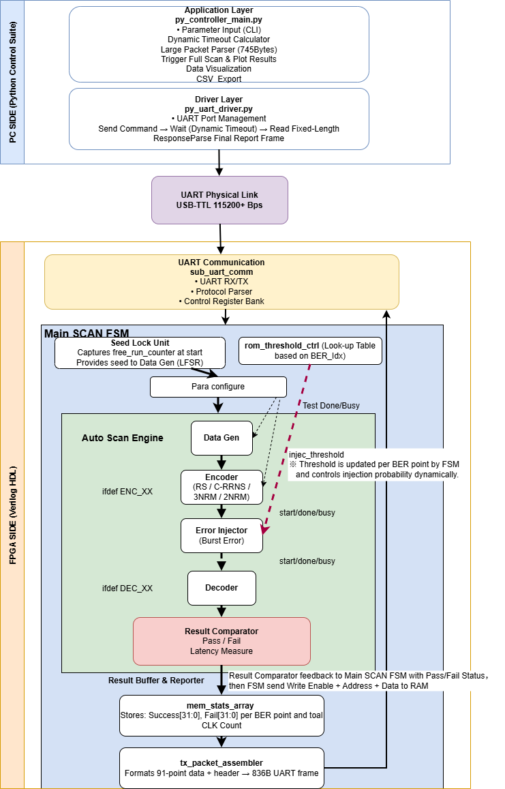
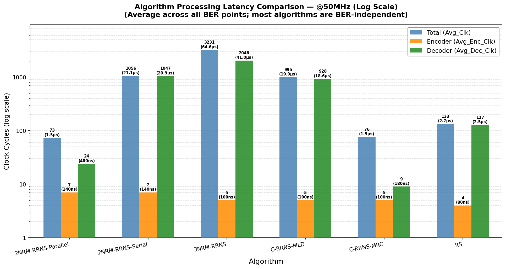
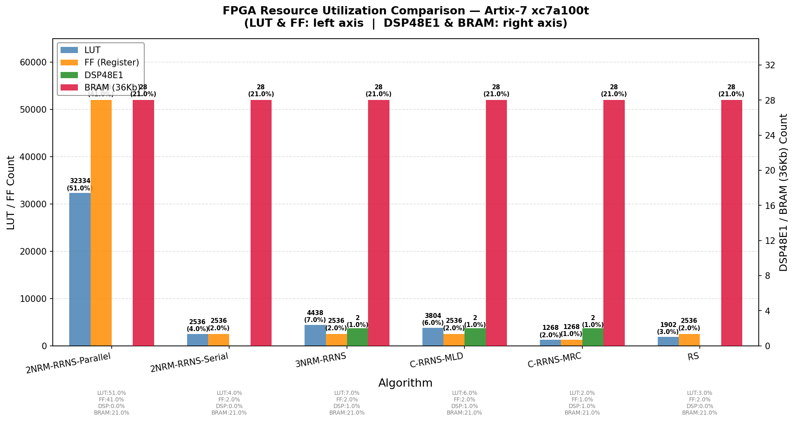

# 1. Motivation and Problem

## Why this project matters

- Hybrid CMOS/non-CMOS memories offer high density and low cost, but they are vulnerable to **spatially correlated cluster faults**.
- Traditional ECC schemes are often evaluated for **independent random errors**, not realistic burst faults.
- Previous studies mainly relied on simulation; **hardware-validated comparison** was still missing.

## Core research question

**Which ECC design gives the best trade-off between fault tolerance, latency, area, power, and storage efficiency on real FPGA hardware?**

# 2. Project Goal and Objectives

## Project goal

To design and implement an **FPGA-based hardware acceleration platform** for fair benchmarking of multiple ECC algorithms under realistic cluster-fault conditions.

## Objectives

1. Implement and compare **6 configurations**:
   - 2NRM-RRNS Parallel
   - 2NRM-RRNS Serial
   - 3NRM-RRNS
   - C-RRNS-MLD
   - C-RRNS-MRC
   - RS(12,4)
2. Evaluate four key dimensions:
   - fault tolerance
   - decoding latency
   - FPGA resource and power cost
   - storage efficiency
# 3. Methodology and Experimental Setup

## Evaluation flow

- **Phase 1**: MATLAB simulation for theoretical baseline.
- **Phase 2**: FPGA implementation for hardware validation.
- Same encode-inject-decode-compare loop is used for every configuration.

## Test settings

- Device: **Artix-7 xc7a100t (Arty A7-100T)**
- Clock: **50 MHz**
- Fault modes:
  - random single-bit injection
  - cluster burst injection with burst length 1-15

# 4. FPGA Platform Architecture

{ width=80% }

## Key idea

The PC controls configuration and visualisation, while the FPGA autonomously performs the full BER sweep and uploads consolidated results through UART.

# 5. Main Innovation: Probabilistic Fault Injection Engine

## Key features

- Uses a **32-bit Galois LFSR** as the pseudo-random source.
- Supports both **random single-bit** and **cluster burst** injection.
- BER is controlled by threshold comparison instead of a fixed schedule.
- Boundary-safe burst masks are precomputed offline and stored in ROM.

## Why it matters

This makes the platform **resource-efficient, reproducible, and reusable** for benchmarking different ECC algorithms.
  
# 6. Why the Test Platform Is Strong

## Advantages of the proposed FPGA test platform

- **Fair comparison**: all algorithms share the same test infrastructure and clock condition.
- **Hardware validated**: results are measured on a Xilinx Artix-7 FPGA, not simulation alone.
- **Low overhead fault injection**: the probabilistic injector uses only **two BRAMs**.
- **Scalable experiments**: supports **101 BER points** from 0% to 10% and **100,000 samples per point**.
- **Extensible architecture**: new ECCs can be added with the wrapper interface.
- **Cross-validated**: FPGA curves closely match MATLAB results, increasing credibility.

# 7. Random Single-Bit Results

{ width=74% }

## Main observation

- FPGA and MATLAB curves show **close agreement**.
- Correcting ECCs remain strong at low BER, while **C-RRNS-MRC** drops fastest.

# 8. Cluster Burst Results at Representative Length L=12

{ width=74% }

## Main observation

- **C-RRNS-MLD** and **RS(12,4)** show the strongest burst resilience.
- Burst-fault ranking differs from random-bit testing, showing why a realistic fault model is necessary.

# 9. Quantitative Comparison of Key Results

| Algo | Burst $L_{max}$ | Dec. cycles | Efficiency |
|:--|:--:|:--:|:--:|
| C-RRNS-MLD | **14** | 928 | 26.2% |
| RS(12,4) | 13 | 127 | 33.3% |
| 3NRM-RRNS | 11 | 2048 | 33.3% |
| 2NRM-P | 8 | **24** | **39.0%** |
| 2NRM-S | 7 | 1047 | **39.0%** |

## Takeaway

- **Most reliable**: C-RRNS-MLD
- **Fastest**: 2NRM-P
- **Most compact**: 2NRM

# 10. Latency Comparison

{ width=82% }

## Conclusion from latency results

- The **2NRM-RRNS Parallel** decoder is the fastest correcting design.
- The parallel implementation achieves a major acceleration over the serial version.
- The result clearly exposes the **resource-latency trade-off** of parallel MLD.

# 11. Resource and Storage Comparison

{ width=68% }

## Key message

- **2NRM-Parallel** achieves high speed at the highest LUT/FF and power cost.
- **2NRM** is the most storage-efficient option, while **C-RRNS-MLD** gives the strongest protection.

# 12. Main Conclusions

## Major conclusions from the dissertation

1. The project successfully delivers a **working FPGA benchmarking platform** for ECC evaluation under cluster faults.
2. **C-RRNS-MLD** shows the strongest burst-fault tolerance in the explored design space.
3. **2NRM-RRNS Parallel** offers the lowest decode latency, but its area and power cost are high.
4. **2NRM-RRNS** provides the best storage efficiency for overhead-sensitive systems.
5. The close agreement between FPGA and MATLAB results confirms the **correctness and reliability** of the evaluation method.

# 13. Contributions and Future Work

## Contributions

- A reusable FPGA evaluation platform with unified wrappers.
- A low-resource probabilistic fault injection engine.
- The first hardware-level quantification of the **parallel vs serial 2NRM-RRNS trade-off**.

## Future work

- evaluate wider data words and more ECC variants
- reduce LFSR correlation with stronger random sources
- migrate the framework toward ASIC or real hybrid memory devices

# Appendix A. Fault Injection Algorithm

## Probabilistic injection procedure

1. Generate encoded codeword.
2. Lock one random seed for the full BER sweep.
3. For each BER point, compute the injection threshold.
4. Use the 32-bit Galois LFSR to decide whether to inject an error.
5. If random mode is selected, test valid bits independently.
6. If burst mode is selected, apply one ROM-based contiguous burst mask.
7. Decode and compare with the original data to record pass or fail.

## Purpose

This appendix shows that the fault injector is not a simple random flip unit, but a **controlled and reproducible hardware evaluation algorithm**.

# Appendix B. Backup Figure: Burst-Length Impact

{ width=46% }
{ width=46% }

## Backup message

These curves support the final claim that **C-RRNS-MLD** provides the best extreme cluster-fault tolerance, with **RS** as the strongest balanced alternative.

# Thank You

## Questions?

Thank you for listening.
