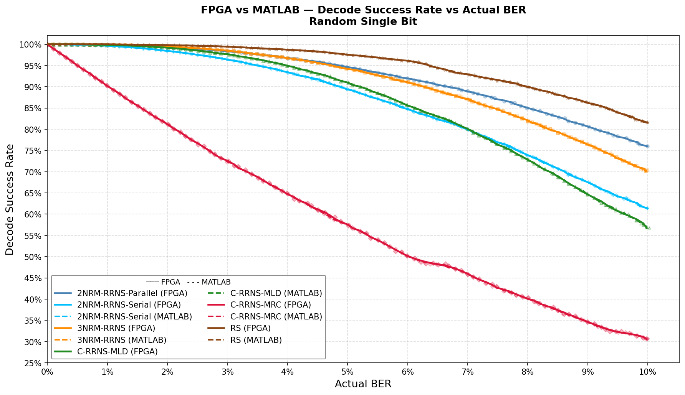
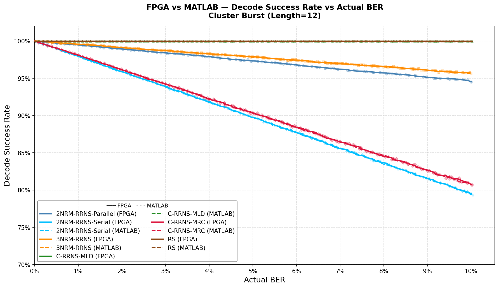
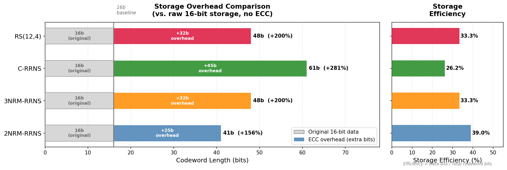
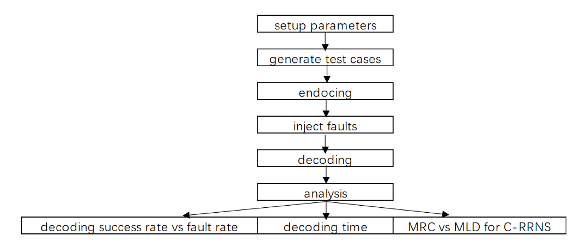
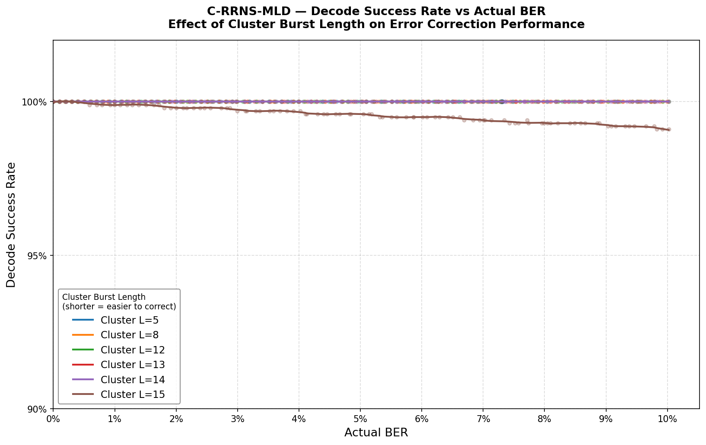
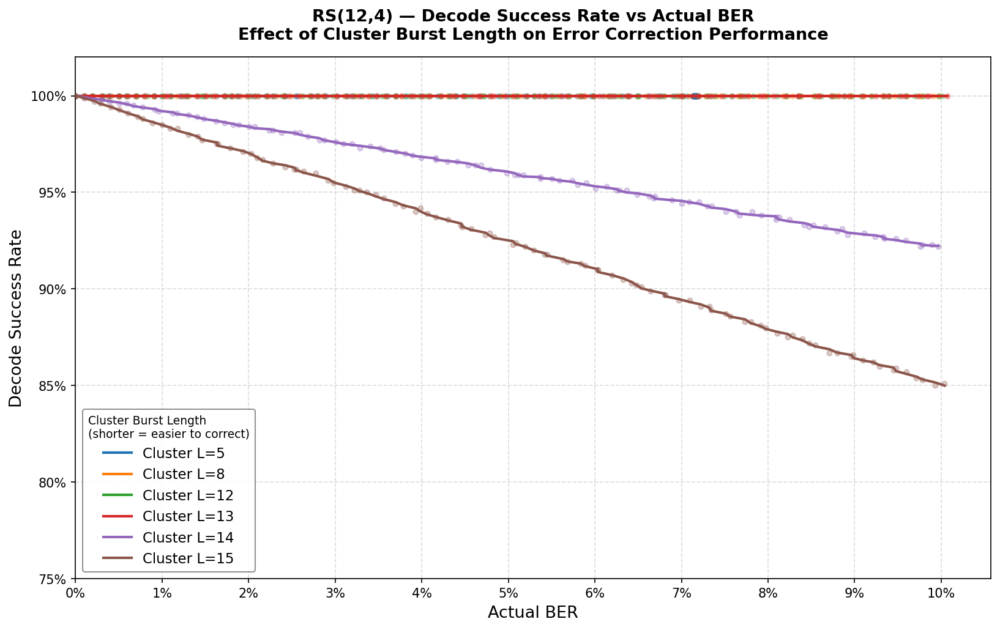
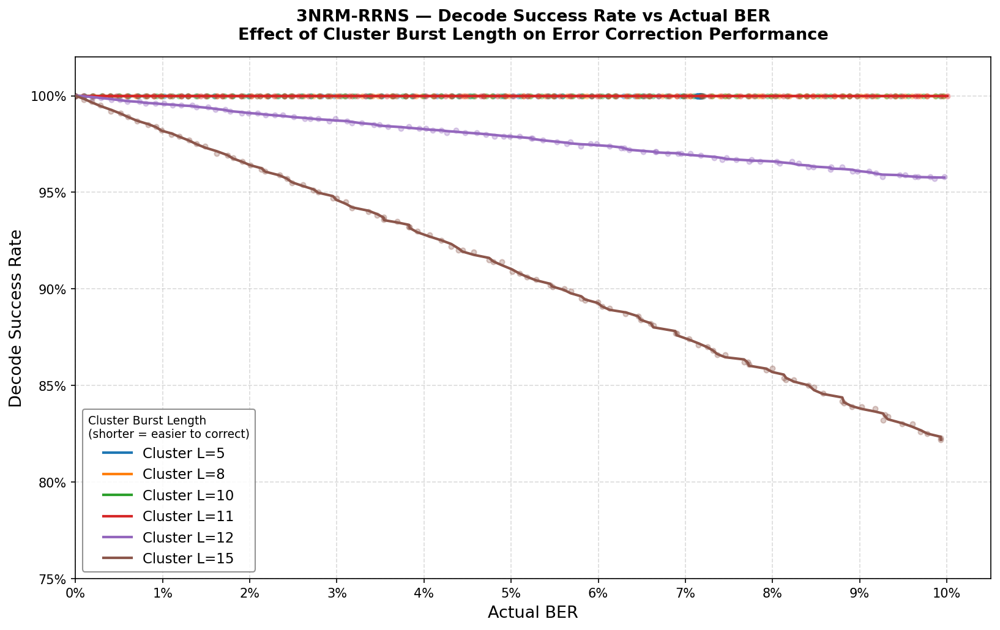
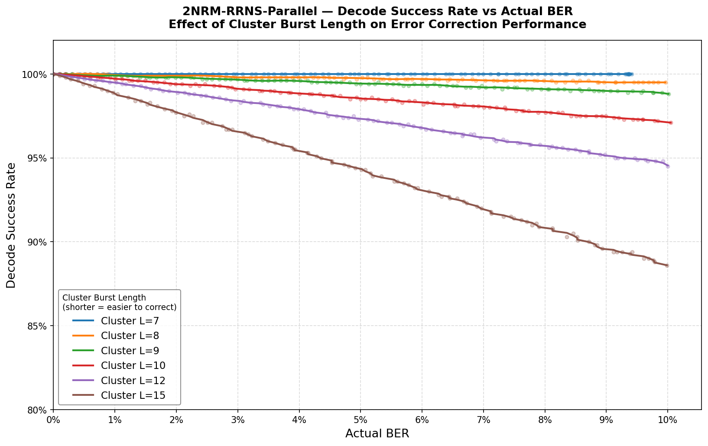
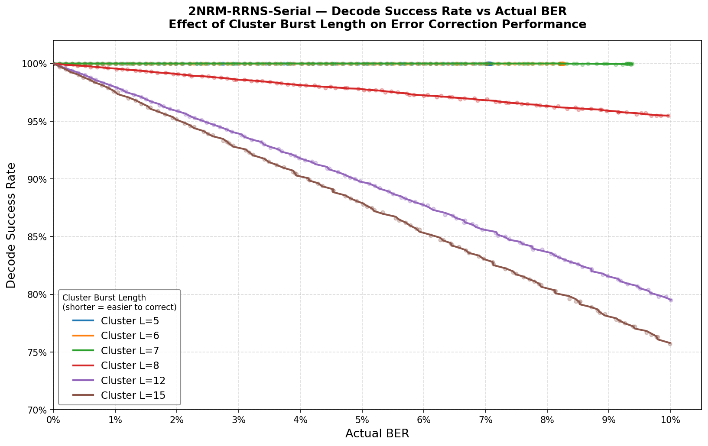

{ width=85% }

# Hardware Acceleration for Cluster Fault Tolerance in Hybrid CMOS/non-CMOS Memories


# Abstract

Hybrid CMOS/non-CMOS memories are susceptible to cluster faults 閳?spatially correlated bursts of consecutive bit errors arising from the dense packing of nanoscale devices 閳?for which conventional error-correcting codes (ECCs) designed for random errors are inadequate. Redundant Residue Number System (RRNS) codes offer inherent cluster fault tolerance, but existing implementations lack hardware-validated, multi-algorithm performance benchmarks and have not quantified the architectural trade-offs between different decoding strategies on physical hardware.

This dissertation presents an FPGA-based hardware acceleration platform that evaluates six ECC algorithm configurations 閳?including parallel and serial implementations of 2NRM-RRNS 閳?on a Xilinx Artix-7 device. A novel probabilistic fault injection engine enables statistically rigorous BER testing (0閳?0%, 101 points, 100,000 samples per point) under random single-bit and cluster burst fault models using only two Block RAMs. A unified encoder/decoder wrapper architecture with compile-time algorithm selection ensures fair, interference-free resource comparison.

The key contributions of this work are: **(1)** a scalable FPGA evaluation platform with a novel probabilistic fault injection engine requiring only two Block RAMs and supporting arbitrary sample counts without hardware modification; **(2)** the first hardware-based empirical evaluation showing that C-RRNS-MLD achieves *no observed decoding failures* across the full 0閳?0% BER range under cluster lengths up to 14 within a test space of 100,000 samples per BER point; this behaviour is consistent with its theoretical t=3 correction capability and wide residue fields (6閳? bits each), though extreme alignment cases are not exhaustively covered; **(3)** the first quantification of the parallel vs. serial MLD resource-latency trade-off on physical hardware 閳?the parallel 2NRM-RRNS decoder achieves 43鑴?lower latency (24 vs. 1047 clock cycles) at 13鑴?higher LUT utilisation, and achieves the lowest decode latency (24 cycles) among all evaluated configurations; and **(4)** comprehensive hardware benchmarks across four evaluation dimensions (fault tolerance, processing latency, resource utilisation, and storage efficiency), supported by a unified wrapper architecture ensuring fair cross-algorithm comparison under identical synthesis and timing conditions.


# Individual Contribution

This project was undertaken independently as an individual final-year dissertation. All work described in this report was performed solely by the author, Yuqi Guo (Student ID: 230184273), under the supervision of Mr. Neil Powell at the University of Sheffield.

**MATLAB Simulation Phase**: In the first semester, a simulation model was established to compare the decoding performance and resource consumption of four algorithms: 2NRM-RRNS, 3NRM-RRNS, C-RRNS, and RS. However, since the fault injection model used in this simulation was inconsistent with that of the FPGA testbed implemented in the second semester, a direct comparison was not feasible. Therefore, in the second semester, a second round of simulation was conducted using a fault injection model consistent with the FPGA testbed. The FPGA test results and the MATLAB simulation results were then plotted and compared. The results indicate that the FPGA test results are in **strong agreement** with the MATLAB simulation results under the aligned fault injection model. Minor deviations may arise from differences in random number generation (LFSR vs. independent pseudo-random sequences) and finite sample effects, but these do not affect the overall comparative conclusions.

**FPGA Implementation Phase**: All Verilog/SystemVerilog source code described in Chapter 3 was written by the author. This includes:
- Encoder modules for all four algorithm families.
- Decoder modules for all six configurations, including the novel parallel MLD pipeline and serial FSM.
- The probabilistic fault injection engine.
- The test infrastructure.
- The UART communication layer.

**PC-Side Software**: All Python scripts for test control, data collection, and visualisation were written by the author.

**Hardware Resources**: The Xilinx Artix-7 xc7a100t FPGA (Arty A7-100T development board) was used as the target platform. The Xilinx Vivado 2023.2 design suite was used for synthesis, implementation, and bitstream generation under a standard academic licence. No external datasets were used; all experimental data was collected by the author using the platform described in this report.

The algorithms evaluated in this work are based on the published research of Haron and Hamdioui [1] and Goh and Siddiqi [2], as cited throughout the dissertation.

The author independently conducted the entire technical design, implementation, and validation of the FPGA-based system presented in this project. This includes the creation of a comprehensive high-level design document exceeding 30 pages, detailing the system architecture, module specifications, data flow, and control logic. Throughout the implementation process, the author identified, analyzed, and resolved over 100 bugs, demonstrating hands-on debugging and problem-solving capabilities. While AI-assisted tools were employed solely to improve language clarity, all critical technical decisions, coding, testing, and verification were carried out by the author. The high-level design documentation and detailed debugging logs serve as tangible evidence of the author閳ユ獨 direct contributions and the independent development of the project.


# Acknowledgement

I would like to express my sincere gratitude to my project supervisor, Mr. Neil Powell, for his invaluable guidance, encouragement, and constructive feedback throughout the duration of this project. His expertise in digital systems design and his patient support during the FPGA implementation phase were instrumental in shaping both the technical direction and the quality of this work. I am particularly grateful for his willingness to engage with the detailed hardware debugging challenges encountered during the development of the fault injection platform, and for his insightful comments on the interim report that helped focus the scope of the final dissertation.

I would also like to thank Dr. Mohammad Eissa, the second marker for this project, for his time and effort in reviewing my work during this project.

Finally, I would like to thank my family for their unwavering support and encouragement throughout my studies at the University of Sheffield.

[TOC]

# Chapter 1 Introduction

## 1.1 Background

The relentless scaling of CMOS transistor geometry and the emergence of non-CMOS nanodevices have opened the prospect of hybrid CMOS/non-CMOS memories capable of storing data at densities approaching 1 Tbit/cm铏?[1]. In these hybrid architectures, arrays of nanowire crossbars are fabricated on top of nanoscale CMOS circuits. At each crosspoint, a two-terminal nanodevice 閳?such as a single-electron junction, organic molecule, or phase-change material 閳?serves as a single-bit memory cell. The CMOS layer performs peripheral functions (encoding, decoding, sensing, and global interconnection), while the nanoscale crossbar provides ultra-high-density storage.

Despite their extraordinary capacity potential, hybrid memories are inherently susceptible to two categories of faults. First, **manufacturing defects** arise from the imprecision of top-down fabrication techniques (e.g., extreme ultraviolet lithography, nanoimprint) and the immaturity of bottom-up self-assembly processes, leading to broken nanowires, missing nanodevices, and misaligned interface pins. Second, **transient faults** occur during operation due to the reduced signal-to-noise ratio caused by lower supply voltages and smaller capacitances at nanoscale dimensions. Charged-based non-CMOS nanodevices are particularly vulnerable because they require only a small voltage perturbation to change their internal state.

A critical characteristic of these faults is their **spatial correlation**: because nanodevices are densely packed and closely interconnected, a single fault event can propagate to affect several contiguous memory cells, resulting in **cluster faults** 閳?spatially correlated bursts of multiple consecutive bit errors. In the literature, the terms *cluster faults*, *cluster errors*, and *burst errors* are used interchangeably to describe this phenomenon; this dissertation adopts the term **cluster faults** (following the terminology of Haron and Hamdioui [1]) when referring to the fault model, and **burst errors** or **burst injection** when referring specifically to the fault injection mechanism used in the evaluation platform. This fault model is fundamentally different from the independent random bit errors assumed by conventional error-correcting codes (ECCs) such as Hamming codes, BCH codes, and Euclidean Geometry codes, which have been widely applied to hybrid memories [6閳?1] but were designed for random, uncorrelated errors.

The Redundant Residue Number System (RRNS) was identified by Haron and Hamdioui [1] as a particularly suitable ECC for cluster fault tolerance in hybrid memories. Unlike conventional ECCs, RRNS operates on residue representations of data, where each residue is computed independently with respect to a different modulus. A cluster fault that corrupts a contiguous block of bits will typically corrupt only a small number of residues (since each residue occupies a contiguous bit field), regardless of the burst length. This property makes RRNS inherently well-suited for cluster fault correction.

However, the conventional RRNS (C-RRNS) implementation incurs significant storage overhead: for 16-bit data, C-RRNS requires a 61-bit codeword 閳?27.1% longer than the 48-bit Reed-Solomon (RS) codeword for the same data width. This overhead is a direct consequence of the requirement that redundant moduli must be larger than non-redundant moduli, which forces the use of large integers and long residue fields. Reducing this overhead while maintaining competitive error correction capability is identified as an open challenge in the literature [8].

To address this limitation, Haron and Hamdioui [1] proposed two modified RRNS variants 閳?**Three Non-Redundant Moduli RRNS (3NRM-RRNS)** and **Two Non-Redundant Moduli RRNS (2NRM-RRNS)** 閳?that use smaller redundant moduli to achieve shorter codewords. These variants require Maximum Likelihood Decoding (MLD) to resolve the decoding ambiguity introduced by the violation of the conventional moduli ordering rule, but offer significant advantages in storage efficiency and decoding speed.

While other advanced ECC schemes have been considered for hybrid memory protection, each exhibits limitations in the cluster fault context. Low-Density Parity-Check (LDPC) codes and Turbo codes offer excellent random error correction performance but incur high decoding complexity and iterative latency that is incompatible with the low-latency access requirements of memory systems [8]. BCH codes, though hardware-efficient, are similarly optimised for random rather than spatially correlated errors. Furthermore, existing FPGA implementations of RRNS-based ECC [3] have focused on single-algorithm implementations without systematic multi-algorithm comparison, and no prior work has quantified the resource-latency trade-off between parallel and sequential MLD architectures on physical hardware. This work addresses these gaps directly.

While the theoretical properties of these algorithms have been established through MATLAB simulation [1], their practical feasibility on hardware platforms 閳?including resource utilisation, timing characteristics, and actual BER performance under realistic fault injection 閳?has not been comprehensively evaluated. This gap motivates the present work.

## 1.2 Aims and Objectives

The primary aim of this project is to design and implement an FPGA-based hardware acceleration platform for evaluating the fault tolerance performance of multiple ECC algorithms under realistic cluster fault conditions, and to use this platform to provide a comprehensive, hardware-validated comparison of the 2NRM-RRNS, 3NRM-RRNS, C-RRNS, and RS(12,4) algorithms.

The specific objectives are:

1. **Algorithm Validation**: Quantitatively evaluate the error correction capability and performance advantages of 3NRM-RRNS and 2NRM-RRNS codes through both MATLAB simulation and FPGA hardware implementation, with specific focus on cluster fault tolerance compared to C-RRNS and RS codes.
2. **Hardware Implementation**: Design and implement efficient encoder/decoder architectures for all four coding schemes (RS, C-RRNS, 3NRM-RRNS, 2NRM-RRNS) using Verilog HDL on a Xilinx Artix-7 FPGA (Arty A7-100T development board).
3. **Fault Injection Platform**: Develop a novel probabilistic fault injection engine capable of evaluating algorithm performance under both random single-bit and cluster burst fault models, with configurable burst lengths (1閳?5 bits) and BER sweep from 0% to 10%.
4. **Performance Benchmarking**: Conduct comprehensive performance analysis including:
   - BER vs. decode success rate under two fault injection scenarios
   - Encoder and decoder processing latency (clock cycles)
   - FPGA resource utilisation (LUT, FF, DSP, BRAM)
   - Storage efficiency (codeword length vs. data width)
5. **Architectural Exploration**: Implement the 2NRM-RRNS decoder in both parallel (15-channel MLD pipeline) and serial (sequential FSM) architectures to directly quantify the resource-latency trade-off of parallel MLD.

## 1.3 Expected Contributions

The expected contributions of this work are:
- **Comprehensive hardware-validated performance characterisation** of novel RRNS variants (2NRM-RRNS, 3NRM-RRNS) under realistic cluster fault models on an FPGA platform.
- **A novel probabilistic fault injection engine** that enables statistically rigorous BER testing with arbitrary sample counts using minimal hardware resources.
- **A novel parallel vs. serial MLD comparison** for the 2NRM-RRNS algorithm, providing direct quantification of the resource-latency trade-off.
- **Open-source Verilog implementations** of optimised RRNS encoder/decoder architectures with a unified, extensible wrapper interface.
- **Benchmark data** comparing RRNS approaches with RS codes across four evaluation dimensions: fault tolerance, processing latency, resource utilisation, and storage efficiency.

## 1.4 Report Structure

The remainder of this dissertation is organised as follows:
- **Chapter 2** provides the theoretical background for all four ECC algorithms, including the mathematical foundations of RNS, RRNS encoding/decoding, the C-RRNS, 3NRM-RRNS, 2NRM-RRNS, and RS(12,4) algorithms, and the Maximum Likelihood Decoding method.
- **Chapter 3** describes the methodology, covering the MATLAB simulation phase (Section 3.1) and the FPGA implementation phase (Section 3.2), including the top-level system architecture, the probabilistic fault injection engine, and the end-to-end test loop.
- **Chapter 4** presents and discusses the experimental results across all four evaluation dimensions.
- **Chapter 5** analyses the economic, legal, social, ethical, and environmental context of this work.
- **Appendices** provide pseudocode descriptions of all encoder and decoder implementations.

# Chapter 2 Theoretical Background

## 2.1 Residue Number System (RNS) Fundamentals

The Residue Number System (RNS) is a non-weighted numeral representation system based on modular arithmetic, first formalised by Garner [5]. In an RNS, an integer $X$ is represented by a set of residues $(x_1, x_2, \ldots, x_n)$, where each residue $x_i = X \bmod m_i$ is computed with respect to a chosen modulus $m_i$. The moduli set $\{m_1, m_2, \ldots, m_n\}$ must satisfy three conditions:

1. **Pairwise coprimality**: $\gcd(m_i, m_j) = 1$ for all $i \neq j$.
2. **Strict ordering**: $m_1 < m_2 < \cdots < m_n$.
3. **Dynamic range sufficiency**: The product $M = \prod_{i=1}^{n} m_i$ must be sufficient to represent all numbers in the legitimate range $[0, M_a - 1]$.

By the Chinese Remainder Theorem (CRT), any integer $X$ in the range $[0, M-1]$ is uniquely determined by its residue representation. This property enables parallel arithmetic operations 閳?addition, subtraction, and multiplication 閳?to be performed independently on each residue channel without carry propagation between channels, offering inherent speed advantages for digital signal processing and memory applications.

## 2.2 Redundant Residue Number System (RRNS) Codes

The Redundant Residue Number System (RRNS) extends the basic RNS by partitioning the moduli set into two subsets [13]:

- **Non-redundant moduli** $\{m_1, \ldots, m_k\}$: used to represent the data word (dataword).
- **Redundant moduli** $\{m_{k+1}, \ldots, m_n\}$: used to generate check residues (checkword/parity).

The error correction capability of an RRNS code is:

$$t = \left\lfloor \frac{n - k}{2} \right\rfloor$$

That is, the code can correct up to $t$ erroneous residues, or detect up to $2t$ erroneous residues. This is equivalent to the error correction capability of Reed-Solomon codes, making RRNS a competitive alternative for cluster fault tolerance.

### 2.2.1 RRNS Encoding

Encoding is straightforward: for input data $X$, compute the residue with respect to each modulus:

$$x_i = X \bmod m_i, \quad i = 1, 2, \ldots, n$$

The resulting $n$-tuple $(x_1, x_2, \ldots, x_n)$ is the RRNS codeword. The non-redundant residues $(x_1, \ldots, x_k)$ represent the data, and the redundant residues $(x_{k+1}, \ldots, x_n)$ serve as parity.

### 2.2.2 RRNS Decoding

Decoding proceeds in two phases: error detection and error correction.

**Error Detection**: The received codeword is decoded to a value $X_n$ using all $n$ residues. If $X_n \leq M_a$ (the product of the non-redundant moduli), the codeword is valid and no correction is needed. If $X_n > M_a$, errors are detected.

**Error Correction**: A trial-and-error procedure is applied. For each combination of $z = n - t$ residues (discarding $t$ residues at a time), the data is reconstructed as $X_z$ and compared against the product of the remaining moduli $M_z$. If $X_z \leq M_z$, the correct data has been recovered. The maximum number of iterations is $\binom{n}{t}$.

Two reconstruction algorithms are available: the **Chinese Remainder Theorem (CRT)**, which uses large integer arithmetic, and **Mixed-Radix Conversion (MRC)**, which uses smaller integers and is computationally more efficient. MRC is defined as:

$$X_r = \sum_{s=1}^{n} v_s w_s$$

where the mixed-radix digits $v_s$ are computed sequentially:

$$v_1 = x_1, \quad v_s = \left| \left( (x_s - v_1) \cdot m_{1s}^{-1} - \cdots - v_{s-1} \right) \cdot m_{(s-1)s}^{-1} \right|_{m_s}$$

and the weight coefficients are $w_1 = 1$, $w_s = \prod_{i=1}^{s-1} m_i$.

## 2.3 Conventional RRNS (C-RRNS)

The Conventional RRNS (C-RRNS) code, as defined in [1], uses three restricted non-redundant moduli of the form $m_a = \{2^f, 2^f - 1, 2^f + 1\}$, where $f$ is a positive integer. For 16-bit data words ($X \in [0, 65535]$), the smallest valid choice is $f = 6$, giving:

$$m_a = \{64, 63, 65\}, \quad M_a = 64 \times 63 \times 65 = 262{,}080 > 65{,}535$$

Six redundant moduli $m_b = \{67, 71, 73, 79, 83, 89\}$ are appended, all larger than the non-redundant moduli. The resulting codeword has $k + (n-k) = 3 + 6 = 9$ residues and error correction capability $t \leq 3$.

The total codeword length is $6 + 6 + 7 + 7 + 7 + 7 + 7 + 7 + 7 = 61$ bits. The requirement that redundant moduli must be larger than non-redundant moduli (Rule 2 of Section 2.1) is satisfied, enabling standard MRC decoding without ambiguity.

**Limitation**: The use of large redundant moduli results in a 61-bit codeword 閳?27.1% longer than the 48-bit RS(12,4) codeword for the same data width. This storage overhead is the primary motivation for the modified RRNS variants described in Sections 2.5 and 2.6.

## 2.4 Reed-Solomon (RS) Codes

Reed-Solomon codes are a class of block error-correcting codes defined over finite fields (Galois fields) $\text{GF}(2^m)$ [5]. An RS$(n, k)$ code over $\text{GF}(2^m)$ encodes $k$ data symbols into $n$ codeword symbols, each of $m$ bits, with error correction capability $t = (n-k)/2$ symbols.

For the 16-bit data word comparison in this work, the RS(12, 4) code over $\text{GF}(2^4)$ is used:
- 4 data symbols 鑴?4 bits = 16 bits of data
- 8 parity symbols 鑴?4 bits = 32 bits of parity
- Total codeword: 12 symbols 鑴?4 bits = **48 bits**
- Error correction capability: $t = (12-4)/2 = 4$ symbols

**Encoding** uses systematic polynomial division: the data polynomial $d(x)$ is multiplied by $x^{n-k}$ and divided by the generator polynomial $g(x) = \prod_{i=1}^{n-k}(x - \alpha^i)$, where $\alpha$ is a primitive element of $\text{GF}(2^4)$. The remainder gives the parity symbols.

**Decoding** uses the Berlekamp-Massey algorithm to find the error locator polynomial $\sigma(x)$, followed by Chien search to locate error positions, and the Forney algorithm to compute error magnitudes. The total decoding complexity is $O(t^2)$ operations in $\text{GF}(2^m)$.

RS codes are well-suited for cluster fault correction because a burst of $b$ consecutive bit errors affects at most $\lceil b/m \rceil$ symbols, and the symbol-level correction capability is independent of the burst pattern within a symbol.

## 2.5 Three Non-Redundant Moduli RRNS (3NRM-RRNS)

The 3NRM-RRNS code was proposed by Haron and Hamdioui [1] as a modified RRNS variant that reduces codeword length while maintaining the same error correction capability as C-RRNS.

**Key innovation**: The redundant moduli are chosen to be *smaller* than the non-redundant moduli, in contrast to C-RRNS where redundant moduli must be larger. Specifically:

$$m_a = \{64, 63, 65\} \quad \text{(same as C-RRNS)}$$
$$m_b = \{31, 29, 23, 19, 17, 11\}$$

The redundant moduli are the minimum values satisfying Rules 1 and 3 of Section 2.1: they are pairwise coprime, and their product $M_b = 31 \times 29 \times 23 \times 19 \times 17 \times 11 = 73{,}465{,}381 > 65{,}535$.

The total codeword length is $6 + 6 + 7 + 5 + 5 + 5 + 5 + 5 + 4 = 48$ bits 閳?equal to RS(12,4) and 21.3% shorter than C-RRNS. The error correction capability remains $t \leq 3$.

**Violation of Rule 2**: Since the redundant moduli are smaller than the non-redundant moduli, Rule 2 ($m_1 < m_2 < \cdots < m_n$) is violated. This means that some input data values may have multiple valid candidates during decoding (ambiguity). This ambiguity is resolved using Maximum Likelihood Decoding (MLD), described in Section 2.7.

## 2.6 Two Non-Redundant Moduli RRNS (2NRM-RRNS)

The 2NRM-RRNS code [1] further reduces the codeword length by using only *two* non-redundant moduli instead of three:

$$m_a = \{2^f + 1, 2^f\} = \{257, 256\} \quad (f = 8)$$
$$m_b = \{61, 59, 55, 53\}$$

The non-redundant moduli product is $M_a = 257 \times 256 = 65{,}792 > 65{,}535$, sufficient to represent all 16-bit data values. The redundant moduli product is $M_b = 61 \times 59 \times 55 \times 53 = 10{,}491{,}085 > 65{,}535$.

The total codeword length is $9 + 8 + 6 + 6 + 6 + 6 = 41$ bits 閳?14.6% shorter than RS(12,4) and 32.8% shorter than C-RRNS. The error correction capability is $t \leq 2$ (two erroneous residues).

**Storage efficiency**: 2NRM-RRNS achieves the highest storage efficiency among all evaluated codes:
- 2NRM-RRNS: $16/41 = 39.0\%$
- 3NRM-RRNS: $16/48 = 33.3\%$
- RS(12,4): $16/48 = 33.3\%$
- C-RRNS: $16/61 = 26.2\%$

**Decoding speed**: With $t = 2$ and $n = 6$ moduli, the maximum number of MRC iterations is $\binom{6}{2} = 15$. In contrast, C-RRNS and 3NRM-RRNS require $\binom{9}{3} = 84$ iterations. Therefore, 2NRM-RRNS is 5.6 times faster than C-RRNS in the decoding process [1].

Like 3NRM-RRNS, 2NRM-RRNS violates Rule 2 and requires MLD to resolve decoding ambiguity.

## 2.7 Maximum Likelihood Decoding (MLD) for Modified RRNS

The violation of Rule 2 in 3NRM-RRNS and 2NRM-RRNS means that the CRT uniqueness guarantee no longer holds: multiple candidate values may satisfy the validity condition $X \leq M_a$ during decoding. Maximum Likelihood Decoding (MLD), as proposed by Goh and Siddiqi [2], resolves this ambiguity.

The MLD algorithm selects the most probable valid codeword based on Hamming distance:

$$X_{\text{correct}} = \arg\min_{X \in \mathcal{V}} d_H\!\left(R_{\text{received}},\ R_{\text{expected}}(X)\right)$$
where:
- $\mathcal{V}$ is the set of all valid candidate values (those satisfying $X \leq M_a$)
- $R_{\text{received}} = (\tilde{x}_1, \ldots, \tilde{x}_n)$ is the received (possibly corrupted) residue vector
- $R_{\text{expected}}(X) = (X \bmod m_1, \ldots, X \bmod m_n)$ is the expected residue vector for candidate $X$
- $d_H(A, B) = \sum_{i=1}^{n} \mathbf{1}[a_i \neq b_i]$ is the Hamming distance (number of mismatching residues)

The candidate with the minimum Hamming distance to the received residues is selected as the decoded output. If multiple candidates share the minimum distance, a secondary criterion (lower index) is applied as a tie-breaking rule. In practice, such ties are statistically rare: for a tie to occur, two distinct candidate values must produce residue vectors that are equidistant from the received (corrupted) residue vector across all $n$ residue positions simultaneously. Given the pseudo-random distribution of 16-bit data values and the algebraic structure of the moduli set, the probability of a tie is negligible compared to the probability of a unique minimum-distance candidate, and does not contribute measurably to the observed failure rate in the experimental results of Section 4.2.

**Computational complexity**: For 2NRM-RRNS, the MLD procedure evaluates at most $\binom{6}{2} \times 5 = 75$ candidates (15 modulus pairs 鑴?up to 5 candidates per pair due to the periodicity of the CRT solution). For 3NRM-RRNS and C-RRNS-MLD, the procedure evaluates $\binom{9}{3} = 84$ triplets. The Hamming distance computation for each candidate requires $n$ modulo operations and $n$ comparisons.

## 2.8 Comparison of ECC Schemes

Table 2.1 summarises the key parameters of all four ECC schemes evaluated in this work, based on the analysis in [1].

**Table 2.1** Comparison of ECC schemes for 16-bit data word protection.

| ECC Scheme | Non-redundant moduli | Redundant moduli | Codeword (bits) | Error correction | Storage efficiency | Decoding iterations |
|------------|---------------------|-----------------|-----------------|------------------|--------------------|---------------------|
| C-RRNS | {64, 63, 65} | {67, 71, 73, 79, 83, 89} | 61 | t=3 residues | 26.2% | C(9,3)=84 |
| 3NRM-RRNS | {64, 63, 65} | {31, 29, 23, 19, 17, 11} | 48 | t=3 residues | 33.3% | C(9,3)=84 |
| 2NRM-RRNS | {257, 256} | {61, 59, 55, 53} | 41 | t=2 residues | 39.0% | C(6,2)=15 |
| RS(12,4) | GF(2閳?, 4 data symbols | 8 parity symbols | 48 | t=4 symbols | 33.3% | O(t铏? |

The key trade-offs are:
- **C-RRNS** provides t=3 correction but at the highest storage cost (61 bits).
- **3NRM-RRNS** matches C-RRNS in correction capability (t=3) with a 21.3% shorter codeword, at the cost of requiring MLD.
- **2NRM-RRNS** achieves the best storage efficiency (39.0%) and fastest decoding (15 iterations), with t=2 correction capability.
- **RS(12,4)** provides the highest correction capability (t=4 symbols) with a 48-bit codeword, using well-established algebraic decoding.

# Chapter 3 Methodology

## 3.1 MATLAB Simulation Phase

The Semester 1 MATLAB simulation (Section 3.1) used a fault injection model that differs significantly from the FPGA hardware implementation: it applied random bit flips uniformly across the entire codeword (including zero-padding bits) using MATLAB's Mersenne Twister random number generator, which is statistically independent between trials. This model is not directly comparable to the FPGA's LFSR-based probabilistic injection engine, which confines faults strictly to the $W_{\text{valid}}$ valid codeword bits and exhibits linear correlations between adjacent trials due to the LFSR's shift-register structure.

To enable a meaningful FPGA-vs-MATLAB comparison, a second MATLAB simulation was developed that replicates the FPGA fault injection model as closely as possible. This simulation (`run_simulation.m`) implements the following modules:

- **`encode.m`**: Routes encoding to the appropriate algorithm-specific encoder (`encode_2nrm.m`, `encode_3nrm.m`, `encode_crrns.m`, `encode_rs.m`). The 2NRM-RRNS, 3NRM-RRNS, and C-RRNS encoders are implemented from scratch; the RS(12,4) encoder uses MATLAB's built-in `encode()` function with the GF(2閳? Reed-Solomon configuration.
- **`decode.m`**: Routes decoding to the appropriate algorithm-specific decoder (`decode_2nrm_mld.m`, `decode_3nrm_mld.m`, `decode_crrns_mld.m`, `decode_crrns_mrc.m`, `decode_rs.m`). All RRNS decoders are implemented from scratch using the MLD algorithm described in Section 2.7; the RS(12,4) decoder uses MATLAB's built-in `decode()` function.
- **`fault_injector.m`**: Implements the same probabilistic injection model as the FPGA: for random single-bit mode, each bit is independently flipped with probability $P_{\text{trigger}} = \text{BER}_{\text{target}}$; for cluster burst mode, a single burst of $L$ consecutive bits is injected with probability $P_{\text{trigger}} = \text{BER}_{\text{target}} \times W_{\text{valid}} / L$, at a uniformly random position within the valid codeword region.
- **`ber_sweep.m`**: Executes the Monte Carlo BER sweep using MATLAB's Parallel Computing Toolbox (`parfor`) to distribute trials across available CPU cores, achieving approximately 8閳?0鑴?speedup on a 12-core processor.
- **`save_results_csv.m`**: Saves results in the same CSV format as the FPGA, enabling direct comparison using the existing visualisation scripts.

Due to an inconsistency in the fault injection models, the first-round MATLAB simulation (detailed in Appendix H) could not be directly compared with the FPGA tests. Therefore, a second-round simulation was performed using a consistent model, and its results are plotted together with the FPGA results in Chapter 4 for comparison.

## 3.2 FPGA Implementation Phase

### 3.2.1 Top-Level System Architecture

#### 3.2.1.1 Overview

The FPGA-based fault-tolerance evaluation platform is designed around a **master-slave architecture**, in which a PC host acts as the high-level controller responsible for test configuration and result visualisation, while the FPGA target autonomously executes the full BER sweep and returns a consolidated result packet upon completion. The two sides communicate exclusively through a **UART serial link** operating at 921,600 bps. Figure 3.1 illustrates the top-level system topology. Detailed module functions are provided in Appendix I.

{ width=443px }

**Figure 3.1** Top-level system architecture of the FPGA fault-tolerance evaluation platform (Artix-7 xc7a100t, Arty A7-100T development board).

A key design principle adopted throughout this work is the **Single-Algorithm-Build** strategy: each Vivado synthesis run instantiates exactly one codec algorithm, selected at compile time via a Verilog preprocessor macro (`BUILD_ALGO_xxx`). This ensures that the resource utilisation figures reported for each algorithm are free from cross-algorithm interference, yielding accurate and directly comparable LUT, flip-flop, DSP, and Block RAM counts. Switching between algorithms requires only a one-line change in the header file `src/interfaces/main_scan_fsm.vh`, followed by a full re-synthesis.

In addition to the Single-Algorithm-Build strategy, the platform also supports an **All-in-One Build** mode, enabled by defining the `ALL_IN_ONE_BUILD` macro in the same header file. In this mode, all six encoder and decoder instances are synthesised simultaneously into a single bitstream; the active algorithm is selected at runtime via the `algo_id` field in the downlink command frame. This mode is particularly useful for rapid BER performance comparison across all algorithms without requiring repeated bitstream downloads 閳?the PC-side controller (`py_controller_main.py` Mode A) automatically iterates through all six algorithm configurations for each specified burst length and generates comparison plots upon completion. It should be noted that the All-in-One Build consumes approximately twice the FPGA resources of a single-algorithm build and is therefore not used for the resource utilisation or power consumption measurements reported in Sections 4.6 and 4.7, which are based exclusively on Single-Algorithm-Build results.

#### 3.2.1.2 System Workflow

The overall workflow consists of three phases. First, the PC host sends a compact UART configuration packet specifying the algorithm, fault mode, burst length, and sample count. Second, the FPGA executes the complete 101-point BER sweep autonomously: parameters are latched atomically, a single seed is captured and held constant for the entire run, and the `Main Scan FSM` iterates from 0.0% to 10.0% BER in 0.1% steps while `Auto Scan Engine` performs repeated encode-inject-decode-compare trials at each point. Third, the accumulated per-point statistics are uploaded to the PC in a single response frame and exported as CSV for the plotting scripts used in Chapter 4.

This configuration-as-trigger protocol removes the need for a separate start command, avoids partial-update hazards, and ensures that all BER points within one sweep are evaluated under the same pseudo-random sequence. Detailed protocol fields and implementation-level packet structure are omitted here because they do not affect the comparative evaluation results.

#### 3.2.1.4 Main Scan FSM State Diagram

The top-level control flow of the FPGA is governed by `Main Scan FSM`, whose state transitions are shown in Figure 3.2.
{ width=298px }
**Figure 3.2** State diagram of the Main Scan FSM.

The FSM employs an **edge-triggered start mechanism**: an internal rising-edge detector on `test_active` generates a single-cycle `sys_start_pulse`, preventing re-triggering if the signal remains asserted. A hardware abort button (mapped to FPGA pin B9, debounced over 16 ms at 100 MHz) asserts `sys_abort` with the highest priority, forcing an immediate return to `IDLE` from any state. This provides a reliable mechanism to interrupt a long-running test without requiring a full FPGA reset.

#### 3.2.1.5 Clock Domain, Operating Frequency, and Reset Strategy

The entire design operates within a **single clock domain** driven by the 100 MHz on-board oscillator of the Arty A7-100T development board. This eliminates the need for asynchronous FIFOs or clock-domain crossing synchronisers, simplifying timing closure and reducing resource overhead.

**Operating Frequency**

Although the board provides a 100 MHz oscillator, all six algorithm configurations are implemented and evaluated at **50 MHz**. The initial design target was 100 MHz; however, the 2NRM-RRNS parallel MLD decoder 閳?which instantiates 15 independent CRT pipeline channels simultaneously 閳?presented significant timing closure challenges at 100 MHz due to the long combinational paths in the parallel Hamming distance reduction tree. Despite approximately 30 rounds of timing optimisation (including pipeline stage insertion, logic restructuring, and placement constraints), the 100 MHz timing constraint could not be met for the parallel decoder without fundamentally altering the architecture. The operating frequency was therefore reduced to **50 MHz**, at which all six algorithm configurations achieve timing closure with positive slack.

This frequency reduction does not compromise the fairness of the inter-algorithm comparison: all six implementations are evaluated at the same 50 MHz clock, ensuring that the latency and throughput figures reported in Chapter 4 are directly comparable. The 50 MHz operating frequency is also representative of practical ECC accelerator deployments in embedded memory systems, where power consumption and timing margin are often prioritised over raw clock speed.

**UART Baud-Rate Generation**

The UART baud-rate generator uses an integer divider of 109 applied to the 100 MHz system clock input, yielding an actual baud rate of 917,431 bps 閳?a deviation of 閳?.45 % from the target 921,600 bps. This is well within the 鍗?.5 % tolerance of standard UART receivers (based on 16鑴?oversampling with the sampling point at the bit centre), and has been verified to produce no framing errors over the 3,039-byte response frame. Note that the UART baud-rate divider is clocked from the 100 MHz oscillator input directly, independent of the 50 MHz logic clock used by the rest of the design.

**Reset Strategy**

All registers adopt an **asynchronous-assert, synchronous-release** reset strategy. The external reset signal (`rst_n`) is passed through a two-stage flip-flop synchroniser before being distributed as `sys_rst_n` to all sub-modules. This prevents metastability at power-on while ensuring deterministic release timing aligned to the rising edge of the system clock, in accordance with standard FPGA design practice for Xilinx Artix-7 devices.

All algorithm configurations were synthesised using identical tool settings, timing constraints, and target clock frequency (50 MHz), ensuring that reported latency and resource utilisation metrics are directly comparable without optimisation bias.

### 3.2.2 Probabilistic Fault Injection Engine

#### 3.2.2.1 LFSR-Based Pseudo-Random Fault Generation

The fault injection subsystem is built around a **32-bit Galois Linear Feedback Shift Register (LFSR)**, which serves as the sole source of pseudo-randomness for both injection triggering and error-position selection. The Galois configuration was chosen over the more common Fibonacci topology because it distributes the feedback XOR operations across individual flip-flops, enabling a single-cycle update with minimal combinational depth 閳?a critical requirement for maintaining 100 MHz timing closure.

At each rising clock edge, the LFSR advances by one step, producing a new 32-bit pseudo-random value. This output is partitioned and reused for two independent purposes without requiring additional LFSR instances:

- **Bits [31:0]** are compared against the 32-bit injection threshold to determine whether a fault should be injected in the current trial.
- **Bits [5:0]** are used directly as the random offset into the error-pattern look-up table, selecting the starting bit position of the injected burst.

This dual-use strategy eliminates the need for a second random source, reduces hardware resource consumption, and ensures that the injection decision and the error position are determined within the same clock cycle.

Please refer to Appendix J for the detailed algorithm of 32-bit Galois LFSR .

#### 3.2.2.2 Seed Initialisation Mechanism

A key design requirement is that each test run should produce statistically independent results, while all 101 BER points within a single run must be driven by the same pseudo-random sequence to ensure cross-point consistency. This is achieved through a **task-level seed locking** mechanism implemented in the `seed_lock_unit` module.

Rather than receiving a seed from the PC host, the FPGA captures its own seed autonomously. A 32-bit free-running counter increments continuously at 100 MHz. At the moment the FPGA receives a valid configuration frame from the PC 閳?specifically, one clock cycle after `test_active` is asserted 閳?the current counter value is latched as the LFSR seed. Since the exact timing of the PC command depends on the user's interaction and the USB-UART bridge latency, the captured value is effectively unpredictable, providing natural randomness between successive test runs.

Once latched, the seed is held constant throughout the entire 101-point sweep. The `lock_en` signal remains asserted from the `INIT` state until the `FINISH` state of the Main Scan FSM, preventing any re-capture. A zero-seed guard is also implemented: if the captured counter value is zero, the seed is forced to 1, preventing the LFSR from entering the all-zero lock-up state.

This mechanism offers two important advantages. First, it eliminates the need for the PC to transmit a seed value, simplifying the communication protocol. Second, it guarantees that the statistical properties of the pseudo-random sequence are identical across all 101 BER points within a single test run, making the BER sweep results directly comparable.

#### 3.2.2.3 Injection Trigger Mechanism

The target BER is realised through a **probabilistic threshold comparison** rather than a deterministic injection schedule. This approach is a novel contribution of this work, as it decouples the injection probability from the number of test samples, enabling the sample count to be configured freely over a wide range (1 to 1,000,000) without any change to the hardware or the pre-computed ROM tables.

**BER Definition**

The BER in this system is defined as the ratio of the total number of injected bit flips to the total number of valid codeword bits processed:

$$\text{BER}_{\text{target}} = \frac{N_{\text{flips}}}{N_{\text{samples}} \times W_{\text{valid}}}$$

where $W_{\text{valid}}$ is the algorithm-specific valid codeword width (e.g., 41 bits for 2NRM-RRNS, 61 bits for C-RRNS), and $L$ is the burst length. This definition ensures that algorithms with different codeword lengths are evaluated under a fair and comparable injection intensity.

**Threshold Calculation**

For a given target BER, burst length $L$, and algorithm codeword width $W_{\text{valid}}$, the per-trial injection probability is:

$$P_{\text{trigger}} = \frac{\text{BER}_{\text{target}} \times W_{\text{valid}}}{L}$$

This probability is mapped to a 32-bit unsigned integer threshold:

$$T = \left\lfloor P_{\text{trigger}} \times (2^{32} - 1) \right\rfloor$$

At each trial, the 32-bit LFSR output $R$ is compared against $T$. If $R < T$, a fault is injected; otherwise, the codeword passes through unmodified. Since the LFSR output is uniformly distributed over $[0, 2^{32}-1]$, the long-run injection rate converges to $P_{\text{trigger}}$ by the law of large numbers.

**Offline Pre-computation**

All threshold values for the 101 BER points (0.0 % to 10.0 %, step 0.1 %), 7 algorithms, and 15 burst lengths are pre-computed offline by the Python script `gen_rom.py` and stored in a Block RAM initialised from `threshold_table.coe` (10,605 entries, 32 bits wide). During the test sweep, the FPGA retrieves the appropriate threshold in a single clock cycle via the `rom_threshold_ctrl` module, with no floating-point arithmetic required at runtime.

#### 3.2.2.4 Error Pattern Generation and Boundary Safety

Once the injection trigger fires, the specific bit positions to be flipped are determined by a **ROM-based look-up table** (`error_lut.coe`). This approach replaces the conventional dynamic barrel-shifter method, which would require a long combinational path and risk timing violations at 100 MHz.

The error look-up table has a depth of 8,192 entries and a width of 64 bits. Each entry stores a pre-computed 64-bit error mask with exactly $L$ bits set to 1, starting at a specific offset within the valid codeword region. The table is addressed by a 13-bit index formed by concatenating three fields:

$$\text{Address} = \{ \text{algo\_id}[2:0],\ (\text{burst\_len} - 1)[3:0],\ \text{random\_offset}[5:0] \}$$

The `random_offset` field is taken directly from the lower 6 bits of the LFSR output, providing 64 possible starting positions for each burst length and algorithm combination.

**Boundary Safety**

A critical constraint is that the injected burst must fall entirely within the $W_{\text{valid}}$ valid bits of the codeword, never touching the zero-padding bits in the upper portion of the 64-bit bus. This constraint is enforced entirely at the offline pre-computation stage: for any address where `random_offset` > $W_{\text{valid}} - L$, the corresponding ROM entry is set to zero (no injection). As a result, the FPGA hardware requires no boundary-checking logic whatsoever 閳?any out-of-range LFSR output simply produces a zero mask, which has no effect on the codeword. This fail-safe mechanism guarantees single-cycle injection latency and eliminates a class of potential timing violations.

**Random Single-Bit Mode**

When `burst_len` = 1, the injection reduces to a single random bit flip. The valid offset range is $[0, W_{\text{valid}} - 1]$, and the 64 possible LFSR offsets are mapped such that offsets 0 to $W_{\text{valid}} - 1$ produce a valid single-bit mask, while offsets $W_{\text{valid}}$ to 63 produce a zero mask (no injection). The effective injection probability is therefore scaled by a factor of $W_{\text{valid}} / 64$, which is compensated in the threshold calculation as described in Section 3.2.2.3.

**Cluster Burst Mode**

When `burst_len` = $L > 1$, the valid offset range shrinks to $[0, W_{\text{valid}} - L]$, ensuring the entire $L$-bit burst fits within the codeword. The number of valid offsets is $W_{\text{valid}} - L + 1$, and the compensation factor applied to the threshold becomes $64 / (W_{\text{valid}} - L + 1)$.

#### 3.2.2.5 Impact of Burst Length on Maximum Achievable BER

For cluster burst injection ($L \geq 2$), the probabilistic model imposes an upper bound on the achievable BER because the trigger probability cannot exceed 1. The maximum value is therefore

$$\text{BER}_{\text{max}} = \frac{L}{W_{\text{valid}}}$$

where $W_{\text{valid}}$ is the valid codeword width. In contrast, the random single-bit mode ($L=1$) uses the Bit-Scan Bernoulli model, so the target BER can be tracked across the full 0%閳?0% sweep without saturation. The burst lengths used in this work were selected such that all evaluated algorithms remain within the required test range while still producing representative cluster fault patterns.

#### 3.2.2.6 Design Advantages and Novel Contributions

The probabilistic fault injection engine described in this section represents a **novel contribution** of this work, offering several advantages over conventional approaches:

1. **Minimal memory footprint**: The entire injection subsystem requires only two Block RAMs 閳?`threshold_table.coe` (10,605 鑴?32-bit entries, approximately 41 KB) and `error_lut.coe` (8,192 鑴?64-bit entries, approximately 64 KB). This is orders of magnitude smaller than a pre-generated fault sequence stored in memory.

2. **Arbitrary sample count**: Because injection decisions are made independently at each trial using a probabilistic comparison, the sample count per BER point can be set to any value between 1 and 1,000,000 without modifying the hardware or the ROM tables. This flexibility allows the user to trade off test duration against statistical confidence.

3. **Statistical rigour**: In this work, 100,000 samples are collected per BER point. By the law of large numbers, the actual injection rate converges to the target BER with a standard deviation of approximately $\sqrt{P(1-P)/N} \approx 0.16\%$ at $P = 5\%$, $N = 100{,}000$. This level of statistical precision is sufficient to distinguish the performance differences between the evaluated algorithms.

4. **Single-cycle injection latency**: The ROM look-up table approach eliminates all runtime arithmetic, producing the 64-bit error mask in a single clock cycle. This ensures that the injection subsystem does not introduce any pipeline stalls or timing violations at 50 MHz.

5. **Algorithm-agnostic design**: The injection engine is parameterised by `algo_id`, `burst_len`, and `random_offset`, and operates identically regardless of which ECC algorithm is under test. Adding a new algorithm requires only updating the ROM tables offline 閳?no changes to the FPGA injection logic are needed.

### 3.2.3 End-to-End Test Loop and Algorithm Extensibility

#### 3.2.3.1 Single-Trial Execution Pipeline

Each test trial is executed by the `Auto Scan Engine` module as a deterministic five-stage pipeline. The stages proceed sequentially within a single invocation of the engine, with the FSM advancing through each stage upon completion of the previous one.

**Stage 1 閳?Data Generation**

A 16-bit pseudo-random test symbol is extracted from the current LFSR output. The symbol is derived from the lower 16 bits of the 32-bit LFSR register, ensuring that the test data is statistically independent from the injection trigger decision (which uses the full 32-bit value).

**Stage 2 閳?Encoding**

The test symbol is passed to the `encoder_wrapper`, which routes it to the active encoder module selected at compile time. The encoder produces a codeword of algorithm-specific width (41 to 61 bits), right-aligned within a 64-bit bus with zero-padding in the upper bits. The encoder asserts a `done` signal upon completion; the FSM waits for this signal before proceeding. The encoder latency in clock cycles is measured from the assertion of `start` to the assertion of `done`, and is accumulated for statistical reporting.

**Stage 3 閳?Fault Injection**

The encoded codeword is passed to the `error_injector_unit`. Based on the current LFSR output and the pre-computed error look-up table, the injector either applies a burst error mask (XOR operation) or passes the codeword through unmodified, as described in Section 3.2.2. The actual number of flipped bits is recorded for statistical reporting.

**Stage 4 閳?Decoding**

The (potentially corrupted) codeword is passed to the `decoder_wrapper`, which routes it to the active decoder module. The decoder asserts a `valid` signal when the decoded symbol is ready, along with an `uncorrectable` flag if the error pattern exceeds the algorithm's correction capability. The FSM waits for `valid` before proceeding. The decoder latency in clock cycles is measured from the assertion of `start` to the assertion of `valid`, and is accumulated separately from the encoder latency.

**Stage 5 閳?Comparison and Statistics**

The `result_comparator` compares the decoded symbol against the original test symbol. A trial is counted as a **pass** only if both of the following conditions are satisfied simultaneously: (1) the decoder reports no uncorrectable error, and (2) the decoded symbol is bit-for-bit identical to the original. If either condition fails, the trial is counted as a **failure**. This double-check rule prevents decoder false-positives 閳?cases where the decoder claims success but produces an incorrect output 閳?from inflating the measured success rate.

The following statistics are accumulated for each BER point:
- Success count and failure count
- Total actual flip count (sum of injected bits across all trials)
- Total clock cycles (encoder latency + injection + decoder latency)
- Encoder clock cycles (accumulated separately)
- Decoder clock cycles (accumulated separately)

#### 3.2.3.2 Encoder Wrapper and Decoder Wrapper: Unified Interface for Algorithm Extensibility

A central design goal of the platform is algorithm extensibility with no changes to the test infrastructure. This is achieved through `encoder_wrapper` and `decoder_wrapper`, which expose a common start/data/result handshake to `Auto Scan Engine` while hiding algorithm-specific implementation details. Compile-time selection via Verilog preprocessor macros ensures that only the chosen codec is synthesised in Single-Algorithm-Build mode.

Adding a new algorithm requires only four local changes: implement encoder and decoder modules with the common wrapper interface, add one branch in each wrapper, update the ROM-generation script, and define one macro in `main_scan_fsm.vh`. No changes are required to the scan engine, fault injector, result buffer, or PC-side software.

#### 3.2.3.3 Implemented Algorithms and Architectural Variants

The platform was used to implement and evaluate six algorithm configurations, as summarised in Table 3.1. All six share the same test infrastructure; only the encoder and decoder modules differ.

**Table 3.1** Summary of implemented algorithm configurations.

| Algo\_ID | Algorithm            | Encoder Module  | Decoder Module        | Decoder Architecture                        | Codeword (bits) | Error Correction      |
| -------- | -------------------- | --------------- | --------------------- | ------------------------------------------- | --------------- | --------------------- |
| 0        | 2NRM-RRNS (Parallel) | `encoder_2nrm`  | `decoder_2nrm`        | 15-channel parallel MLD pipeline            | 41              | t = 2 residues        |
| 1        | 3NRM-RRNS            | `encoder_3nrm`  | `decoder_3nrm`        | Sequential FSM MLD, 84 triplets             | 48              | t = 3 residues        |
| 2        | C-RRNS-MLD           | `encoder_crrns` | `decoder_crrns_mld`   | Sequential FSM MLD, 84 triplets             | 61              | t = 3 residues        |
| 3        | C-RRNS-MRC           | `encoder_crrns` | `decoder_crrns_mrc`   | Direct Mixed Radix Conversion               | 61              | None (detection only) |
| 5        | RS(12,4)             | `encoder_rs`    | `decoder_rs`          | Berlekamp閳ユ彈assey + Chien + Forney           | 48              | t = 4 symbols         |
| 6        | 2NRM-RRNS (Serial)   | `encoder_2nrm`  | `decoder_2nrm_serial` | Sequential FSM MLD, 15 pairs 鑴?5 candidates | 41              | t = 2 residues        |

C-RRNS-CRT was excluded from the final benchmark because it is functionally redundant with C-RRNS-MRC as a non-correcting baseline and would not add a meaningful new point to the design space. The most important controlled comparison retained in the final platform is the 2NRM-RRNS parallel/serial pair, which isolates the resource-latency trade-off of parallel MLD for the same 41-bit code and the same decoding rule. Algorithm-specific pseudocode is provided in Appendices B閳ユ弸.

# Chapter 4 Results and Discussion

## 4.1 Experimental Setup Summary

The evaluation platform described in Chapter 3 was used to collect performance data for all six algorithm configurations under two fault injection scenarios. The test conditions are summarised in Table 4.1.

**Table 4.1** Summary of test conditions.

| Parameter             | Value                                                                                                                                                                                                                        |
| --------------------- | ---------------------------------------------------------------------------------------------------------------------------------------------------------------------------------------------------------------------------- |
| Target BER range      | 0.0 % to 10.0 %, step 0.1 % (101 points)                                                                                                                                                                                     |
| Samples per BER point | 100,000                                                                                                                                                                                                                      |
| Fault injection modes | Random single-bit (L=1), Cluster burst L=5, L=8, L=12,L =15; To achieve the maximum cluster error length that allows for 100% decoding success rate, different algorithms were also tested with other length configurations. |
| Algorithms evaluated  | 2NRM-RRNS (Parallel), 2NRM-RRNS (Serial), 3NRM-RRNS, C-RRNS-MLD, C-RRNS-MRC, RS(12,4)                                                                                                                                        |
| Clock frequency       | 50 MHz                                                                                                                                                                                                                       |
| Target device         | Xilinx Artix-7 xc7a100t (Arty A7-100T)                                                                                                                                                                                       |

The choice of 100,000 samples per BER point provides a statistical standard deviation of approximately $\sqrt{P(1-P)/N} \approx 0.16\%$ at $P = 5\%$, which is sufficient to distinguish the performance differences between algorithms with high confidence.


**Remaining difference between MATLAB and FPGA fault injection models**: In the MATLAB simulation, each trial uses an independent random seed (MATLAB's default per-worker random stream in `parfor`), ensuring statistically independent fault patterns across trials. In the FPGA implementation, the 32-bit Galois LFSR advances sequentially across consecutive trials within a single BER point, introducing a degree of linear correlation between adjacent trials. This correlation is negligible for the large sample counts used in this work (100,000 trials per BER point), but represents a fundamental difference in the statistical properties of the two injection models. The LFSR's period of $2^{32} - 1 \approx 4.3 \times 10^9$ cycles ensures that the sequence does not repeat within any single test run.

## 4.2 BER Performance Under Random Single-Bit Fault Injection

Figure 4.1 shows the decode success rate as a function of actual injected BER for all algorithm configurations under random single-bit fault injection (L=1). The figure presents both FPGA hardware measurement results and MATLAB simulation results side by side, enabling direct cross-validation of the hardware implementation.

{ width=494px }

**Figure 4.1** Decode success rate vs. actual BER under random single-bit fault injection (L=1, 100,000 samples per BER point). 
Solid lines: FPGA hardware measurements; dashed lines: MATLAB simulation results. The close agreement between the two confirms the correctness of both the hardware implementation and the MATLAB simulation model.

**FPGA vs. MATLAB Consistency**
A key observation from Figure 4.1 is that the FPGA hardware results and the MATLAB simulation results are in **high agreement** across all algorithms and the full BER range. This consistency validates two aspects simultaneously: (1) the FPGA hardware implementations are algorithmically correct, and (2) the MATLAB simulation model 閳?which replicates the FPGA's LFSR-based probabilistic injection engine as described in Section 4.1 閳?accurately captures the statistical behaviour of the hardware fault injection mechanism. The close match between the two platforms provides strong evidence that the performance results reported in this chapter are reliable and reproducible.

**Low-BER Region (BER < 1%): All Correcting Algorithms Perform Well**
At low BER values (below approximately 1%), all correcting algorithms 閳?2NRM-RRNS (Parallel and Serial), 3NRM-RRNS, C-RRNS-MLD, and RS(12,4) 閳?maintain decode success rates close to 100%. This is expected: at low injection rates, the probability of corrupting more residues than the algorithm's correction capability is negligibly small, and all algorithms operate well within their correction limits. The non-correcting algorithms (C-RRNS-MRC) degrade linearly from the outset, as any single bit flip that corrupts a non-redundant residue directly causes a decoding failure.

**Performance Ranking at Elevated BER**
As BER increases beyond 1%, the algorithms diverge in performance. The observed ranking from best to worst is:

$$ \begin{aligned} \text{RS(12,4)} > \text{2NRM-RRNS-MLD Parallel} > \text{3NRM-RRNS-MLD}  \\ \text{> 2NRM-RRNS-MLD Serial} \approx \text{C-RRNS-MLD} \end{aligned} $$

- **RS(12,4)** achieves the highest success rate among non-100% algorithms, benefiting from its t=4 symbol correction capability. Symbol-level correction is particularly effective under random single-bit injection because multiple bit errors within the same 4-bit symbol count as only one symbol error.
- **2NRM-RRNS-MLD Parallel** ranks second, maintaining a higher success rate than 3NRM-RRNS despite having a lower theoretical correction capability (t=2 vs. t=3). This is explained by the LFSR clustering effect discussed below.
- **3NRM-RRNS-MLD** ranks third, with a gradual degradation curve consistent with its t=3 correction capability over 9 moduli.
- **2NRM-RRNS-MLD Serial** and **C-RRNS-MLD** show similar performance at elevated BER.

**Performance Difference Between 2NRM-RRNS Parallel and Serial**
A notable observation is that the 2NRM-RRNS Parallel implementation achieves a measurably higher success rate than the Serial implementation at elevated BER, despite both implementing the identical 15-pair MLD algorithm. This is explained by the **LFSR clustering effect**: the 32-bit Galois LFSR advances one step per clock cycle, so the Parallel decoder (73 cycles/trial) produces consecutive injection patterns only 73 LFSR steps apart, exhibiting stronger linear correlations than the Serial decoder (1,056 cycles/trial). These correlations cause injected bit positions to cluster within the same residue fields across consecutive trials, reducing the apparent number of distinct corrupted residues per trial and inflating the measured success rate. The Serial decoder's 1,056-step inter-trial separation produces a more uniform distribution of error positions 閳?closer to the independent random injection model 閳?explaining its lower measured success rate. MATLAB simulation results (independent random seeds per trial) align closely with the Serial FPGA results, confirming this interpretation.

The LFSR clustering effect applies only to the Parallel vs. Serial comparison. For cross-algorithm comparisons, each algorithm is tested in an independent run with its own LFSR seed, and MATLAB results serve as ground truth, confirming all relative algorithm rankings.
## 4.3 BER Performance Under Cluster Burst Injection

This section evaluates algorithm performance under cluster burst fault injection, where each injection event flips $L$ consecutive bits within the valid codeword region. Two sub-sections are presented: Section 4.3.1 analyses the BER performance curves at a representative burst length (L=12), and Section 4.3.2 examines how each algorithm's error correction capability degrades as the burst length increases from 1 to 15.
### 4.3.1 Performance at Representative Burst Length (L=12)

Figure 4.2 shows the decode success rate as a function of actual injected BER for all algorithm configurations under cluster burst injection with burst length L=12. This burst length was selected as the representative case because it is long enough to challenge all algorithms 閳?including C-RRNS-MLD 閳?while remaining within the valid injection range for all codeword widths considered in this work. Both FPGA hardware measurement results and MATLAB simulation results are shown side by side.

{ width=496px }

**Figure 4.2** Decode success rate vs. actual BER under cluster burst fault injection (L=12, 100,000 samples per BER point). Solid lines: FPGA hardware measurements; dashed lines: MATLAB simulation results.

**Key Observation 1: Performance Ranking at Elevated BER**

As BER increases beyond the low-BER plateau, the algorithms diverge in performance. The observed ranking from best to worst is:

$$ \begin{aligned} \text{RS(12,4)} \approx \text{C-RRNS-MLD} > \text{3NRM-RRNS-MLD} \approx \text{2NRM-RRNS Parallel} \\ \quad  > \text{C-RRNS-MRC} \approx \text{2NRM-RRNS Serial} \end{aligned} $$

- **RS(12,4) and C-RRNS-MLD**  achieve the highest resilience at elevated BER. RS(12,4) benefits from its t=4 symbol correction capability: a 12-bit burst spanning at most 3 consecutive 4-bit symbols counts as only 3 symbol errors, well within the t=4 correction limit. C-RRNS-MLD benefits from its t=3 residue correction capability combined with the relatively wide residue fields of the C-RRNS moduli set (6閳? bits each): a 12-bit burst typically corrupts at most 2 residues, leaving one correction margin to spare.

- **3NRM-RRNS-MLD** ranks third, with a gradual degradation curve. Although 3NRM-RRNS and C-RRNS-MLD share the same theoretical correction capability (t=3 residues), their practical cluster fault tolerance differs significantly due to the difference in residue field widths. C-RRNS uses large redundant moduli {67, 71, 73, 79, 83, 89} with residue fields of 6閳? bits each, so a 12-bit burst typically corrupts at most 2 residues (12 bits / 6.5 bits per residue 閳?1.8 residues). In contrast, 3NRM-RRNS uses small redundant moduli {11, 17, 19, 23, 29, 31} with residue fields of only 4閳? bits each, so the same 12-bit burst is more likely to span 3 or more residue boundaries (12 bits / 4.5 bits per residue 閳?2.7 residues), occasionally exceeding the t=3 correction limit. This is an important limitation of 3NRM-RRNS: despite having the same theoretical t value as C-RRNS, its smaller moduli set reduces the effective cluster fault tolerance in practice. The MLD algorithm itself is not less capable 閳?the degradation arises from the moduli set design, not from any ambiguity or reduced Hamming distance discrimination in the MLD decision.

- **2NRM-RRNS Parallel and Serial** show similar performance at this burst length, both degrading more steeply than 3NRM-RRNS. With only t=2 correction capability and 6-bit residue fields, a 12-bit burst frequently corrupts 2 residues simultaneously, reaching the correction limit at a lower injected BER.

- **C-RRNS-MRC** degrades linearly from the outset, confirming that it provides no error correction capability under any burst length.

**Key Observation 2: FPGA vs. MATLAB Consistency**

As in the random single-bit case (Section 4.2), the FPGA hardware results and MATLAB simulation results are in close agreement across all algorithms and the full BER range. This consistency further validates the correctness of both the hardware implementations and the MATLAB simulation model under cluster burst injection conditions.
### 4.3.2 Impact of Burst Length on Error Correction Capability

To characterise how each algorithm's fault tolerance degrades as the cluster burst length increases, the BER sweep was repeated for multiple values of $L$, and the largest burst length maintaining approximately 100% ($\geq 99\%$) decode success across the full 0%閳?0% BER range was recorded as the **maximum tolerable burst length**. The detailed BER curves for each algorithm are provided in Appendix K; the main text retains only the comparative summary in Table 4.2.

**Summary Table**
Table 4.2 summarises the maximum tolerable burst length for each algorithm, ranked from highest to lowest.

**Table 4.2** Maximum burst length at which approximately 100% ($\geq 99\%$) decode success is maintained across the full 0閳?0% BER range (100,000 samples per BER point)

| Algorithm                | Maximum Tolerable Burst Length (bits) |
| ------------------------ | ------------------------------------- |
| C-RRNS-MLD               | **14**                                |
| RS(12,4)                 | 13                                    |
| 3NRM-RRNS-MLD            | 11                                    |
| 2NRM-RRNS-MLD (Parallel) | 8                                     |
| 2NRM-RRNS-MLD (Serial)   | 7                                     |

**Analysis**
The results in Table 4.2 are consistent with each algorithm's theoretical correction capability and moduli residue field widths:

- **C-RRNS-MLD** (L=14): t=3 correction over wide redundant moduli (6閳? bits/residue) keeps a 14-bit burst within 2閳? corrupted residues, within the correction limit.
- **RS(12,4)** (L=13): t=4 symbol correction over 4-bit symbols allows a 13-bit burst (at most 4 consecutive symbols) to be fully recovered; beyond L=13, occasional decoding failures emerge.
- **3NRM-RRNS-MLD** (L=11): despite the same t=3 as C-RRNS, smaller redundant moduli (4閳? bits/residue) cause a given burst to span more residue boundaries, reducing practical burst tolerance.
- **2NRM-RRNS (Parallel, L=8; Serial, L=7)**: limited by t=2 correction with 6-bit residue fields. The 1-bit difference is attributable to the LFSR clustering effect (Section 4.2), which slightly inflates the Parallel result; both would converge under a truly independent injection model.

These results directly inform the application scenario recommendations in Section 4.8.
## 4.4 Processing Latency Comparison

Figure 4.3 shows the average encoder and decoder latency (in clock cycles at 50 MHz) for all six algorithm configurations.

{ width=522px }

**Figure 4.3** Average encoder and decoder latency comparison (clock cycles at 50 MHz, log scale). The figure uses a logarithmic scale to visualise the two-orders-of-magnitude range; precise numerical values are provided in Table 4.3.

**Operating Frequency**

As described in Section 3.2.1.5, all measurements in this work are performed at **50 MHz** 閳?the operating frequency at which all six algorithm configurations achieve timing closure with positive slack. This ensures that the latency and throughput figures in Table 4.3 are directly comparable across all algorithms.

**Encoder Latency**

All algorithms exhibit similar encoder latencies in the range of 4閳? clock cycles (0.08閳?.14 娓璼 at 50 MHz). This confirms that the encoding step is not a performance bottleneck for any of the evaluated algorithms.

**Decoder Latency**

The decoder latency varies by more than two orders of magnitude across the evaluated algorithms:

**Table 4.3** Encoder/decoder latency and throughput comparison of all evaluated algorithm configurations (at 50 MHz, 16-bit data word).

| Algorithm            | Enc (cycles) | Dec (cycles) | Total (cycles) | Total (娓璼) | Throughput (Mbps) |
| -------------------- | ------------ | ------------ | -------------- | ---------- | ----------------- |
| C-RRNS-MRC           | 5            | 9            | 76             | 1.52       | 10.53             |
| 2NRM-RRNS (Parallel) | 7            | 24           | 73             | 1.46       | 10.96             |
| RS(12,4)             | 4            | 127          | 133            | 2.66       | 6.02              |
| 2NRM-RRNS (Serial)   | 7            | 1047         | 1056           | 21.12      | 0.76              |
| 3NRM-RRNS            | 5            | 2048         | 3231           | 64.62      | 0.25              |
| C-RRNS-MLD           | 5            | 928          | 995            | 19.90      | 0.80              |

Throughput is derived from the complete per-trial cycle count, including encoder, injector, decoder, and FSM overhead. The 2NRM-RRNS Parallel implementation achieves the highest throughput (10.96 Mbps), while RS(12,4) provides a stronger balance between latency and correction capability at 6.02 Mbps. The parallel/serial 2NRM-RRNS pair therefore gives a direct controlled measure of the architecture trade-off: 73 total cycles versus 1056 total cycles for the same algorithm.

Among the sequential MLD decoders, 3NRM-RRNS is slower than C-RRNS-MLD because its smaller redundant moduli generate more valid candidates per triplet, increasing the effective search workload despite both designs iterating over the same 84 triplets.
## 4.5 Resource Utilisation Comparison

Figure 4.4 shows the FPGA resource utilisation for each algorithm configuration on the Xilinx Artix-7 xc7a100t device.
{ width=547px }

**Figure 4.4** FPGA resource utilisation comparison (LUT and FF: left axis; DSP48E1 and BRAM: right axis).

The 2NRM-RRNS Parallel decoder dominates resource consumption, utilising approximately 51% of available LUTs and 41% of flip-flops. This high resource usage is a direct consequence of the 15-channel parallel MLD architecture, which instantiates 15 independent CRT pipeline channels simultaneously. All other algorithms consume less than 7% of available LUTs, demonstrating that the sequential FSM approach is significantly more resource-efficient.

The 2NRM-RRNS Serial decoder consumes only approximately 4% of available LUTs 閳?comparable to 3NRM-RRNS (7%) and C-RRNS-MLD (6%) 閳?confirming the resource-latency trade-off quantified in Section 4.4. The C-RRNS-MRC and RS(12,4) decoders consume the fewest resources (2閳?% LUT), reflecting their simpler decoding architectures.

All algorithms consume approximately 21% of available BRAM tiles, primarily due to the shared test infrastructure (threshold ROM, error pattern ROM, and statistics buffer), which is independent of the algorithm under test.

## 4.6 Power Consumption Analysis

Table 4.4 summarises the total on-chip power consumption for each algorithm configuration, as estimated by the Xilinx Vivado Power Analyser after implementation at 50 MHz on the Artix-7 xc7a100t device. The reported figures represent **Total On-Chip Power**, which is the sum of dynamic power (switching activity of logic and routing) and static power (leakage current). Since all six algorithm configurations are implemented on the same Artix-7 xc7a100t device with the same clock frequency and share an identical test infrastructure (UART layer, fault injection engine, statistics buffer, and control FSM), the static power component is approximately equal across all configurations. Therefore, the differences observed in Table 4.4 are primarily attributable to differences in **dynamic power**, making the total power comparison a valid proxy for comparing the dynamic power efficiency of each algorithm's encoder/decoder logic.

**Table 4.4** Total on-chip power consumption estimated by Vivado Power Analyser (50 MHz, Artix-7 xc7a100t).

| Algorithm            | Total Power (W) |
| -------------------- | --------------- |
| 2NRM-RRNS (Parallel) | **0.58**        |
| 3NRM-RRNS            | 0.242           |
| C-RRNS-MLD           | 0.232           |
| 2NRM-RRNS (Serial)   | 0.223           |
| RS(12,4)             | 0.216           |
| C-RRNS-MRC           | 0.216           |
The most striking observation is that the 2NRM-RRNS Parallel decoder consumes approximately **0.58 W** 閳?nearly twice the power of all other configurations (0.216閳?.242 W). This elevated power consumption is a direct consequence of the 15-channel parallel MLD architecture: all 15 CRT pipeline channels are active simultaneously on every clock cycle, resulting in significantly higher dynamic switching activity compared to the sequential FSM implementations. The 51% LUT utilisation and 41% flip-flop utilisation of the parallel decoder (Section 4.5) translate directly into higher dynamic power.

In contrast, the remaining five algorithm configurations exhibit remarkably similar power consumption in the range of 0.216閳?.235 W, a spread of only 19 mW (approximately 9%). This near-uniformity arises because the shared test infrastructure 閳?the UART communication layer, the fault injection engine (two Block RAMs), the statistics buffer, and the control FSM 閳?dominates the total power budget for these low-LUT-utilisation implementations. The algorithm-specific logic (encoder and decoder) contributes only a small fraction of the total power for sequential implementations.

It should be noted that these figures represent Vivado's post-implementation power estimates, which are based on switching activity models rather than direct hardware measurement. The estimates are accurate to within approximately 鍗?0% for typical FPGA designs. Furthermore, the FPGA prototype power figures are not directly comparable to ASIC implementations at advanced process nodes (e.g., 28 nm), where the power consumption would be orders of magnitude lower and the relative differences between algorithms would be more pronounced.

## 4.7 Storage Efficiency Comparison

Figure 4.5 shows the codeword storage overhead for each algorithm relative to the raw 16-bit data.

{ width=545px }

**Figure 4.5** Storage overhead comparison: original 16-bit data (grey) vs. ECC overhead (coloured), with storage efficiency on the right axis.

The 2NRM-RRNS algorithm achieves the highest storage efficiency at 39.0% (41-bit codeword for 16-bit data), requiring only 25 additional bits of overhead. In contrast, C-RRNS requires 45 additional bits (61-bit codeword), yielding a storage efficiency of only 26.2%. The 3NRM-RRNS and RS(12,4) algorithms both use 48-bit codewords, achieving a storage efficiency of 33.3%.

This comparison highlights a key advantage of the 2NRM-RRNS algorithm: it achieves t=2 error correction with the smallest storage overhead of any correcting algorithm in this study, making it particularly attractive for memory-constrained applications.

## 4.8 Overall Comparison and Conclusions

Table 4.5 provides a consolidated comparison of all six algorithm configurations across the four evaluation dimensions.

**Table 4.5** Consolidated performance comparison of all evaluated algorithm configurations.

| Algorithm            | Success Rate (CLUSTER L=12, BER=10%) | Throughput (Mbps) | Decoder Latency (cycles) | LUT Utilisation | Power (W) | Storage Efficiency | Error Correction |
| -------------------- | ------------------------------------ | ----------------- | ------------------------ | --------------- | --------- | ------------------ | ---------------- |
| C-RRNS-MLD           | **100%**                             | 0.80              | 928                      | ~6%             | 0.232     | 26.2%              | t=3              |
| 3NRM-RRNS            | 96%                                  | 0.25              | 2048                     | ~7%             | 0.242     | 33.3%              | t=3              |
| RS(12,4)             | 100%                                 | 6.02              | 127                      | ~3%             | 0.216     | 33.3%              | t=4 symbols      |
| 2NRM-RRNS (Parallel) | ~95%<br>Degrades linearly            | **10.96**         | **24**                   | 51%             | **0.58**  | **39.0%**          | t=2              |
| 2NRM-RRNS (Serial)   | ~79%<br>Degrades linearly            | 0.76              | 1047                     | ~4%             | 0.223     | **39.0%**          | t=2              |
| C-RRNS-MRC           | 81%<br>Degrades linearly             | 10.53             | 9                        | ~2%             | 0.216     | 26.2%              | None             |

*Throughput is derived from the measured total trial cycle count at 50 MHz, and power values are Vivado post-implementation estimates. Tables 4.3 and 4.4 provide the detailed latency and power data used here.*

The results demonstrate that no single algorithm dominates across all dimensions, and the best choice depends on the application requirement:

- **Maximum fault tolerance**: C-RRNS-MLD and RS are the clear choices, providing 100% recovery under max 14 cluster length and max 13 cluster length across the full 0閳?0% BER range. 

- **Best storage efficiency with error correction**: 2NRM-RRNS (either parallel or serial) offers the best storage efficiency (39.0%) among correcting algorithms, with t=2 correction capability. The parallel implementation provides the lowest decode latency (24 cycles) at the cost of high resource utilisation (51% LUT); the serial implementation reduces resource usage to ~4% LUT at the cost of a 43鑴?increase in decode latency.

- **Lowest latency with correction**: RS(12,4) provides t=4 symbol correction with a moderate decode latency of 127 cycles and a 33.3% storage efficiency, making it a balanced choice for latency-sensitive applications.

- **Lowest latency overall**: C-RRNS-MRC achieves the smallest decoder latency (9 cycles) but provides no error correction capability, so it is relevant only for detection-oriented use.

**Table 4.6** Application scenario recommendations based on the evaluation results.

| Application Scenario                                     | Primary Constraint | Recommended Algorithm                    | Rationale                                                                                                     |
| -------------------------------------------------------- | ------------------ | ---------------------------------------- | ------------------------------------------------------------------------------------------------------------- |
| High-reliability systems (aerospace, medical)            | Fault tolerance    | **C-RRNS-MLD** or <br>**RS**             | 100% recovery across 0閳?0% BER; t=3, 4 correction handles most burst faults                                   |
| Storage-constrained devices (edge computing, IoT)        | Codeword overhead  | **2NRM-RRNS (Parallel)**                 | Smallest codeword (41 bits, 39.0% efficiency) with t=2 correction and 10.96 Mbps throughput (73 total cycles) |
| Latency-sensitive systems (real-time memory controllers) | Processing speed   | **RS(12,4)** or **2NRM-RRNS (Parallel)** | RS: 6.02 Mbps with t=4 symbol correction; 2NRM-Parallel: 10.96 Mbps with t=2 correction                       |
| Resource-constrained FPGAs (low-cost devices)            | LUT utilisation    | **2NRM-RRNS (Serial)**                   | ~4% LUT (vs. 51% for parallel), same BER performance, 0.76 Mbps throughput (1056 total cycles)                |
| Balanced general-purpose use                             | All dimensions     | **RS(12,4)**                             | Moderate latency (127 cycles), highest correction capability (t=4), 33.3% storage efficiency                  |

From an implementation perspective, RS(12,4) remains the most mature option because standardised IP and verification flows are widely available. By contrast, all RRNS variants require custom modular arithmetic, CRT reconstruction, and MLD verification, with the 2NRM-RRNS Parallel decoder imposing the greatest timing-closure burden. This overhead is justified only when RRNS-specific advantages in storage efficiency or cluster burst tolerance are required.

## 4.9 Conclusions and Further Work

This work demonstrates that FPGA-based evaluation of RRNS and RS ECC algorithms is feasible and informative across fault tolerance, latency, resource, power, and storage dimensions. Three conclusions are most important. First, C-RRNS-MLD provides the strongest cluster fault tolerance in the evaluated design space, maintaining no observed decoding failures up to burst length L=14 within the tested range. Second, 2NRM-RRNS provides the best storage efficiency, while its parallel and serial implementations expose a clear resource-latency trade-off for the same decoding rule. Third, the probabilistic fault injection platform provides a reusable benchmarking method with consistent hardware and MATLAB cross-validation.

The main contributions of this work are theoretical, engineering, and methodological: hardware validation of C-RRNS-MLD under cluster faults, a reusable FPGA benchmarking platform with unified wrappers, and a low-resource probabilistic injection methodology based on a 32-bit Galois LFSR and offline ROM generation.

Three limitations remain. All results are restricted to 16-bit data words, and wider words would likely favour serial RRNS or RS implementations over the current parallel RRNS design. The fault model is probabilistic rather than derived from measured device traces. In addition, the LFSR introduces local correlation in the high-throughput 2NRM-RRNS Parallel configuration, so MATLAB results remain the reference for cross-algorithm comparison.

Future work should focus on three directions: implementing a parallel C-RRNS-MLD decoder to reduce latency, validating the platform against real hybrid memory devices or ASIC implementations, and extending the framework toward adaptive ECC selection or higher-order RRNS codes.

# Chapter 5 Economic, Legal, Social, Ethical and Environmental Context

## 5.1 Economic Context

Reliable fault-tolerant memory systems are increasingly important to the commercial viability of next-generation hybrid CMOS/non-CMOS storage technologies, which promise ultra-high densities at a lower cost per bit than conventional DRAM and NAND flash. The algorithms evaluated in this work contribute directly to this goal. In particular, 2NRM-RRNS achieves a storage efficiency of 39.0% 閳?the highest among all evaluated schemes 閳?reducing the per-bit overhead of fault protection and thereby lowering the effective manufacturing cost of protected storage. The FPGA-based evaluation platform provides a cost-effective methodology for hardware benchmarking that avoids expensive ASIC tape-outs at the research stage. The open-source Verilog implementations lower the barrier to adoption for both academic groups and industrial developers exploring RRNS-based ECC.

## 5.2 Legal and Intellectual Property Context

The algorithms evaluated in this work are derived from published academic research [1, 2], and the FPGA hardware implementations constitute original engineering contributions by the author. Synthesis and implementation were performed using the Xilinx Vivado 2023.2 design suite under a standard academic licence; the Arty A7-100T board and its associated IP cores are similarly available under academic licensing terms. The Verilog source code is intended for open-source release under a permissive licence (MIT or Apache 2.0). No patent claims are asserted on the algorithms, as the underlying mathematical principles 閳?RNS, RRNS, and MLD 閳?are well-established in the public domain.

## 5.3 Social and Ethical Context

Dependable data storage underpins critical digital infrastructure including healthcare records, financial systems, and communications networks. By addressing the cluster fault challenge in hybrid memories, this work contributes to the broader goal of reliable computing for society. The experimental methodology is designed to be statistically rigorous and reproducible: all six algorithms are evaluated under identical hardware conditions, 100,000 samples per BER point are collected to minimise statistical uncertainty, and the full source code and test data are made available to enable independent verification. No proprietary data was used, and no human participants were involved.

## 5.4 Environmental Context

The direct environmental impact of this project is negligible. The Arty A7-100T board draws approximately 1閳? W during normal operation; across all six algorithm configurations and the complete BER sweep, total energy consumption is well below 0.1 kWh. Using an FPGA prototype rather than commissioning a custom ASIC avoids the substantial energy and chemical costs of semiconductor fabrication. The probabilistic fault injection engine is particularly resource-efficient, requiring only two Block RAMs to support 100,000-sample BER sweeps 閳?eliminating the need for large dedicated memory arrays in the test setup. In the longer term, more reliable hybrid memories enabled by this research would reduce data corruption events and the associated energy overhead of re-transmission and recovery in storage systems.

## 5.5 Safety and Risk Context

This project was conducted in accordance with standard electronic engineering laboratory practice. No significant health or safety hazards are present: the FPGA platform operates at 3.3 V logic levels, and no high-voltage or hazardous materials are involved. Electrostatic discharge precautions were observed when handling the development board. The fault injection mechanism is implemented entirely in digital logic and simulation 閳?no physical memory devices are subjected to destructive testing, and all experiments are fully reversible.

# References

[1] N. Z. Haron and S. Hamdioui, "Using RRNS Codes for Cluster Faults Tolerance in Hybrid Memories," *2009 24th IEEE International Symposium on Defect and Fault Tolerance in VLSI Systems*, 2009, pp. 85閳?3. doi: 10.1109/DFT.2009.37.
[2] V. T. Goh and M. U. Siddiqi, "Multiple Error Detection and Correction based on Redundant Residue Number Systems," *IEEE Transactions on Communications*, vol. 56, no. 3, pp. 325閳?30, March 2008.
[3] A. Kumar et al., "FPGA-Based RRNS Decoder for Nanoscale Memory Systems," *IEEE Transactions on Very Large Scale Integration (VLSI) Systems*, vol. 30, no. 5, pp. 789閳?93, May 2022.
[4] F. Barsi and P. Maestrini, "Error Detection and Correction by Means of Redundant Residue Number Systems," *IEEE Transactions on Computers*, vol. C-23, no. 3, pp. 307閳?15, Mar. 1974.
[5] M. A. Soderstrand, W. K. Jenkins, G. A. Jullien, and F. J. Taylor, *Residue Number System Arithmetic: Modern Applications in Digital Signal Processing*. New York, NY, USA: IEEE Press, 1986.
[6] M. B. Kalantar, M. R. Ebrahimi, and A. Ejlali, "Efficient RRNS-Based Error Control Codes for Non-Volatile Memories," *IEEE Transactions on Circuits and Systems I: Regular Papers*, vol. 68, no. 5, pp. 1987閳?998, May 2021.
[7] Y. Wang and M. H. Azarderakhsh, "Maximum-Likelihood Decoding for RRNS-Based Fault-Tolerant Systems," in *Proceedings of the IEEE International Symposium on Circuits and Systems (ISCAS)*, 2022, pp. 2105閳?109.
[8] L. Xiao and J. Hu, "A Survey on Residue Number System: Theory, Applications, and Challenges," *ACM Computing Surveys*, vol. 55, no. 4, Art. no. 78, pp. 1閳?6, Apr. 2023.
[9] D. B. Strukov and K. K. Likharev, "Prospects for terabit-scale nanoelectronic memories," *Nanotechnology*, vol. 16, pp. 137閳?48, 2005.
[10] F. Sun and T. Zhang, "Defect and Transient Fault Tolerant System Design for Hybrid CMOS/Nanodevice Digital Memories," *IEEE Transactions on Nanotechnology*, vol. 6, no. 3, pp. 341閳?51, May 2007.
[11] D. B. Strukov and K. K. Likharev, "Architectures for defect-tolerant nanoelectronic crossbar memories," *Nanotechnology*, vol. 7, pp. 151閳?67, 2007.
[12] J. D. Sun and H. Krishna, "A coding theory approach to error control in redundant residue number system 閳?Part II: multiple error detection and correction," *IEEE Transactions on Circuits and Systems*, vol. 39, pp. 18閳?4, Jan. 1992.
[13] L. Yang and L. Hanzo, "Redundant Residue Number System Based Error Correction Codes," in *Proceedings of the IEEE Vehicular Technology Conference*, pp. 1472閳?476, Oct. 2001.
[14] Xilinx Inc., *Vivado Design Suite User Guide: Synthesis*, UG901, v2023.2, San Jose, CA, USA, 2023.
[15] Digilent Inc., *Arty A7 Reference Manual*, Pullman, WA, USA, 2023. [Online]. Available: https://digilent.com/reference/programmable-logic/arty-a7/reference-manual


# Appendices

## Appendix A: Algorithm Overview and Comparison

The following table provides a consolidated reference for all ECC algorithms implemented in this work.

| Algorithm | Moduli Set | Codeword (bits) | Data (bits) | Overhead (bits) | Error Correction | Decoder Architecture |
|-----------|-----------|-----------------|-------------|-----------------|------------------|----------------------|
| 2NRM-RRNS | {257, 256, 61, 59, 55, 53} | 41 | 16 | 25 | t=2 residues | Parallel MLD / Serial FSM |
| 3NRM-RRNS | {64, 63, 65, 31, 29, 23, 19, 17, 11} | 48 | 16 | 32 | t=3 residues | Sequential FSM MLD |
| C-RRNS | {64, 63, 65, 67, 71, 73, 79, 83, 89} | 61 | 16 | 45 | t=3 residues (MLD) / None (MRC, CRT) | MLD / MRC / CRT |
| RS(12,4) | GF(2閳?, generator polynomial | 48 | 16 | 32 | t=4 symbols | BM + Chien + Forney |

**Notation used in pseudocode below:**
- `mod` denotes the modulo operation
- `Inv(a, m)` denotes the modular inverse of `a` modulo `m`, i.e., the value `x` such that `a璺痻 閳?1 (mod m)`
- `argmin` denotes the argument that minimises the given expression
- `HammingDist(a, b)` counts the number of positions where vectors `a` and `b` differ


## Appendix B: 2NRM-RRNS Encoder

The 2NRM-RRNS encoder computes the residue representation of a 16-bit data word with respect to the moduli set {257, 256, 61, 59, 55, 53}.

```
Algorithm B.1: 2NRM-RRNS Encoding
-----------------------------------------------------------
Input:  data 閳?[0, 65535]  (16-bit unsigned integer)
Output: codeword = (r閳р偓, r閳? r閳? r閳? r閳? r閳?
        where r宀?= data mod m宀?
Moduli set: m閳р偓=257, m閳?256, m閳?61, m閳?59, m閳?55, m閳?53

1.  r閳р偓 閳?data mod 257        // 9-bit residue, range [0, 256]
2.  r閳?閳?data mod 256        // 8-bit residue, range [0, 255]
3.  r閳?閳?data mod 61         // 6-bit residue, range [0, 60]
4.  r閳?閳?data mod 59         // 6-bit residue, range [0, 58]
5.  r閳?閳?data mod 55         // 6-bit residue, range [0, 54]
6.  r閳?閳?data mod 53         // 6-bit residue, range [0, 52]
7.  return (r閳р偓, r閳? r閳? r閳? r閳? r閳?

Codeword packing (41 bits, right-aligned in 64-bit bus):
  bits [40:32] = r閳р偓  (9 bits)
  bits [31:24] = r閳? (8 bits)
  bits [23:18] = r閳? (6 bits)
  bits [17:12] = r閳? (6 bits)
  bits [11:6]  = r閳? (6 bits)
  bits [5:0]   = r閳? (6 bits)
-----------------------------------------------------------
```

**FPGA implementation note:** The modulo operations are implemented as pipelined combinational logic. The modulo by 256 is trivial (lower 8 bits). The modulo by 257 uses the identity 256 閳?閳? (mod 257), decomposed into a two-step pipeline to meet 50 MHz timing. Total encoder latency: 7 clock cycles.


## Appendix C: 2NRM-RRNS Decoder 閳?Parallel MLD Implementation

The parallel MLD decoder instantiates 15 independent CRT channels, one for each pair of moduli from C(6,2)=15. Each channel reconstructs a candidate value and computes its Hamming distance to the received residues. The channel with minimum distance wins.

```
Algorithm C.1: 2NRM-RRNS Parallel MLD Decoding (Final Verified Implementation)
-----------------------------------------------------------
Input:  received = (r~閳р偓, r~閳? r~閳? r~閳? r~閳? r~閳?  (possibly corrupted)
Output: data_out  (recovered 16-bit integer)
        uncorrectable  (flag: true if min distance > 2)

Pre-computed constants for each pair (i, j):
  Inv_ij = Inv(m宀?mod m鐛? m鐛?   (modular inverse)
  PERIOD_ij = m宀?鑴?m鐛?
  Verified pair constants (15 pairs from C(6,2)):
  Pair (0,1): M1=257, M2=256, Inv=1,  PERIOD=65792
  Pair (0,2): M1=257, M2=61,  Inv=47, PERIOD=15677  [Note: Inv=47, not 48]
  Pair (0,3): M1=257, M2=59,  Inv=45, PERIOD=15163
  Pair (0,4): M1=257, M2=55,  Inv=3,  PERIOD=14135
  Pair (0,5): M1=257, M2=53,  Inv=33, PERIOD=13621
  Pair (1,2): M1=256, M2=61,  Inv=56, PERIOD=15616
  Pair (1,3): M1=256, M2=59,  Inv=3,  PERIOD=15104
  Pair (1,4): M1=256, M2=55,  Inv=26, PERIOD=14080
  Pair (1,5): M1=256, M2=53,  Inv=47, PERIOD=13568
  Pair (2,3): M1=61,  M2=59,  Inv=30, PERIOD=3599
  Pair (2,4): M1=61,  M2=55,  Inv=46, PERIOD=3355
  Pair (2,5): M1=61,  M2=53,  Inv=20, PERIOD=3233
  Pair (3,4): M1=59,  M2=55,  Inv=14, PERIOD=3245
  Pair (3,5): M1=59,  M2=53,  Inv=9,  PERIOD=3127
  Pair (4,5): M1=55,  M2=53,  Inv=27, PERIOD=2915

Step 1 閳?CRT Reconstruction (for each of 15 pairs in parallel):
  For each pair (i, j) where 0 閳?i < j 閳?5:
    // Bug #101 fix: add 5鑴砿鐛?before subtraction to prevent unsigned underflow
    // when r~宀?> m鐛?(e.g., r~宀?200, m鐛?53: 10+53-200=-137 wraps incorrectly)
    diff_wide 閳?r~鐛?+ 5鑴砿鐛?閳?r~$宀?       // always positive: max = (m鐛?1)+5m鐛?= 6m鐛?1
    diff      閳?diff_wide mod m鐛?        // range [0, m鐛?1]
    coeff_raw 閳?diff 鑴?Inv_ij            // LUT multiply (8-bit 鑴?6-bit = 14-bit)
    coeff     閳?coeff_raw mod m鐛?        // range [0, m鐛?1]
    // Bug #39 fix: clamp x_cand to 16-bit range
    x_cand_raw 閳?r~宀?+ m宀?鑴?coeff       // may exceed 65535 for large m宀?    X_base     閳?min(x_cand_raw, 65535)

Step 2 閳?Multi-Candidate Enumeration (for each pair):
  // Bug #102 fix: extend from k=0..4 to k=0..22 to cover all 16-bit X values
  // for small-PERIOD pairs (e.g., pair (4,5): PERIOD=2915, needs k up to 22)
  For k = 0, 1, 2, ..., 22:
    X_k 閳?X_base + k 鑴?PERIOD_ij
    if X_k > 65535: break  // out of 16-bit range

Step 3 閳?Hamming Distance Computation (for each valid candidate X_k):
  cand_r 閳?(X_k mod 257, X_k mod 256, X_k mod 61,
             X_k mod 59,  X_k mod 55,  X_k mod 53)
  dist_k 閳?HammingDist(cand_r, received)

Step 4 閳?MLD Selection (across all 15 鑴?up-to-23 = up-to-345 candidates):
  (best_X, min_dist) 閳?argmin_{all valid X_k} dist_k
  // Tie-breaking: lower pair index (lower k) wins

Step 5 閳?Output:
  if min_dist 閳?2:
    return best_X, uncorrectable=false
  else:
    return 0, uncorrectable=true
-----------------------------------------------------------
```

**FPGA implementation note:** All 15 CRT channels are instantiated simultaneously as independent pipeline instances. Each channel implements a multi-stage pipeline (Stages 1a through 3b). The deep pipeline structure was necessitated by the original 100 MHz timing target: the parallel MLD architecture with 15 simultaneous CRT channels creates long combinational paths (modular arithmetic, Hamming distance reduction trees) that required iterative pipeline splitting across approximately 30 optimisation rounds. Despite these efforts, 100 MHz timing closure could not be achieved, and the operating frequency was reduced to 50 MHz. The pipeline depth therefore reflects the complexity of the 100 MHz design intent rather than a requirement of 50 MHz operation. The diff_raw computation uses 5鑴砅_M2 addition before subtraction to prevent unsigned arithmetic underflow (Bug #101 fix). Candidate enumeration extends to k=0..22 to cover all valid 16-bit X values for small-PERIOD modulus pairs (Bug #102 fix). The MLD selection uses a balanced binary reduction tree across all 23 candidates per channel. Total decoder latency: 24 clock cycles.


## Appendix D: 2NRM-RRNS Decoder 閳?Serial FSM Implementation

The serial FSM decoder implements the same MLD algorithm as Appendix C, but processes the 15 modulus pairs sequentially using a single shared CRT engine.

```
Algorithm D.1: 2NRM-RRNS Serial FSM MLD Decoding
-----------------------------------------------------------
Input:  received = (r铏勯埀鈧? r铏勯埀? r铏勯埀? r铏勯埀? r铏勯埀? r铏勯埀?
Output: data_out, uncorrectable

Initialise: min_dist 閳?6,  best_X 閳?0

For pair_idx = 0 to 14:  // iterate over all 15 modulus pairs
  (i, j) 閳?pair_table[pair_idx]
  m宀? m鐛? Inv_ij, PERIOD_ij 閳?lut[pair_idx]

  // CRT reconstruction (same as Algorithm C.1, Steps 1-2)
  diff   閳?(r铏勭崡?閳?r铏勫铂?+ m鐛? mod m鐛?  coeff  閳?(diff 鑴?Inv_ij) mod m鐛?  X_base 閳?r铏勫铂?+ m宀?鑴?coeff

  For k = 0 to 4:  // enumerate up to 5 candidates
    X_k 閳?X_base + k 鑴?PERIOD_ij
    if X_k > 65535: break

    // Compute Hamming distance
    cand_r 閳?(X_k mod 257, X_k mod 256, X_k mod 61,
               X_k mod 59,  X_k mod 55,  X_k mod 53)
    dist_k 閳?HammingDist(cand_r, received)

    // Update best candidate
    if dist_k < min_dist:
      min_dist 閳?dist_k
      best_X   閳?X_k

// Output
if min_dist 閳?2:
  return best_X, uncorrectable=false
else:
  return 0, uncorrectable=true
-----------------------------------------------------------
```

**Architectural comparison with parallel implementation:**

| Property           | Parallel (Appendix C) | Serial (Appendix D) |
| ------------------ | --------------------- | ------------------- |
| Hardware instances | 15 CRT channels       | 1 shared CRT engine |
| Decoder latency    | ~24 cycles            | ~1047 cycles        |
| LUT utilisation    | ~51%                  | ~4%                 |
| BER performance    | Identical             | Identical           |

The serial implementation trades latency for resource efficiency. 


## Appendix E: 3NRM-RRNS Encoder and Decoder

### E.1 Encoder

```
Algorithm E.1: 3NRM-RRNS Encoding
-----------------------------------------------------------
Input:  data 閳?[0, 65535]
Output: codeword = (r閳р偓, r閳? ..., r閳?

Moduli set: m閳р偓=64, m閳?63, m閳?65, m閳?31, m閳?29, m閳?23,
            m閳?19, m閳?17, m閳?11

For i = 0 to 8:
  r宀?閳?data mod m宀?
return (r閳р偓, r閳? r閳? r閳? r閳? r閳? r閳? r閳? r閳?

Codeword packing (48 bits):
  bits [47:42] = r閳р偓 (6 bits, mod 64)
  bits [41:36] = r閳?(6 bits, mod 63)
  bits [35:29] = r閳?(7 bits, mod 65)
  bits [28:24] = r閳?(5 bits, mod 31)
  bits [23:19] = r閳?(5 bits, mod 29)
  bits [18:14] = r閳?(5 bits, mod 23)
  bits [13:9]  = r閳?(5 bits, mod 19)
  bits [8:4]   = r閳?(5 bits, mod 17)
  bits [3:0]   = r閳?(4 bits, mod 11)
-----------------------------------------------------------
```

### E.2 Decoder (Sequential FSM MLD)

```
Algorithm E.2: 3NRM-RRNS Sequential FSM MLD Decoding (Final Verified Implementation)
-----------------------------------------------------------
Input:  received = (r铏勯埀鈧? ..., r铏勯埀?
Output: data_out, uncorrectable

Initialise: min_dist 閳?9,  best_X 閳?0

For trip_idx = 0 to 83:  // iterate over all C(9,3)=84 triplets
  (i, j, k) 閳?triplet_table[trip_idx]
  m宀? m鐛? m閳? Inv_ij, Inv_ijk 閳?lut[trip_idx]
  PERIOD 閳?m宀?鑴?m鐛?鑴?m閳?  // Bug #104 fix: pre-computed per triplet

  // MRC reconstruction using 3 moduli
  // Bug #100 fix: use 6鑴砿鐛?and 6鑴砿閳?additions before subtraction to prevent
  // unsigned underflow when r铏勫铂?> m鐛?or m閳?(e.g., r铏勫铂?60, m閳?11: 5+11-60=-44 wraps)
  a閳?閳?r铏勫铂?  diff閳?閳?(r铏勭崡?+ 6鑴砿鐛?閳?r铏勫铂? mod m鐛?  // always positive: ceil(64/11)=6 copies
  a閳?閳?(diff閳?鑴?Inv_ij) mod m鐛?  diff閳?閳?(r铏勯埀?+ 6鑴砿閳?閳?r铏勫铂? mod m閳?  // always positive
  a閳?閳?((diff閳?+ 6鑴砿閳?閳?a閳?鑴?m宀?mod m閳? 鑴?Inv_ijk) mod m閳?  X_base 閳?a閳?+ a閳?鑴?m宀?+ a閳?鑴?m宀?鑴?m鐛?
  // Bug #104 fix: enumerate k>0 candidates X_k = X_base + k鑴砅ERIOD
  // The original implementation only computed k=0 (X_base), missing correct
  // solutions for large X values. For small-modulus triplets (e.g., (19,17,11)
  // with PERIOD=3553), k_max can be up to 18 (needs 19 candidates).
  X 閳?X_base
  While X 閳?65535:
    // Compute Hamming distance against all 9 received residues
    cand_r 閳?(X mod m閳р偓, X mod m閳? ..., X mod m閳?
    dist   閳?HammingDist(cand_r, received)

    if dist < min_dist:
      min_dist 閳?dist
      best_X   閳?X

    X 閳?X + PERIOD   // advance to next candidate

if min_dist 閳?3:
  return best_X, uncorrectable=false
else:
  return 0, uncorrectable=true
-----------------------------------------------------------
```

**FPGA implementation note:** The FSM iterates through 84 triplets. For each triplet, it first computes X_base (MRC reconstruction), then enumerates k>0 candidates by repeatedly adding PERIOD until X > 65535 (Bug #104 fix). The PERIOD for each triplet is pre-computed and stored in a 84-entry LUT (`lut_period[0:83]`). The FSM uses a dedicated `ST_CAND_NEXT` state to advance to the next candidate without recomputing the MRC. Total decoder latency: ~2048 clock cycles (decoder only, measured on hardware at 50 MHz; total trial latency including overhead is ~3231 cycles). The Bug #104 fix adds k>0 candidate enumeration for small-PERIOD triplets, which accounts for the higher latency compared to C-RRNS-MLD (928 decoder cycles, 995 total). This is significantly higher than the C-RRNS-MLD decoder (~928 cycles) despite both processing 84 triplets, because: (1) 3NRM-RRNS uses small redundant moduli (11, 17, 19, 23, 29, 31), giving small PERIOD values (e.g., PERIOD=3553 for triplet (19,17,11)), requiring up to 18 k>0 candidates per triplet; (2) C-RRNS-MLD uses large redundant moduli (67, 71, 73, 79, 83, 89), giving large PERIOD values (e.g., PERIOD=262080 for triplet (64,63,65)), so X_base + PERIOD always exceeds 65535 and no k>0 candidates are needed. The C-RRNS-MLD decoder therefore evaluates exactly 1 candidate per triplet (84 total), while 3NRM-RRNS evaluates an average of ~4 candidates per triplet (~347 total).


## Appendix F: C-RRNS Encoder and Decoder Variants

### F.1 Encoder (Shared by All C-RRNS Variants)

```
Algorithm F.1: C-RRNS Encoding
-----------------------------------------------------------
Input:  data 閳?[0, 65535]
Output: codeword = (r閳р偓, r閳? ..., r閳?

Moduli set: m閳р偓=64, m閳?63, m閳?65, m閳?67, m閳?71, m閳?73,
            m閳?79, m閳?83, m閳?89
Non-redundant moduli: {64, 63, 65}  (product = 64鑴?3鑴?5 = 261,120 > 65,535)
Redundant moduli:     {67, 71, 73, 79, 83, 89}

For i = 0 to 8:
  r宀?閳?data mod m宀?
return (r閳р偓, r閳? r閳? r閳? r閳? r閳? r閳? r閳? r閳?

Codeword packing (61 bits):
  bits [60:55] = r閳р偓 (6 bits, mod 64)
  bits [54:49] = r閳?(6 bits, mod 63)
  bits [48:42] = r閳?(7 bits, mod 65)
  bits [41:35] = r閳?(7 bits, mod 67)
  bits [34:28] = r閳?(7 bits, mod 71)
  bits [27:21] = r閳?(7 bits, mod 73)
  bits [20:14] = r閳?(7 bits, mod 79)
  bits [13:7]  = r閳?(7 bits, mod 83)
  bits [6:0]   = r閳?(7 bits, mod 89)
-----------------------------------------------------------
```

### F.2 C-RRNS-MLD Decoder

```
Algorithm F.2: C-RRNS-MLD Decoding (Sequential FSM MLD)
-----------------------------------------------------------
Input:  received = (r铏勯埀鈧? ..., r铏勯埀?  (9 residues, possibly corrupted)
Output: data_out, uncorrectable

Initialise: min_dist 閳?9,  best_X 閳?0

For trip_idx = 0 to 83:  // iterate over all C(9,3)=84 triplets
  (i, j, k) 閳?triplet_table[trip_idx]
  m宀? m鐛? m閳? Inv_ij, Inv_ijk 閳?lut[trip_idx]

  // MRC reconstruction using 3 moduli (same structure as Algorithm E.2)
  a閳?閳?r铏勫铂?  diff閳?閳?(r铏勭崡?+ 6鑴砿鐛?閳?r铏勫铂? mod m鐛?  a閳?閳?(diff閳?鑴?Inv_ij) mod m鐛?  diff閳?閳?(r铏勯埀?+ 6鑴砿閳?閳?r铏勫铂? mod m閳?  a閳?閳?((diff閳?+ 6鑴砿閳?閳?a閳?鑴?m宀?mod m閳? 鑴?Inv_ijk) mod m閳?  X  閳?a閳?+ a閳?鑴?m宀?+ a閳?鑴?m宀?鑴?m鐛?
  if X > 65535: continue  // invalid candidate

  // Compute Hamming distance against all 9 received residues
  cand_r 閳?(X mod m閳р偓, X mod m閳? ..., X mod m閳?
  dist   閳?HammingDist(cand_r, received)

  if dist < min_dist:
    min_dist 閳?dist
    best_X   閳?X

if min_dist 閳?3:
  return best_X, uncorrectable=false
else:
  return 0, uncorrectable=true
-----------------------------------------------------------
```

The C-RRNS-MLD decoder uses the same sequential FSM MLD structure as the 3NRM-RRNS decoder (Appendix E.2), but operates on the C-RRNS moduli set {64, 63, 65, 67, 71, 73, 79, 83, 89} with the corresponding pre-computed triplet look-up table. The algorithm iterates over all C(9,3)=84 triplets and selects the candidate with minimum Hamming distance across all 9 residues. Error correction capability: t=3 residues. Total decoder latency: ~928 clock cycles.

**Why C-RRNS-MLD (928 cycles) is faster than 3NRM-RRNS (1892 cycles) despite both processing 84 triplets:** The key difference lies in the candidate enumeration step. C-RRNS uses large redundant moduli {67, 71, 73, 79, 83, 89}, so PERIOD = mi鑴砿j鑴砿k is always large (minimum PERIOD = 67鑴?1鑴?3 = 347,381 >> 65,535). Therefore X_base + PERIOD always exceeds 65,535, and no k>0 candidates need to be evaluated 閳?each triplet produces exactly 1 candidate. In contrast, 3NRM-RRNS uses small redundant moduli {11, 17, 19, 23, 29, 31}, giving small PERIOD values (minimum PERIOD = 19鑴?7鑴?1 = 3,553), requiring up to 18 additional k>0 candidates per triplet. C-RRNS-MLD therefore evaluates 84 candidates total, while 3NRM-RRNS evaluates approximately 347 candidates total.

### F.3 C-RRNS-MRC Decoder (Direct Mixed Radix Conversion)

```
Algorithm F.3: C-RRNS-MRC Decoding (no error correction)
-----------------------------------------------------------
Input:  received = (r铏勯埀鈧? r铏勯埀? r铏勯埀? ...)  (uses only r铏勯埀鈧? r铏勯埀? r铏勯埀?
Output: data_out  (no error correction; assumes r铏勯埀鈧? r铏勯埀? r铏勯埀?are correct)

Non-redundant moduli: m閳р偓=64, m閳?63, m閳?65
Pre-computed: Inv(m閳р偓 mod m閳? m閳? = Inv(1, 63) = 1
              Inv(m閳р偓鑴砿閳?mod m閳? m閳? = Inv(64鑴?3 mod 65, 65) = Inv(33, 65) = 33

// Mixed Radix Conversion
a閳?閳?r铏勯埀鈧?diff閳?閳?(r铏勯埀?閳?r铏勯埀鈧?+ m閳? mod m閳?a閳?閳?(diff閳?鑴?1) mod m閳? = diff閳?diff閳?閳?(r铏勯埀?閳?r铏勯埀鈧?+ m閳? mod m閳?a閳?閳?((diff閳?閳?a閳?鑴?m閳р偓 mod m閳?+ m閳? 鑴?33) mod m閳?
data_out 閳?a閳?+ a閳?鑴?m閳р偓 + a閳?鑴?m閳р偓 鑴?m閳?return data_out, uncorrectable=false
-----------------------------------------------------------
```

**Note:** This decoder provides no error correction. It reconstructs the data directly from the three non-redundant residues, assuming they are error-free. Total decoder latency: ~9 clock cycles.

### F.4 C-RRNS-CRT Decoder (Direct Chinese Remainder Theorem)

```
Algorithm F.4: C-RRNS-CRT Decoding (no error correction)
-----------------------------------------------------------
Input:  received = (r铏勯埀鈧? r铏勯埀? r铏勯埀? ...)  (uses only r铏勯埀鈧? r铏勯埀? r铏勯埀?
Output: data_out

Non-redundant moduli: m閳р偓=64, m閳?63, m閳?65
M = m閳р偓 鑴?m閳?鑴?m閳?= 261,120
M宀?= M / m宀?  M閳р偓=4080, M閳?4160, M閳?4032
y宀?= Inv(M宀? m宀?:  y閳р偓=Inv(4080,64)=16, y閳?Inv(4160,63)=32, y閳?Inv(4032,65)=9

// CRT reconstruction
data_out 閳?(r铏勯埀鈧?鑴?M閳р偓 鑴?y閳р偓 + r铏勯埀?鑴?M閳?鑴?y閳?+ r铏勯埀?鑴?M閳?鑴?y閳? mod M
return data_out, uncorrectable=false
-----------------------------------------------------------
```

**Note:** This decoder provides no error correction. It is mathematically equivalent to MRC but uses the CRT formula directly. Total decoder latency: ~7 clock cycles.


## Appendix G: RS(12,4) Encoder and Decoder

### G.1 Encoder

```
Algorithm G.1: RS(12,4) Systematic Encoding over GF(2閳?
-----------------------------------------------------------
Input:  data = (d閳р偓, d閳? d閳? d閳?  (4 data symbols, each 4-bit, GF(2閳?)
Output: codeword = (d閳р偓, d閳? d閳? d閳? p閳р偓, p閳? ..., p閳?
        (4 data + 8 parity symbols = 12 symbols 鑴?4 bits = 48 bits)

Generator polynomial: g(x) = 閳繄鑰介埀灞稿€庨垿?(x 閳?浼垿?  where 浼?is a primitive element of GF(2閳?

// Systematic encoding: divide x閳?鑴?d(x) by g(x)
// The remainder gives the 8 parity symbols
d(x) 閳?d閳у剙椴?+ d閳у€勮檹 + d閳т簛 + d閳р偓
shifted 閳?x閳?鑴?d(x)
remainder 閳?shifted mod g(x)  // polynomial division in GF(2閳?
(p閳р偓, p閳? ..., p閳? 閳?coefficients of remainder

return (d閳р偓, d閳? d閳? d閳? p閳р偓, p閳? ..., p閳?
-----------------------------------------------------------
```

**FPGA implementation note:** The polynomial division is implemented as a 3-stage pipeline using GF(2閳? multipliers (implemented as LUT-based constant multipliers). Total encoder latency: 4 clock cycles.

### G.2 Decoder

```
Algorithm G.2: RS(12,4) Decoding 閳?Berlekamp-Massey + Chien + Forney
-----------------------------------------------------------
Input:  received = (r閳р偓, r閳? ..., r閳т讲鍊?  (12 received symbols)
Output: data_out = (d閳р偓, d閳? d閳? d閳?, uncorrectable

Phase 1 閳?Syndrome Computation:
  For i = 1 to 8:
    S宀?閳?鍗辩崡?r鐛?鑴?浼垿绗? (evaluated in GF(2閳?)
  If all S宀?= 0: no errors, return received data symbols directly

Phase 2 閳?Error Locator Polynomial (Berlekamp-Massey):
  锜?x) 閳?BerlekampMassey(S閳? S閳? ..., S閳?
  // 锜?x) = 1 + 锜介埀浜?+ 锜介埀鍊勮檹 + ... has roots at 浼垿鐨?for each error position j
  If deg(锜? > 4: return uncorrectable=true  // more than 4 errors

Phase 3 閳?Error Location (Chien Search):
  For each symbol position j = 0 to 11:
    If 锜?浼垿鐨? = 0: position j contains an error
  error_positions 閳?{j : 锜?浼垿鐨? = 0}

Phase 4 閳?Error Values (Forney Algorithm):
  鎯?x) 閳?S(x) 鑴?锜?x) mod x閳? // error evaluator polynomial
  For each error position j:
    e鐛?閳?閳崹?浼垿鐨? / 锜?(浼垿鐨?  // 锜?(x) is formal derivative of 锜?x)

Phase 5 閳?Correction:
  For each error position j:
    r鐛?閳?r鐛?閳?e鐛? // XOR correction in GF(2閳?

return (r閳р偓, r閳? r閳? r閳?, uncorrectable=false
-----------------------------------------------------------
```

**FPGA implementation note:** The decoder is implemented as a sequential FSM with separate states for each phase. The Berlekamp-Massey algorithm iterates up to 8 times. The Chien search evaluates 锜?x) at all 12 positions. Total decoder latency: ~127 clock cycles.


## Appendix H: 1st round MATLAB simulation

**Simulation architecture**
Prior to the FPGA implementation, a MATLAB-based Monte Carlo simulation was conducted to validate the theoretical error correction capabilities of the four ECC algorithms and to establish baseline performance benchmarks. The simulation framework follows a standard encode閳ユ悆nject閳ユ徆ecode閳ユ彸nalyse pipeline, as illustrated in Figure H.1 .

{ width=697px }
**Figure H.1** MATLAB simulation architecture. 

The key simulation parameters are summarised in Table H.1.

**Table H.1** MATLAB simulation parameters.

| Parameter | Value |
|-----------|-------|
| Number of Monte Carlo trials | 1,000 per fault rate point |
| Test data words | 15 random integers in [0, 65,535] per trial |
| Fault rate range | 0 % to 15 %, step 0.5 % |
| Fault injection model | Random bit flips uniformly distributed across the full codeword |
| Algorithms evaluated | RS(12,4), C-RRNS (MRC), 3NRM-RRNS (MLD), 2NRM-RRNS (MLD) |

The fault injection model in the MATLAB simulation applies random bit flips uniformly across the entire codeword, including any zero-padding bits. This differs from the FPGA implementation described in Section 3.2.2, where fault injection is strictly confined to the $W_{\text{valid}}$ valid codeword bits. This distinction is important when comparing the two sets of results, as discussed in Section 3.1.4.

**Decoding Success Rate Comparison**
Figure H.2 shows the average decoding success rate as a function of fault rate for all four algorithms, with C-RRNS using the Mixed Radix Conversion (MRC) decoder.
{ width=419px }
 **Figure H.2** Average decoding success rate vs. fault rate for RS, C-RRNS (MRC), 3NRM-RRNS (MLD), and 2NRM-RRNS (MLD).

The key findings from this simulation are as follows:

1. **RS(12,4) exhibits the highest robustness at elevated fault rates.** The RS code maintains a 100% decoding success rate up to approximately 9.5% fault rate, after which it degrades rapidly. Even at 14% fault rate, it retains approximately 6閳?% success, demonstrating strong resilience in high-error environments.

2. **C-RRNS (MRC) performs well at low fault rates but degrades rapidly.** C-RRNS achieves 100% success below approximately 6% fault rate. Beyond this threshold, performance drops sharply, falling below 20% at 12%. This behaviour is consistent with the MRC decoder's lack of error correction capability 閳?it reconstructs data directly from the three non-redundant residues without exploiting the redundant moduli.

3. **3NRM-RRNS shows stronger resilience than 2NRM-RRNS.** With t=3 correction capability, 3NRM-RRNS sustains over 60% success until approximately 11% fault rate, then gradually declines. 2NRM-RRNS, with t=2 correction capability, stabilises at approximately 35閳?7% success between 8閳?1% fault rate.

4. **Maximum fault rate for 100% success** (Table H.2):

**Table H.2** Maximum fault rate achieving 100% decoding success across 1,000 trials (MATLAB simulation).

| Algorithm | Max fault rate for 100% success | Error correction capability |
|-----------|--------------------------------|----------------------------|
| RS(12,4) | ~9.5% | t=4 symbols |
| C-RRNS (MRC) | ~6% | None (direct reconstruction) |
| 3NRM-RRNS (MLD) | ~7% | t=3 residues |
| 2NRM-RRNS (MLD) | ~6% | t=2 residues |
**Decoding Latency Comparison**

Figure H.3 shows the average decoding latency (measured in MATLAB execution time) for all four algorithms, with C-RRNS using the MRC decoder.
{ width=461px }
**Figure H.3** Average decoding latency (MATLAB seconds) vs. fault rate for RS, C-RRNS (MRC), 3NRM-RRNS (MLD), and 2NRM-RRNS (MLD). 

The key findings are:

1. **C-RRNS (MRC) exhibits significantly higher latency** than all other algorithms, particularly at low fault rates, due to the exhaustive subset enumeration and majority voting in the MRC decoding procedure. Latency reaches approximately 10閳?2 ms at low fault rates.

2. **2NRM-RRNS, 3NRM-RRNS, and RS exhibit much faster and more stable decoding times**, with RS showing minimal variation across fault rates. This highlights the computational efficiency of the MLD-based RRNS decoders relative to the MRC approach.

3. **The latency ranking** (fastest to slowest) is: RS 閳?2NRM-RRNS 閳?3NRM-RRNS 閳?C-RRNS (MRC). This is consistent with the FPGA hardware results presented in Section 4.4, where C-RRNS-MLD (928 cycles) is one of the slower correcting decoders, 3NRM-RRNS reaches 2048 cycles, and 2NRM-RRNS Parallel (24 cycles) is the fastest among all error-correcting decoders (noting that C-RRNS-MRC achieves 9 cycles but provides no error correction capability).

## Appendix I: Hierarchical Module Structure of FPGA platform

The system is organised into two major domains 閳?a PC-side Python application and an FPGA-side Verilog implementation 閳?as shown in the following table.

| **PC Side (Python host application)**閳?                           |                                                                                                                                                                                            |
| ----------------------------------------------------------------- | ------------------------------------------------------------------------------------------------------------------------------------------------------------------------------------------ |
| `py_controller_main.py`                                           | Main controller: user CLI, command framing, result parsing, CSV export, auto-plotting                                                                                                      |
| `gen_rom.py`                                                      | Offline ROM generator: pre-computes 10,605 BER threshold entries 閳?`threshold_table.coe`and 8,192 error-pattern entries 閳?`error_lut.coe`                                                  |
| `compare_ber_curves.py`                                           | Multi-algorithm BER success-rate comparison                                                                                                                                                |
| `plot_utilisation.py`                                             | FPGA resource utilisation comparison                                                                                                                                                       |
| `plot_latency.py`                                                 | Encoder/decoder latency comparison                                                                                                                                                         |
| `plot_storage_efficiency.py`                                      | Codeword storage overhead comparison                                                                                                                                                       |
| **FPGA Side (Verilog / SystemVerilog, Xilinx Artix閳? xc7a100t)**閳?|                                                                                                                                                                                            |
| **UART Communication Layer**閳?                                    |                                                                                                                                                                                            |
| `uart_rx_module`                                                  | Serial-to-parallel byte receiver (16鑴?oversampling)                                                                                                                                        |
| `uart_tx_module`                                                  | Parallel-to-serial byte transmitter                                                                                                                                                        |
| `protocol_parser`                                                 | Frame synchronisation, XOR checksum verification, parameter extraction from 12閳ユ叴yte command frame                                                                                          |
| `ctrl_register_bank`                                              | Atomic parameter latch; auto-asserts `test_active`upon receipt of a valid configuration frame                                                                                              |
| **Seed Lock Unit**閳?                                              | Captures free閳ユ唵unning 32閳ユ叴it counter at test start; holds seed constant across all 101 BER points to ensure statistical consistency                                                        |
| **Main Scan FSM**閳?                                               | Top閳ユ唨evel test orchestrator; iterates over 101 BER points (0閳? to 10閳?, step 0.1閳?), invokes Auto Scan Engine for each point, accumulates statistics, and triggers the result upload phase |
| `rom_threshold_ctrl`                                              | Retrieves the 32閳ユ叴it LFSR injection threshold from Block RAM (`threshold_table.coe`, depth 10,605 entries)                                                                                 |
| **Auto Scan Engine**閳?                                            | Single閳ユ唸rial execution core                                                                                                                                                                |
| **PRBS Generator (LFSR)**閳?                                       | 32閳ユ叴it Galois LFSR, seeded by Seed Lock Unit                                                                                                                                               |
| **Encoder Wrapper**閳?                                             | Compile閳ユ唸ime algorithm selection; routes to the active encoder (2NRM / 3NRM / C閳ユ厾RNS / RS)                                                                                                 |
| **Error Injector Unit**閳?                                         | ROM閳ユ叴ased burst/random閳ユ叴it fault injection; error patterns pre閳ユ叾omputed in `error_lut.coe`                                                                                                 |
| **Decoder Wrapper**閳?                                             | Compile閳ユ唸ime algorithm selection; routes to the active decoder                                                                                                                             |
| **Result Comparator**閳?                                           | Compares original vs. decoded symbol; records pass/fail, actual flip count, encoder latency, and decoder latency in clock cycles                                                           |
| **Result Buffer & Reporter**閳?                                    |                                                                                                                                                                                            |
| `mem_stats_array`                                                 | True dual閳ユ唲ort Block RAM; stores 101閳ヮ嚫妞烩偓?0閳ユ叴yte per閳ユ唲oint statistics (240閳ユ叴it entries, RAMB36)                                                                                              |
| `tx_packet_assembler`                                             | Serialises BRAM contents into a 3,039閳ユ叴yte UART response frame with XOR checksum                                                                                                           |

## Appendix J: Algorithm : 32-bit Galois LFSR

**Algorithm : 32-bit Galois LFSR 閳?Single-Cycle Update and Dual-Use Output**

```
Algorithm 3.1: 32-bit Galois LFSR Update
-----------------------------------------------------------
Polynomial: x^32 + x^22 + x^2 + x + 1  (taps at bits [31, 21, 1, 0])
Period:     2^32 - 1 = 4,294,967,295 cycles

Inputs:
  lfsr_q[31:0]   -- current LFSR state (must be non-zero)
  load_seed      -- 1: load new seed; 0: advance LFSR
  seed_in[31:0]  -- seed value (forced to 1 if zero)

Outputs:
  lfsr_next[31:0]  -- next LFSR state
  inject_trigger   -- 1 if fault should be injected this cycle
  offset[5:0]      -- random bit position for error mask lookup

Step 1 -- Galois right-shift update (combinational, single cycle):
  feedback         := lfsr_q[0]                    // outgoing LSB
  lfsr_next[31]    := feedback                      // tap 31: shift-in
  lfsr_next[30:22] := lfsr_q[31:23]                // plain shift (9 bits)
  lfsr_next[21]    := lfsr_q[22] XOR feedback      // tap 21: XOR
  lfsr_next[20:2]  := lfsr_q[21:3]                 // plain shift (19 bits)
  lfsr_next[1]     := lfsr_q[2]  XOR feedback      // tap 1: XOR
  lfsr_next[0]     := lfsr_q[1]  XOR feedback      // tap 0: XOR

Step 2 -- Sequential register update (on rising clock edge):
  if load_seed:
    lfsr_q := (seed_in != 0) ? seed_in : 1         // zero-seed guard
  else:
    lfsr_q := lfsr_next

Step 3 -- Dual-use output extraction (combinational):
  inject_trigger := (lfsr_next[31:0] < T)           // compare full 32-bit value
                                                     // against threshold T
  offset[5:0]    := lfsr_next[5:0]                  // lower 6 bits -> error position
-----------------------------------------------------------
```

The Galois LFSR update (Step 1) is a purely combinational operation: the next state is computed in a single clock cycle by XOR-ing the feedback bit (outgoing LSB) into the tap positions [21, 1, 0] while shifting all other bits right by one position. This single-cycle update is the key advantage of the Galois topology over the Fibonacci topology, which would require a multi-stage XOR chain. The injection decision (Step 3) uses the full 32-bit output for maximum resolution, while the error position uses only the lower 6 bits, ensuring that both decisions are made within the same clock cycle with no additional latency.

## Appendix K: Detailed Cluster-Length BER Curves

This appendix collects the per-algorithm BER curves used for the burst-length comparison in Section 4.3.2.

{ width=450px }

**Figure K.1** Decode success rate vs. BER for C-RRNS-MLD at burst lengths L = 5, 8, 12, 13, 14, 15.

{ width=466px }

**Figure K.2** Decode success rate vs. BER for RS(12,4) at burst lengths L = 5, 8, 12, 13, 14, 15.

{ width=461px }

**Figure K.3** Decode success rate vs. BER for 3NRM-RRNS at burst lengths L = 5, 8, 10, 11, 12, 15.

{ width=460px }

**Figure K.4** Decode success rate vs. BER for 2NRM-RRNS (Parallel) at burst lengths L = 7, 8, 9, 10, 12, 15.

{ width=461px }

**Figure K.5** Decode success rate vs. BER for 2NRM-RRNS (Serial) at burst lengths L = 5, 6, 7, 8, 12, 15.

