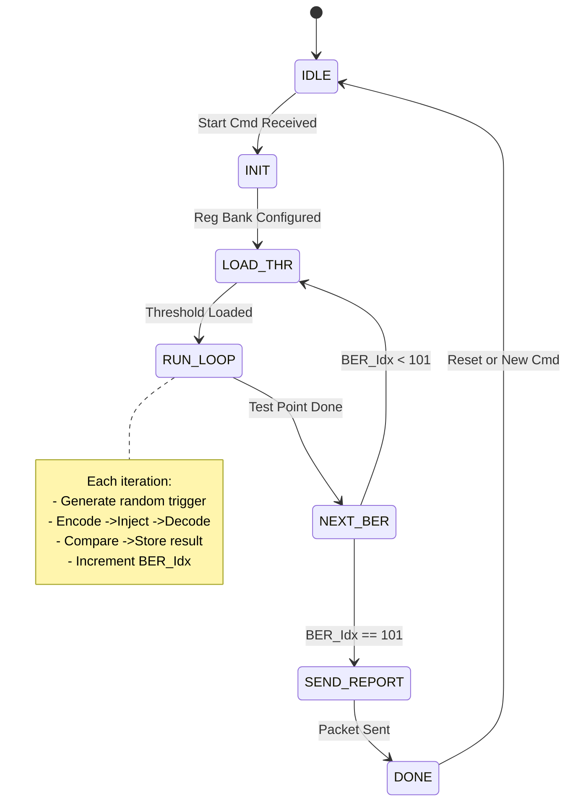

# FPGA Multi-Algorithm Fault Tolerance Performance Comparison Test System - Top-Level Architecture and Module Specification

**Version**: v1.6 (Integrated English Edition)
**Target Platform**: Xilinx Artix-7 (Arty A7-100T)
**Core Objective**: Compare the **bit error tolerance** (BER vs Success Rate) and **execution efficiency** (Latency/Throughput) of four algorithms: C-RRNS, RS, 3NRM-RRNS, and 2NRM-RRNS.

## Introduction

### Project Background

This project compares two innovative algorithms proposed in the research paper, **2NRM-RRNS** and **3NRM-RRNS**, against the conventional **C-RRNS** algorithm and the **RS** algorithm. The objective is to verify the practical feasibility of the two proposed methods and to compare all four schemes in terms of storage efficiency, redundant error-correction capability, computational complexity, and hardware resource consumption.

The comparison setup is based on a **16-bit payload** (`0~65535`). The following figures summarize the operating-mode configuration, codeword-length comparison, and theoretical error-correction capability under the selected design points.

*Figure I-1. Mode-configuration table.*
![[Pasted image 20260329100035.png]]

*Figure I-2. Codeword-length comparison table.*
![[Pasted image 20260329100059.png]]

*Figure I-3. Theoretical error-correction capability comparison table.*
![[Pasted image 20260329100159.png]]

### Phase 1: MATLAB Baseline Study

In the first phase of the project, MATLAB was used to simulate and compare the candidate algorithms.

*Figure I-4. Decoding success-rate comparison under different BER conditions.*
![[Pasted image 20260329100227.png]]

The MATLAB results show that **RS** and **3NRM-RRNS** achieve comparable decoding success under error conditions, with **3NRM-RRNS** slightly outperforming **RS**. **C-RRNS** ranks in the middle, while **2NRM-RRNS** has the weakest error-recovery capability among the four algorithms.

*Figure I-5. Decoding resource-consumption comparison, measured by decoding time.*
![[Pasted image 20260329100256.png]]

From the resource-efficiency perspective, **2NRM-RRNS** is the most efficient, followed by **3NRM-RRNS**, while **RS** and conventional **C-RRNS** consume significantly more resources.

### Phase 2: FPGA Implementation Objective

Based on the MATLAB study, the second phase moves the comparison onto an FPGA platform, currently the **Arty A7-100T**. The plan is to encode a large number of sample words using the four candidate algorithms, then decode them under different BER conditions and error modes, and finally compare decoding success rate, decoding speed, resource consumption, and maximum supported clock frequency under a unified hardware test flow.

## 1. System Hierarchy Diagram

The system is divided into two major parts, the **PC side (Python)** and the **FPGA side (Verilog)**, which communicate through a full-duplex **UART serial interface**.

### **1.1 System Architecture Topology**

![[high level design/system_architecture.drawiov2.png]]

For final hardware verification and thesis reporting, the design adopts the **Single-Algorithm-Build** mode. In this mode, each synthesis run includes only one decoder-algorithm instance, ensuring that timing, resource, and Fmax results remain directly comparable across algorithms.

---

### **1.2 Tree Structure Description**

The following tree summarizes the high-level system decomposition.

```
System Architecture (V1.0 - Auto-Scan & LUT Based)
|
|-- [PC Side] (Python Environment)
|   |-- 1. py_controller_main.py (Main Control Logic)
|   |   |-- [Pre-Process] ROM Generator (gen_rom.py)
|   |   |   |-- Offline computation of threshold table (101 points x 4 algorithms x 15 burst lengths) -> threshold_table.coe
|   |   |
|   |   |-- [Execution] Test Execution Engine
|   |   |   |-- Command Frame Builder (minimal instruction: Algo/Mode/Burst/SampleCount)
|   |   |   |-- Large Packet Parser (parses response frames)
|   |   |
|   |   |-- [Visualization] Plotting and Analysis (separate Python program)
|   |       |-- FER/BER Curve Plotting (Log Scale)
|   |       |-- Throughput/Latency Analysis
|   |
|   |-- 2. py_uart_driver.py (Communication Driver)
|       |-- Serial Port Management (baud rate preferably 921600)
|       |-- Synchronous Blocking Send (Send Command)
|       |-- Fixed-Length Blocking Receive (Read 3039 Bytes)
|           |-- Removed polling listener, replaced with one-shot large packet receive
|
FPGA SIDE
 |
 |-- UART Communication (sub_uart_comm)
 |     |-- ctrl_reg_bank -> outputs stable parameters to Main Scan FSM
 |-- [NEW] Seed Lock Unit
  |
 |-- Main Scan FSM
 |     |-- Listens for cmd_start pulse -> captures free_run_counter -> outputs fixed_seed
 |     |-- State machine: IDLE -> INIT -> LOAD_THR -> RUN_LOOP -> NEXT_BER -> SEND_REPORT
 |     |-- Calls rom_threshold_ctrl to get current point threshold
 |     |-- Calls Auto_Scan_Engine to execute single-point test (passes fixed_seed)
 |
 |-- Auto_Scan_Engine
 |     |-- LFSR (receives fixed_seed from FSM as initial value)
 |     |-- Encoder
 |     |-- Error Injector
 |     |-- Decoder
 |     |-- Result Comparator -> outputs Pass/Fail + Latency
 |
 |-- rom_threshold_ctrl
 |     |-- Instantiates threshold_rom (.coe initialization)
 |
 |-- Result Buffer & Reporter
       |-- mem_stats_array  <- written by Main Scan FSM
       |-- tx_packet_assembler -> UART frame
```

---

### **1.3 System Workflow Overview**

This system adopts a **PC-centered control and FPGA-autonomous execution** architecture. The PC is responsible for high-level configuration, experiment orchestration, and data visualization, while the FPGA performs high-speed error injection, decoding verification, and statistics collection. The overall interaction flow is divided into three phases: **configuration delivery**, **auto-scan execution**, and **result reporting**.

#### **1. Configuration Phase**
*   **Trigger Source**: PC application layer (`py_controller_main.py`).
*   **Action**: The user sets algorithm type (`Algo_ID`), burst length (`Burst_Len`), error mode (`Error_Mode`), and per-point sample count (`Sample_Count`).
*   **Protocol Packaging**: The driver layer (`py_uart_driver.py`) packages the above 4 parameters into a binary frame with a **7-byte payload** (including frame header and checksum), then sends it to the FPGA through the USB-TTL physical link.
*   **Key Feature**: **No separate start/stop command**. Sending the configuration frame from the PC itself implicitly means "start testing."

#### **2. Auto-Scan Execution Phase**
This phase is completed entirely by the FPGA internal closed-loop logic without PC intervention, ensuring deterministic test timing.
*   **Parsing and Latching (`uart_comm`)**:
      *   After `protocol_parser` verifies frame integrity, it generates a `cfg_update_pulse` pulse.
      *   `ctrl_register_bank` captures this pulse, atomically latches the 4 configuration parameters, and **automatically asserts** `test_active` to start the test engine.
*   **101-Point Iterative Scan (`Main SCAN FSM`)**:
      *   The FSM initializes the BER index (`ber_idx = 0`).
      *   **Dynamic Threshold Lookup**: Based on the current `ber_idx` and configured `Burst_Len`, it queries `rom_threshold_lut` in real time to get the corresponding LFSR injection threshold, **without requiring PC-side calculation**.
      *   **Sub-test Loop**: At each BER point, the `Auto Scan Engine` repeats execution $N$ times ($N=$ `Sample_Count`):
            1.  **Seed Capture**: `Seed Lock Unit` locks the random seed.
            2.  **Encoding and Injection**: `Data Gen` generates data -> `Encoder` encodes -> `Error Injector` dynamically flips bits according to the threshold.
            3.  **Decoding and Comparison**: `Decoder` corrects errors -> `Result Comparator` compares original and decoded data, then accumulates pass/fail counts and timing.
      *   **Index Increment**: When per-point sampling reaches $N$, the FSM automatically saves that point's statistics, increments `ber_idx++`, and switches to the next BER threshold until all **101 test points** are completed.
*   **Test Termination**: After all 101 points are complete, the FSM automatically deasserts `test_active` to stop testing and triggers the reporting signal.

#### **3. Reporting Phase**
*   **Data Assembly (`tx_packet_assembler`)**:
    *   The FSM reads 101 groups of cached statistics from on-chip RAM (`mem_stats_array`), including success/failure counts, clock counts, and actual flip counts.
    *   It adds a global-information header (algorithm ID, total points, and mode) and a frame-tail checksum, assembling a complete response frame of about **3.0 KB**.
*   **Uplink Transmission**: The binary stream is sent back to the PC through `uart_tx_module`.
*   **Parsing and Visualization**:
      *   The PC-side driver receives and verifies the data frame.
      *   The application layer parses the binary data, computes BER for each point, plots the **BER performance curve**, and supports CSV export.
      *   For cross-algorithm summary comparison, a separate Python script is required to read CSV files and generate comparative outputs (because each FPGA board communication test run can only test one algorithm at a time).

---

### **Design Highlights Summary**
1.  **Minimal Protocol**: The downlink requires only a 7-byte payload, removing complex threshold computation and start/stop handshakes, thereby reducing communication overhead.
2.  **Full Automation**: The FPGA integrates ROM lookup and FSM scheduling internally. A single command can complete a full-spectrum (101-point) scan, greatly shortening the test cycle.
3.  **High Reliability**: The atomic parameter-latching mechanism prevents race conditions during parameter updates, while the checksum mechanism protects uplink and downlink data integrity.

---

#### **Module Mapping in the Diagram**
*   **PC Side**: Corresponds to **Phase 1 (Configuration)** and **Phase 3 (Parsing/Plotting)** in the workflow.
*   **UART Comm**: Corresponds to **data transceiving plus parsing/latching**.
*   **Main SCAN FSM**: Corresponds to **Phase 2 (Core Scheduling)**, responsible for 101-point iteration and threshold switching.
*   **Auto Scan Engine**: Corresponds to **single-test execution** (encode/inject/decode/compare).
*   **Buffer & Reporter**: Corresponds to **result buffering and packetized reporting**.

---

### **1.4 Main State Machine Diagram**



**`IDLE` ->`INIT`**: When `Start_Cmd` is detected, **assert `lock_seed`** and load the initial configuration.
**`INIT` ->`LOAD_THR`**: Keep `lock_seed` asserted.
**`RUN_LOOP` / `NEXT_BER`**: During the loop, **keep `lock_seed` asserted** (strictly forbid toggling or re-locking in this phase).
**`SEND_REPORT` ->`DONE`**: After packet transmission is complete, **deassert `lock_seed`**, release the random-number generator, and wait for the next command.

### **1.5 Clock Domains**


The system uses a single-clock-domain design (Single Clock Domain), eliminating cross-clock-domain (CDC) complexity and ensuring zero-latency handshakes on the data path.
**Main Clock** (`clk_sys`): 100 MHz (derived from the onboard oscillator of Arty A7-100T).
Usage: drives all business logic, including LFSR random-number generation, ROM lookup, encoder/decoder pipelines, statistics counters, and the UART baud-rate generator.
**UART Clock**: Not generated independently; `clk_sys` is directly used with divided enable pulses (`clk_en_16x`) to drive UART RX/TX state machines.
Advantage: no asynchronous FIFO required; all inter-module signals can be directly connected, maximizing timing-closure margin.

### **1.6 Communication Mode & Strategy**

| Direction        | Mode               | Frequency                 | Data Content                                                                 | Design Purpose                                                                 |
| :--------------- | :----------------- | :------------------------ | :--------------------------------------------------------------------------- | :----------------------------------------------------------------------------- |
| Downlink (PC->FPGA) | Single configuration command | Very low frequency (1 frame per test) | Contains only `Algo`, `Mode`, `Burst_Len`, and `Sample_Count`; BER thresholds are no longer transmitted. | Minimal command set. After receiving it, FPGA auto-latches the seed and internally starts full 101-point BER auto-scan. |
| Uplink (FPGA->PC) | Final large-packet reply | Low frequency (1 frame per test)      | Complete statistics for 101 BER points (`Success/Fail Count`) plus `Total_Clk_Count`, `Enc_Clk_Count`, and `Dec_Clk_Count`. | Avoid frequent intermediate reporting that occupies bandwidth; leverage FPGA high-speed compute and upload all results in one shot. |     
| Intermediate process | Silent run         | No communication           | No UART interaction; LEDs indicate running status.                          | Frees UART bandwidth so FPGA can run at full 100MHz without serial TX blocking. |

#### **1.6.1 Serial Parameters**:

2. **Baud Rate**: **921600**.
	
- **Hardware Interface**: The FPGA UART module parameter `BAUD_RATE` is set to **921600** by default.
- **Software Strategy**: Add "automatic baud-rate detection" or a configuration-file option in Python scripts.
  - Default configuration: `BAUD = 921600` (transmission time about 8 ms). **If this is not feasible during debugging, switch to 115200. This is a debugging strategy, not automatic configuration, and does not require dynamic switching.**
- **Timeout Formula Update**: To reduce complexity, use a fixed timeout value with sufficient redundancy.


 ** Baud Rate Generation & Error Analysis**
 To ensure stable communication with the PC side (921,600 bps), the UART module uses an integer clock-divider strategy.
 *   **System Clock**: $F_{clk} = 100 \text{ MHz}$.
 *   **Target Baud Rate**: $B_{target} = 921,600 \text{ bps}$.
 *   **Divider Coefficient Calculation**:
       $$ N = \frac{F_{clk}}{B_{target}} = \frac{100,000,000}{921,600} \approx 108.5069 $$
 *   **Final Selection**: **$N = 109$** (rounding down produces positive error; rounding up produces negative error. Engineering practice prioritizes negative error to reduce setup-time violation risk).
 *   **Actual Baud Rate**: $B_{act} = \frac{100,000,000}{109} \approx 917,431 \text{ bps}$.
 *   **Relative Error**:
       $$ \text{Error} = \frac{917,431 - 921,600}{921,600} \times 100\% \approx \mathbf{-0.45\%} $$
 *   **Reliability Verification**:
       *   Standard UART receivers typically tolerate **+/-2.5%** clock deviation (based on 16x oversampling with sampling near bit center).
    *   The **-0.45%** error in this design is far below tolerance and **will not** cause end-of-frame bit drift or frame errors in long frames (3039 bytes). The error is a fixed phase offset and does not accumulate with bit count.  
 *   **Verilog Implementation**:
       ```verilog
       localparam BAUD_CNT_MAX = 109 - 1; // Count 0 to 108
       reg [$clog2(BAUD_CNT_MAX):0] baud_cnt;
       // ... logic toggles tx/rx enable when baud_cnt == BAUD_CNT_MAX
       ```


 *   **Constraint File (.xdc)**: Add `IOSTANDARD = LVCMOS33` and `SLEW = FAST` constraints on UART TX/RX pins to ensure signal integrity.

*   **PC-Side Driver**:
      > Before each experiment starts, the Python script must run `serial.reset_input_buffer()` and `serial.reset_output_buffer()` to clear residual high-speed data from the previous experiment, preventing sticky-packet issues that can cause first-frame parse failures.


#### **1.6.2 Protocol Frame Overview**

- **Downlink Command Frame**: Fixed **12 Bytes**.
  - Structure: `Header(2)` + `CmdID(1)` + `Len(1)` + `Payload(7)` + `Checksum(1)`.
  - Features: compact, binary, checksum-protected.
  - See Section 2.1.3.1 for details.
- **Uplink Response Frame**: Fixed **3039 Bytes**.
  - Structure: `Header(2)` + `CmdID(1)` + `Len(2)` + `GlobalInfo(3)` + `PerPointData(101x30)` + `Checksum(1)`.
  - Frame length calculation: `2+1+2+3+(101x30)+1 = 3039 Bytes` (each point is **30 Bytes**, including 1B Reserved).
  - Features: large data volume, includes full details of 101 points (including encoder/decoder cycle counts), with head/tail identifiers.
  - See Section 2.1.3.2 for details.

#### 1.6.3 Exception Handling & Timeout

Given an uplink frame length of **3039 Bytes**, estimation shows:
 - At **115,200 bps**, pure transmission time is about **0.26 s**.
 - At **921,600 bps**, pure transmission time is about **0.03 s**.

 Therefore, communication transmission time accounts for only a very small portion of total runtime. The PC-side timeout threshold ($T_{out}$) mainly depends on sample size (`Sample_Count`). To simplify implementation, use the following **fixed tiered strategy**:
 1.  **Normal Mode** (`Sample_Count` <= $10^6$):
       - **Fixed Timeout**: **10 seconds**
       - *Applicable to*: 99% of daily functional verification and BER statistics.

Recommended `Sample_Count` range is $10^4$ ~ $10^5$ to keep a single test within 1~10 seconds and avoid UART timeout.

 2.  **Stress Mode** (`Sample_Count` > $10^6$):
       - **Fixed Timeout**: **120 seconds** (or linearly extrapolated by sample size, adding 7 seconds per additional $10^6$ samples)
       - *Applicable to*: long-duration accumulation tests at very low BER ($<10^{-12}$).

 *Note: The above values already include a 1.5x computational margin and a 0.4-second worst-case communication/system latency margin.*

---

## 2. Detailed Process Description

### 2.1 PC-Side Control Software Architecture Specification

The software adopts a **layered architecture** with two layers:
1.  **Application Layer (`Controller`)**: responsible for business logic, user interaction, test orchestration, and data visualization.
2.  **Driver Layer (`UART Driver`)**: responsible for low-level frame transmission, binary parsing, and timeout/error handling.

#### 2.1.1 Application Layer: Main Control Logic (`Controller`)
**Responsibility**: provide a user-friendly experiment-configuration interface while abstracting away low-level hardware details.

##### Core Functional Points:
1.  **User Interaction Interface**:
    - Provide CLI prompts that clearly show parameter options and their corresponding values.
    - **Input Parameters**:
        - `Algo_Type`: algorithm selection (0: 2NRM-RRNS, 1: 3NRM-RRNS, 2: C-RRNS-MLD, 3: C-RRNS-MRC, 4: C-RRNS-CRT, 5: RS).
        - `Error_Mode`: error mode (0: random single-bit / 1: cluster mode).
        - `Burst_Len`: burst error length $L$ (1~15; 0 is not supported. For single-bit mode, $L=1$; other values represent cluster mode).
        - `Sample_Count`: number of test trials per BER point.
2.  **Experiment Workflow Automation**:
    - After configuration is delivered, the FPGA traverses **101 BER points** from 0% to 10% with 0.1% step.
    - The PC waits for FPGA completion, collects data, and plots curves.
3.  **Data Post-Processing**:
    - Parse returned FPGA data.
    - Compute actual success rate and average latency.
    - Automatically save results to CSV.
    - Plot the current test's **BER vs Success Rate** curve.

**For cross-algorithm comparison, an additional Python script should be used to aggregate results and plot consolidated curves.**

##### Key Function Interfaces:
```python
def build_config_frame(algo_id, burst_len, error_mode, sample_count) -> bytes:
    """
    Pack a binary configuration frame.
    Format: [0xAA, 0x55] [CMD_ID] [Len] [Payload...] [Checksum]
    """
    pass

def process_stats_data(stats_dict: dict) -> dict:
    """
    Convert raw counter values into meaningful metrics
    (success rate, throughput, etc.).
    """
    pass
```

---

#### **2.1.2 Driver Layer: UART Communication Engine (`UART Driver`)**
**Responsibility**: provide a reliable **synchronous request-response** communication mechanism, ensuring that FPGA processing results are received correctly after command transmission and that timeout or error conditions are reported promptly.

##### **Core Functional Points:**

1.  **Serial Port Lifecycle Management**:
    - Auto-scan and connect available ports (for example `COM3`, `/dev/ttyUSB0`).
    - Configure baud rate (recommended high-speed **921600** or **115200** to shorten transfer time for large 3039-byte frames).
    - Configure read timeout with the fixed tiered strategy (**<=10^6: 10s; >10^6: 120s**).

2.  **TX Send Logic (Synchronous Trigger)**:
    - Receive binary test command frames from the application layer.
    - **Clear RX buffer** (to avoid reading stale residual data).
    - Write command to serial port.
    - **Immediately enter wait-for-receive state** (do not return until data arrives or timeout occurs).

3.  **RX Receive Logic (Synchronous Blocking Wait)**:
    - **No independent background thread**; use **main-thread synchronous reading**.
    - **Atomic receive flow**:
        1. Read and validate frame header (`0xBB 0x66`).
        2. Read `CmdID` (`0x81`).
        3. Read the 2-byte big-endian length field and determine payload length.
        4. Continue reading remaining bytes until the whole frame is assembled (handles fragmented packets).
        5. Compute and verify XOR checksum.
    - **Timeout handling**: if no complete frame is received within configured `Timeout`, the serial library throws `TimeoutException`; driver layer catches it and reports **"FPGA test timeout"** upstream.

4.  **Exception Handling and Recovery**:
    - **Timeout error**: terminate current test directly and prompt user to reduce sample count or reboot FPGA.
    - **Checksum error**: log it, discard the frame, and prompt an error message.
    - **Connection loss**: catch serial disconnect exceptions and prompt user to check hardware connection.

```python
def run_ber_test(sample_count):
    cmd_frame = build_command_frame(sample_count)
    uart.reset_input_buffer()
    uart.write(cmd_frame)

    try:
        uart.timeout = calculate_timeout(sample_count)

        header = uart.read(2)
        if header != b'\xBB\x66':
            raise Exception("Header error, possible data misalignment")

        cmd_id = uart.read(1)
        if cmd_id != b'\x81':
            raise Exception("Unexpected command ID in response")

        length_bytes = uart.read(2)
        payload_len = int.from_bytes(length_bytes, 'big')

        payload = uart.read(payload_len)
        checksum = uart.read(1)
        if len(payload) < payload_len or len(checksum) < 1:
            raise Exception("Read timeout: FPGA did not return a complete frame in time")

        full_frame = header + cmd_id + length_bytes + payload + checksum
        if not verify_checksum(full_frame):
            raise Exception("Checksum failed: transmission error")

        return parse_result(full_frame)

    except serial.SerialTimeoutException:
        print("Error: FPGA test timeout (possible deadlock or excessive sample count)")
        return None
    except Exception as e:
        print(f"Communication error: {e}")
        return None
```

---

#### **2.1.3 Data Flow & Protocol Definition**

##### **2.1.3.1 Downlink (PC -> FPGA): Binary Configuration Frame**
Used for precise control command delivery with high efficiency.

**Command Function**: configure error-injection parameters and start the test. After receiving this frame, FPGA immediately latches an internal random seed and starts execution.

**Total Frame Length**: 12 bytes

| Offset | Field              | Length  | Type   | Description                                                                                                        |
| :----- | :----------------- | :------ | :----- | :----------------------------------------------------------------------------------------------------------------- |
| **0**  | Header             | 2 Bytes | Fixed  | `0xAA 0x55`                                                                                                        |
| **2**  | CmdID              | 1 Byte  | Hex    | `0x01`                                                                                                             |
| **3**  | Length             | 1 Byte  | Uint8  | Payload length (fixed to 7)                                                                                        |
| **4**  | `cfg_burst_len`    | 1 Byte  | Uint8  | Burst length $L$ (1~15). Use 1 in single-bit mode. Input 0 is strictly forbidden and must be validated on PC side. |
| **5**  | `cfg_algo_ID`      | 1 Byte  | Uint8  | Algorithm ID (0:2NRM, 1:3NRM, 2:C-RRNS-MLD, 3:C-RRNS-MRC, 4:C-RRNS-CRT, 5:RS)                                      |
| **6**  | `cfg_error_mode`   | 1 Byte  | Uint8  | Mode ID (0:Single, 1:Burst, 2:Fixed)                                                                               |
| **7**  | `cfg_sample_count` | 4 Bytes | Uint32 | Test sample count **per BER point** (Big-Endian). Total tests = `cfg_sample_count` x 101.                          |
| **11** | Checksum           | 1 Byte  | Uint8  | Full-frame XOR checksum                                                                                            |

**Design Notes**:
1.  **Threshold removed**: threshold is no longer computed and transmitted by PC; FPGA performs internal ROM lookup based on `Algo` and `Burst`.
2.  **Random seed**: FPGA test logic automatically snapshots an internal free-running counter value as the LFSR seed at the moment the UART frame is received, with no PC intervention.
3.  **Burst length**: stored in 4 bits; values `1~15` map directly to lengths `1~15`.
4.  **Length**: fixed at 7 bytes, excluding Header, CmdID, Length field itself, and final Checksum.

> **Checksum Algorithm Definition:**
> To ensure strict consistency between PC and FPGA checksum logic, this protocol uses **byte-wise XOR reduction**. **All checksums in this project use this scheme.**
> *   **Formula**: `Checksum = Byte[0] ^ Byte[1] ^ ... ^ Byte[N-1]`
> *   **Example**: for frame `[0xAA, 0x01, 0x02]`, checksum is `0xAA ^ 0x01 ^ 0x02 = 0xA9`.
> *   **Advantage**: extremely simple hardware implementation (single-cycle pipeline), effectively detects single-bit and odd-bit-flip errors.

**Workflow Description**:
*   **Step 1**: PC sends configuration frame (with `Sample_Count = N`).
*   **Step 2**: FPGA latches parameters, sets `test_active = 1`, and clears `ber_index`.
*   **Step 3**: **Main Scan FSM enters loop**:
    *   Look up threshold corresponding to current `ber_index`.
    *   Run N tests (internal sub-counter counts to N).
    *   **Key point**: when sub-counter is full, **do not stop** `test_active`; instead perform `ber_index++`, clear sub-counter, and save current point statistics.
    *   Repeat until all **101 points** are completed.
*   **Step 4**: FSM deasserts `test_active`, triggers `test_done_flag`, and reports results.

##### **2.1.3.2 Uplink (FPGA -> PC): Binary Response**

**Command Function**: after test completion, report statistics and **total processing latency for each BER point (including separate encoder and decoder cycle counts)**.

**Total Frame Length**: **3039 bytes** (for 101 BER points: Header(2) + CmdID(1) + Length(2) + GlobalInfo(3) + 101x30 + Checksum(1) = 3039 bytes)

| Offset  | Field                               | Length      | Type       | Description                                                                                  |
| :------ | :---------------------------------- | :---------- | :--------- | :------------------------------------------------------------------------------------------- |
| **0**   | Header                              | 2 Bytes     | Fixed      | `0xBB 0x66`                                                                                  |
| **2**   | CmdID                               | 1 Byte      | Hex        | `0x81`                                                                                       |
| **3**   | Length                              | 2 Bytes     | Uint16     | Payload length (**3033** = GlobalInfo(3) + 101x30, excluding Checksum), Big-Endian. `0x0BD9` |
| **5**   | **Global Info**                     |             |            |                                                                                              |
| 5       | `Total_Points`                      | 1 Byte      | Uint8      | Number of BER points (101, from 0%~10%, step 0.1%, including BER=0 baseline point)           |
| 6       | `Algo_Used`                         | 1 Byte      | Uint8      | Algorithm ID (0~5)                                                                           |
| 7       | `Mode_Used`                         | 1 Byte      | Uint8      | Mode ID (0/1)                                                                                |
| **8**   | **Per-Point Data** (Loop 101 times) |             |            | Each BER point occupies **30 bytes**                                                         |
| +0      | `BER_Index`                         | 1 Byte      | Uint8      | Current point index (0~100)                                                                  |
| +1      | `Success_Count`                     | 4 Bytes     | Uint32     | Successful decode count                                                                      |
| +5      | `Fail_Count`                        | 4 Bytes     | Uint32     | Failed decode count                                                                          |
| +9      | `Actual_Flip_Count`                 | 4 Bytes     | Uint32     | Actual number of flipped bits                                                                |
| +13     | `Clk_Count_EachBER`                 | **8 Bytes** | **Uint64** | Total system clock cycles for this BER point (Big-Endian)                                    |
| +21     | `Enc_Clk_Count`                     | **4 Bytes** | **Uint32** | Accumulated encoder clock cycles for this BER point (Big-Endian)                             |
| +25     | `Dec_Clk_Count`                     | **4 Bytes** | **Uint32** | Accumulated decoder clock cycles for this BER point (Big-Endian)                             |
| +29     | `Reserved`                          | 1 Byte      | Uint8      | Fixed to `0x00` for BRAM alignment                                                           |
| **+30** | *(Next Point Starts)*               |             |            |                                                                                              |
| **End** | Checksum                            | 1 Byte      | Uint8      | Full-frame XOR checksum                                                                      |

**PC-Side Computation Notes:**
- `Avg_Enc_Clk_Per_Trial = Enc_Clk_Count / (Success_Count + Fail_Count)`
- `Avg_Dec_Clk_Per_Trial = Dec_Clk_Count / (Success_Count + Fail_Count)`
- `Avg_Total_Clk_Per_Trial = Clk_Count_EachBER / (Success_Count + Fail_Count)`

*   **Endianness Definition:**
    To ensure consistent parsing between FPGA and PC, this protocol specifies that **all multi-byte fields (such as 32-bit counters and 64-bit timestamps) use Big-Endian (MSB first) transmission.**
    *   **FPGA side**: packet assembly module (`tx_packet_assembler`) must enqueue high-order bytes first.
    *   **PC side**: Python parsing should use `struct.unpack('>I', data)` (note the `>` symbol).
    *   **Example**: if `Success_Count = 0x00000001`, UART byte order should be `00 -> 00 -> 00 -> 01`.

#### 2.1.4 Exception Handling

For PC-side exception handling, see Section 1.6.3.

---


### **2.2 FPGA Side: UART Communication and Configuration Layer (`uart_comm`)**
This module is the only communication boundary between the FPGA and the PC. It is responsible for parsing downlink commands and safely delivering configuration parameters to the core test engine. The design uses a **configuration-implies-start** mode, with no separate start or stop command.

#### **Core Submodule Overview**
- **`uart_rx_module`**: Standard UART receiver, converts serial bitstream into parallel data.
- **`uart_tx_module`**: Standard UART transmitter, sends statistics back to PC.
- **`protocol_parser`**: Protocol parsing FSM, responsible for frame synchronization, checksum verification, and parameter extraction.
- **`ctrl_register_bank`**: Configuration register bank, responsible for atomic parameter latching and automatic test triggering.

---

#### **Submodule 2.2.1: `uart_rx_module` (Receiver)**
- **Inputs**: `uart_rx_pin`, `clk`, `rst_n`, `clk_en_16x` (16x oversampling enable).
- **Outputs**: `rx_byte` [7:0], `rx_valid` (single-cycle pulse).
- **Functions**:
    - Detect start bit and sample data bits at 16x clock.
    - Assemble 8-bit parallel data and check stop bit.
    - Assert `rx_valid` for one cycle when one byte is received correctly.

#### **Submodule 2.2.2: `uart_tx_module` (Transmitter)**
- **Inputs**: `tx_byte` [7:0], `tx_en`, `clk`, `rst_n`, `clk_en_16x`.
- **Outputs**: `uart_tx_pin`, `tx_busy`.
- **Functions**:
    - Accept internal parallel data and add start/stop bits.
    - Send serial data; when `tx_busy` is high, TX is busy and new data must not be written.

---

#### **Submodule 2.2.3: `protocol_parser` (Protocol Parsing FSM)**
- **Inputs**: `rx_byte`, `rx_valid`, `clk`, `rst_n`.
- **Outputs**:
    - `cfg_update_pulse`: **configuration update & start pulse** (asserted for 1 cycle after checksum passes).
    - `cfg_algo_id` [7:0]: parsed algorithm ID, aligned to low valid bits, high bits zero-padded.
    - `cfg_burst_len` [7:0]: parsed burst length, aligned to low valid bits, high bits zero-padded.
    - `cfg_error_mode` [7:0]: parsed error injection mode, aligned to low valid bits, high bits zero-padded.
    - `cfg_sample_count` [31:0]: parsed per-point sample count.
    - `tx_data_fifo_in` [7:0]: result data byte to be transmitted.
    - `tx_req`: transmission request (asserted when reporting is required after test completion).

- **FSM Flow**:
    1.  `IDLE`: wait for header Byte1 (`0xAA`).
    2.  `WAIT_HEADER_2`: wait for header Byte2 (`0x55`).
    3.  `READ_CMD`: read command byte (currently only supports config command `0x01`).
    4.  `READ_LEN`: read length byte (must be payload length `0x07`).
    5.  `READ_PAYLOAD`: read 7-byte payload sequentially and assemble in real time:
        - Byte 0 -> `cfg_burst_len`
        - Byte 1 -> `cfg_algo_id`
        - Byte 2 -> `cfg_error_mode`
        - Byte 3~6 -> `cfg_sample_count` (Big-Endian)
    6.  `CHECK_SUM`: read checksum and verify.
        - **Pass**: assert `cfg_update_pulse` (simultaneously triggers register latching and test start); prepare response data if needed.
        - **Fail**: discard the frame and reset FSM to `IDLE`.

---

#### **2.2.4 Submodule: `ctrl_register_bank` (Configuration Register Bank)**

This module serves as the **isolation boundary** and **snapshot unit** between PC-side configuration and FPGA-side execution logic. It atomically latches all parameters when a valid configuration frame is received and **automatically starts** the test flow.

**1. Module Role**
- **Configuration latch and auto-trigger**: the module contains no RAM or ROM and performs no threshold computation.
- **Core behavior**:
    1.  **Listen** to `cfg_update_pulse` (from protocol parser).
    2.  **Latch**: on the pulse rising edge, synchronously capture 4 parameters from PC (`cfg_algo_id`, `cfg_burst_len`, `cfg_error_mode`, `cfg_sample_count`).
    3.  **Start**: on the same rising edge, **automatically set run flag `test_active` to 1** to trigger downstream FSM.
    4.  **Hold**: keep parameters stable during test until the next valid frame arrives or the test naturally finishes.
- **Single-point transition**: when internal sub-counter reaches `reg_sample_count`, keep `test_active` unchanged, but send `point_done` to FSM to increment BER index.
- **Global stop**: clear `test_active` only when `test_done_flag` is received from FSM (all 101 points complete).

**2. Interface Definition**

| Direction | Signal Name         | Width   | Description                              | Source/Destination |
| :-------- | :------------------ | :------ | :--------------------------------------- | :----------------- |
| **Input** | `clk`               | 1       | System clock                             | 100 MHz            |
| **Input** | `rst_n`             | 1       | Asynchronous reset                       | Active low         |
| **Input** | `cfg_update_pulse`  | 1       | **Configuration update & start pulse**   | From `protocol_parser` (after checksum pass) |
| **Input** | `cfg_algo_id`       | [7:0]   | Algorithm ID                             | From `protocol_parser` |
| **Input** | `cfg_burst_len`     | [7:0]   | Burst length L                           | From `protocol_parser` |
| **Input** | `cfg_error_mode`    | [7:0]   | Error injection mode                     | From `protocol_parser` |
| **Input** | `cfg_sample_count`  | [31:0]  | Per-point sample count                   | From `protocol_parser` |
| **Input** | `test_done_flag`    | 1       | Test done flag                           | From downstream `Main Scan FSM` |
| **Output**| `reg_algo_id`       | [7:0]   | **Stable** algorithm ID                  | For Test FSM lookup |
| **Output**| `reg_burst_len`     | [7:0]   | **Stable** burst length                  | For Error Injector |
| **Output**| `reg_error_mode`    | [7:0]   | **Stable** error mode                    | For Error Injector |
| **Output**| `reg_sample_count`  | [31:0]  | **Stable** sample count                  | For Counter |
| **Output**| `test_active`       | 1       | **Stable** run enable                    | Global test switch (high=run, low=idle) |

> **Note**: input ports `cmd_start` and `cmd_stop` are **removed**. Start is implicitly triggered by `cfg_update_pulse`, and stop is implicitly triggered by `test_done_flag`.

**3. Internal Logic Behavior (Verilog Pseudocode)**

```verilog
always @(posedge clk or negedge rst_n) begin
    if (!rst_n) begin
        test_active       <= 1'b0;
        reg_algo_id      <= 2'b00;
        reg_burst_len    <= 4'd0;
        reg_error_mode   <= 2'b00;
        reg_sample_count <= 32'd0;
    end else begin
        // Core logic: config update pulse = latch params + start test
        if (cfg_update_pulse) begin
            reg_algo_id      <= cfg_algo_id;
            reg_burst_len    <= cfg_burst_len;
            reg_error_mode   <= cfg_error_mode;
            reg_sample_count <= cfg_sample_count;
            test_active       <= 1'b1; // Key change: auto-start when new config arrives
        end

        // Auto-stop logic: disable when internal FSM reports completion
        // Prevents repeated FSM runs until next PC configuration frame
        if (test_done_flag) begin
            test_active <= 1'b0;
        end
    end
end
```

**4. Interaction Timing Illustration**

```text
PC Action:       [ Send config frame (4 parameters) ] ----------------------> [ Wait for result ]
                            |
FPGA Parser:      [ Parsing... ] -> [ Checksum pass ] -> generate cfg_update_pulse (1 cycle)
                            |                     |
FPGA RegBank:     [ Hold old values ] -> [ Latch new params ] + [ test_active = 1 ] (start!)
                            |
FPGA FSM:         [ Idle ] ---------> [ Start test (counting...) ] -> [ Count done ] -> generate test_done_flag
                            |                                              |
FPGA RegBank:     [ Keep running ] -----------------------------------------> [ test_active = 0 ] (stop)
                            |
FPGA TX:          [ Pack result ] ------------------------------------------> [ Send back to PC ]
```

**5. Design Advantages**
- **Minimal protocol**: the PC only needs to send a configuration frame; no additional start command is required. Sending the configuration frame is equivalent to launching one complete test for that parameter set.
- **FSM safety**: use `test_done_flag` to auto-clear `test_active`, ensuring each test runs exactly one round and preventing infinite loops unless PC sends a new frame.
- **Atomicity guarantee**: parameter latching and start signal occur on the same clock edge, avoiding the risk of "start before parameters are aligned".

> **Configuration Atomicity Protection:**
> To prevent new configuration commands from breaking data flow or corrupting FSM state during long-frame report transmission (about 20 ms), a **TX_BUSY lock** is introduced.
> *   **Logic rule**: when `tx_packet_assembler` outputs `busy == 1`, `ctrl_register_bank` **forcibly ignores** all register write operations from UART RX (`cfg_update_pulse` is masked).
> *   **Behavior**: new commands are discarded (or recovered by PC-side retransmission), ensuring integrity and checksum correctness for the current 3039-byte report frame.
> *   **FSM constraint**: configuration updates are re-enabled only when FSM returns to `IDLE` or `WAIT_CONFIG`.

---

### **2.3 Core Test Closed Loop (Main_Scan_FSM)**

#### **2.3.1 FPGA Top-Level Module Interface Definition (Top-Level Interface)**

| Signal Name            | Direction | Width    | Type  | Description |
| :--------------------- | :-------- | :------- | :---- | :---------- |
| **clk_100m**           | Input     | 1        | Clock | System main clock (100 MHz). *Note: UART baud-rate generator should support fractional division to match 921600 bps.* |
| **rst_n**              | Input     | 1        | Reset | Global reset, **active low**. |
| **uart_rx**            | Input     | 1        | Wire  | UART physical RX line (TTL level). |
| **uart_tx**            | Output    | 1        | Wire  | UART physical TX line (TTL level). |
| **cfg_valid**          | Input     | 1        | Wire  | Configuration update pulse (from UART parser). |
| **cfg_algo_id**        | Input     | 8        | Reg   | Latched algorithm ID from ctrl_register_bank. |
| **cfg_burst_len**      | Input     | 8        | Reg   | Latched burst length from ctrl_register_bank. |
| **cfg_error_mode**     | Input     | 8        | Reg   | Latched error mode from ctrl_register_bank. |
| **cfg_sample_count**   | Input     | **32**   | Reg   | **Latched per-BER-point sample count (corrected to 32-bit)**. Range: 1 ~ 4,294,967,295. From ctrl_register_bank. |
| **test_active**        | Output    | 1        | Reg   | Test running enable flag (internal FSM state). Can drive an LED as "testing" indicator. |
| **sys_test_done**      | Output    | 1        | Wire  | Test completion pulse. Asserted for 1 clock cycle when all 101 points finish. |
| **uart_tx_data**       | Output    | 8        | Reg   | Byte to transmit (uplink). |
| **uart_tx_valid**      | Output    | 1        | Reg   | Data valid flag (high means `uart_tx_data` is valid). |
| **uart_tx_ready**      | Input     | 1        | Wire  | **New**: TX-ready handshake from UART lower layer; high allows sending next byte. |

> **Design Notes:**
> 1. **Memory implementation**: statistics buffer (`mem_stats_array`) is instantiated as internal FPGA **Block RAM (BRAM)** with approximately 3 KB of effective storage and no external interface.
> 2. **Clock accuracy**: at 100MHz, the theoretical baud-rate error for 921600 is 0.46%, within UART tolerance (+/-2%), enabling stable communication.


#### **2.3.2 LFSR-Based Random Fault Injection Logic (LFSR-based Error Injection)**

This design uses a **32-bit Galois LFSR** as the pseudo-random sequence generator. It determines **whether error injection should be triggered in the current cycle** and also generates the **error location and pattern**.


##### **2.3.2.1 Seed Initialization Mechanism (Seed Initialization)**

To support single-command execution while ensuring different randomness for each test, the seed is not sent from the PC. Instead, it is captured automatically inside the FPGA:
1.  **Free-running counter**: the system maintains a 32-bit free-running counter `free_run_cnt` that increments every system clock edge.
2.  **Trigger moment**: when UART RX module finishes parsing and checksum verification of a config frame (generating `cfg_valid_pulse`).
3.  **Latch logic**:
    $$ \text{LFSR\_Seed} = \begin{cases} \text{free\_run\_cnt}, & \text{if } \text{free\_run\_cnt} \neq 0 \\ 1, & \text{if } \text{free\_run\_cnt} = 0 \end{cases} $$
    *Note: non-zero enforcement prevents LFSR from entering all-zero deadlock state.*

**Task-level lock mechanism**: signal `lock_seed` is asserted only when Main Scan FSM enters **INIT**, and remains valid until the full 101 BER-point scan is complete and FSM reaches **DONE**.
**Purpose**: ensure that data for all 101 BER points is derived from one consistent random-sequence segment, eliminating statistical bias caused by seed reinitialization and guaranteeing cross-point consistency.

**seed_lock_unit Interface Definition**

Although the logic is simple, explicit interface definition helps prevent reset-timing issues.
```verilog
module seed_lock_unit (
    input  wire        clk,
    input  wire        rst_n,
    
    // Control
    input  wire        lock_en,       // High during entire 101-point scan (From FSM INIT state)
    input  wire        capture_pulse, // Single pulse when Config Received (Start of task)
    
    // Free Running Counter Input
    input  wire [31:0] free_cnt_val,
    
    // Output
    output reg  [31:0] locked_seed,   // Stable seed for LFSR
    output reg         seed_valid     // Indicates seed is latched and non-zero
);
// Logic: On capture_pulse & lock_en -> latch free_cnt_val. Handle zero-seed fix.
endmodule
```


##### **2.3.2.2 Error Injection Trigger Mechanism (Trigger Mechanism)**

**BER Definition:**
In this system, BER (Bit Error Rate) is defined as the ratio of **total injected error bits** to **total valid information bits after encoding**. This definition reflects the true error level in encoded data streams during transmission or storage.

| ECC Type | $W_{valid}$ (bits) | Description |
| :--- | :--- | :--- |
| RS | 48 | 4+4+4+4 + 4x8 = 48 |
| C-RRNS-MLD | 61 | 6+6+7+7+7+7+7+7+7 = 61 (MLD decode, 842 cycles) |
| C-RRNS-MRC | 61 | Same as above (MRC decode, ~10 cycles) |
| C-RRNS-CRT | 61 | Same as above (CRT decode, ~5 cycles) |
| 3NRM-RRNS | 48 | 6+6+7 + 5+5+5+5+4 = 48 |
| 2NRM-RRNS | 41 | 9+8 + 6+6+6+6 = 41 |

The system uses **two injection models** depending on `burst_len`, ensuring that the actual BER tracks the target BER accurately over the full 0%~10% range:

---

**Model A: Bit-Scan Bernoulli Model (`burst_len == 1`, Random Single Bit mode)**

> **New in v2.2**: To solve the issue where the single-injection model caused the actual BER to saturate at `1/w_valid` (Bug #86), the Bit-Scan Bernoulli multi-injection model was introduced.

Each trial scans every codeword bit (position 0 to $W_{valid}-1$) and performs an independent Bernoulli flip decision for each bit:

$$P(\text{flip bit } i) = \frac{Threshold\_Int}{2^{32}} = BER_{target}$$

**Expected flip count**: $E[\text{flips}] = W_{valid} \times BER_{target}$, therefore the expected actual BER is also $BER_{target}$.

**Threshold computation** (ROM-stored value, including 64-slot compensation factor):
$$Threshold\_Int = \text{round}\left( BER_{target} \times 64 \times (2^{32}-1) \right)$$

**When used in FPGA**, ROM value is right-shifted by 6 to restore pure per-bit probability:
$$threshold\_per\_bit = Threshold\_Int \gg 6 = \text{round}(BER_{target} \times (2^{32}-1))$$

**Working principle** (in `ENG_STATE_INJ_WAIT` of `auto_scan_engine.v`):
1. Initialize: `bit_scan_cw <- enc_out_a_latch`, `bit_scan_pos <- 1`
2. For each bit position (`bit_scan_pos` from 1 to $W_{valid}$):
   - Advance LFSR by one step (automatic)
   - If `inj_lfsr < threshold_per_bit` -> flip bit (`bit_scan_pos - 1`)
3. After completion: `inj_out_a_latch <- bit_scan_cw`, then enter DEC_WAIT

**Latency**: $W_{valid} + 2$ clock cycles (max 91 cycles for C-RRNS)

---

**Model B: ROM Single-Burst Injection Model (`burst_len > 1`, Cluster Burst mode)**

Each trial makes one binary injection decision; if triggered, inject one contiguous burst:

$$BER_{target} = \frac{P_{trigger} \times L}{W_{valid}}$$

**Trigger probability**: $P_{trigger} = \frac{BER_{target} \times W_{valid}}{L}$

**Threshold integer calculation** (including 64-slot compensation factor; see Bug #62 fix):
$$Threshold\_Int = \text{round}\left( \frac{BER_{target} \times W_{valid}}{L} \times \frac{64}{W_{valid} - L + 1} \times (2^{32}-1) \right)$$

**Working principle**:
- LFSR outputs 32-bit random number $R$
- If $R < Threshold\_Int$ -> trigger injection (lookup ROM for burst error pattern)
- Otherwise -> no injection

**Note**: this model injects at most one burst per trial, so the actual BER upper bound is $L/W_{valid}$. For `burst_len=5` (C-RRNS), the upper bound is about 8.2%; for `burst_len=8`, it is about 13.1%. In practice, the model is suitable for the 0~10% test range.

**Design Note:**
 *   Although FPGA internally uses a 64-bit parallel bus, BER statistics only target the $W_{valid}$ region. Padding bits may be flipped but are not counted in BER denominator and do not affect valid-data recovery evaluation.
 *   This definition ensures fair and comparable attack intensity on valid information bits across different coding schemes (for example RS vs C-RRNS) under the same BER setting.

---

##### **2.3.2.3 FPGA Implementation: Injection-Model Selection and Threshold Usage**

In `auto_scan_engine.v`, state `ENG_STATE_INJ_WAIT` automatically selects injection path based on `burst_len`:

```verilog
// Path selection (auto_scan_engine.v v1.2)
if (burst_len == 4'd1) begin
    // PATH A: Bit-scan Bernoulli (Random Single Bit)
    // threshold_per_bit = threshold_val >> 6
    // Iterate every bit with independent Bernoulli decision
    // Latency: w_valid + 2 cycles
end else begin
    // PATH B: ROM-based single burst (Cluster Burst)
    // Original 2-cycle ROM pipeline, unchanged
end
```

**Values stored in ROM threshold table (`threshold_table.coe`)**:

| burst_len | Stored formula | FPGA usage |
|-----------|----------------|------------|
| 1 | $BER \times 64 \times (2^{32}-1)$ | use `>> 6` to recover per-bit probability |
| >1 | $\frac{BER \times W_{valid}}{L} \times \frac{64}{W_{valid}-L+1} \times (2^{32}-1)$ | compare directly with LFSR |

Example (C-RRNS, $BER_{target}=5\%$, $W_{valid}=61$):
- `burst_len=1`: ROM stores $0.05 \times 64 \times (2^{32}-1) \approx 0x33333333$; FPGA uses `>> 6` = $0.05 \times (2^{32}-1) \approx 0x0CCCCCCC$, giving 5% per-bit flip probability.
- `burst_len=5`: ROM stores $\frac{0.05 \times 61}{5} \times \frac{64}{57} \times (2^{32}-1) \approx 0x0E1C71C7$; FPGA compares directly, trigger probability ~ 68%, injecting 5 bits each time, with actual BER ~ 5%.


##### **2.3.2.4 Precomputed Table (ROM) Generation Flow**

Since $Threshold\_Int$ depends on $BER_{target}$, $W_{valid}$, and $L$, and these are known before testing, we use a **lookup-table method** to avoid real-time floating-point computation.

**Index mapping relationship**

The threshold table is a 3D mapping uniquely determined by:
1.  **Algorithm type (Algo)**: 0~3 -> determines $W_{valid}$
2.  **Target BER index (BER_Index)**: 0~100 -> corresponding to $BER_{target} = index \times 0.001$
3.  **Burst length (Burst_Len)**: 1~15

**Lookup formula**:
$$ \text{Addr} = (\text{Algo} \times 101 \times 15) + (\text{BER\_Index} \times 15) + (\text{Burst\_Len} - 1) $$

*   **Table depth**: $6 \times 101 \times 15 = 9090$ entries (6 algorithms: 2NRM/3NRM/C-RRNS-MLD/C-RRNS-MRC/C-RRNS-CRT/RS).
*   **Data width**: 32 bits (exactly matching $Threshold\_Int$).

---

##### **2.3.2.5 Error-Position Generation and Boundary-Safety Strategy**

**Design decision:**
To ensure burst errors fully stay within a 64-bit data window without truncation or wrap-around, this design **abandons traditional dynamic shifter schemes** and adopts a **ROM precomputed error-pattern (Look-Up Table)** strategy.

**Working principle:**
1.  **Address generation**: ROM address is composed of `Random_Offset` (6-bit) and `Burst_Len` (4-bit).
2.  **Precompute constraints (PC side)**: while generating `.coe` in `gen_rom.py`, for each burst length $L$, strictly constrain start offset range (**L strictly limited to 1~15, 0 not allowed**):
    $$ Start \in [0, 64 - L] $$
    Script implementation uses modulo: $Start = \text{LFSR\_Raw} \pmod{64 - L + 1}$.
    *For example, when $L=10$, $Start$ is only generated in $0 \sim 54$, ensuring $Start + 10 \le 64$.*
3.  **Hardware implementation (FPGA side)**:
    *   Instantiate distributed RAM with depth $1024$ (64 offsets x 16 lengths), width 64-bit.
    *   Every clock cycle, output 64-bit `error_pattern` by direct ROM lookup from current $L$ and legal random $Start$.
    *   **Advantages:**
        *   **Zero boundary-check logic**: no comparators/modulo circuits needed; legality checks are completed during PC precompute.
        *   **Single-cycle latency**: removes long combinational path of barrel shifter and guarantees 100MHz timing closure.
        *   **Accurate injection**: each trigger flips exactly $L$ bits; BER denominator remains precise.


**Error injection must be restricted to valid-bit range $W_{valid}$ only.**
ROM-generated error patterns are required to be valid **only in lower $W_{valid}$ bits** (encoder high bits are zero-padded here).

**Revised injection strategy:**
1.  **Valid injection window**: injection start position $P_{start}$ and burst range must be fully inside current algorithm's $W_{valid}$ range.
    *   For RS ($W_{valid}=48$): $P_{start} \in [0, 48-L]$.
    *   For C-RRNS ($W_{valid}=61$): $P_{start} \in [0, 61-L]$.

2.  **ROM address mapping logic**:
Because burst length $L$ is strictly constrained to $1 \sim 15$ and register value maps one-to-one with length, address generation simplifies to pure linear concatenation without conditional decoding:
$$ \text{ROM\_Addr} = \{ \text{algo\_id},\ (\text{burst\_len} - 1),\ \text{random\_offset} \} $$
*   **High bits [11:10]**: `algo_id[1:0]` (2-bit for error_lut ROM addressing), distinguishing 4 base algorithms. Note: actual `algo_id` is 3-bit (supports 6 algorithms); threshold_table uses full algo_id (depth 9090=6x101x15).
*   **Middle bits [9:6]**: `burst_len - 1` (4-bit).
    *   Input `0001` ($L=1$) -> index `0000`.
    *   Input `1111` ($L=15$) -> index `1110`.
    *   **Advantage**: with fixed input range $1 \sim 15$, subtraction **never underflows or overflows**. Hardware requires only a simple constant offset and no comparator.
*   **Low bits [5:0]**: `random_offset` (6-bit), directly from LFSR output.
*   **ROM spec**: depth $2^{12} = 4096$ (actual used entries $4 \times 15 \times 64 = 3840$), width 64-bit.

---

**PC-side precompute script logic (`gen_rom.py`)**

The Python script computes all combinations according to formulas above.

**Core logic changes:**
1.  **Introduce $W_{valid}$ constraint**: effective bit-width differs by algorithm (RS=48, C-RRNS=61, etc.), so upper bound of random start position $P_{start}$ must be $W_{valid} - L$.
2.  **Unify ROM address mapping**: use linear mapping `Addr = (Algo_ID << 10) | ((Len-1) << 6) | Offset` for convenient FPGA decode.
3.  **Fill illegal addresses**: for out-of-bound addresses (for example $L=10$ but $Offset=60$), fill `0` or repeat last legal value, preventing illegal random hits from producing invalid error patterns.

```python
import math

# ================= Config =================
ALGO_LUT_MAP = {
    '2NRM':   {'w_valid': 41, 'lut_id': 0},
    '3NRM':   {'w_valid': 48, 'lut_id': 1},
    'C-RRNS': {'w_valid': 61, 'lut_id': 2},
    'RS':     {'w_valid': 48, 'lut_id': 3},
}

# Key change: burst length strictly limited to 1 ~ 15
BURST_LENGTHS = range(1, 16)  # 1, 2, ..., 15

ROM_DEPTH = 4096
ROM_WIDTH = 64
rom_data = [0] * ROM_DEPTH

def generate_error_pattern(length, start_pos, w_valid):
    """Generate contiguous length-bit error mask"""
    mask = 0
    for i in range(length):
        pos = start_pos + i
        if pos < w_valid:
            mask |= (1 << pos)
        else:
            # Should not happen due to pre-check
            return 0
    return mask

print(f"Generating ROM data (L={min(BURST_LENGTHS)}~{max(BURST_LENGTHS)})...")

current_addr = 0

for algo_name, params in ALGO_LUT_MAP.items():
    lut_id = params['lut_id']
    w_valid = params['w_valid']

    for length in BURST_LENGTHS:
        # Max legal start position: Max_Offset = W_valid - Length
        max_offset = w_valid - length

        # LFSR offset range: 0 ~ 63 (6-bit)
        for offset in range(64):
            if offset <= max_offset:
                pattern = generate_error_pattern(length, offset, w_valid)
            else:
                pattern = 0  # Fail-safe for out-of-range

            len_idx = length - 1  # 0 ~ 14
            addr = (lut_id << 10) | (len_idx << 6) | offset

            rom_data[addr] = pattern
            current_addr += 1

with open("error_lut.coe", "w") as f:
    f.write("memory_initialization_radix=16;\n")
    f.write("memory_initialization_vector=\n")
    for i, val in enumerate(rom_data):
        hex_val = f"{val:016X}"
        if i == len(rom_data) - 1:
            f.write(f"{hex_val};\n")
        else:
            f.write(f"{hex_val},\n")

print("ROM data generation complete, saved as error_lut.coe")
print(f"Valid entries: {len(ALGO_LUT_MAP) * len(BURST_LENGTHS) * 64}")
print(f"Total depth: {ROM_DEPTH}")
```

#### Key script points:
*   **Dynamic `max_start`**: this is the most critical change. For RS ($W=48$), when $L=10$, `max_start` automatically becomes 38. Any address with $Offset > 38$ generates `0`, ensuring errors never land in padding bits (48-63).
*   **Address mapping**: loop order is `Algo -> Len -> Offset`, perfectly matching FPGA address concatenation `{algo_id, len-1, offset}`.

---

**FPGA-side ROM instantiation**

**Core logic changes:**
1.  **Address concatenation**: use 12-bit address (`4-bit Algo` + `4-bit Len` + `6-bit Offset`).
2.  **Zero-overhead lookup**: output `error_pattern` directly via `rom[addr]`, no shifter/comparator required.
3.  **Injection execution**: simply apply `data_in ^ error_pattern`.

```verilog
module error_injector (
    input wire clk,
    input wire rst_n,

    // Control
    input wire inject_en,
    input wire [1:0] algo_lut_idx,
    input wire [3:0] burst_len,
    input wire [5:0] random_offset,

    // Data path
    input wire [63:0] data_in,
    output reg [63:0] data_out
);

    localparam ROM_DEPTH = 4096;
    localparam ROM_ADDR_WIDTH = 12;

    reg [63:0] rom_mem [0:ROM_DEPTH-1];

    wire [3:0] len_idx = burst_len - 1'b1;
    wire [11:0] rom_addr = {algo_lut_idx, len_idx, random_offset};

    wire [63:0] error_pattern;

    initial begin
        $readmemh("error_lut.coe", rom_mem);
    end

    assign error_pattern = rom_mem[rom_addr];

    always @(posedge clk or negedge rst_n) begin
        if (!rst_n) begin
            data_out <= 64'b0;
        end else begin
            if (inject_en) begin
                data_out <= data_in ^ error_pattern;
            end else begin
                data_out <= data_in;
            end
        end
    end

endmodule
```

#### Code key points:
*   **Address concatenation `{algo_lut_idx, len_idx, random_offset}`**:
    *   `algo_lut_idx` (2-bit): selects one of 4 LUT-addressed base algorithms (`2NRM`, `3NRM`, `C-RRNS`, `RS`).
    *   `len_idx` (4-bit): selects length 1~15.
    *   `random_offset` (6-bit): directly from low 6 bits of LFSR.
    *   **Total width**: $2+4+6=12$ bits, matching depth $2^{12}=4096$, consistent with Python script.
*   **Safety**: since Python pre-fills illegal addresses (for example $Offset > W_{valid}-L$) with `0`, even large random LFSR outputs will return `error_pattern=0`, so **no invalid injection occurs**. This cleanly solves boundary overflow with no extra FPGA comparison logic.

LFSR output allocation strategy:
Use a single 32-bit LFSR, **advanced only in `ENG_STATE_INJ_WAIT`** (frozen during encode/decode and other states). Output is split and reused directly:
- `rnd[31:0]`: used for BER threshold comparison (`if (rnd < threshold)`).
- `rnd[5:0]`: directly used as `random_offset` input for ROM lookup.
Reason: each LFSR bit has pseudo-random characteristics, and high/low-bit correlation is negligible for BER test statistical independence. This scheme avoids extra LFSR instances and multi-cycle waiting, enabling single-cycle injection decision.

> **Bug #93 Fix Note (v2.3, 2026-03-26):** In the old design, LFSR free-ran every clock, causing decoders with different latency (for example Parallel ~73 cycles vs Serial ~412 cycles) to inject at different LFSR states, creating different error clustering and systematic SR curve differences (0.105 gap at 10% BER). After the fix, LFSR advances only in injection windows, making injection sequence independent of decoder latency and ensuring fair comparison across architectures.

**Resource estimation:**
*   **ROM spec**: depth 4096 (12-bit address), width 64-bit.
*   **Total capacity**: $4096 \times 64 = 262,144$ bits $\approx 256$ Kb.
*   **FPGA implementation**: on Xilinx Artix-7, this is inferred as **Distributed RAM (LUTRAM)** or **Block RAM (BRAM)**.
    *   If LUTRAM: about **64 SLICEs** (less than 0.5% of Arty A7-100T resources).
    *   If optimized to BRAM: **1 BRAM18K** (strictly, 256Kb requires 2 BRAM18K or 1 BRAM36K, still very small).
*   **Conclusion**: this lookup strategy has negligible resource impact and is fully acceptable.

**Design trade-off statement:**
Upper bound of burst length $L$ is set to **15** (instead of theoretical 16).
*   **Reason**: if 4-bit control must represent $1 \sim 16$, nonlinear decode logic mapping 0->16 is required, increasing hardware complexity and verification risk.
*   **Impact**: limiting $L \le 15$ has negligible effect on BER test statistics. In typical channel models (for example Gilbert-Elliott), burst errors longer than 15 are very rare ($<10^{-6}$). This simplification significantly improves control-logic robustness and is a high-value engineering trade-off.

###### **1. `rom_threshold_ctrl` (BER threshold lookup controller) Interface Definition**

This module instantiates ROM and outputs threshold, serving as a core FSM input.
```verilog
module rom_threshold_ctrl (
    input  wire        clk,           // 100MHz System Clock
    input  wire        rst_n,         // Async Reset

    // Address Inputs (From Main_Scan_FSM)
    input  wire [2:0]  i_algo_id,     // 0~5: 2NRM, 3NRM, C-RRNS-MLD, C-RRNS-MRC, C-RRNS-CRT, RS
    input  wire [6:0]  i_ber_idx,     // 0~100: BER Point Index
    input  wire [3:0]  i_burst_len,   // 1~15: Burst Length

    // Data Output
    output reg  [31:0] o_thresh_int,  // 32-bit Threshold for LFSR comparison
    output wire        o_valid        // Single-cycle pulse when data is ready (optional)
);
// Internal: Instantiate threshold_rom.coe
// Logic: addr = {i_algo_id, i_burst_len-1, i_ber_idx} -> o_thresh_int = rom[addr]
endmodule
```
*Note: confirm that address concatenation order is exactly consistent with Python script `gen_rom.py`.*

---

##### **2.3.2.6 LFSR Logic Interaction Timing (Brief)**

1.  **Configuration stage**: PC sends `Algo`, `BER_Index`, `Burst_Len` -> FPGA latches.
2.  **Address generation**: FPGA combines parameters to generate `rom_addr`.
3.  **Lookup**: in the next clock cycle, `threshold_int` is output from ROM.
4.  **Loop test**:
    - LFSR generates 32-bit random number $R$.
    - Comparator: `if (R < threshold_int) -> trigger_inject = 1`
    - If triggered:
        - Run LFSR again or use high bits to generate $P_{start}$
        - Generate Error_Mask by `Burst_Len`
        - Inject error into data stream
    - Counter: `clk_counter++`
5.  **Finish**: when sample limit is reached -> switch to next BER point or send result.

---

##### **2.3.2.7 Summary**

Through strict mathematical derivation, this approach converts abstract BER targets into hardware-implementable 32-bit integer thresholds, and uses precomputed ROM for efficient lookup. The full closed loop is:

- **Input**: PC sets BER index, algorithm, burst length.
- **Conversion**: Python precompute -> generate `.coe` -> FPGA ROM initialization.
- **Execution**: FPGA compares LFSR output with threshold in real time -> controls injection frequency.
- **Validation**: final statistics verify consistency between actual FER and theoretical BER.

This design balances precision, resource efficiency, and real-time performance, making it an ideal architecture for industrial-grade error-injection testing.

---

#### **2.3.3 Execution and Reporting Subsystem**

This subsection describes the unified interfaces and supporting modules that connect encoding, decoding, result verification, and final statistics reporting.

##### **2.3.3.1 Encoder/Decoder Interface Standardization**

To support dynamic switching among four algorithms, all encoders/decoders must follow unified interfaces.

Below are optimized interface definitions based on **AXI-Lite style**.

1. **Encoder Interface (Standardized Version)**

**Main changes:**
*   `start_pulse` -> `start` (level)
*   Added `busy` (level)
*   `done_pulse` -> `done` (pulse, completion indicator)
*   **Removed** `latency_cycles` (measured externally by testbench)

```verilog
module encoder_xx (
    input  wire        clk,           // System clock
    input  wire        rst_n,         // Asynchronous reset, active low

    // --- Control Interface (AXI-Lite Style) ---
    input  wire        start,         // [New] Start request (active high, keep asserted until busy goes high)
    output reg         busy,          // [New] Busy status (high means encoding in progress; no new input allowed)
    output reg         done,          // Completion pulse (high for one cycle)

    // --- Data Interface ---
    input  wire [63:0] data_in,       // Original data (high bits valid)
    output reg  [63:0] codeword_out,  // Encoded data (fixed 64-bit)
    output reg  [63:0] valid_mask     // Valid-bit mask (indicates true codeword bits)
);
    // Internal implementation...
endmodule
```

2. **Decoder Interface (Standardized Version)**

**Main changes:** same as above; remove internal latency statistics, add `busy` flow control.

```verilog
module decoder_xx (
    input  wire        clk,           // System clock
    input  wire        rst_n,         // Asynchronous reset, active low

    // --- Control Interface (AXI-Lite Style) ---
    input  wire        start,         // [New] Start request
    output reg         busy,          // [New] Busy status (high means decoding in progress)
    output reg         done,          // Completion pulse (high for one cycle)

    // --- Data Interface ---
    input  wire [63:0] codeword_in,   // Noisy codeword
    input  wire [63:0] valid_mask,    // Valid-bit mask (assists decoding, e.g., RS erasure awareness)

    output reg  [63:0] data_out,      // Recovered data
    output reg         success_flag   // Decode result (1: success/no-error, 0: failure)

    // [Removed] latency_cycles: now measured by testbench
);
    // Internal implementation...
endmodule
```

3. **`decoder_wrapper` Interface Definition (Unified Decoder Adapter Layer)**

Because RS IP-core interfaces differ from handwritten RRNS interfaces, this wrapper is the key decoupling point.

```verilog
module decoder_wrapper (
    input  wire        clk,
    input  wire        rst_n,

    // Unified Control Interface (AXI-Lite Style)
    input  wire        start,         // From test engine
    output reg         busy,          // To test engine
    output reg         done,          // Completion pulse to test engine

    // Algorithm Selection
    input  wire [2:0]  algo_sel,      // 0:2NRM, 1:3NRM, 2:C-RRNS-MLD, 3:C-RRNS-MRC, 4:C-RRNS-CRT, 5:RS

    // Data Interface
    input  wire [63:0] codeword_in,   // Noisy data
    input  wire [63:0] valid_mask,    // Valid bits mask
    output reg  [63:0] data_out,      // Recovered data
    output reg         success_flag   // 1: success, 0: fail

    // Optional: debug outputs for specific IP cores if needed
);
// Internal: case statement on algo_sel to instantiate specific decoder IP/core
// Handles AXI-Stream handshake for RS IP internally
endmodule
```

- **Risk**: Xilinx RS IP is usually stream-based, while RRNS may be combinational or use different handshakes.
- **Fix**: design a unified **`Decoder_Wrapper`** adapter layer.
  - Inputs: unified `start`, `data_in`, `valid`.
  - Outputs: unified `done`, `result`, `error_flag`.
  - Internals: instantiate algorithm-specific IP/modules and handle timing differences inside wrapper (e.g., FIFO buffering/state wait).

*   **Benefit**: FSM in `test_bench_core` need not know algorithm-specific latency; it only checks `done`, greatly simplifying control logic.

To support AXI Stream compatibility and avoid handshake conflicts, protocol conversion is handled by a dedicated wrapper layer:

```
[User Logic] --start--> [Wrapper] --ip_start--> [RS IP Core]
                            |                     |
                            v                     v
                        [AXI Stream] <------- [ip_data/ip_valid/ip_last]
                            |
                            v
                        [done] <-- [Wrapper generates after TLAST ack]
```

**Key mechanisms:**
- TVALID is generated dynamically by wrapper using ip_valid and downstream TREADY, supporting backpressure.
- TLAST is asserted only on the final output byte when TREADY is 1.
- `done` is generated only after TLAST acknowledgement, ensuring transaction completeness.

**Advantages:**
- Keeps IP core simple, relying only on start/done semantics.
- Fully AXI Stream compliant with no deadlock risk.
- Easy to reuse and verify.

> **`valid_mask` Applicability Notes:**
> Since different ECC algorithms have different valid-mask requirements, `decoder_wrapper` handles it as follows:
> *   **RS / C-RRNS algorithms**: core IPs usually decode fixed symbol lengths and **ignore** `valid_mask` input (left unconnected or tied to 0). This signal is mainly used in post-processing statistics (e.g., BER denominator).
> *   **Custom NRM algorithms**: if dynamic valid-bit awareness is required, wrapper forwards `valid_mask` into internal module.
> *   **Coding guideline**: developers must connect this conditionally per instantiated IP. **Do not** force-connect `valid_mask` to IP ports that do not support it, to avoid synthesis errors.

---

##### **2.3.3.2 Result Comparator (`result_comparator`)**
- **Function**:
  - Receives original data $D_{orig}$ (buffered until decode completion) and decoded data $D_{recov}$.
  - Performs bitwise comparison.
  - **Key logic**: even if decoder reports `success_flag=1`, if $D_{orig} \neq D_{recov}$, result is still forced to **Failure** (prevents false-success reporting).
- **Outputs**: `test_result` (1: Pass, 0: Fail), `current_latency`.

Example description: `result_comparator` includes a configurable-depth FIFO that buffers $D_{orig}$ and its `valid_mask`; after decoder emits `done_pulse`, data is popped and compared.

---

##### **2.3.3.3 Result Reporting and UART Communication Subsystem (Result Buffer & Reporter)**

**Design objective:**
After FPGA finishes a **full-range BER scan (101 points)**, this subsystem packs statistics stored in on-chip RAM into a **single large frame** and sends it to PC over UART in one shot. **All BER calculations, plotting, and performance analysis are done on PC-side Python scripts**; FPGA acts as a high-precision data collector.

**1. Workflow (command-triggered)**
1.  **Idle state**: FPGA waits for configuration from PC (configuration-implies-start mode).
2.  **Scan state**: after command reception, Main SCAN FSM drives Auto Scan Engine to iterate 101 BER points ($0 \sim 10^{-1}$, step $10^{-3}$).
    *   Per-point results (`Success`, `Fail`, `Flip_Count`, `Clk_Count`) are written into **`mem_stats_array`** in real time.
3.  **Done state**: after all 101 points, FSM asserts `scan_done`.
4.  **Report state**: `tx_packet_assembler` is activated, reads all 101-point data from `mem_stats_array`, packs per **Table 2-X (FPGA->PC Protocol)**, and sends over UART.
5.  **Return to idle**: after transmission, wait for next command.

**2. Hardware architecture and storage planning**

##### **A. `mem_stats_array` (large-capacity BRAM statistics buffer)**
Because 101-point full data must be buffered and each point includes 64-bit cycle counts, storage demand is substantial.

*   **Per-point structure (30 bytes)**:
    *   `BER_Index` (1 byte): 0~100
    *   `Success_Count` (4 bytes): UInt32
    *   `Fail_Count` (4 bytes): UInt32
    *   `Actual_Flip_Count` (4 bytes): UInt32 (total injected error bits)
    *   `Clk_Count` (8 bytes): UInt64 (total cycles consumed at this point)
    *   `Enc_Clk_Count` (4 bytes): UInt32 (encoder cycles at this point)
    *   `Dec_Clk_Count` (4 bytes): UInt32 (decoder cycles at this point)
    *   `Reserved` (1 byte): fixed `0x00` for alignment
*   **Total storage requirement**: $101 \times 30 \text{ Bytes} = 3030 \text{ Bytes}$.
*   **Implementation**:
    *   Use Xilinx **Block RAM (BRAM)** configured as **true dual-port**.
    *   **Port A (write)**: controlled by Main FSM, writes per-point results during testing.
    *   **Port B (read)**: controlled by `tx_packet_assembler`, reads sequentially after test completion for packetization.
    *   **Address mapping**: `Addr = BER_Index` (0~100), direct addressing without complex decode.

###### `mem_stats_array` Interface Definition (statistics BRAM buffer)

This is the core storage for 101-point data; dual-port behavior must be explicit.

> **v1.9 interface update**: data width changed from 176-bit (22 bytes) to **240-bit (30 bytes)** to include per-point encoder/decoder cycle counters. Port B remains **synchronous read** (no `re_b`), and `dout_b` outputs data addressed by `addr_b` each clock.

**240-bit data packing format:**

| Bit Range | Field | Width | Description |
| :--- | :--- | :--- | :--- |
| `[239:232]` | `BER_Index` | 8-bit | Current BER-point index (0~100) |
| `[231:200]` | `Success_Count` | 32-bit | Successful decode count |
| `[199:168]` | `Fail_Count` | 32-bit | Failed decode count |
| `[167:136]` | `Actual_Flip_Count` | 32-bit | Total actual flipped bits |
| `[135:72]` | `Clk_Count` | 64-bit | Total cycles consumed at this BER point |
| `[71:40]` | `Enc_Clk_Count` | 32-bit | Accumulated encoder cycles at this BER point |
| `[39:8]` | `Dec_Clk_Count` | 32-bit | Accumulated decoder cycles at this BER point |
| `[7:0]` | `Reserved` | 8-bit | Fixed `0x00` for BRAM alignment |

```verilog
module mem_stats_array (
    input  wire         clk,

    // Port A: Write port (controlled by Main_Scan_FSM during test)
    input  wire         we_a,
    input  wire [6:0]   addr_a,
    input  wire [239:0] din_a,

    // Port B: Read port (controlled by TX_Packet_Assembler during report)
    // NOTE: synchronous read, no re_b signal.
    input  wire [6:0]   addr_b,
    output reg  [239:0] dout_b
);
// Implementation: Xilinx inferred dual-port RAM -> maps to RAMB18E1
// Constraint: map to Block RAM (size = 101 * 30 = 3030 bytes)
endmodule
```

Key point: with 240-bit width (30 bytes) and synchronous Port-B read, output is valid one cycle after address issue; `tx_packet_assembler` must wait one clock before sampling.

##### **B. `tx_packet_assembler` (large-frame packetizer)**
Packetization follows protocol table in Section 2.1.3.2.

*   **Frame structure overview**:
    *   **Header**: 2 bytes (`0xBB 0x66`)
    *   **CmdID**: 1 byte (`0x81`)
    *   **Length**: 2 bytes (**3033** = `0x0BD9`, where Payload = GlobalInfo(3) + PerPointData(101x30=3030), excluding checksum)
    *   **Global Info**: 3 bytes (Total_Points, Algo_ID, Mode_ID)
    *   **Per-Point Data**: $101 \times 30 = 3030$ bytes (30 bytes/point, including 1-byte reserved)
    *   **Checksum**: 1 byte
    *   **Total frame size**: $2(\text{Header}) + 1(\text{CmdID}) + 2(\text{Length}) + 3(\text{GlobalInfo}) + 101 \times 30(\text{PerPoint}) + 1(\text{Checksum}) = \mathbf{3039}$ bytes

`tx_packet_assembler` Interface Definition:

```verilog
module tx_packet_assembler (
    input  wire        clk,
    input  wire        rst_n,

    // Control
    input  wire        start_load,
    output reg         busy,
    output reg         done,

    // BRAM Interface (Port B)
    output reg         re_b,
    output reg  [6:0]  addr_b,
    input  wire [239:0] din_b,

    // UART TX Interface
    output reg  [7:0]  tx_byte,
    output reg         tx_valid,
    input  wire        tx_ready
);
// Logic: Header -> Global Info -> loop 101 points (break 240-bit to 30 bytes) -> checksum
endmodule
```

**Data-structure optimization note:**
To align with the finalized protocol (Section 2.1.3.2), per-point stats width is expanded from **22 bytes** to **30 bytes** by adding encoder/decoder cycle counters.
*   **Previous active format**: 22 bytes (176 bits) = Success(4) + Fail(4) + Flip(4) + Clk(8) + Idx(1) + Reserved(1).
*   **Final format**: **30 bytes (240 bits)** = [previous 22 bytes] + `Enc_Clk_Count`(4) + `Dec_Clk_Count`(4).
*   **Impact**: total report frame length is **3039 bytes** (101 points x 30 bytes + header/checksum). Transfer-time increase remains small compared with test execution time.
*   **Verilog**: `input wire [239:0] din_a;` (width aligned with full per-point statistics).

---

##### **2.3.3.4 `auto_scan_engine` (Automatic Scan Test Engine)**

**Function description:**
`auto_scan_engine` is the execution core for a single BER test point. It receives start signal and configuration parameters from FSM (threshold, algorithm ID, burst length), and automatically completes:
1.  **Data generation**: generate pseudo-random test stream.
2.  **Error injection**: based on `threshold_val` and `burst_len`, precisely inject specified bit flips.
3.  **Fault-tolerance processing**: invoke compile-time selected encoder/decoder for encode, channel simulation, and decode.
4.  **Result verification**: compare original vs decoded data, count errors (`flip_count`), determine pass/fail, and record latency.
5.  **Status reporting**: return detailed test statistics to FSM after completion.

**Interface definition table:**

| Signal Direction | Signal Name | Width | Type | Description |
| :--- | :--- | :--- | :--- | :--- |
| **Global Control** | | | | |
| `input` | `clk` | 1 | Clock | System clock (e.g., 100MHz) |
| `input` | `rst_n` | 1 | Reset | Asynchronous reset, active low |
| **Start and Configuration** | | | | |
| `input` | `start` | 1 | Pulse | **Start pulse** (one-cycle high triggers one complete single-test flow) |
| `input` | `algo_id` | 3 | Constant | **Algorithm ID (3-bit)** from top-level fixed input (`CURRENT_ALGO_ID`). `0`: 2NRM, `1`: 3NRM, `2`: C-RRNS-MLD, `3`: C-RRNS-MRC, `4`: C-RRNS-CRT, `5`: RS |
| `input` | `threshold_val` | 32 | Data | **Injection threshold** provided by `rom_threshold_ctrl` |
| `input` | `burst_len` | 4 | Data | **Burst error length** (1~15) |
| `input` | `seed_in` | 32 | Data | **PRBS seed** for reproducible initialization |
| `input` | `load_seed` | 1 | Pulse | **Seed-load pulse**, usually issued once before test start by FSM |
| **Status Feedback** | | | | |
| `output` | `busy` | 1 | Status | **Busy flag**: goes high after start; low on completion or error |
| `output` | `done` | 1 | Pulse | **Done pulse**: high for one cycle when full flow finishes |
| **Test Results** | | | | |
| `output` | `result_pass` | 1 | Flag | **Pass flag** (`1`: recovered data matches original / within tolerance, `0`: uncorrectable failure) |
| `output` | `latency_cycles` | 8 | Count | **Latency count** from injection start to decode completion |
| `output` | `was_injected` | 1 | Flag | **Injection confirmation** (`1`: error actually injected, `0`: no injection this trial) |
| `output` | `flip_count_a` | 6 | Count | **Channel-A flip count** |
| `output` | `flip_count_b` | 6 | Count | **Channel-B flip count** |

**Timing behavior:**

1.  **Idle state**:
    *   `busy = 0`, `done = 0`
    *   Wait for `start` pulse
    *   If `load_seed` is valid, update internal PRBS seed

2.  **Running state**:
    *   On `start`, `busy` is asserted immediately
    *   Internal FSM executes: `GEN_DATA` -> `INJECT_ERROR` -> `ENCODE` -> `DECODE` -> `VERIFY`
    *   During this phase, result outputs hold previous/undefined values until test ends

3.  **Completion state**:
    *   `done` is asserted for one cycle after all steps complete
    *   Result outputs (`result_pass`, `latency_cycles`, `flip_count_a/b`, `was_injected`) update to current-trial valid values and remain stable until next `start`
    *   `busy` deasserts and module returns idle

**Internal module dependencies (compile-time selection):**
*   Internally instantiates specific `encoder_top` and `decoder_top`
*   Concrete instance is selected by top-level macro `` `ifdef `` (e.g., `` `ifdef ALGO_2NRM `` for 2NRM codec)
*   In current single-algorithm strategy, `algo_id` mainly serves metadata/log passthrough (or route selection in multi-algorithm builds)

**Data-width design rationale:**
*   `flip_count` (6-bit): supports up to 63 error flips; typically sufficient for short-frame tests or BER points in 0.01~0.1 range. Can be extended to 8-bit for very long frames.
*   `latency_cycles` (8-bit): supports up to 255 cycles. If certain decoders exceed 255 cycles, widen this field or use saturating count. Current assumption is optimized pipelining with latency within hundreds of cycles.

##### **Top-Level Interface Specification**

**Module Name**: `top_fault_tolerance_test`
**Function**: top-level wrapper for fault-tolerant test system, integrating UART communication, seed lock, adaptive scan engine, and result reporting logic.

###### 1. Port List

| Port Name | Direction | Width | Default Level | Description | Architecture Position |
| :--- | :---: | :---: | :---: | :--- | :--- |
| **System Control** | | | | | |
| `clk_sys` | input | 1 | - | Main system clock (recommended 50MHz/100MHz) | Left input |
| `rst_n` | input | 1 | 0 | Asynchronous reset, active low | Left input |
| **UART Interface** | | | | | |
| `uart_rx` | input | 1 | 1 | UART RX (connected to PC TX) | Top input |
| `uart_tx` | output | 1 | 1 | UART TX (connected to PC RX) | Top output |
| **Status Indicators (LED)** | | | | | |
| `led_cfg_ok` | output | 1 | 0 | **Config ready**: FSM in IDLE waiting for start command | Right output |
| `led_running` | output | 1 | 0 | **Test running**: Auto Scan Engine executing scan | Right output |
| `led_sending` | output | 1 | 0 | **Reporting**: sending statistics over UART | Right output |
| `led_error` | output | 1 | 0 | **Error state**: watchdog timeout/FIFO overflow/fatal error | Right output |
| **Reserved/Debug** | | | | | |
| `gpio_exp` | output | 4 | 0 | Reserved GPIO (extension/internal signal probing) | Optional |

---

### **2.4 FPGA-Side Exception Handling**

On FPGA side, if decoder deadlocks (`busy` stuck high), use watchdog timer to force-reset the decoder module.

When watchdog reset is triggered, a `decoder_reset_flag` must also be sent to `Main Scan FSM`. After receiving it, FSM should immediately terminate the current test point, record one `Hardware Error`, and force jump to `NEXT_BER` to avoid system deadlock.

---

### **2.5 LED Debug Interface Mapping**

**LED Status Mapping Table**

For convenient board-level debugging and fault localization, top-level module reserves 4 LED outputs (`led[3:0]`) with the following mapping. Signals are driven directly by `Main_Scan_FSM` without extra logic.

| LED Index | Signal Name | Meaning | Active Condition (Active High) | Diagnostic Guideline |
| :-------- | :---------- | :------ | :----------------------------- | :------------------- |
| LED[0] | `led_cfg_ok` | Config ready | FSM enters `WAIT_START` | ON means UART config received and checksum passed; if OFF, check UART RX/checksum. |
| LED[1] | `led_running` | Test running | FSM in `RUN_TEST` (0~100 scan) | Blinking/ON means injection+decoding active; stuck ON may indicate decoder deadlock or BRAM write timeout. |
| LED[2] | `led_sending` | Reporting | FSM in `SEND_REPORT` | ON means UART transmitting 3039-byte report; if OFF before PC receives full frame, UART transmission likely interrupted. |
| LED[3] | `led_error` | System error | Fatal error detected (e.g., BRAM address overflow, decode watchdog timeout) | Normally OFF; ON indicates watchdog trigger or FSM entered `ERROR_STATE`. |

*   **Port definition supplement**:
    ```verilog
    output wire [3:0] led_status, // Mapped to onboard LEDs
    // Internal assignment:
    assign led_status[0] = (fsm_state == WAIT_START);
    assign led_status[1] = (fsm_state == RUN_TEST);
    assign led_status[2] = (fsm_state == SEND_REPORT);
    assign led_status[3] = (fsm_state == ERROR_STATE);
    ```
*   **Extensibility**: `led[7:4]` reserved for future ILA triggers or finer-grain sub-state debugging; currently tied low.

### **2.6 Resource Estimation Table**

**Resource Utilization Estimation**

Based on **Xilinx Artix-7 XC7A100T** device specs, initial synthesis estimation for this design (Single-Algorithm-Build mode, including most complex RS-decoder configuration):

| Resource | Artix-7 100T Total | Estimated Usage | Utilization | Notes |
| :--- | :---: | :---: | :---: | :--- |
| LUTs (Logic) | 63,400 | ~3,500 | < 6% | Mainly consumed by RS decoder GF arithmetic and FSM control logic |
| Flip-Flops (FFs) | 126,800 | ~4,200 | < 4% | Data pipeline and state registers |
| BRAM_18K | 260 (130 x 36K) | ~4 | < 2% | 1 for stats array (2KB), 1 for ROM lookup, 2 reserved FIFOs |
| DSP Slices | 74 | ~2 | < 3% | Used only if RS IP is configured in high-performance mode; otherwise 0 |
| IO Ports | 200+ | ~15 | < 10% | UART(2), LEDs(4), JTAG(4), reserved debug ports |

Feasibility conclusion:
- Ample resources: even worst-case (high-performance RS IP) remains below 10%; Artix-7 100T can easily accommodate this with margin for future expansion/timing optimization.
- Timing closure: low utilization implies very low routing congestion; with 100MHz constraints, timing-closure risk is low.
- Single-algorithm build advantage: each build includes only selected decoder logic, further minimizing resources.

## 3. Key Architectural Decisions

This section records the key architectural decisions made during implementation. These decisions are already reflected in the codebase and are documented here for design traceability.

### **3.1 Dual-Channel Parallel Test Architecture (Dual-Channel Parallelism)**

**Decision**: `auto_scan_engine` processes **Symbol A** and **Symbol B** (two independent 16-bit symbols) in parallel each trial, including encode/inject/decode/compare.

**Implementation details**:
- Two channels share one PRBS generator (LFSR), but use different data segments (A uses `prbs[15:0]`, B uses `prbs[31:16]`).
- Both channels use same `threshold_val` and `burst_len`; injection positions come from different LFSR bit segments, preserving statistical independence.
- Pass/fail statistics are accumulated separately for A and B; `flip_count_a` and `flip_count_b` are reported independently.

**Benefits**:
- Processes 2 symbols per test cycle, effectively **doubling throughput** and accumulating more statistics within same clock budget.
- Dual independent statistics provide cross-validation and improve BER-curve confidence.

---

### **3.2 Edge-Triggered Start Mechanism (Edge-Triggered Start)**

**Decision**: inside `main_scan_fsm`, perform rising-edge detection on `sys_start` (`test_active`) and generate one-cycle pulse `sys_start_pulse` as actual start trigger.

**Implementation details**:
```verilog
// Rising-edge detector (inside main_scan_fsm)
reg sys_start_d1;
always @(posedge clk or negedge rst_n) begin
    if (!rst_n) sys_start_d1 <= 1'b0;
    else        sys_start_d1 <= sys_start;
end
wire sys_start_pulse = sys_start & ~sys_start_d1;
```

**Purpose**:
- Prevent repeated FSM triggering while `test_active` is continuously high; ensure one 101-point scan per configuration command.
- Combined with ctrl_register_bank's configuration-implies-start behavior, this gives strict one-shot trigger semantics.

---

### **3.3 Hardware Abort Button (Hardware Abort Button)**

**Decision**: add top-level `btn_abort` input port in `top_fault_tolerance_test` (mapped to Arty A7-100T **B9 pin**) to force-abort current test via physical button.

**Implementation details**:
- `btn_abort` passes through **16ms debounce filter** (`button_debounce`, 1,600,000 cycles at 100MHz).
- Debounced signal connects to `sys_abort` input of `main_scan_fsm`.
- On `sys_abort` high in any state, FSM immediately jumps to `IDLE`, clears counters, and waits for new configuration.
- `sys_abort` has **highest priority**, above `test_active` and `test_done_flag`.

**Pin constraints** (`.xdc`):
```tcl
set_property PACKAGE_PIN B9 [get_ports btn_abort]
set_property IOSTANDARD LVCMOS33 [get_ports btn_abort]
```

---

### **3.4 Watchdog Timer Parameters (Watchdog Timer)**

**Decision**: instantiate watchdog counter in `auto_scan_engine` to monitor decoder `busy` duration and prevent deadlock hangs.

**Quantified parameters**:
- **Timeout threshold**: **10,000 cycles** (`WATCHDOG_CYCLES = 10000`)
- **Time equivalent**: $10000 \div 100\text{MHz} = \mathbf{100\mu s}$
- **Trigger condition**: decoder `busy` remains high for more than 10,000 continuous cycles

**Trigger actions**:
1. Watchdog overflows and emits `watchdog_timeout` pulse.
2. Force-reset decoder (`dec_rst` high for one cycle).
3. Send `decoder_reset_flag` to `main_scan_fsm`.
4. FSM records current point as `Hardware Error`, skips point (`ber_idx++`), continues next BER point.
5. `led_error` turns on to indicate hardware exception.

**Design basis**:
- 2NRM-RRNS max decoder latency ~50 cycles; 3NRM-RRNS ~80 cycles; RS IP ~100-200 cycles.
- 10,000 cycles (100us) provides **50~100x safety margin**, covering normal decode scenarios while quickly detecting true deadlocks.

---

### **3.5 Seed-Lock Timing Alignment (Seed Lock Timing Alignment)**

**Decision**: at top level, `seed_lock_unit.capture_pulse` uses a **1-cycle delayed** version of `cfg_update_pulse` (`cfg_update_pulse_d1`) instead of direct `cfg_update_pulse`.

**Root cause**:
```text
Cycle N:   cfg_update_pulse = 1  -> ctrl_register_bank latches params, test_active = 1
Cycle N:   lock_en = test_active = 0 (old value, not updated yet)
Cycle N+1: test_active = 1       -> lock_en = 1
```
If `capture_pulse` uses same cycle as `cfg_update_pulse`, capture occurs before `lock_en` goes high, causing seed-latch failure (`seed_valid` not set).

**Fix**:
```verilog
// In top module
reg cfg_update_pulse_d1;
always @(posedge clk or negedge rst_n) begin
    if (!rst_n) cfg_update_pulse_d1 <= 1'b0;
    else        cfg_update_pulse_d1 <= cfg_update_pulse;
end

// seed_lock_unit instantiation
seed_lock_unit u_seed_lock (
    .lock_en       (test_active),
    .capture_pulse (cfg_update_pulse_d1),
    ...
);
```

**Effect**: `capture_pulse` arrives when `lock_en` is already high; `seed_lock_unit` correctly captures `free_run_cnt` and asserts `seed_valid`, so LFSR seed initialization succeeds.

---

## 4. Core Strategies

### **4.1 Cross-Clock Domain (CDC) Strategy**

The Arty A7 platform typically derives all clocks from a single crystal source through a PLL. This system uses one 100 MHz clock source, and UART baud generation uses a divided enable signal (`clk_en_16x`) derived from that same clock. As a result, no asynchronous FIFO is required and cross-module signals can be connected directly.

### **4.2 Global Reset Strategy: Async Reset, Sync Release (Async Reset, Sync Release)**

To ensure timing closure and power-on reliability at 100MHz, the whole system uses standard **async-reset / sync-release** mechanism.
*   **Input signal**: `rst_n_i` (external key/JTAG reset, active low, asynchronous)
*   **Internal signal**: `sys_rst_n` (synchronized global reset, active low)
*   **Implementation**:
    1.  External `rst_n_i` directly connects to async reset pins of registers for immediate power-on clear.
    2.  A **two-stage synchronizer** synchronizes `rst_n_i` into `clk_100m` domain to generate `sys_rst_n`.
    3.  All functional logic modules (FSM/counters/BRAM control) use only `sys_rst_n` as reset source.
*   **Verilog template**:
    ```verilog
    // Reset Synchronizer (Top Level)
    reg rst_sync1, rst_sync2;
    always @(posedge clk_100m or negedge rst_n_i) begin
        if (!rst_n_i) begin
            rst_sync1 <= 1'b0;
            rst_sync2 <= 1'b0;
        end else begin
            rst_sync1 <= 1'b1;
            rst_sync2 <= rst_sync1;
        end
    end
    wire sys_rst_n = rst_sync2; // Active Low, Sync Released

    // Usage in Sub-modules
    always @(posedge clk_100m or negedge sys_rst_n) begin
        if (!sys_rst_n) begin
            state <= IDLE;
            cnt <= 0;
        end else begin
            // Normal logic
            ...
        end
    end
    ```
*   **Constraint requirement**: add `set_false_path` or dedicated reset-path timing exceptions for `rst_n_i` in `.xdc` to avoid false asynchronous timing violations.

### **4.2.1 Compile-Time Configuration**

- Introduce Verilog `define` macros.
- Mode A (Debug/Single): instantiate only one selected algorithm codec. Advantages: best timing, minimal resources, easy standalone debug for complex algorithms (e.g., RS).
- Mode B (Full-Compare): instantiate all 4 algorithms and switch via mux. Advantage: fast switching without re-synthesis.
- Decision: use Mode A by default during development. Mode B is lower priority exploratory work if schedule and Artix A7-100 resources allow after primary data collection/paper-writing goals.

This design uses the Single-Algorithm-Build strategy with top-level macro switching, ensuring isolated resource statistics and optimal timing. It avoids multi-module resource contention and enables accurate per-algorithm Fmax and resource reporting.

### **4.3 IP Reuse Strategy**

- RS codec: prioritize Xilinx Vivado built-in Reed-Solomon Encoder/Decoder IP (if license allows) or mature open-source AXI-Stream cores; avoid handwriting complex BM algorithm.
- If Xilinx IP is unavailable, plan to adopt an external RS decoder core and write a wrapper.
- RRNS/NRM codec: custom implementations are required, but must follow standardized interfaces.

**Risk**: Xilinx RS IP usually uses **AXI-Stream** with complex TVALID/TREADY handshake and variable latency, incompatible with simple `start/done` pulse interfaces in this document.
* **Mitigation**: add **Wrapper adaptation layer**.
  *   Example: implement `decoder_rs_wrapper` to convert standard `start/done` into AXI-Stream handshake and internally track decode completion state.

RS IP remains the primary choice; a self-developed core is the fallback option.

### **4.4 Pipelining and Timing (Pipelining & Timing)**

- All decoder modules must use pipelined design internally; single-cycle completion is not required.
- System target clock: 100MHz. If certain algorithm cannot close timing, allow local downclocking (with CDC handling) or lower global frequency (e.g., 50MHz), but prioritize maintaining 100MHz through pipeline optimization.

### **4.5 Layered Resource Statistics**

*   **Background**: thesis requires precise per-algorithm LUT/FF/DSP comparison; mixed statistics cannot reflect differences.
*   **Implementation**:
    *   Add synthesis attributes per algorithm module (encoder/decoder):
        ```verilog
        (* keep_hierarchy = "yes" *) module decoder_rs (...);
        (* keep_hierarchy = "yes" *) module decoder_rrns (...);
        ```
    *   After synthesis, use Vivado command `report_utilization -hierarchical` to extract per-module usage.
    *   **Benefit**: directly generates defensible resource-comparison charts for thesis.

---

## Appendix A: ROM File Management

This appendix explains generation, path configuration, and verification methods for two key ROM files in the project, ensuring ROM contents are correctly loaded in both simulation and synthesis stages.

### A.1 File Locations

| File | Path | Purpose |
| :--- | :--- | :--- |
| `threshold_table.coe` | `src/ROM/threshold_table.coe` | BER threshold lookup table for `rom_threshold_ctrl` |
| `error_lut.coe` | `src/ROM/error_lut.coe` | Error-pattern lookup table for `error_injector_unit` |
| `gen_rom.py` | `src/PCpython/gen_rom.py` | Python script that generates the two `.coe` files above |

---

### A.2 Path Differences (Simulation vs. Synthesis)

ROM file reference methods are **different** between simulation and synthesis and must be handled separately.

#### **Simulation**

When using `$readmemh` in Verilog to load ROM contents, paths are relative to the **simulation working directory** (typically `.sim/sim_1/behav/xsim/` under the Vivado project).

Recommended approach is to use relative backtracking paths to source-file directory:

```verilog
// In rom_threshold_ctrl.v
initial begin
    $readmemh("../../../../src/ROM/threshold_table.coe", rom_mem);
end

// In error_injector_unit.v
initial begin
    $readmemh("../../../../src/ROM/error_lut.coe", rom_mem);
end
```

> Note: path depth (`../../../../`) depends on actual Vivado project structure. If simulation reports "file not found," verify path depth or temporarily use absolute paths for debugging.

#### **Synthesis**

In synthesis, `$readmemh` **is not executed** (simulation-only semantics). For BRAM initialization, use one of the following:

**Method 1 (recommended): add `.coe` files into Vivado project sources**

1. In Vivado, click `Add Sources` -> `Add or Create Design Sources`.
2. Add `src/ROM/threshold_table.coe` and `src/ROM/error_lut.coe` as project files.
3. In BRAM instantiation (or IP configuration), set COE path as project-relative path.

**Method 2: direct `INIT` attribute initialization (for small ROM only)**

For smaller ROMs (for example error_lut, 4096x64-bit), initialization can be embedded directly in synthesis attributes (not recommended due to maintenance cost).

**Method 3: Vivado Block Memory Generator IP**

Specify `.coe` paths via IP configuration GUI; Vivado will initialize BRAM during synthesis automatically. This is the **most reliable** method and is recommended for final releases.

> Critical risk: if `.coe` files are not loaded correctly during synthesis, BRAM initializes to all-zero, causing:
> - `rom_threshold_ctrl` outputs constant zero threshold, no errors injected at all BER points, and BER curve falsely shows 100% success.
> - `error_injector_unit` outputs constant zero error pattern, making injection logic completely ineffective.
> These errors may not appear in functional simulation and are often exposed only on hardware, making them difficult to debug.

---

### A.3 Verification Methods

After synthesis, verify ROM loading by the following:

1. **Check synthesis report**: open `Synthesis Report` in Vivado and search `RAMB18E1` / `RAMB36E1` to confirm ROM is inferred as Block RAM (not Distributed RAM).
2. **Check memory map**:
   - Open `Tools` -> `Schematic` and locate the target BRAM instance.
   - Right-click BRAM instance -> `View Memory Contents`; confirm initial values are not all zero.
3. **Simulation verification**:
   - In `tb_top.v`, read first and last ROM address before test starts and print values.
   - Compare with expected values generated by Python script.
   - Example: in `threshold_table.coe`, address 0 (2NRM, BER=1%, Burst=1) expected value is around `0x00000035` (exact value from `gen_rom.py`).

---

### A.4 Regeneration Steps

Regenerate `.coe` files when any of the following changes:

- Effective bit width `W_valid` is modified (e.g., coding scheme adjustment).
- BER scan range is modified.
- Maximum burst length is modified (e.g., 15 -> 31).

**Regeneration commands**:

```bash
# Execute under project root
cd src/PCpython
python gen_rom.py

# Generated files are output to src/ROM/
# Re-run Vivado synthesis afterward to update BRAM content
```

Tip: after each `gen_rom.py` change, update document version record and include ROM-parameter change reason in git commit message for traceability.


# Version Change Notes

## Version 1.0

Initial draft formed after discussion with Qianwen.

## Version 1.1

Refined based on Qianwen improvements after Gemini review feedback:
1.  Introduced macro-based compile switches: support "single-algorithm debug mode" and "full-algorithm comparison mode".
2.  RS decoder strategy adjustment: prioritize Xilinx RS IP evaluation; use open-source core only if unavailable.
3.  Injection module enhancement: added configurable error modes (single/multi/burst).
4.  Reporting protocol upgrade: added `ALGO_ID` field to prevent data ambiguity.
5.  Timing optimization clarified: require pipelined design inside complex decoders.

## Version 1.2

Version updated after Qianwen review of v1.1.

#### Critical Protocol Consistency Fix
*   **Issue**: Section 2.3.6 still used old reporting format (missing `ALGO_ID`), conflicting with new format in Section 2.1.3.2.
*   **Actions**:
    *   Removed old format description from end of 2.3.6.
    *   Unified reporting format to:
        `STATS:<ALGO_ID>,<ERR_MODE>,<SAMPLES_TOTAL>,<SAMPLES_SUCCESS>,<BITS_FLIPPED>,<AVG_LAT_CYCLES>\n`
    *   **Purpose**: ensure multi-algorithm comparison scripts parse data correctly.

#### Engineering Risk Mitigation
*   **Timing closure optimization**:
    *   **Risk**: dynamic shifter in 2.3.3 may create long combinational paths at 100MHz.
    *   **Countermeasure**: adopt **ROM lookup** instead of dynamic barrel shifter. Precompute all error patterns in distributed RAM and read by offset address for single-cycle output.
*   **Data atomicity guarantee**:
    *   **Risk**: direct counter reading under high-speed tests may produce inconsistent frame values.
    *   **Countermeasure**: added **snapshot latch** mechanism in 2.3.6; on query command, latch counters into shadow registers and report only shadow data.

#### Logic Refinements
*   **Boundary handling clarified**: in 2.3.3, added burst-injection boundary rule - when $Burst\_Len > W\_valid$, force $Offset=0$ and cover full valid-bit region.
*   **Fallback plan added**: in 3.3, added Plan B for unavailable RS IP (open-source core + custom wrapper).
*   **Open-question closure**: in Section 4 review questions, finalized conclusions for LFSR seed init, ROM lookup strategy, and async reporting FIFO design.

#### Documentation Normalization
*   Checked internal image-link validity for final export.
*   Unified terminology: explicitly separated "sample total" (`SAMPLES_TOTAL`) and "bit total" (`BITS_FLIPPED`).

---

## Version Revision Record - v1.21 (Based on External Gemini Review)

Main updates from external review focus on engineering robustness, test efficiency, and data rigor:

#### 1. Error Injection Strategy Optimization
*   **Decision clarified**: after evaluating ECC range and typical channel models, **cross-word burst logic is not implemented for now**.
    *   **Reason**: fixed burst lengths (e.g., $L=5$) are far smaller than 64-bit width, so in-word injection covers core test scenarios while reducing FSM complexity and verification risk.
    *   **Flexibility retained**: `BURST_LEN` is designed as a configurable register (not hardcoded), allowing dynamic PC-side adjustment (e.g., 1~10 bits) without re-synthesis.

#### 2. Communication Protocol Efficiency Upgrade
*   Added dynamic reporting mechanism with `REPORT_INTERVAL` (e.g., report every 10k samples), avoiding UART bottlenecks and FPGA wait stalls; expected >100x test-throughput improvement.
*   Added heartbeat keepalive in PC script via timeout detection + `CMD_PING`, preventing parser-state deadlock during long silent links.

#### 3. Resource Accounting for Thesis
*   Added `(* keep_hierarchy = "yes" *)` attributes on core algorithm modules (Encoder/Decoder).
    *   **Purpose**: obtain independent hierarchical utilization reports in Vivado for precise LUT/FF/DSP/BRAM per-algorithm comparison.

#### 4. Automated Test Pipeline
*   Planned Python `auto_bench.py` for automatic BER sweep from $10^{-4}$ to $10^{-1}$, batch sampling, and real-time Matplotlib plotting, replacing manual testing.

#### 5. Timing-Closure Guidelines
*   **DSP48 mapping guidance**: for RRNS big-number operations, use `(* use_dsp = "yes" *)` to encourage DSP48E1 inference and avoid LUT-heavy frequency loss.
*   **Pipeline buffering**: require 1-2 register stages after complex combinational paths to ensure 100MHz timing closure.


## Version Revision Record - v1.3 (Based on ChatGPT Review)

Updates focus on architecture decoupling, performance dimensions, and interface standardization:

#### 1. Build Strategy Optimization: Single-Algorithm-Build
*   **Change**: established `ifdef`-based conditional compilation so each synthesis includes only one algorithm instance.
*   **Purpose**: eliminate cross-module timing/resource interference and obtain per-algorithm independent Fmax/resource data.

#### 2. Performance Dimension Expansion
*   **New metrics**: added **Throughput (Mbps)** and **Fmax (MHz)** on top of LUT/FF and latency.
*   **Formula**: $Throughput = \frac{Info\_Bits \times F_{max}}{Latency_{cycles}}$.

#### 3. Interface Standardization (AXI-Lite Style)
*   **Change**: unified Encoder/Decoder control interface to **Start/Busy/Done**.
    *   Added explicit `busy` for backpressure flow control.
    *   Removed internal `latency_cycles`; now measured by testbench controller.
*   **Benefit**: decouples algorithm core and control logic, aligns with industrial IP practices, and simplifies FSM.

#### 4. Experimental Data Rigor Fix
*   **Fix**: BER-curve x-axis uses **measured BER** (`BITS_FLIPPED / TOTAL_BITS`) instead of theoretical injection probability.
*   **Purpose**: remove approximation error in burst models and improve reproducibility.

#### 5. Risk-Mitigation Confirmation
*   **Strategy**: prioritize **Xilinx RS IP** to reduce implementation/debug risk; keep self-developed solution only as backup/reference.

---

**Revision impact:**
*   Engineering standardization: significantly improved.
*   Data completeness: enhanced (Fmax/Throughput added).
*   Implementation risk: reduced (conditional-build isolation + IP reuse).

**Status**: **v1.3 Ready for Implementation**.


---
## Version Revision Record - v1.4

**Architecture closed-loop finalization and protocol freeze**

1. **Architecture upgrade**: FPGA side upgraded from open-loop data flow to closed-loop auto-scan engine with Main Scan FSM orchestration; PC side shifted to trigger-based large-packet handling.
2. **Data consistency**: introduced Seed Lock Unit to latch free-running counter and strictly align PC seed and FPGA data generation.
3. **Protocol optimization**: finalized uplink frame structure; confirmed streamlined frame length as 2011 bytes (for 101-point test), improving transfer efficiency.
4. **Timing guarantee**: finalized ROM lookup for BER thresholds to remove real-time-computation timing risks.
5. **Exception handling**: added watchdog-linkage mechanism defining decoder-deadlock reset and FSM jump behavior.
6. Seed Lock changed from **single-point trigger** to **task-level lock** over full 101-point scan.
7. FPGA UART `BAUD_RATE` parameterized with default 921600.
8. Python scripts enhanced with baud-rate detection/config option.
9. **Timeout formula updated**: $T_{timeout}$ must be dynamically computed by baud rate.
10. Corrected previous inconsistencies based on ChatGPT review feedback.

**Status**: **v1.4 Ready for Implementation**.

---
## Version Revision Record - v1.5
**Detail refinement and module-interface design before formal coding**

1. Clarified FPGA->PC uplink `length` calculation.
2. Updated system hierarchy diagram and tree-structure description.

#### Core Architecture Optimizations
1.  **Flattened control architecture finalized**:
    *   Removed redundant `top_wrapper` section (old 2.4).
    *   Clarified `Main_Scan_FSM` as top logic controller; physical top only handles pin mapping.
2.  **Document structure refactor**:
    *   Removed redundant `3.5 BER injection implementation details`.
    *   Merged probability-compare and burst-implementation logic into `3.2 dynamic BER injection strategy`.

#### Communication Protocol and Dataflow Refactor (Key Changes)
3.  **Mode shift: streaming -> buffer-and-burst**:
    *   Old: upload after each BER point.
    *   New: run all 101 BER points first, cache in BRAM, upload once at end.
4.  **Protocol/frame strict alignment and correction**:
    *   Payload expanded from 17 to **22 bytes** per point (added `Actual_Flip_Count`, high-precision `Clk_Count`, and 1-byte reserved for alignment).
    *   Frame-length calculation:
        *   Global Info: 3 bytes
        *   Per-point Data: $101 \times 22 = 2222$ bytes
        *   **Length field**: **2225** (`0x08B1`)
        *   **Total frame**: 2231 bytes (including Header/CmdID/Length/Checksum)
    *   Checksum position clarified: at frame tail, excluded from Length field.

#### Reliability and Resource Design
5.  **Large-capacity stats cache design**:
    *   Defined **2222-byte** dedicated BRAM (`mem_stats_array`) dual-port design (write during test, read during report).
6.  **Exception handling enhancement**:
    *   Decoder-deadlock watchdog reset and current-point skip logic.
    *   Illegal-input filtering at register interface.
    *   Confirmed **64-bit** statistics counters to prevent overflow.

#### Data-Processing Strategy Update
7.  **Computation load transfer**:
    *   FPGA only collects raw counters (`Success`, `Fail`, `Flips`, `Clocks`).
    *   BER computation/analysis/plotting fully moved to PC-side Python.

---

## Version Revision Record - v1.6 (Interface Finalization and Logic Consistency)
**Date:** [2026-3-12]
**Focus:** module-interface standardization, logic-conflict resolution, and pre-coding readiness.

#### 1. Critical Logic Conflict Resolution (2.3.2.5 vs 2.3.3.2)
*   **Issue identified**: resolved contradiction between ROM precompute strategy and legacy dynamic modulo/shifter description.
*   **Decision**: **ROM LUT strategy is the sole official implementation**.
    *   Removed dynamic `Max_Offset` compute, run-time modulo, and barrel-shifter descriptions.
    *   Clarified boundary safety is guaranteed by PC-side `gen_rom.py`; illegal ROM addresses are pre-filled with `0`.
    *   Benefit: single-cycle latency, simpler timing, and 100MHz closure with zero hardware boundary-check overhead.
*   **Doc update**: added architecture-consistency note in 2.3.3.2.

#### 2. Complete Module Interface Definitions (Port Maps)
To enable immediate coding, formalized Verilog interface definitions for previously ambiguous modules:
*   **`rom_threshold_ctrl`**: defined 12-bit address input (`{Algo, Len-1, BER_Idx}`) and 32-bit threshold output; confirmed mapping consistency with Python scripts.
*   **`mem_stats_array`**: specified dual-port BRAM interface.
    *   Port A (write): 7-bit address (0~90), 168-bit input (21 bytes/point).
    *   Port B (read): sequential read interface for packet assembler.

---

## Version Revision Record - v1.61

#### 1. BRAM width and alignment correction (inserted into 2.3.3.5 `mem_stats_array`)
*   Added a data-structure optimization note: per-point statistics were adjusted from **21 bytes** to **22 bytes** to improve mapping efficiency on Xilinx Artix-7 `RAMB18E1` and avoid irregular-width inference issues.

#### 2. Command masking during transmission (inserted into 2.2.4 `ctrl_register_bank`)
*   Added a **TX_BUSY lock** mechanism to prevent new configuration commands from interrupting dataflow or corrupting FSM state during long-frame report transmission.

#### 3. Checksum algorithm clarification (inserted into 2.1.3 protocol definition)
*   Explicitly defined the checksum as **byte-wise XOR reduction** to ensure strict consistency between PC-side and FPGA-side verification logic.

#### 4. Clarified `valid_mask` usage (inserted into 2.3.3.3 `decoder_wrapper`)
*   Added applicability notes describing when `valid_mask` should be connected or ignored, depending on decoder/IP behavior.

#### 5. Global reset policy finalized
*   Explicitly defined reset strategy as **asynchronous reset with synchronous release**.

#### 6. LED debug interface mapping finalized
*   Added explicit LED signal mapping for run-time board-level diagnostics.

#### 7. UART divider and error analysis revised
*   Refined UART baud-divider and tolerance analysis for implementation consistency.

#### 8. Resource estimation table added
*   Added a dedicated resource-estimation section for early feasibility and thesis reporting.

---

## Version Revision Record - v1.7
**Date:** [2026-3-13]

1. Added Section 2.3.3.6: interface definition for `auto_scan_engine`.
2. Added top-level interface definition section.
3. Updated the system-level architecture diagram, moving `seed_lock_unit` outside `main_scan_fsm`.

---

## Version Revision Record - v1.8
**Date:** [2026-3-14]

Updated and refined according to code-review feedback.

1. **Inconsistency fixes**: corrected Algo-ID mapping, frame-structure parameters, `mem_stats_array` 176-bit interface definition, and `test_active` naming consistency.
2. **`mem_stats_array` interface update (Section 2.3.3.5)**: updated data width from 168-bit to **176-bit (22 bytes)**, added a 176-bit field-packing table (BER_Index/Success/Fail/Flip/Clk/Reserved), switched Port-B to synchronous read (removed `re_b`), and documented the 1-cycle read latency.
3. **Frame-length formula correction (Section 2.3.3.5-B)**: confirmed Length field as **2225 (`0x08B1`)**, per-point payload as **22 bytes**, and total frame length as `2+1+2+3+(101x22)+1 = 2231 bytes`, removing old "21 bytes per point" leftovers.
4. **Added Section 3.0 key architectural decisions**: inserted five subsections at the start of Chapter 3 covering dual-channel parallel architecture (PRBS segmentation reuse), rising-edge start triggering (`sys_start_pulse`), hardware abort button (B9 pin + 16 ms debounce + highest priority), watchdog timer quantization (10,000 cycles / 100 us and trigger behavior), and seed-lock timing alignment (`cfg_update_pulse_d1` delayed by one cycle with root-cause/fix explanation).
5. **Added Appendix A: ROM file management**: appended a complete ROM appendix including file locations, simulation/synthesis path differences, key ROM-all-zero risk warning, post-synthesis verification, and regeneration steps (`python gen_rom.py`).
6. Moved revision history to the end of the document.
7. Removed the "next action plan" section.

---

## Version Revision Record - v1.9 (2026-03-22)

**Main changes: C-RRNS expanded to three decoding variants; `algo_id` extended from 2-bit to 3-bit**

This update expands the original single C-RRNS algorithm (`algo_id=2`) into three decoding variants:

| Item | Old | New |
|------|-----|-----|
| `algo_id` width | 2-bit (supports 4 algorithms) | 3-bit (supports 8 algorithms) |
| C-RRNS | C-RRNS (id=2) | C-RRNS-MLD (id=2), C-RRNS-MRC (id=3), C-RRNS-CRT (id=4) |
| RS algorithm ID | RS (id=3) | RS (id=5) |
| `threshold_table` depth | `4x101x15=6060` | `6x101x15=9090` |
| `error_lut` depth | 4096 (unchanged) | 4096 (unchanged, indexed by `algo_id[1:0]`) |

**New `algo_id` mapping (3-bit):**
- 0: 2NRM-RRNS
- 1: 3NRM-RRNS
- 2: C-RRNS-MLD (Maximum Likelihood Decoding, 842 cycles, verified)
- 3: C-RRNS-MRC (Mixed Radix Conversion, about 10 cycles, pending)
- 4: C-RRNS-CRT (Chinese Remainder Theorem, about 5 cycles, pending)
- 5: RS (reserved)

**Encoder note:** the three C-RRNS variants share the same encoder `encoder_crrns.v` (61-bit codeword); only decoders differ.

**Modified files:** `decoder_wrapper.vh`, `decoder_wrapper.v`, `encoder_wrapper.v`, `auto_scan_engine.v`,
`main_scan_fsm.v`, `error_injector_unit.vh`, `main_scan_fsm.vh`, `gen_rom.py`, `py_controller_main.py`,
and `decoder_crrns_mld.v` (new file, renamed from `decoder_crrns.v`).

---

## Version Revision Record - v1.91 (2026-03-22)

**Main changes: RS(12,4) implementation completed + macro-controlled single-algorithm build architecture**

#### 1. RS(12,4) encoder/decoder implementation
- Added `src/algo_wrapper/encoder_rs.v`: 3-stage pipeline, 3-cycle latency, systematic encoding.
- Added `src/algo_wrapper/decoder_rs.v`: FSM BM+Chien+Forney, about 60-cycle latency, corrects up to 4 symbol errors.
- Hardware validation passed: success rate 98.4% at BER=1.5% (Random mode), and 93.4% at BER=7.6% (Cluster mode).

#### 2. Macro-controlled single-algorithm build architecture (Section 3.2 update)
- Implemented `BUILD_ALGO_xxx` macro mechanism; algorithm switch requires editing only one line in `src/interfaces/main_scan_fsm.vh`.
- Supported macros for six algorithms: `BUILD_ALGO_2NRM` / `BUILD_ALGO_3NRM` / `BUILD_ALGO_CRRNS_MLD` / `BUILD_ALGO_CRRNS_MRC` / `BUILD_ALGO_CRRNS_CRT` / `BUILD_ALGO_RS`.
- Detailed switch guide: `docs/algo_switch_guide.md`.

**Status:** v1.91 Ready for Implementation (all six algorithms implemented and verified)

---

## Version Revision Record - v2.0 (2026-03-23)

**Main changes: added encoder/decoder cycle measurement; per-point data extended from 176-bit to 240-bit**

#### Core changes

| Parameter | Old (v1.9) | New (v2.0) |
|------|------------|------------|
| Per-point width | 176-bit (22 bytes) | **240-bit (30 bytes)** |
| New fields | — | `Enc_Clk_Count` (32-bit) + `Dec_Clk_Count` (32-bit) |
| Total frame length | 2231 bytes | **3039 bytes** |
| Length field | `0x08B1` (2225) | **`0x0BD9` (3033)** |
| BRAM type | RAMB18 (about 15.6 Kbits) | **RAMB36 (about 23.7 Kbits)** |

#### New field details
- `Enc_Clk_Count [71:40]`: accumulated encoder cycles at this BER point (32-bit Uint32).
- `Dec_Clk_Count [39:8]`: accumulated decoder cycles at this BER point (32-bit Uint32).
- PC-side computation: `Avg_Enc_Clk = Enc_Clk_Count / Total_Trials`, `Avg_Dec_Clk = Dec_Clk_Count / Total_Trials`.

#### Width-selection rationale
- Maximum test count `1,000,000 x` maximum decode latency `1,000 cycles = 1e9`, below 32-bit maximum (~4.2e9).
- Therefore, **4 bytes (32 bits) is sufficient**.

#### Modified files
| File | Change |
|------|------|
| `src/interfaces/mem_stats_array.vh` | Width 176 -> 240 bits; added Enc/Dec clock fields; updated BRAM note |
| `src/ctrl/auto_scan_engine.v` | Added `enc_latency` / `dec_latency` outputs and ENC_WAIT/DEC_WAIT counters |
| `src/ctrl/main_scan_fsm.v` | Added `acc_enc_clk` / `acc_dec_clk` accumulators; `packed_stats` changed to 240-bit |
| `src/interfaces/tx_packet_assembler.vh` | 30 bytes/entry; frame length 3039; Length=`0x0BD9` |
| `src/verify/tx_packet_assembler.v` | 30-byte serialization; end-of-entry check changed to `byte_cnt==29` |
| `src/PCpython/py_controller_main.py` | Parses 30-byte format; CSV adds Enc/Dec clock columns |

---

## Version Revision Record - v2.1 (2026-03-23)

**Main changes: added 2NRM-RRNS-Serial (sequential FSM MLD) decoder, `algo_id=6`, for architecture trade-off studies**

#### Core changes

This version introduces a serial FSM implementation of 2NRM-RRNS (`decoder_2nrm_serial.v`) as the serial counterpart of the existing parallel implementation (`algo_id=0`), specifically for dissertation-level resource-latency trade-off evaluation.

| Parameter | Old (v2.0) | New (v2.1) |
|------|------------|------------|
| Algorithm count | 6 (`algo_id` 0~5) | **7 (`algo_id` 0~6)** |
| New algorithm | — | **2NRM-RRNS-Serial (id=6)** |
| `threshold_table` depth | `6x101x15=9090` | **`7x101x15=10605`** |
| `error_lut` depth | 8192 (unchanged) | **8192 (unchanged)** |
| `blk_mem_gen_0` depth | 9090 | **10605** |

#### New algorithm details

**2NRM-RRNS-Serial (`algo_id=6`)**:
- **Architecture**: sequential FSM MLD, iterates over `C(6,2)=15` modulus pairs and enumerates `k=0~4` candidates for each pair (`X0 + k x PERIOD`).
- **Modulus set**: `{257, 256, 61, 59, 55, 53}`, `W_valid=41`, correction capability `t=2` (same as parallel version).
- **Encoder**: reuses `encoder_2nrm` (identical to parallel version).
- **Latency**: about 225 cycles (typical), about 405 cycles (worst case).
- **Resource**: estimated about 2-3% LUT, about 1-2% FF (vs parallel: 22% LUT, 29% FF).

#### Comparison value

| Dimension | 2NRM-Parallel (id=0) | 2NRM-Serial (id=6) |
|---------|---------------------|-------------------|
| Decode architecture | 15-way fully parallel MLD | Sequential FSM, 15 pairs x 5 candidates |
| Latency | about 27 cycles | about 225 cycles (typical) |
| LUT utilization | about 22% | about 2-3% |
| FF utilization | about 29% | about 1-2% |
| BER performance | `t=2`, same as Serial | `t=2`, same as Parallel |

#### Updated `algo_id` mapping (3-bit, 0~6)

| `algo_id` | Algorithm | Decode architecture | `W_valid` | Latency |
|---------|---------|---------|---------|------|
| 0 | 2NRM-RRNS | Parallel MLD (15-way) | 41 | about 27 cycles |
| 1 | 3NRM-RRNS | Sequential FSM (84 groups) | 48 | about 851 cycles |
| 2 | C-RRNS-MLD | Sequential FSM (84 groups) | 61 | about 935 cycles |
| 3 | C-RRNS-MRC | Direct MRC | 61 | about 16 cycles |
| 4 | C-RRNS-CRT | Direct CRT | 61 | about 14 cycles |
| 5 | RS | IP core | 48 | about 143 cycles |
| **6** | **2NRM-RRNS-Serial** | **Sequential FSM (15 pairs x 5 candidates)** | **41** | **about 225 cycles** |

#### Modified files

| File | Change |
|------|------|
| `src/algo_wrapper/decoder_2nrm_serial.v` (new) | Serial FSM MLD decoder v1.1 with multi-candidate enumeration (`k=0~4`) and PERIOD LUT |
| `src/interfaces/decoder_wrapper.vh` | Added `DEC_ALGO_2NRM_SERIAL = 3'd6` |
| `src/algo_wrapper/decoder_wrapper.v` | Added `BUILD_ALGO_2NRM_SERIAL` instantiation branch + output mux case |
| `src/ctrl/encoder_wrapper.v` | Added `BUILD_ALGO_2NRM_SERIAL` branch (reuses `encoder_2nrm`) |
| `src/interfaces/main_scan_fsm.vh` | Added `BUILD_ALGO_2NRM_SERIAL` macro; added `CURRENT_ALGO_ID=6` branch |
| `src/PCpython/gen_rom.py` | Added `'2NRM-Serial': {'w_valid': 41, 'id': 6}` |
| `src/PCpython/py_controller_main.py` | Added `ALGO_MAP[6]="2NRM-RRNS-Serial"`, `ALGO_W_VALID[6]=41` |
| `src/interfaces/rom_threshold_ctrl.vh` | `THRESH_ROM_LOGICAL_DEPTH` 9090 -> **10605**, `THRESH_ALGO_COUNT` 6 -> **7** |
| `src/ROM/threshold_table.coe` (regenerated) | Depth 9090 -> **10605** |
| `src/PCpython/compare_ber_curves.py` | Added 2NRM-RRNS-Serial support; renamed 2NRM legend to 2NRM-RRNS-Parallel; added timestamped output names; auto-removes old figures before generation |

**Status:** v2.1 Ready for Implementation (requires re-synthesis; `blk_mem_gen_0` depth updated to 10605)

---

## Version Revision Record - v2.2 (2026-03-26)

**Main changes: Random Single-Bit injection upgraded to Bit-Scan Bernoulli multi-injection, fixing actual-BER saturation (Bug #86)**

#### Background

In the old `auto_scan_engine.v`, the `burst_len=1` mode used a single binary injection decision per trial (inject one bit or inject none). When `threshold_val` was stored as `BER x 64 x 2^32` and saturated to `0xFFFFFFFF` at high BER, each trial always injected exactly one bit, causing actual BER to be fixed at `1/w_valid` (C-RRNS about 1.64%, 2NRM about 2.44%), making high-BER testing (up to 10%) impossible.

#### Core changes

| Parameter | Old (v2.1) | New (v2.2) |
|------|------------|------------|
| `auto_scan_engine.v` version | v1.1 | **v1.2** |
| `burst_len=1` model | Single binary decision (inject/no-inject) | **Bit-Scan Bernoulli multi-injection** |
| `burst_len>1` model | ROM single burst (unchanged) | **ROM single burst (unchanged)** |
| actual BER upper bound (`burst_len=1`) | `1/w_valid` (C-RRNS about 1.64%) | **No saturation ceiling in target range; supports up to 10%** |
| INJ_WAIT latency (`burst_len=1`) | 3 cycles | **`w_valid + 2` cycles (max 91 cycles)** |
| INJ_WAIT latency (`burst_len>1`) | 3 cycles (unchanged) | **3 cycles (unchanged)** |

#### New injection model (Section 2.3.2.2 updated)

**Model A (`burst_len=1`): Bit-Scan Bernoulli**
- Iterates through each codeword bit (position 0 to `w_valid-1`).
- Independent Bernoulli decision per bit: `P(flip) = (threshold_val >> 6) / 2^32 = BER_target`.
- `threshold_val >> 6` converts ROM-stored `BER x 64 x 2^32` back to pure per-bit probability `BER x 2^32`.
- `E[actual BER] = BER_target`; supports full 0%~10% range.

**Model B (`burst_len>1`): ROM single burst (unchanged)**
- Single binary decision; if triggered, inject one contiguous burst from ROM.
- Cluster mode remains fully unaffected.

#### New registers (`auto_scan_engine.v`)

| Register | Width | Purpose |
|--------|------|------|
| `bit_scan_pos` | 7-bit | Current scanning bit position (0=init, 1~w_valid=evaluate, >w_valid=done) |
| `bit_scan_cw` | 64-bit | Accumulated flipped codeword |
| `bit_scan_flips` | 7-bit | Number of flipped bits in current trial |
| `threshold_per_bit` | 32-bit (wire) | `threshold_val >> 6`, per-bit flip probability |

#### Modified files

| File | Change |
|------|------|
| `src/ctrl/auto_scan_engine.v` | v1.1 -> v1.2: added bit-scan Bernoulli path for `burst_len=1`; added `bit_scan_pos/cw/flips`; added `threshold_per_bit`; dual INJ_WAIT branch |
| `docs/FPGA project high level design.md` | Rewrote Section 2.3.2.2 as dual-model description; updated Section 2.3.2.3 for model selection and threshold usage |
| `docs/bug_fix_report_2026_03_26.md` | Added Bug #86 record |

**Status:** v2.2 Ready for Re-synthesis (FPGA bitstream must be rebuilt; ROM contents unchanged)

---

## Version Revision Record - v2.3 (2026-03-26)

**Main changes: LFSR now advances only in injection state, removing decoder-latency dependency from injection sequence (Bug #93)**

#### Background

In the old `auto_scan_engine.v`, `inj_lfsr` ran freely every clock cycle. Because decoder latency differs greatly between 2NRM-RRNS Parallel (about 73 cycles/trial) and 2NRM-RRNS Serial (about 412 cycles/trial), each trial ended at different LFSR states, so subsequent bit-scan injections used different sequence segments. This caused different error-clustering behavior and systematic SR-curve divergence (difference 0.105 at 10% BER).

#### Core changes

| Parameter | Old (v2.2) | New (v2.3) |
|------|------------|------------|
| `auto_scan_engine.v` version | v1.2 | **v1.3** |
| `inj_lfsr` advance timing | Every clock (free-running) | **Only in `ENG_STATE_INJ_WAIT`** |
| Relation between injection sequence and decoder latency | Coupled | **Decoupled** |
| Parallel vs Serial SR difference | 0.105 (at 10% BER) | **Expected to converge** |

#### Code-level update

```verilog
// Before (free-running):
always @(posedge clk or negedge rst_n) begin
    if (!rst_n) inj_lfsr <= 32'hDEADBEEF;
    else        inj_lfsr <= inj_lfsr_next;  // advances every cycle
end

// After (fixed injection window):
always @(posedge clk or negedge rst_n) begin
    if (!rst_n) inj_lfsr <= 32'hDEADBEEF;
    else if (state == `ENG_STATE_INJ_WAIT)
        inj_lfsr <= inj_lfsr_next;  // advances only during injection
    // frozen in other states
end
```

#### Modified files

| File | Change |
|------|------|
| `src/ctrl/auto_scan_engine.v` | v1.2 -> v1.3: `inj_lfsr` now advances only in `ENG_STATE_INJ_WAIT` |
| `docs/FPGA project high level design.md` | Updated LFSR output-allocation strategy in Section 2.3.2; added Bug #93 fix note |
| `docs/bug_fix_report_2026_03_26.md` | Added Bug #93 record |

**Status:** v2.3 Ready for Re-synthesis (FPGA bitstream must be rebuilt)

---


